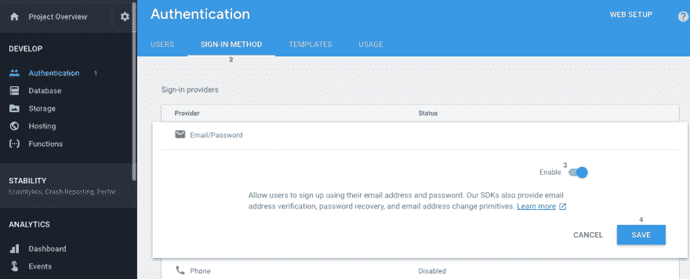
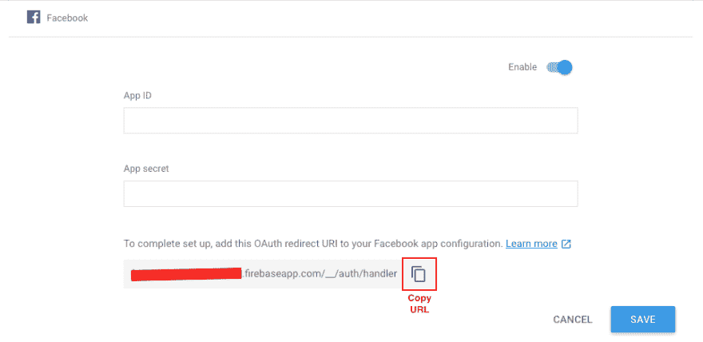

# Firebase 身份验证简介

> 原文:[https://dev . to/aurelkurtula/introduction-to-authentic ation-with-firebase-bkd](https://dev.to/aurelkurtula/introduction-to-authentication-with-firebase-bkd)

我想通过浏览 firebase 提供的认证服务来继续我对 firebase 的探索。

如果你导航到 [firebase 控制台](https://console.firebase.google.com/)并选择你正在做的项目，从左侧栏选择**认证**，然后选择`SIGN-IN METHOD`，你将看到允许你的用户登录的七种方式。

(如果你没有读过我在这个系列中以前的教程，我强烈推荐你阅读第一篇关于 [firebase 的实时数据库](https://dev.to/aurelkurtula/introduction-to-firebases-real-time-database-89l)的教程，除了学习如何使用数据库，我还会完成项目的设置。然后，如果你有兴趣，但不是必需的，你可以阅读其他关于[存储](https://dev.to/aurelkurtula/introduction-to-firebases-storage-e12)的教程

## 01。设置

设置将与 [firebase 的实时数据库](https://dev.to/aurelkurtula/introduction-to-firebases-real-time-database-89l)完全相同。我们有一个 HTML 和一个 JavaScript 文件。html 将会略有不同，虽然

```
<!DOCTYPE html>
<html lang="en">
<head>
    <meta charset="UTF-8">
    <title>Authentication with firebase</title>
    <script src="https://www.gstatic.com/firebasejs/4.8.0/firebase.js"></script>
    <script src="https://www.gstatic.com/firebasejs/4.6.2/firebase-auth.js"></script>
    <style>
        #app{
        width:50%;
        margin: 100px auto;
        }
        .hide{
        display: none;
        }
    </style>
</head>
<body>
    <div id="app">
        <input type="email" id="txtEmail" placeholder="Enter email" /> <br/>
        <input type="password" id="txtPassword" placeholder="Enter password" /><br/>
        <button id="btnLogin" >Log in</button>
        <button id="btnSignUp" >Sign Up</button>
        <button id="btnLogOut" class="hide" >Log Out</button>
        <button id="withFB">Log In with FaceBook</button>
        <button id="withGithub">Log In with GitHub</button>
    </div>  
    <div id="results"></div>
    <script type="text/javascript" src="script.js"></script>
</body>
</html> 
```

<svg width="20px" height="20px" viewBox="0 0 24 24" class="highlight-action crayons-icon highlight-action--fullscreen-on"><title>Enter fullscreen mode</title></svg> <svg width="20px" height="20px" viewBox="0 0 24 24" class="highlight-action crayons-icon highlight-action--fullscreen-off"><title>Exit fullscreen mode</title></svg>

需要注意的最重要的一点是，firebase 将身份验证作为一个独立的模块，因此第二个脚本标记位于顶部。除此之外，我们有两个输入字段来测试通过电子邮件和密码进行身份验证，然后我们将了解如何通过 FaceBook 和 GitHub 进行身份验证。带有`result`的`id`的 div 也会派上用场。

为了确保我们在同一个页面上，你应该有一个带有配置代码的`script.js`(作为浏览[第一教程](https://dev.to/aurelkurtula/introduction-to-firebases-real-time-database-89l)的结果)

```
var config = {
  apiKey: "*******************",
  authDomain: "******.firebaseapp.com",
  databaseURL: "https://******.firebaseio.com",
  projectId: "******",
  storageBucket: "******.appspot.com",
  messagingSenderId: "***************"
};
firebase.initializeApp(config); 
```

<svg width="20px" height="20px" viewBox="0 0 24 24" class="highlight-action crayons-icon highlight-action--fullscreen-on"><title>Enter fullscreen mode</title></svg> <svg width="20px" height="20px" viewBox="0 0 24 24" class="highlight-action crayons-icon highlight-action--fullscreen-off"><title>Exit fullscreen mode</title></svg>

## 02。基础知识

为了充分理解身份验证的简单性，我将首先向您展示我们将使用的方法，这些方法由身份验证服务提供。然后我们将实际使用它们。

```
const auth = firebase.auth(); 
```

<svg width="20px" height="20px" viewBox="0 0 24 24" class="highlight-action crayons-icon highlight-action--fullscreen-on"><title>Enter fullscreen mode</title></svg> <svg width="20px" height="20px" viewBox="0 0 24 24" class="highlight-action crayons-icon highlight-action--fullscreen-off"><title>Exit fullscreen mode</title></svg>

由于我们必须使用[数据库](https://dev.to/aurelkurtula/introduction-to-firebases-real-time-database-89l)和[存储](https://dev.to/aurelkurtula/introduction-to-firebases-storage-e12)服务，这就是我们如何初始化认证服务的使用。通过该功能，`auth()`可以使用以下所有方法。

```
const promise = auth.signInWithEmailAndPassword(email, pass);
auth.createUserWithEmailAndPassword(email, pass); 
```

<svg width="20px" height="20px" viewBox="0 0 24 24" class="highlight-action crayons-icon highlight-action--fullscreen-on"><title>Enter fullscreen mode</title></svg> <svg width="20px" height="20px" viewBox="0 0 24 24" class="highlight-action crayons-icon highlight-action--fullscreen-off"><title>Exit fullscreen mode</title></svg>

这些都是自我解释，这就是我们将能够登录或注册。

然后，脸书和 GitHub 这两个提供商的代码遵循稍微不同的约定。

```
const facebookProvider = new firebase.auth.FacebookAuthProvider();
const facebookPromise = auth.signInWithPopup(facebookProvider)
const githubProvider = new firebase.auth.GithubAuthProvider();
const githubPromise = firebase.auth().signInWithPopup(githubProvider); 
```

<svg width="20px" height="20px" viewBox="0 0 24 24" class="highlight-action crayons-icon highlight-action--fullscreen-on"><title>Enter fullscreen mode</title></svg> <svg width="20px" height="20px" viewBox="0 0 24 24" class="highlight-action crayons-icon highlight-action--fullscreen-off"><title>Exit fullscreen mode</title></svg>

我们将不得不经历许多配置，将 firebase 与脸书和 Github 连接起来——在仪表板之间有许多工作，但代码非常简单。

最后，**也是最重要的**我们有一个监听认证变化的方法。因此，当用户登录或退出时，我们能够相应地采取行动。

```
firebase.auth().onAuthStateChanged() 
```

<svg width="20px" height="20px" viewBox="0 0 24 24" class="highlight-action crayons-icon highlight-action--fullscreen-on"><title>Enter fullscreen mode</title></svg> <svg width="20px" height="20px" viewBox="0 0 24 24" class="highlight-action crayons-icon highlight-action--fullscreen-off"><title>Exit fullscreen mode</title></svg>

## 03。使用电子邮件和密码进行身份验证

我们要使用的每种身份验证方法都必须启用，所以让我们首先启用“电子邮件/密码”方法。

为此，导航到 [firebase 控制台](https://console.firebase.google.com)，选择您按照 [firebase 的实时数据库](https://dev.to/aurelkurtula/introduction-to-firebases-real-time-database-89l)教程中的说明创建的项目，然后选择“身份验证”和“登录方法”，最后选择“电子邮件/密码”方法并启用它

[T2】](https://res.cloudinary.com/practicaldev/image/fetch/s--fZnOQP80--/c_limit%2Cf_auto%2Cfl_progressive%2Cq_auto%2Cw_880/https://thepracticaldev.s3.amazonaws.com/i/31gm8vy4wtxrts7bh8p3.png)

这个方法就这么多了。如果您想稍后验证用户是否已实际创建，您可以通过导航到“用户”进行检查(参见上面的屏幕截图)

#### 03.1。用用户名和密码注册

在`script.js`中，让我们编写创建用户的代码。

在我们继续之前，重要的是要注意到**验证取决于我们，firebase 不检查验证。如果用户没有添加至少 6 个字母的密码，firebase 不会验证。作为开发人员，您需要这样做。**然而，我不关心本教程中的任何内容。假设用户填写了表单并点击了“注册”。以下代码处理该操作:

```
document.getElementById("btnSignUp").addEventListener('click', e=>{
  const email = document.getElementById("txtEmail").value;
  const pass = document.getElementById("txtPassword").value;
  firebase.auth().createUserWithEmailAndPassword(email, pass).catch(function(error) {
   console.log(error.message);
  });
}) 
```

<svg width="20px" height="20px" viewBox="0 0 24 24" class="highlight-action crayons-icon highlight-action--fullscreen-on"><title>Enter fullscreen mode</title></svg> <svg width="20px" height="20px" viewBox="0 0 24 24" class="highlight-action crayons-icon highlight-action--fullscreen-off"><title>Exit fullscreen mode</title></svg>

如您所见，第 4 行注册了用户。

虽然您看不到任何东西，但是使用上面的代码创建并验证了一个用户(登录)。如果你导航到“认证”，你会看到用户。

#### 03.2。使用用户名和密码登录

当用户注册时，他们已经登录。但这是为那些已经使用上述方法注册的用户登录的功能。

```
document.getElementById("btnLogin").addEventListener('click', e=>{
  const email = document.getElementById("txtEmail").value;
  const pass = document.getElementById("txtPassword").value;
  const promise = firebase.auth().signInWithEmailAndPassword(email, pass);
  promise.catch(e=>{ console.log(e.massage)})
}) 
```

<svg width="20px" height="20px" viewBox="0 0 24 24" class="highlight-action crayons-icon highlight-action--fullscreen-on"><title>Enter fullscreen mode</title></svg> <svg width="20px" height="20px" viewBox="0 0 24 24" class="highlight-action crayons-icon highlight-action--fullscreen-off"><title>Exit fullscreen mode</title></svg>

## 04。根据状态变化采取行动(登录/注销)

每当用户登录或退出时，我们都希望改变应用程序的状态。当然，在这个基本的、普通的 javascript 演示中，我们不会在登录时做什么惊人的事情，但是，让我们利用`onAuthStateChanged`方法:

```
firebase.auth().onAuthStateChanged(user=>{ 
  if(user){
    document.getElementById("btnLogOut").classList.remove('hide')
  } else{
    document.getElementById("btnLogOut").classList.add('hide')
  }
}) 
```

<svg width="20px" height="20px" viewBox="0 0 24 24" class="highlight-action crayons-icon highlight-action--fullscreen-on"><title>Enter fullscreen mode</title></svg> <svg width="20px" height="20px" viewBox="0 0 24 24" class="highlight-action crayons-icon highlight-action--fullscreen-off"><title>Exit fullscreen mode</title></svg>

注意，`user`给了你更多的信息，它给了你用户的 id-`user.uid`。还有一个`refreshToken` - `user.refreshToken` -其用法超出了本教程的范围。

正如你所看到的，上面我们只是让“退出”按钮可见。

## 05。注销

注销非常简单:

```
document.getElementById("btnLogOut").addEventListener('click', e=>{
  firebase.auth().signOut();
  console.log('logged out')
}) 
```

<svg width="20px" height="20px" viewBox="0 0 24 24" class="highlight-action crayons-icon highlight-action--fullscreen-on"><title>Enter fullscreen mode</title></svg> <svg width="20px" height="20px" viewBox="0 0 24 24" class="highlight-action crayons-icon highlight-action--fullscreen-off"><title>Exit fullscreen mode</title></svg>

就是这样！

**注意注销时，`onAuthStateChanged`已经自动触发，注销按钮现在隐藏**

## 06。向脸书认证

正如我们之前所做的一样，让我们来看看 firebase 身份验证设置并启用脸书身份验证。

请注意，它需要一个“应用 ID”和一个“应用密码”。这些是从“脸书应用程序配置”中获得的，作为开发人员，您必须进行设置。让我们现在做那件事。

为开发者导航到[脸书](https://developers.facebook.com/)。在顶部右侧，将鼠标悬停在“我的应用”上，导航至“添加新应用”，然后为其命名并单击“创建应用 Id”。然后会引导您选择一种产品。

我们需要“脸书登录”，悬停在它上面，选择“设置”，然后选择“网络”作为所需的平台。接下来，给它一个网址，点击“保存”**，然后导航到“设置”，在“脸书登录”**下

您需要为它提供一个“有效的 OAuth 重定向 URIs”。当启用 facebook 时，您可以在 firebase 上看到这一点！

[T2】](https://res.cloudinary.com/practicaldev/image/fetch/s--no6VAzrt--/c_limit%2Cf_auto%2Cfl_progressive%2Cq_auto%2Cw_880/https://thepracticaldev.s3.amazonaws.com/i/lo75lj49jfbwlw2k0iqm.png)

抄下那份 URI，交给脸书。保存更改。

然后，从侧边栏中选择“Dashboard ”,复制“App ID”和“App Secret ”,并填写上述表格。

最后，单击保存。

### 06.1 编码 facebook 认证

```
document.getElementById('withFB').addEventListener( 'click', e=>{
  const provider = new firebase.auth.FacebookAuthProvider();
  const promise = firebase.auth().signInWithPopup(provider)
  promise.then(function(result) {
    console.log(result)
    // ...
  }).catch(function(error) {
          // ...
  });
}) 
```

<svg width="20px" height="20px" viewBox="0 0 24 24" class="highlight-action crayons-icon highlight-action--fullscreen-on"><title>Enter fullscreen mode</title></svg> <svg width="20px" height="20px" viewBox="0 0 24 24" class="highlight-action crayons-icon highlight-action--fullscreen-off"><title>Exit fullscreen mode</title></svg>

现在，当用户点击 facebook 按钮时，他们会得到通常的弹出窗口要求访问，就是这样！

如果您已经了解了，您可以打开控制台，看到`results`是一个对象，在其他数据中，它有`displayName`、`email`和`photoURL`；来自用户 facebook 个人资料的信息。另外，`result.credential.accessToken`对于高级用例来说很重要。

## 07。关于数据库的一句话

我真的很想创建另一个教程，将我在这里介绍的内容与我在 [firebase 的实时数据库](https://dev.to/aurelkurtula/introduction-to-firebases-real-time-database-89l)中介绍的内容结合起来。

简而言之，您现在可以将数据库规则更改如下:

```
{
  "rules": {
    ".read": "auth != null",
    ".write": "auth != null"
  }
} 
```

<svg width="20px" height="20px" viewBox="0 0 24 24" class="highlight-action crayons-icon highlight-action--fullscreen-on"><title>Enter fullscreen mode</title></svg> <svg width="20px" height="20px" viewBox="0 0 24 24" class="highlight-action crayons-icon highlight-action--fullscreen-off"><title>Exit fullscreen mode</title></svg>

然后只有当用户登录时才能访问数据。

然而，有很多事情可以做。和大多数应用一样，有些数据需要公开，有些需要保密。在这里详述会使本教程太长，并且不符合身份验证的主题。

## 结论

如您所见，使用 firebase 进行身份验证非常容易。其他方法包括:电话、谷歌、twitter、github 和匿名。我不能说我尝试了所有的方法，但是我确信它们都遵循相同的惯例，使得这个过程非常容易。

对于本系列的下一个教程，我想以托管结束，但我也可能尝试创建一个小应用程序，将这三个教程中介绍的所有内容结合起来，然后以托管这个迷你应用程序结束，这也将解决这个过程中最脆弱的部分——它将隐藏配置设置。