# 对编译和解释的更深入的考察

> 原文：<https://dev.to/vaidehijoshi/a-deeper-inspection-into-compilation-and-interpretation-8bp>

<figure>[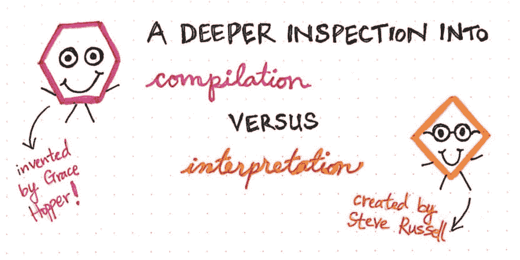](https://res.cloudinary.com/practicaldev/image/fetch/s--apzN_k4z--/c_limit%2Cf_auto%2Cfl_progressive%2Cq_auto%2Cw_880/https://cdn-images-1.medium.com/max/1024/1%2AboC06EC2PGmMYNjpHtrL4A.jpeg) 

<figcaption>深入考察成编 vs .释义</figcaption>

</figure>

也许没有什么比看到拼图的碎片拼在一起更令人满意的了。实际的谜题是这样，我很不擅长，因为我似乎总是在沙发下丢东西，更隐喻的谜题，我通常更擅长，因为在陌生的地方不会丢东西。

学习的困惑无疑是更复杂的谜团之一。学习一个新事物是困难的，因为你试图不断地拼凑想法和构建概念，而不一定总是知道这些部分如何融入更大的整体。当你不断发现自己在想这个新事物与你已经熟悉的更广阔的图景有什么关系时，你很难试图去理解这个新事物。这有点像找到一个随机的拼图块，然后试图找到适合它的块，但不一定知道这些块如何适合大图。

学习特定的主题也是如此，比如计算机科学。有时候，你会觉得自己在获取一点点信息——这里是数据结构，那里是算法——却不知道这些信息是如何相互联系的。我倾向于认为，这就是学习计算机科学如此困难的原因:没有太多的资源可以构建这个领域的图景，所有这些完美的片段可以相互匹配。

然而，偶尔，如果你真的坚持一个话题足够长的时间，你会发现一些片断会开始汇集在一起。当我们一起完成这个系列时，是时候让它最终实现了！

### 我们认识并喜爱的翻译家

当我们大约一年前开始这个系列时，我们探索的第一个主题是通常被认为是计算机科学“基石”的东西:[二进制](https://dev.to/vaidehijoshi/bits-bytes-building-with-binary)。我们了解到，从本质上讲，二进制是每台计算机都能说和理解的语言。我们的机器，说到底，都是靠 1 和 0 运行的。

从那以后，我们探索了不同的数据结构，像[树](https://dev.to/vaidehijoshi/how-to-not-be-stumped-by-trees)、[图](https://dev.to/vaidehijoshi/a-gentle-introduction-to-graph-theory)和[链表](https://dev.to/vaidehijoshi/whats-a-linked-list-anyway)，以及[排序算法](https://dev.to/vaidehijoshi/sorting-out-the-basics-behind-sorting-algorithms)和[遍历或搜索算法](https://dev.to/vaidehijoshi/finding-the-shortest-path-with-a-little-help-from-dijkstra-cmi)。现在是时候最终将它们整合在一起了——或者更确切地说，将它们全部*还原为二进制。*

<figure>[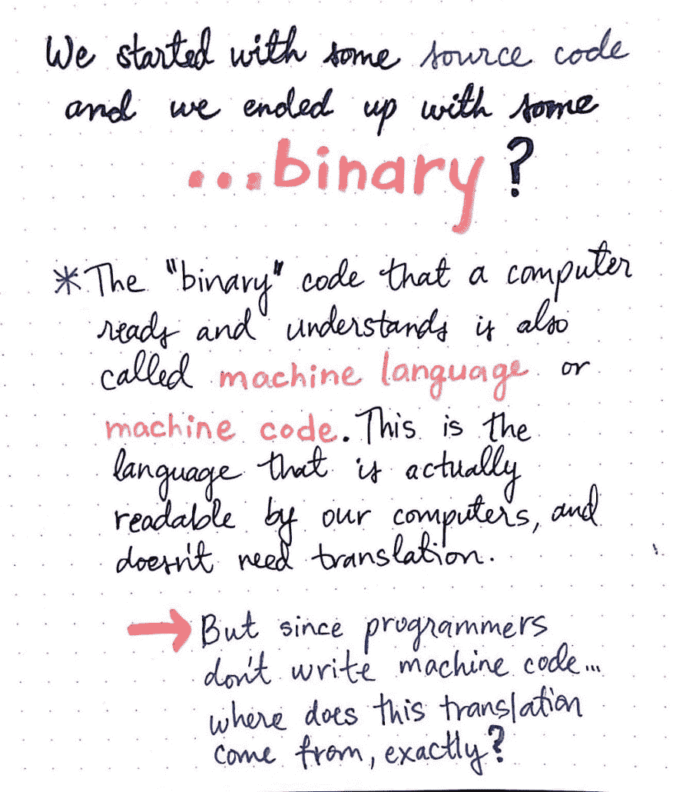](https://res.cloudinary.com/practicaldev/image/fetch/s--y5o_DEgZ--/c_limit%2Cf_auto%2Cfl_progressive%2Cq_auto%2Cw_880/https://cdn-images-1.medium.com/max/1024/1%2AJrvsA3pmJCWqlPMGnIoSYA.jpeg) 

<figcaption>我们从一些源代码开始，现在我们在这里。</figcaption>

</figure>

谈到计算和计算机科学的核心概念，我们已经走遍了世界。但是有一个问题我们还没有真正回答，尽管我们可能已经思考了整整一年:我们到底是如何从我们的代码进入我们计算机的 1 和 0 的呢？

好吧，在我们深入探讨*我们写的代码如何*变成二进制之前，让我们澄清一下我们在这个上下文中使用术语二进制的真正含义。计算机读取和理解的“二进制”代码一般称为 ***机器语言*** 或 ***机器代码*** ，是给机器的一组指令，由一个 its ***中央处理器*** (或 ***CPU*** )运行。

需要注意的一件重要事情是，有不同种类的机器代码，其中一些是字面上的 0 和 1，另一些是小数或[十六进制](https://dev.to/vaidehijoshi/hexes-and-other-magical-numbers)(我们已经知道很多了！).不管机器语言是以哪种确切的格式编写的，它都必须是相当初级的，因为它需要被计算机理解。这就是机器语言被称为低级语言的原因，因为它们需要被简化到足以被我们机器的 CPU 处理，我们已经知道它只是一堆内部开关。

> 我们可以认为低级语言是计算机的“母语”;机器代码应该可以被我们的机器直接读取，而不应该需要被他们翻译。

但是我们如何从*我们的*代码到机器友好的(*机器代码*)版本的完全相同的东西呢？嗯，我们作为程序员编写的代码和计算机处理器读取的机器代码只不过是两种不同类型的*语言*。如果我们仔细想想，我们真正需要做的就是在这两种语言之间进行翻译。

现在又出现了一个问题:我们不知道如何在我们的代码和机器代码之间进行转换！好吧，开个玩笑——这不是一个真正的问题。因为我们有两个好朋友可以帮助我们。

<figure>[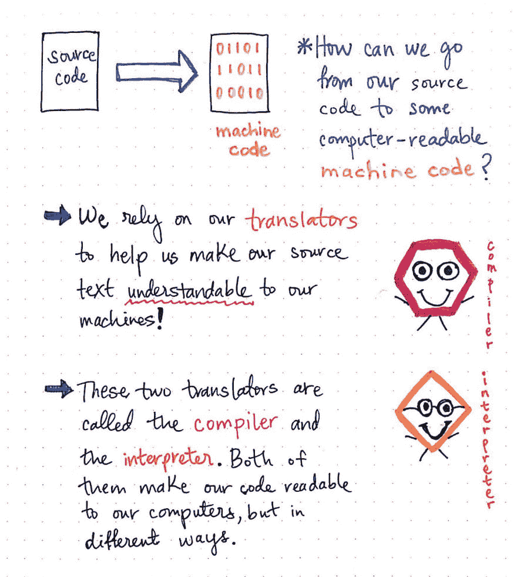](https://res.cloudinary.com/practicaldev/image/fetch/s--iO_nDTqu--/c_limit%2Cf_auto%2Cfl_progressive%2Cq_auto%2Cw_880/https://cdn-images-1.medium.com/max/1024/1%2Ai6IkXutqKYWpm0JwlvzPUA.jpeg) 

<figcaption>翻译者让我们的机器能够理解我们的源文本！</figcaption>

</figure>

为了将我们的源代码转换成某种二进制格式的计算机可读的机器代码，我们需要依靠翻译器来帮助我们让我们的机器能够理解我们的源文本。

***翻译器*** ，有时也被称为编程语言处理器，只不过是一个程序，它将 ***源*** 语言翻译成 ***目标*** 语言，同时保持它正在翻译的代码的逻辑结构。

我们已经对一种翻译器有点熟悉了，尽管我们可能还不知道它。在本系列的前面，我们已经看了编译器的[词法和语法分析](https://dev.to/vaidehijoshi/leveling-up-ones-parsing-game-with-asts-4ha)阶段(前端),以及这个过程中涉及的不同数据结构。

事实证明，编译器是一种*类型的*翻译器！还有另一个翻译器，它的名字经常和编译器的名字混在一起，叫做 ***翻译器*** 。编译器和解释器都使代码对我们的计算机可读，但方式非常不同。

但是让我们先从我们已经知道的开始，首先:编译器。

<figure>[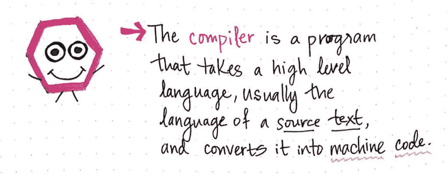](https://res.cloudinary.com/practicaldev/image/fetch/s--XBWaIPMK--/c_limit%2Cf_auto%2Cfl_progressive%2Cq_auto%2Cw_880/https://cdn-images-1.medium.com/max/1024/1%2AhmOcXMhDgZ3FiZTURbSgiA.jpeg) 

<figcaption>编译器:一个定义。</figcaption>

</figure>

***编译器*** 只不过是一个程序，它采用一种高级语言——我们用来编写代码的语言——并将其转换成机器代码。编译器有许多可移动的部分(或者更确切地说，在它内部)，可能包括一个扫描器、一个词法分析器/标记器和一个解析器。但最终，即使它很复杂，它也只是一个将我们的代码变成机器可读代码的程序。

然而，即使它的工作看起来很简单，编译器完成这项重要任务的方式还是值得一提的。

<figure>[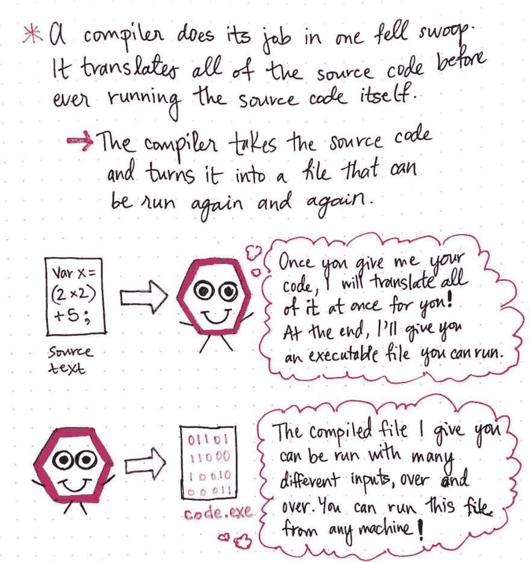](https://res.cloudinary.com/practicaldev/image/fetch/s--2fMfUYy3--/c_limit%2Cf_auto%2Cfl_progressive%2Cq_auto%2Cw_880/https://cdn-images-1.medium.com/max/1024/1%2AUS267VbwKwSVaLa-2MIGOw.jpeg) 

<figcaption>编译器是如何工作的。</figcaption>

</figure>

在大多数情况下，编译器会将我们的代码一次性翻译成机器代码。换句话说，在源代码被执行或运行之前，编译器会翻译程序员的所有源代码。它获取我们的源代码，并将其转换成用机器代码编写的单个文件。正是这种机器码文件——称为 ***可执行*** 文件，通常以。exe 扩展名——这实际上允许我们运行我们编写的原始代码。

编译器最重要的特质是，它接受源文本，然后“一次性”将其翻译成二进制机器码。它将翻译、编译后的文件返回给程序员，程序员将能够通过输出的可执行文件运行他们的代码。

> 编译器返回的可执行文件一旦被翻译，就可以反复运行；编译器不需要在任何后续的重新运行中出现！

一旦编译器将所有源代码翻译成机器码，编译器的工作就完成了。程序员可以使用他们喜欢的任何输入，运行编译后的代码任意多次。他们还可以与其他人共享这些编译后的代码，而不必共享他们的原始源代码。

<figure>[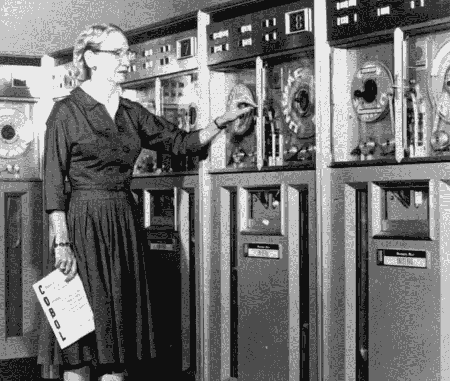](https://res.cloudinary.com/practicaldev/image/fetch/s---mdG71oU--/c_limit%2Cf_auto%2Cfl_progressive%2Cq_auto%2Cw_880/https://cdn-images-1.medium.com/max/1024/1%2AcV0BYWBDTFZbUr6iFjFNrg.jpeg) 

<figcaption>格蕾丝·赫柏， [TechCrunch](https://techcrunch.com/2016/11/17/grace-hopper-and-margaret-hamilton-awarded-presidential-medal-of-freedom-for-computing-advances/)</figcaption>

</figure>

这个特定翻译器背后的概念——以及术语“编译器”本身——是由杰出的*于 1952 年在最有趣的情况下创造的。*

 *当时，霍普一直在埃克特-莫奇利计算机公司工作，作为团队中的一名数学家，帮助开发 UNIVAC I 计算机。实际上，她正致力于将数学代码转换成自己的语言(A-0 系统语言)。

然而，她有更大的想法。她想写一种全新的程序语言，可以用英语来表达，而不是有限的数学符号。然而，当她把这个想法告诉她的同事时。他们拒绝了她，并告诉她她的想法是不可能的，因为“计算机不懂英语”。但是她没有被吓住。

在这个团队工作了三年之后，Hopper 有了她的第一个工作编译器。但是没有人相信她真的做到了！在她的传记*格蕾丝·赫柏:海军上将和计算机先驱*中，她[解释了](http://www.public.navy.mil/surfor/ddg70/Pages/namesake.aspx#.WjA760zGxE4):

> 我有一个正在运行的编译器，没人会碰它。…他们小心翼翼地告诉我，计算机只能做算术；他们不能做程序。

幸好格蕾丝·赫柏没有听那些不信者的话，因为她最终继续她的工作，开发了最早的高级编程语言之一，叫做 COBOL。她还获得了总统自由勋章，以及其他许许多多的成就。

事实上，如果她*听取了所有这些人的意见，她可能永远也不会在构建和设计第一个编译器的早期工作中将计算提升到一个全新的水平。格蕾丝·赫柏在第一个编译器上的工作为几年后出现的另一个翻译器奠定了基础:解释器。*

### 分步翻译

1958 年，在格蕾丝·赫柏完成编译器的工作几年后，麻省理工学院的一些学生在实验室里，用一台 IBM 704 T1 计算机工作，这是一项相当新的技术，四年前才刚刚推出。其中一名学生，名叫史蒂夫·拉塞尔，正在和他的教授约翰·麦卡锡一起研究一个名为“麻省理工学院人工智能项目”的项目。

当时，Russell 正在使用 Lisp 编程语言，他已经阅读了他的教授就该主题写的一篇论文。他想出了将 Lisp 中的 eval 函数转换为机器代码的想法，这使他走上了创建第一个 Lisp 解释器的道路，该解释器用于评估语言中的表达式——相当于当时在 Lisp 中运行程序。

<figure>[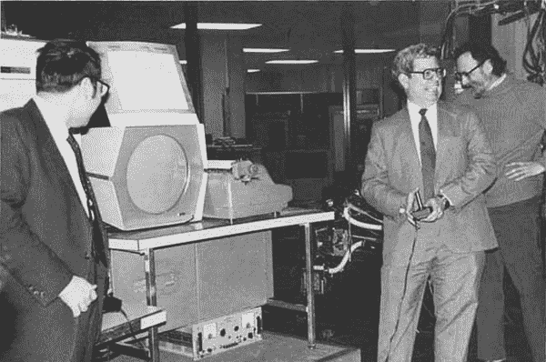](https://res.cloudinary.com/practicaldev/image/fetch/s--4XLwITJB--/c_limit%2Cf_auto%2Cfl_progressive%2Cq_auto%2Cw_880/https://cdn-images-1.medium.com/max/600/1%2Ahql6HmnIb5Jlw6xBVhMHMQ.jpeg) 

<figcaption>【史蒂夫·罗素】[大众:werk](http://www.masswerk.at/spacewar/SpacewarOrigin.html)</figcaption>

</figure>

的确，霍普的工作直接影响了罗素的发明。Lisp 解释器的第一个版本是手工编译的。在 2008 年计算机历史博物馆的一次采访中，Russell [解释了](http://archive.computerhistory.org/resources/access/text/2012/08/102746453-05-01-acc.pdf)编译器是如何影响他在麻省理工学院的工作的:

> 我记得约翰·麦卡锡(John McCarthy)在 9 月底或 10 月的某一天，带着通用的 M-expression，也就是 Lisp 解释器以 M-expression 的形式写出来，我们看着它说，“哦，是的，那可以，”我看着它说，“哦，那只是做更多的手动编译，就像我一直在做的那样。我可以做到这一点。”>…我在圣诞节前得到了一些工作，这是一个有用的解释器；没有垃圾收集器，但是还没有任何大的程序。

Russell 和他的同事将继续手工编译 Lisp 解释器的前两个版本。今天，大多数程序员甚至不会梦想手工编译他们的任何代码！事实上，我们中的许多人在应用程序开发中与解释器交互并多次使用它——只是我们可能并不总是意识到它。

那么，到底是个什么样的*译员呢？是时候要一个官方的定义了！*

<figure>[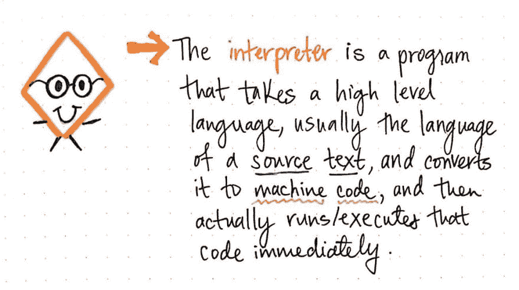](https://res.cloudinary.com/practicaldev/image/fetch/s--e0Go5w7Z--/c_limit%2Cf_auto%2Cfl_progressive%2Cq_auto%2Cw_880/https://cdn-images-1.medium.com/max/1024/1%2AW3b3zEDlsm3ECrl6ZcsuKg.jpeg) 

<figcaption>口译员:一个定义。</figcaption>

</figure>

一个 ***解释器*** 也是一个翻译器，就像一个编译器，它采用一种高级语言(我们的源文本)并将其转换成机器代码。然而，它做了一些稍微不同的事情:它实际上运行并且*执行*它翻译的代码。

> 我们可以把翻译看作是家庭中更“有条理”的翻译。比起一次性把我们的代码翻译成机器语言，它更系统地描述了它是如何工作的。

口译员一点一点地完成工作。它将一次翻译我们源文本的一部分，而不是一次翻译全部。

<figure>[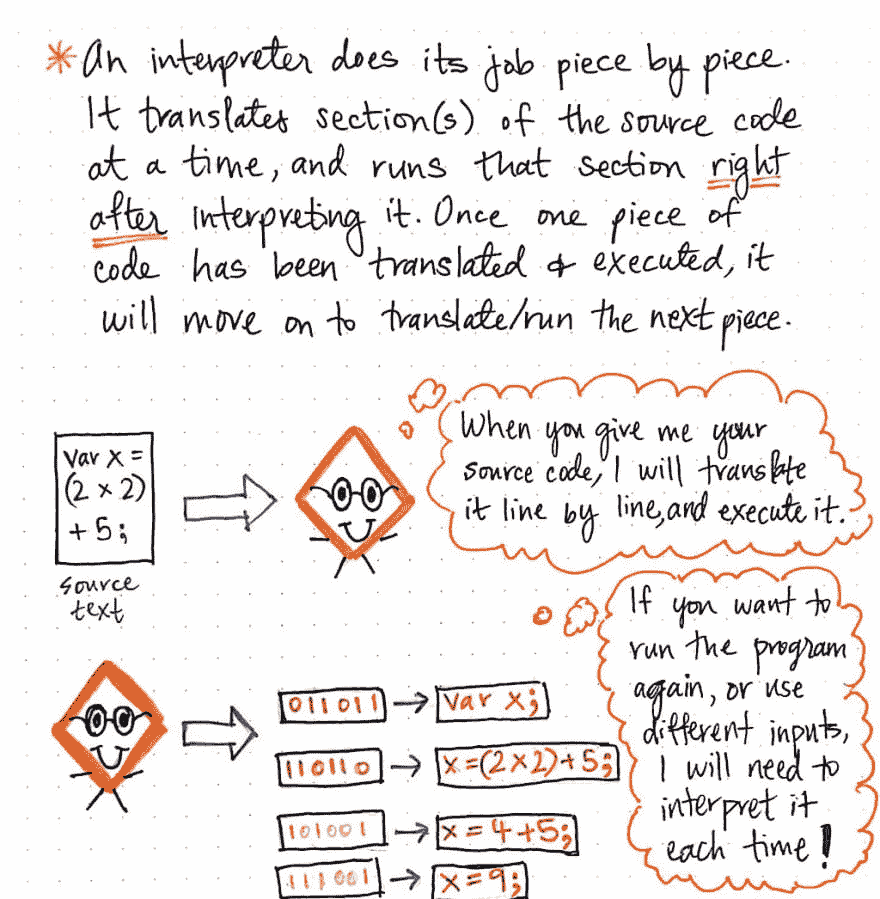](https://res.cloudinary.com/practicaldev/image/fetch/s--tNZjAHJl--/c_limit%2Cf_auto%2Cfl_progressive%2Cq_auto%2Cw_880/https://cdn-images-1.medium.com/max/1024/1%2AcB2ZxcXz1ZKu7CxfdjIcNw.jpeg) 

<figcaption>解释器是如何工作的。</figcaption>

</figure>

不像编译器，它不翻译所有的东西，把文件交给我们程序员去执行。相反，解释器一次只能翻译一行/一段代码。一旦它翻译完一行，它将获取该行的机器码版本，并立即运行它。

另一种思考方式是，一旦解释器翻译了一段代码，只有在那时它才能运行。乍一看，这似乎相当直观，因为一个解释器在不知道一行代码在二进制/机器码中的含义的情况下，怎么能运行它呢？但是，如果我们更深入地思考这个问题，就会发现还有其他的含义。只有当解释器成功运行完一行代码后，它才会真正进入下一行。我们可以想象这可能是也可能不是一件好事，这取决于我们要做什么。

例如，假设我们想用 10 个不同的输入来运行我们的程序。我们的解释器将不得不运行我们的程序 10 次，逐行解释我们的每一个输入。然而，如果我们在代码中犯了一个致命的错误，我们的解释器可以在错误发生的那一刻为我们捕捉到它，因为它在翻译完代码后，实际上刚刚试图运行我们的(中断的)代码行！

到目前为止，我们可能开始能够看到解释器和编译器是如何权衡的。在本系列中，我们已经一次又一次地看到了不同工具的优缺点，这可能是计算机科学领域的一个标志性特征。围绕这个主题，让我们权衡一下作为翻译技术的解释和编译之间的根本区别。

### 两位翻译家，两人的尊严都很相似

解释和编译以及它们各自的翻译者之间的差异告诉我们很多关于这两个程序是如何实现的。如果我们比较这两种方法，我们将开始看到它们如何完成相同的任务，但在根本上非常不同的方式。

下图以更明显的方式说明了这一点。

<figure>[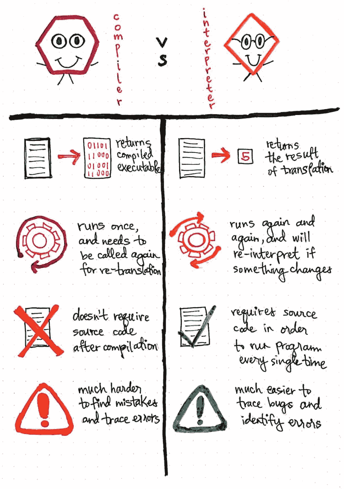](https://res.cloudinary.com/practicaldev/image/fetch/s--Df5YugSW--/c_limit%2Cf_auto%2Cfl_progressive%2Cq_auto%2Cw_880/https://cdn-images-1.medium.com/max/1024/1%2AZxXGe3fv1pzTQi8QLucYcQ.jpeg) 

<figcaption>编译 vs .解释:取舍。</figcaption>

</figure>

1.  ***返回结果。*** 编译器会获取一些源代码并返回编译后的可执行文件，而解释器会实际翻译并执行源代码本身，直接返回翻译结果。
2.  ***运行频率。*** 一个编译器只会运行一次，如果发生变化就需要再次调用重新翻译源代码。另一方面，解释器会再次运行，并在源代码发生变化时重新解释源代码；口译员“逗留”下来继续翻译。
3.  ***灵活性。*** 编译器一次性翻译源代码，即编译后不再需要源代码。然而，每次运行程序时，解释器都需要源代码来翻译和执行程序。
4.  ***调试。*** 编译器一般会让确定源代码中错误发生的位置变得更加困难，因为整个程序都已经被翻译过了，而错误的位置在机器码中可能并不容易识别。然而，使用解释器识别错误更容易，因为它可以维护错误或 bug 的位置，并将问题暴露给编写代码的程序员。

由于这些主要差异，编译后的代码——使用编译过程翻译和运行的代码——比解释后的代码运行起来要快一点*。这是因为在代码被执行之前，将源文本翻译成机器代码的工作已经完成了。*

 *<figure>[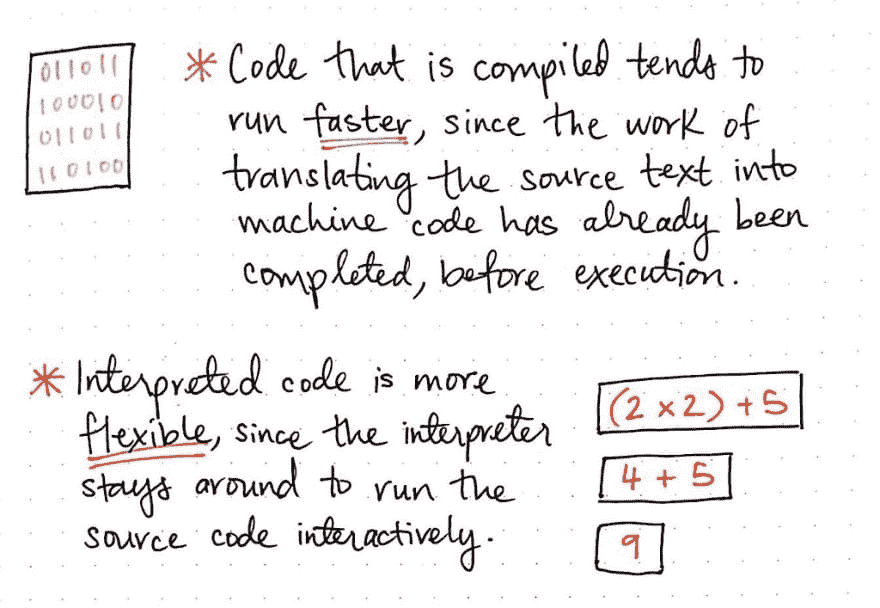](https://res.cloudinary.com/practicaldev/image/fetch/s--_PaGqWUH--/c_limit%2Cf_auto%2Cfl_progressive%2Cq_auto%2Cw_880/https://cdn-images-1.medium.com/max/1024/1%2AtEaHNTcgH3ksRTn_PPvUIA.jpeg) 

<figcaption>编译代码与解释代码的对比。</figcaption>

</figure>

另一方面，解释后的代码要灵活得多*，因为解释器会在翻译“过程”中读取和处理我们的代码。*

 *在这种情况下，灵活性意味着能够更改我们的代码，并能够在事后立即运行它。如果我们做了更改，没有必要重新编译我们的代码；解释器会抓住这个机会，重新解释代码，使它成为一种更加互动的翻译形式。使用解释器使测试小(或大)变得容易多了！)源文件中的更改。

<figure>[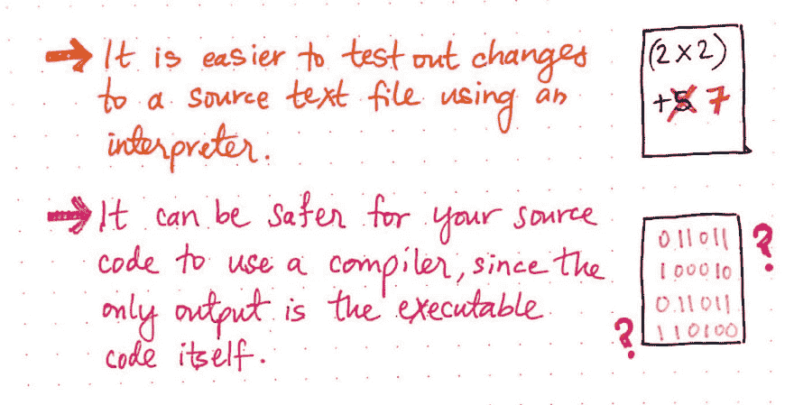](https://res.cloudinary.com/practicaldev/image/fetch/s--Dkbsit-I--/c_limit%2Cf_auto%2Cfl_progressive%2Cq_auto%2Cw_880/https://cdn-images-1.medium.com/max/1024/1%2AbEjIOSRlVoqme1h2uddSUQ.jpeg) 

<figcaption>编纂的好处不如解释。</figcaption>

</figure>

然而，当谈到解释时，我们实际上需要源代码以便能够做任何事情。测试变更和调试问题肯定更容易，但首先也是最重要的是源文本必须是可访问的。对于编译，情况就不一样了。一旦我们将代码编译成可执行文件，我们就再也不用担心源代码了——当然，除非我们需要重新编译。

这通常会使编译器成为“更安全”的选择，因为我们的源代码是不公开的；相反，唯一的输出是可执行文件本身，它只有 1 和 0，从来没有向任何人展示过*我们如何*编写我们的代码或者实际上*说了什么*，因为在那一点上它都是机器语言。

> 编译和解释不仅扮演着软件开发者的角色，也扮演着软件消费者的角色。

<figure>[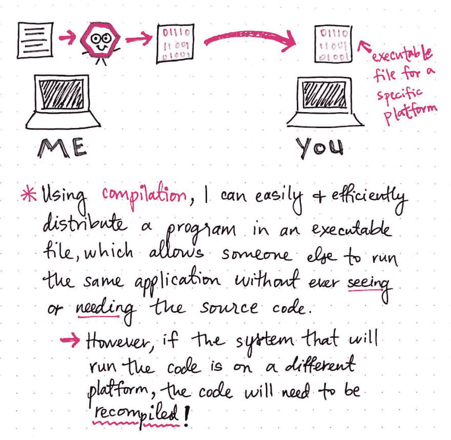](https://res.cloudinary.com/practicaldev/image/fetch/s--3RzExarG--/c_limit%2Cf_auto%2Cfl_progressive%2Cq_auto%2Cw_880/https://cdn-images-1.medium.com/max/1024/1%2AG_MKTnRevNPkNVeh7Xu8hw.jpeg) 

<figcaption>编译的轻松与速度，尽在行动。</figcaption>

</figure>

例如，每当我们下载一个文件，或者从。exe 文件，我们依赖一些软件的创建者为我们编译一个可执行文件。

使用编译，我们可以很容易地将程序作为可执行文件分发。这将允许其他人运行与我们完全相同的代码，但不需要实际向他们展示或给他们我们的代码本身。编译文件的消费者永远不需要看到源文本，因为他们可以简单地得到一个可执行文件，在他们自己的本地机器上运行。

然而，分发编译过的文件的问题是创建在不同平台上兼容的文件(比如 Windows 操作系统和 OS X)。作为程序员，我们的工作是确保我们编译的可执行文件在各种平台上成功运行，有时，这意味着重新编译我们的代码！

<figure>[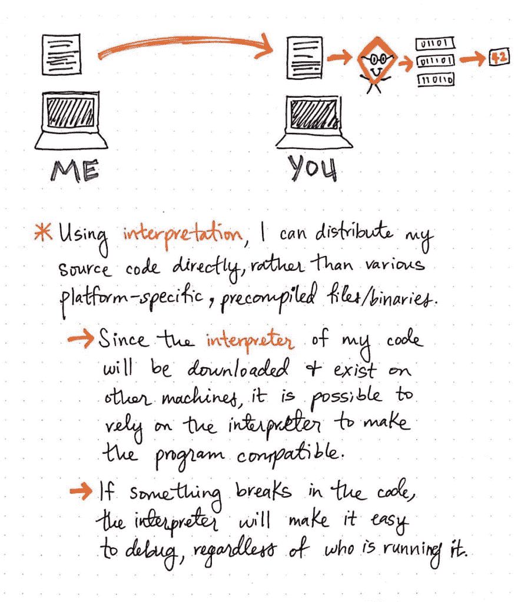](https://res.cloudinary.com/practicaldev/image/fetch/s--3QrWuBaT--/c_limit%2Cf_auto%2Cfl_progressive%2Cq_auto%2Cw_880/https://cdn-images-1.medium.com/max/1024/1%2Arqrqsd2_SZApubCulF0jwg.jpeg) 

<figcaption>将效率和好处诠释，付诸行动。</figcaption>

</figure>

另一方面，当我们使用解释时，我们可以直接分发我们的源代码，而不是担心特定于平台的可执行文件，或者考虑我们将如何着手编译二进制文件供每个人使用。

然而，在这种情况下，我们将需要程序的消费者下载一个解释器——它实际上通常是随语言一起提供的——并确保解释器存在于他们的机器上。一旦他们有了解释器，他们就可以看到我们的原始源代码，获取这些代码，然后依靠他们自己版本的解释器在本地运行这些代码。

在这种情况下，我们依靠解释器来使兼容所有平台，而我们，作为程序员和消费者，不需要考虑这个问题。此外，如果出现问题(无论是我们编写的源代码中的问题，还是与他们自己的平台相关的问题)，我们代码的消费者可以比编译文件更容易地找出问题所在。解释器将使调试任何问题变得容易，不管是谁在运行我们的代码。

但是，不管我们选择编译还是解释，最终目标都是一样的:说一种我们的计算机能够理解的语言！事实证明，归根结底，所有的*都是*二进制。

### 资源

因为解释器和编译器已经存在很多年了，所以有很多关于这两种类型的翻译器的资源。从实现的角度来看，有许多不同的方法来编写编译器和解释器。但是，如果您只是想了解更多或更深入一点，这些资源是一个很好的起点。

1.  [解释器和编译器(比特和字节，第 6 集)](https://www.youtube.com/watch?v=_C5AHaS1mOA)，比特和字节 TVO
2.  编译器和解释器的区别
3.  [编译 vs 解释](https://www.youtube.com/watch?v=JNMy969SjyU)，BogeysDevTips
4.  使用解释器和编译器的机器代码和高级语言
5.  [编程过程](http://www2.hawaii.edu/~takebaya/ics111/process_of_programming/process_of_programming.html)，Vern Takebayashi 教授
6.  [为什么第一个编译器是在第一个解释器之前写的？](https://softwareengineering.stackexchange.com/questions/251431/why-was-the-first-compiler-written-before-the-first-interpreter)，StackOverflow

* * ****