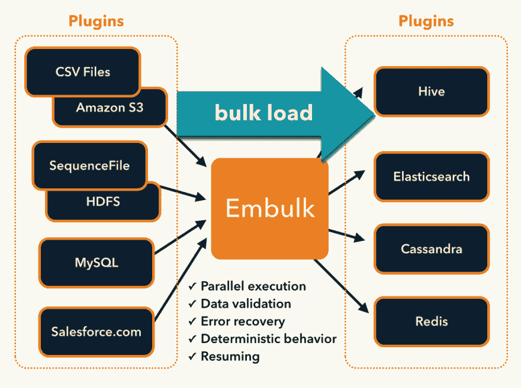

# Embulk 开源批量数据加载器文档。

> 原文:[https://dev . to/hiroysato/embulk-open-source-bulk-data-loader-documents-8j 3](https://dev.to/hiroysato/embulk-open-source-bulk-data-loader-documents-8j3)

Embulk 是一个开源的批量数据加载器，帮助在各种数据库、存储、文件格式和云服务之间传输数据。

[T2】](https://res.cloudinary.com/practicaldev/image/fetch/s--mOW6-q3L--/c_limit%2Cf_auto%2Cfl_progressive%2Cq_auto%2Cw_880/http://www.embulk.org/docs/_images/embulk-architecture.png)

我正在收集世界上所有的知识。如果你找到有用的信息，请告诉我。

佐藤博之(twitter [@hiroysato](https://twitter.com/hiroysato) )

## 官方页面。

*   [官方页面](https://github.com/embulk/embulk)。
*   [文件](http://www.embulk.org/docs/)

## 提交人文件

*   [Embulk，一个基于开源插件的并行批量数据加载器](http://www.slideshare.net/frsyuki/embuk-making-data-integration-works-relaxed)
*   [Embuk internals](http://www.slideshare.net/frsyuki/embuk-internals)
*   [Embulk Meetup 主题演讲#2](http://www.slideshare.net/frsyuki/embulk-56197273) Treasure Data，Inc. Sadayuki Furuhashi(@frsyuki)

## 往事

*   2015-04-18 [Fluentd 和 Embulk](http://www.slideshare.net/repeatedly/fluentd-and-embulk-game-server-4) 对游戏服务器的研究。中川正弘
*   2015-07-31 [数据处理世界中带 Java 代码的 JRuby](http://www.slideshare.net/tagomoris/jruby-with-java-code-in-data-processing-world)tago moris[jrubyconf . eu](http://2015.jrubyconf.eu)演示文稿[视频](https://www.youtube.com/watch?v=tPtELQyax0U)
*   2015-12-03 [将数据加载到 Redshift -简化模式读取 ELT](http://www.meetup.com/ja/awsgurus/events/226705053/?eventId=226705053) ( [幻灯片](http://www.slideshare.net/treasure-data/treasure-data-from-mysql-to-redshift)
*   2015 年 9 月 12 日至 15 日
    *   [Embulk Meetup #2 主题演讲](http://www.slideshare.net/frsyuki/embulk-56197273) Treasure Data，Inc. Sadayuki Furuhashi (@frsyuki)
    *   [财富数据公司的 Embulk](http://www.slideshare.net/oreradio/embulk-at-treasure-data)
*   2016-03-30 [在宝藏数据使用恩布尔](http://www.slideshare.net/muga.nishizawa/using-embulk-at-treasure-data)宝藏数据公司 Muga Nishizawa 宝藏数据技术讲座在日本。
*   2016-05-03 [与恩布尔克](http://www.slideshare.net/frsyuki/fighting-against-chaotically-separated-values-with-embulk) [csv，conf，v2](http://csvconf.com) 宝藏数据公司 Sadayuki Furuhashi(@ frsyuki)([视频](https://www.youtube.com/watch?v=RuA_SL5-sXY))
*   2018-10-12 [Apache 气流&包装](https://docs.google.com/presentation/d/1LxwJIA2BFbGtPtdaUaGp1mngYWUQDMrM1V3DZ8AneR0/edit#slide=id.p)(安托万八月)
*   2019-05-02 [学习如何使用开源工具 Embulk 执行 ETL 数据迁移](https://conferences.oreilly.com/strata/strata-eu/public/schedule/detail/74094) (Jason Bell)

## 日文文献。

日语的 Embulk 文档。

## 其他

*   [YAML 配置用 Embulk 导入画布数据](https://github.com/ccsd/canvas-data-embulk-configs)

## 博文

*   宝藏数据
    *   [Embulk 概述](https://docs.treasuredata.com/articles/embulk-overview)
    *   [S3 的恩布尔克](https://docs.treasuredata.com/articles/embulk-import-s3)
    *   用于 MySQL 的 Embulk
    *   [谷歌表单的 Embulk](https://docs.treasuredata.com/articles/embulk-import-googlesheet)
*   DZone
    *   [如何成功导入 XML](https://dzone.com/articles/how-to-succeed-at-importing-xml)
    *   [权衡 BigQuery 与红移](https://dzone.com/articles/weighing-bigquery-vs-redshift)
*   AWS 大数据博客
    *   2016 年 7 月 14 日【SmartNews 如何在 AWS 上构建 Lambda 架构来分析客户行为并推荐内容
*   驾驶工程
    *   2017-12-11 [Embulk:跨数据源轻松移动数据](https://drivy.engineering/embulk-data-transfer/)