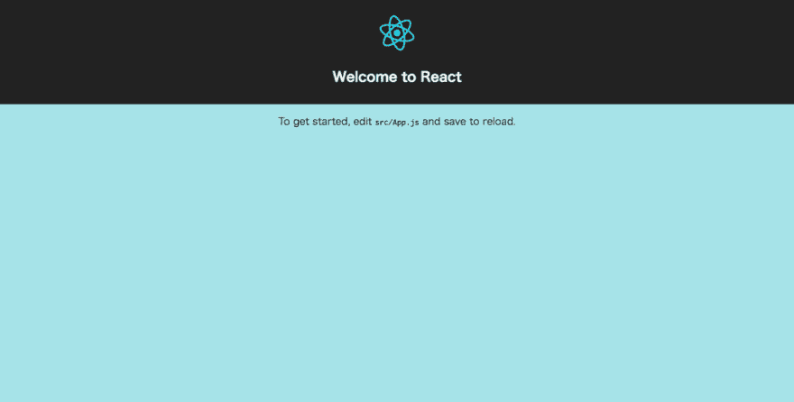

# 在 React 应用程序开发中使用 Sass

> 原文：<https://dev.to/koheishingaihq/react-with-sass-11e>

# 定制创建 React App : *CSS*

## CSS → Sass

开始定制 [create-react-app](https://dev.to/koheishingaihq/how-to-get-started-with-react-9jj) 。

### 安装 npm 模块: *node-sass-chokidar*

```
# Current path : ~/create-react-app
npm install node-sass-chokidar --save-dev 
```

### 安装 npm 模块:*NPM-运行-全部*

```
# Current path : ~/create-react-app
npm install npm-run-all --save-dev 
```

### 编辑 package.json : *脚本*

```
# Current path : ~/create-react-app/package.json
-    "start": "react-scripts start",
-    "build": "react-scripts build", +    "start-js": "react-scripts start",
+    "start": "npm-run-all -p watch-css start-js",
+    "build": "npm run build-css && react-scripts build",
+    "build-css": "node-sass-chokidar src/ -o src/",
+    "watch-css": "npm run build-css && node-sass-chokidar src/ -o src/ --watch --recursive", 
```

### 将自定义的 sass 文件添加到项目中

```
/* File path : ~/create-react-app/src/Custom.sass */ body
  background: powderblue 
```

```
# File path : ~/create-react-app/src/App.js
import './App.css';
+ import './Custom.css' 
```

→运行`npm start`将`.sass`文件编译到`/src`目录下的`.css`。

→打开 [http://localhost:3000](http://localhost:3000) 看`create-react-app`。

> 演示:[koheishingaiHQ.github.io/create-react-app-with-sass](https://koheishingaihq.github.io/create-react-app-with-sass)

[T2】](https://res.cloudinary.com/practicaldev/image/fetch/s--A24NBxdb--/c_limit%2Cf_auto%2Cfl_progressive%2Cq_auto%2Cw_880/https://c1.staticflickr.com/5/4465/36878306283_8811ec8516_b.jpg)