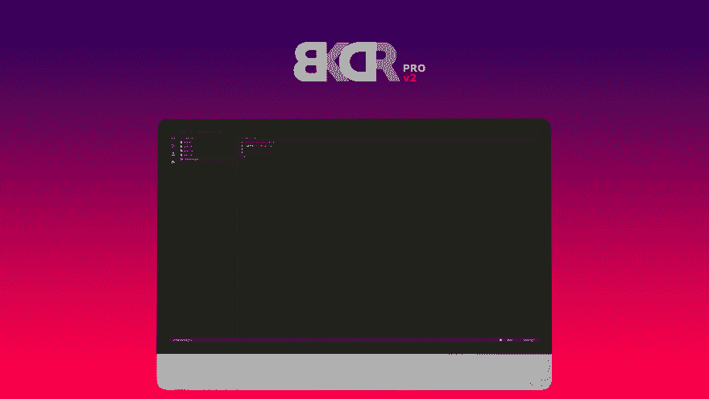

# BKDR v2 -我的 ReactJS 之旅

> 原文:[https://dev . to/Shannon recoa/back door-code-editor-v2-in-react-ch7](https://dev.to/shannonreca/backdoor-code-editor-v2-in-react-ch7)

[T2】](https://res.cloudinary.com/practicaldev/image/fetch/s--gu2pRS-g--/c_limit%2Cf_auto%2Cfl_progressive%2Cq_auto%2Cw_880/https://thepracticaldev.s3.amazonaws.com/i/1i37ai080cygcw8agyug.jpg)

当我最初创建我的 in- [浏览器代码编辑器](https://codecanyon.net/item/backdoor-browser-based-code-editor/13725356)时，我是用 CoffeeScript 编写的。更糟的是，我把它写在一个大文件里。开始时是一个简单的酷想法，随着每一个功能或新想法而变得越来越大。最终，我知道我不能继续这样工作了。对新特性的请求变得越来越难以组织，伸缩也成了一个问题。

这都是因为没有计划。这是一个有趣的，很酷的想法，后来变成了其他的东西，当我意识到的时候，已经太晚了。所以尽管不想，我知道我需要重新开始。

### 接下来是什么？

在我考虑如何以及用什么来重建我的代码编辑器的时候，React 和 Angular where trending。Angular 2 处于测试阶段，与 Angular 1 有很大的不同，这让我对学习它的任何尝试都犹豫不决。此外，根据我的简单理解，React 是一个更轻量级的框架。所以我决定做出反应。

我不想做的一件事是在重新制作我的 web 应用程序时学习 React。这似乎只是一个不明智的决定，最终会回来困扰我。我需要另一个项目来真正展现我的沙盒冒险。当然，了解我之后，我创建了一个[社交网络](https://mocfolio.com)(好像那是更容易的选择)。

### 上课上课

最后，我能够带走这么多宝贵的经验。例如，当你面对一种情况时，jQuery 有时会成为一种反射。但是在 React 中，你需要改变你的思维模式。我们太习惯用 JavaScript 和 jQuery 操作 DOM 了。然而，React 最大的好处之一是它能够更新组件内的状态变化。

在组件中，HTML 或其他组件可以在 render 方法中返回。每次更新或替换状态时，都会触发组件重新呈现。这是在实际 DOM 中更新之前通过虚拟 DOM 处理的。Redux 还添加了另一个伟大的元素来与它的商店反应。基本上，它能够拥有一个可以通过调度进行更新的集中式数据源。这是创建我的 web 应用程序的一个巨大特点。对于更简单的项目，这可能是多余的。这真的完全取决于你的需求。

### 结果

在花了大约八个月的时间学习 React 后，我在 2017 年 3 月开始了第二版的[后门](http://bkdr.pro)(我将其更名为 [BKDR](http://bkdr.pro) )。现在，10 个月后，我将在接下来的几天内发布我的测试版，完全内置在 React 中，并在 PHP 中处理服务器端。我估计我写了超过 30 个组件，所有的组件都组织得很好，并且最适合扩展。

如果你想了解我的后门进展，你可以访问 BKDR.org。