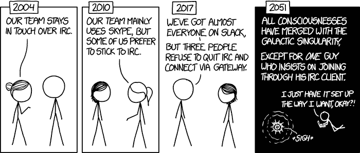

# IRC 网络礼仪和你

> 原文:[https://dev.to/codemouse92/irc-netiquette-and-you-doa](https://dev.to/codemouse92/irc-netiquette-and-you-doa)

不管喜欢与否，IRC 仍然是计算机行业中占主导地位的聊天协议之一。成百上千的人来了又走，但没有人真正取代它。它缺少许多其他协议的铃声、口哨声和锣声，但这似乎增加了它的价值。它是去中心化的，几乎没有 bug，几乎可以在任何有网络连接的机器上运行。

这就是为什么这将永远是真的...

[T2】](https://res.cloudinary.com/practicaldev/image/fetch/s--NIypIt3Y--/c_limit%2Cf_auto%2Cfl_progressive%2Cq_auto%2Cw_880/https://imgs.xkcd.com/comics/team_chat.png)

我年轻时第一次注册了 IRC，建立了许多友谊，甚至发起了一场恶作剧战争(我赢了)。我离开它好几年了，在高中时通过聊天室重新发现了它。我毫不掩饰这是我加入的第一个专业编程社区，我仍然认为像`nedbat`和`habnabit_`这样的常客是我早期的影响和导师。

正确使用的话，IRC 是你职业网络中不可替代的一部分，提供大量有用的建议和很多有用的联系方式。但是，像任何“古老”的通信协议一样，IRC 有自己的文化和规则。如果你想在 IRC 上生存和发展，你必须知道这个社区是如何运作的。

**注意:**虽然这些规则和概念可以追溯到 IRC，但是您可以很容易地将它们移植到任何聊天协议中。

## 了解网络礼仪

在大多数情况下，这些被认为是 IRC 的*不成文的*规则。许多人会期望你自己跟随他们。在许多房间里，严重的违法行为甚至可能没有警告；你可能会被禁赛。

然而，因为 IRC 是分散的，而且很大程度上不受监管，所以不是所有的网络、房间或社区都遵循这些规则。如果你发现自己身处其中一条黑暗的小巷，你需要自己决定是留还是走。总的来说，呆在忽视网络礼仪的房间里是不值得的——它通常会变成一种有争议的、令人精疲力尽的经历，在那里派系和双重标准比比皆是。

最终，你要对自己负责。无论你身在何处，无论这些规则似乎被忽视了多少，你最好的办法就是遵守网络礼仪。

## 注册您的昵称

当您首次登录社区时，**选择并注册一个或多个昵称**。你不太可能发现自己作为一个“未注册”的用户被信任或被授权访问。在 Libera Chat [上注册昵称的说明可以在这里找到](https://libera.chat/guides/registration)。其他网络可能有自己的指令，但它通常遵循相同的过程。

注册昵称后，请务必在每次登录 IRC 时登录。许多 IRC 客户端支持 [SASL](https://libera.chat/guides/sasl) ，它会自动为你完成这个登录步骤。

## 基本规则

当你第一次加入一个房间时，一定要阅读**主题**，它会在你第一次加入时显示(也可能在你的 IRC 客户端的顶部)。这会让你知道基本规则是什么。

*   永远遵守任何房间规则。如果你不喜欢规则，*我们不在乎*。你应该阅读张贴的规则(包括完整规则和社区指南的链接)，并遵守。如果你违反了警告，不要期待警告。

*   不要跑题。如果房间是为 Python 支持准备的，那么就把话题放在 Python 支持上。许多社区都有一个专门的“话题外”的房间，用于所有其他的对话。

*   尊重 OPs(会议室主持人)。他们经常去卧底，但如果一个人“行动起来”(显示他们的行动状态)，你应该听听他们要说什么！大多数行动会警告一次，然后踢，然后踢禁令。

*   如果你对这个房间的管理方式不满意，查看一下社区规则，看看是否有正式的地方可以提出争议。如果没有，或者你觉得没有必要提出正式的争议，那就离开这个社区。不是每个房间都适合每个人。

## 文化敏感度

关于 IRC，要记住的最重要的一点是，它是一个国际平台。你会遇到来自所有国家、文化和各行各业的人。你应该始终保持尊重和文化敏感性。这其实不是一个“政治正确”的问题；你应该简单地用不容易被误解的方式交流。

在这一点上，如果你不小心侮辱了某人，只要道歉，并注意如何更好地沟通。跨文化交际是一种后天的技能，所以大多数人会温和地纠正你。(当然，如果一个人习惯性地被所有人所有事侮辱，那你也没办法。)

一个很好的快速检查你的措辞的方法是问“这是不是假设了其他人的一些事情？”在你对这个人了解更多之前，要坚持使用通用的措辞。

我曾亲自与来自世界各地的了不起的人聊天——法国、西班牙、德国、苏格兰、马恩岛、墨西哥、加拿大、塞浦路斯、俄罗斯...这样的例子不胜枚举！大多数人喜欢谈论他们的国家和文化，所以问“你从哪里来”不会有什么坏处(如果他们不想告诉你，那就随他去吧。)

最重要的是，向每个人展示你希望别人如何对待你的那种尊重。

## 提问

IRC 的主要用途之一是回答问题。这些是你应该遵守的绝对重要的规则:

*   提出问题时，包括所有相关的软件版本/系统信息、代码和错误消息。对大量文本使用粘贴工具。(请参阅泛滥和垃圾邮件)

*   发布您的问题并等待。在 IRC 上获得帮助是一件冒险的事——一个有知识回答你的问题的人必须在场并且很活跃。如果没人能帮忙，通常没人会对你说什么。

*   不要再发表你的问题，直到它以某种方式从屏幕上消失，并且已经超过十分钟。人们一般不会“读”超过一两页(尽管也有例外)。一旦你确定你的问题已经被“埋葬”了，你可以重新发布它。

*   如果没有很快得到答案，不要心急。发布类似“嗯？”或者“有人吗？?"没有帮助——它实际上降低了别人帮助你的可能性。

*   **待在房间里！**如果必须的话，把你自己标记为`/away`，但是只要你在技术上能够呆在房间里，就这样做。问完问题几个小时后才收到答案的情况并不少见。(这条规则是双向的，所以如果你因为离开电脑而错过了几个小时的后续问题，不要感到难过)。

*   避免交叉发布。等到你的问题被“埋”在一个房间里，或者直到有人明确告诉你，在那个房间里没有人可以帮助你，然后再把它张贴到另一个房间。如果你在一个安静的房间里等了很长时间，通常可以在第二个房间里重新发布问题，但是一旦你有了答案，一定要用答案更新第一个房间！

## 争论与室温

基于文本的交流是一种奇怪的媒介。我们很自然地在文本中读出语气和其他非语言的暗示。甚至现在，你几乎可以肯定听到一个“精神叙述者”在用一种特殊的语气读这篇文章(希望是友好的语气！)

这很快会成为 IRC 中的一个问题，尤其是当热门话题出现时。有些房间甚至完全禁止宗教和政治，但人们仍然会为一些事情争吵。我们将房间内的冲突程度称为其**温度。**

在适当的时间和地点，有争议的话题不一定是坏事；通过与世界各地的人讨论文化和时事，你可以学到很多东西。事实上，进行这些对话而不引起问题是可能的。这里有一些规则:

*   检查一下你的“精神叙述者”。假设对方最好的一面。

*   盯紧“室温”。如果人们明显感到不安，认真考虑停止对话。简单的说“这个话题好像有点白热化了。我们谈点别的吧。”对降低室温大有帮助。

*   如果你觉得你的脾气在上升，停止说话。

*   人比“赢得”一场辩论更重要。“同意不同意”没关系，不管别人怎么说。我个人放弃了我感兴趣的话题，仅仅是因为我重视友谊胜过证明我的观点。

*   如果你被要求放弃一个话题，放弃这个话题。同样，如果你让别人放弃这个话题，就认为它已经被放弃了，并拒绝进一步参与。(忽略一个论点是一个强有力的工具。)

*   如果争论失去了控制，你无法在房间里逃脱，离开几分钟冷静下来。虽然有些人会把这误标为“愤怒-放弃”，但这实际上是处理爆炸性“没有胜利”情况的成熟方法。每隔几分钟检查一下房间，看看辩论是否已经结束，然后重新加入。如果非要使用这种战术， ***永远不要*恢复辩论！**

## ping

当你在 IRC 上的一条消息中加入某人的昵称时(假设他们和这条消息在同一个房间)，他们将被“ping”。这是一个非常有用的特性，但是你应该小心不要滥用它。

*   如果你在一个又大又忙的房间里，你应该总是在一串信息中的第一条上 ping 你的谈话对象。这有助于其他人跟踪对话。

*   如果你真的想引起某人的注意，就去试一试。通常有常见的昵称缩写版本(如“codemouse”而不是`CodeMouse92__`),人们会用它们来称呼一个人，而不用 ping 它们。

*   如果有人让你不要 ping 他们，就不要 ping 他们。

## 私人消息

在 IRC 上给人发私信是可能的。大多数人不介意你开始一次私人谈话，但是如果你不确定，你应该先问一下(无论是在公共场合还是在最初的私人信息中)。

不管怎样，尊重对方，把私人信息视为一种特权。有些人可以接受偶尔的信息，但不能接受长时间或频繁的对话。

当然，在这件事上你和其他人一样有权利。要有礼貌，但要清楚自己的私人信息界限。

此外，还要考虑对话是否可能对整个房间都有用。如果有人问了一个公共问题，而你不必要地发给他们答案，你就剥夺了社区其他人的解决方案。

## 泛滥和滥发

你应该避免张贴大量的文字。即使你看起来可以把它全部装进你的客户端的盒子里(比如 Hexchat)，IRC 也有一个最大的消息大小，你的客户端会把盒子里的内容裁剪成所需的正确数量。试图张贴大量文本会淹没房间，这是一个巨大的烦恼。

为了避免这种情况，我们使用像[bpaste.net](http://bpaste.net/)这样的网站来发布代码、错误信息和其他长文本。检查首选粘贴工具的房间主题，如果没有其他要求，默认为 bpaste。

(顺便说一下，Pastebin 本身是不鼓励的，因为一些国际用户无法查看该站点。)

此外，你不应该一遍又一遍地发布相同的信息。这被认为是垃圾邮件，它通常会警告你和/或禁止你进入房间。(参见提问)。

## 拖钓和燃烧

在任何情况下，你都不应该带着挑起争论或挑起事端的明确目的走进房间，不管你认为这有多好笑。这被称为“钓鱼”，是你在 IRC 上犯下的最严重的罪行之一。

一般来说，你也应该避免使用亵渎和其他攻击性的语言。不同的房间在这方面有不同的政策，但是保持你的语言干净没有坏处。(它还提倡使用更有创意、更具描述性的词汇——从语言学上来说，f-bomb 只是毫无意义的填充词。)

过度使用攻击性或伤害性的语言，尤其是针对一个人，被称为燃烧。这是不对的。永远不会。句号。

## 僵尸工具

如果你所在的房间有一个专为房间参与者设计的机器人，学习如何正确使用它是一个好主意。你不应该滥用房间的机器人功能。

还有流氓聊天机器人，旨在自动搜索频道。因为没有人能打败图灵测试，我们通常能很快发现这些。如果出于某种原因，有人开始质疑你是不是机器人，不要觉得被侮辱了。只要混合你的句子结构(机器人不能做得很好)，并确保你不总是谈论同样的事情。

## 友谊和熟悉

现在，我在 IRC 的几个好朋友想让我指出，*是另一种“钓鱼”的地方。在一个紧密团结的社区范围内，已经证明自己值得信任的常客有时会以类似于钓鱼的方式相互戏弄。然而，**这是一个应得的特权**。*

很容易假设，因为我们是通过 IRC 认识的，所以我们没有真正的关系。没有什么比这更偏离事实了！就在我花费大部分时间的地方，我把许多成员都看作是我最亲密的朋友。我们对彼此有很深的信任。我们中的一些人分享了电话号码和邮件地址。晚餐的长期邀请存在，现实生活中的聚会发生。我们有过争论并解决了它们，信任和被信任，当关键时刻，彼此足够关心，以非常切实的方式提供帮助。我们在 IRC 的环境中就像在面对面的友谊中一样亲密。但是，就像在现实生活中一样，这些友谊是随着时间的推移而形成的*。*

 *因此，如果一个新来的人走进房间，开始以同样熟悉的方式互动，他们自然不会受到欢迎。这和一个随机的陌生人走进一个私人的生日聚会或婚礼，假装自己是“一伙人”是一样的。令人毛骨悚然。这并不是说我们有一个“小团体”，因为许多新来者已经进入了我们的核心圈子。我们只是有亲密的友谊，这需要时间来形成。

这就是为什么你不应该把网络礼仪的明显“例外”当作无视规则的许可证。可能只是你还没有证明自己。通过定期的积极互动，你也会发现自己是社区中值得信赖的一部分，拥有值得信赖的朋友。

## 讥讽、刻薄、迂腐

你已经进入了这个星球上最大的网虫社区。我们有自己独特的交流方式。

如果有人听起来像是在侮辱你，假设他们是在讽刺或愚蠢——他们几乎总是这样！对公开的侮辱做出回应，就好像这是真的和/或赞美是最好的回应方式。那些故意侮辱人的人无论如何都不能用那种回应来工作。

这是我自己聊天记录中的一个例子。另一个人其实一点也不介意我在那里:

> *CodeMouse92 加入。哦，太好了...是 CodeMouse92

除了发生在一个稳固的 IRC 友谊中，这在一般情况下并不少见。

当心双重含义和内涵！电脑程序员及其特别喜欢玩文字游戏，所以你很可能会把这样的信息故意曲解为笑话。如有必要，配合或礼貌地澄清。例如:

> [phunyguy]嗯，我的状态实际上现在还悬而未决，所以我说为什么不呢
> [phunyguy] ldunn，不要说出来
> *CodeMouse92 注意到 phunyguy 没有要求他不要对那个声明签名
> [CodeMouse92] phunyguy，你的状态悬而未决？我希望你在一个小机场，否则你将很难找到一个足够大的机场。CodeMouse92，哦，原来是你说的。我以为会是 ldunn 和法兰绒。

再说一次，虽然马上加入这种谈话很有诱惑力，但不要在家里尝试...至少，直到你在一个房间里有了足够的经验，知道社会的期望和一般的节奏。在展示你的小聪明之前，先在社区内建立信任。

## 几个不错的房间

我几乎所有的时间都花在 Libera 聊天网络上，我发现了好的和不好的房间。大多数语言和许多开源项目都有专门的房间(官方的或非官方的)。

以下是我发现的一些有用的例子:

`#c++-basic`和`#c++-general` : C 和 C++支持问题和技术讨论。(我运行后者)

`#python`和`##learnpython` : Python 支持问题和技术讨论。(两者我都有，但我最喜欢的一直是前者。)

`#learnprogramming`:任何语言的编程题。初学者为主，但是比较高级的问题也可以。

`#javascript` : Javascript 支持和技术讨论。我实际上从来没有来过这里，但是我的几个好朋友强烈推荐它。

`#ubuntu`:Ubuntu 操作系统的技术支持。(另请参见，`#ubuntu-server`获取 IT 相关的支持和讨论。)*