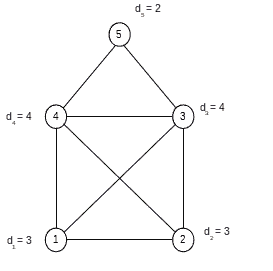
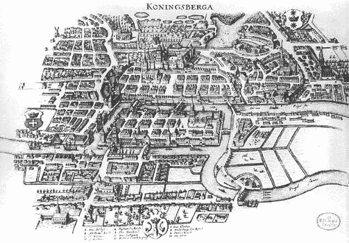
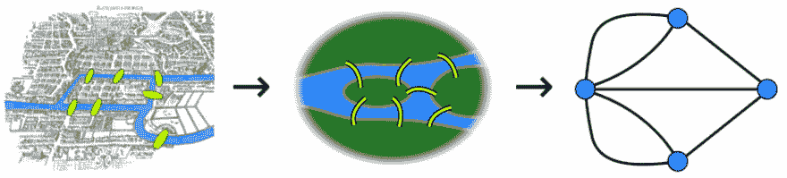
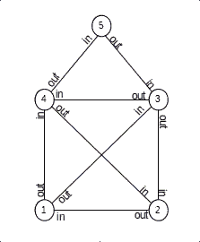

# 节日快乐！有一些图论知识...

> 原文：<https://dev.to/danielw/happy-holidays-have-some-graph-theory-c9h>

差不多是圣诞节了，我想起了前几天在德语国家流行的一个儿童谜题，叫做 *Haus des Nikolaus* ，大致翻译过来就是*圣诞老人之家* 1 。当我还是个孩子的时候，我总是用我记忆中的一种解法来解决这个问题，但是就在几年前，我在一次大学数学课上偶然得知了它的理论基础。

因此，有一点时间休息，并认为这可能是有趣的，欢迎来到我在互联网上的第一个帖子！

难题是画一个像标题图片中的房子，从它的任何一个角落开始，永远不要重走你已经画的线，永远不要提起你的笔。最终结果应该是这样的:

[T2】](https://res.cloudinary.com/practicaldev/image/fetch/s--Itg-ay4D--/c_limit%2Cf_auto%2Cfl_progressive%2Cq_auto%2Cw_880/https://thepracticaldev.s3.amazonaws.com/i/0dnumwzbl1ljtupp87gv.png)

拿出一张纸来试试吧！能解决吗？你能想出解决这个问题的多种方法吗？

* * *

是吗？做不到？我是来读书的，不是来画画的！？
让我们看看如何用图表来形式化和解决这个问题！

### 首先，让我们来定义一下

一个图由一组*节点*(或顶点)和连接它们的*边*组成。在我们的特例中，我们谈论的是一个*无向图*，即。可以在任一方向上遍历边的图。
我们要做的另一个定义是节点的*度*，即。连接到一个节点的边的数目。

因此，根据我们的新知识，让我们把圣诞老人的房子设置成一个图，每个节点的度数都标在旁边。

[T2】](https://res.cloudinary.com/practicaldev/image/fetch/s--I-o78wac--/c_limit%2Cf_auto%2Cfl_progressive%2Cq_auto%2Cw_880/https://thepracticaldev.s3.amazonaws.com/i/e8ca3vx6v7idsb0go4h5.png)

## 历史上短暂的历程

*尼古拉故居*问题可以解释为一个 18 世纪早期问题的变体，即数学家莱昂哈德·欧拉(1707-1783)提出的*柯尼斯堡的七座桥*。
问题是，是否有可能设计一次穿越东普鲁士当时的首都柯尼斯堡的往返旅行，正好一次穿过所有七座桥，最后到达你开始旅行的地方。

[T2】](https://res.cloudinary.com/practicaldev/image/fetch/s--I3UqC008--/c_limit%2Cf_auto%2Cfl_progressive%2Cq_auto%2Cw_880/https://thepracticaldev.s3.amazonaws.com/i/mruafit1q1f4axjjuu6z.png)

欧拉对这个问题的解决方案今天被认为是第一篇发表在图论上的论文。他观察到，当你通过一座桥进入一块陆地时，你也必须通过一座桥离开这块陆地。因为你不能两次使用同一个桥来进出，所以每块大陆必须有偶数个桥与之相连。一个用于进入，一个用于离开大陆。

他的结论是，柯尼斯堡的七座桥问题无解，因为每个地块都有奇数座桥与之相连。
更一般地陈述问题和欧拉观察:
通过一个图找到一种方法，使
1)访问所有节点，
2)恰好遍历每条边一次，
3)在同一个节点开始和结束。
这种方式被称为*欧拉周期*。
无向图有欧拉圈当且仅当每个节点都有偶数度。

关于柯尼斯堡七座桥问题的更完整和连贯的帖子，请查看 [Vaidehi Joshi](https://dev.to/vaidehijoshi) 的[牛逼帖子](https://dev.to/vaidehijoshi/knigsberg-seven-small-bridges-one-giant-graph-problem)！

## 回我们家

[T2】](https://res.cloudinary.com/practicaldev/image/fetch/s--I-o78wac--/c_limit%2Cf_auto%2Cfl_progressive%2Cq_auto%2Cw_880/https://thepracticaldev.s3.amazonaws.com/i/e8ca3vx6v7idsb0go4h5.png)

我们之前陈述的房屋绘图的约束可以被重新表述为欧拉循环的一个较弱的变体:
通过一个图找到一种方式，该方式是
1)访问所有节点，
2)恰好遍历每条边一次，
3)但是开始和结束节点不需要相同。
这条路被称为*欧拉路径*。从我们上面的观察中，我们可以得出一个欧拉轨迹存在于一个图中，当且仅当零个或两个节点具有奇数度。

从我们的 *Haus des Nikolaus* 图中可以看到，幸运的是，我们的图中正好有 2 个奇数度的节点，因此我们可以得出结论，一个解决方案实际上是可能的！
但是有一个条件。
让你的画起作用的唯一方法是在一个奇数度节点开始和结束你的路径。

为了使这一事实更加明显，让我们根据您想要在路径中使用它们的方向，用“in”或“out”来标记每个边。
[T3】](https://res.cloudinary.com/practicaldev/image/fetch/s--0bnw23wC--/c_limit%2Cf_auto%2Cfl_progressive%2Cq_auto%2Cw_880/https://thepracticaldev.s3.amazonaws.com/i/spj9qa9hjzznz90epxb4.png)

现在我们可以立即看到，底部节点之一有 2 个*输入*，但只有 1 个*输出*，这意味着你将不可避免地陷入其中。这自然一定是你的终点节点。
两个底部节点中的另一个有 2 个*输出*，但只有 1 个*输入*，这意味着为了遍历图中的所有边，2 个输出中的一个需要是你遍历的第一条边。使该节点成为您的开始节点。

[T2】](https://res.cloudinary.com/practicaldev/image/fetch/s--QXBXfYWF--/c_limit%2Cf_auto%2Cfl_progressive%2Cq_66%2Cw_880/https://upload.wikimedia.org/wikipedia/commons/1/11/Blender3D_HouseOfStNiclas.gif)

所以我们有它。一个简单的儿童难题用太多的努力解决了！我有一种感觉，这是那种会永远缠着你的无用信息。此外，在野外遇到并识别著名数学问题的变体总是很有趣。

希望你玩得开心:)

#### 额外学分

这个问题有多少种可能的解决方案？

* * *

那是谎言*尼可劳斯*不翻译成*圣诞老人*。他就是[圣尼古拉斯](https://en.wikipedia.org/wiki/Saint_Nicholas_Day)。押韵这样更好:P