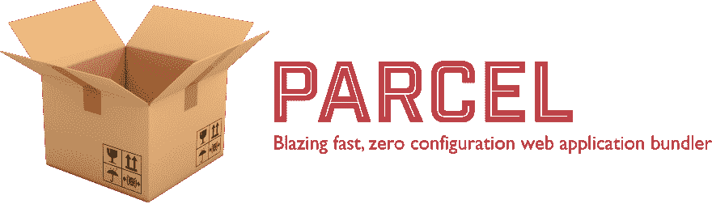

# package+riot . js

> 原文：<https://dev.to/nasa9084/parcel--riotjs-cgn>

## TL；博士；医生

*   [试着接触了名为 Parcel](https://parceljs.org/) 的 JavaScript 的模块束带
*   与 webpack 等相比，不需要设定文件等也非常简单
*   可以简单地运行热重新加载的开发服务器
*   和 Riot 组合也不是很难

## 包裹+ Riot.js

[T2】](https://res.cloudinary.com/practicaldev/image/fetch/s--lKqpRp5h--/c_limit%2Cf_auto%2Cfl_progressive%2Cq_auto%2Cw_880/https://blog.web-apps.tech/conteimg/2017/12/parcel.png)

[Parcel](https://parceljs.org/) 这个 JavaScript 的模块乐队成为了话题，所以进行了触摸。

在国内成为话题的原报道是“[webpack 时代的结束和 parcel 时代的开始](https://qiita.com/bitrinjani/items/b08876e0a2618745f54a)”。

[与 React](https://reactjs.org/) 的组合写了报道。

因为我个人喜欢[Riot.js](http://riotjs.com/ja/) ，所以试着和 Riot.js 组合接触了一下。

另外，webpack 因为挫折而无法比较。

## Parcel/Riot.js 的安装

使用 npm 进行安装。

```
$ npm install -g parcel-bundler riot 
```

## 源代码

### 目录结构

假设目录结构如下:

另外，为了练习，与动作确认无关的部分进行了适当的削除。

```
src/
|- index.html
|- index.js
|- package.json
|- app/
| |- App.tag 
```

### index.html

```
<!doctype html>
<html lang="ja">
  <head></head>
  <body>
    <App></App>
    <script src="index.js"></script>
  </body>
</html> 
```

### index.js

```
import riot from 'riot'
import './app/tags'

riot.mount('App') 
```

### App.tag

```
<App>
  <h1>Hello, parcel world!</h1>

  <script>
  import riot from 'riot' 
  </script>
</App> 
```

### package.json

`package.json`在`npm init -y`中创建。

## 编译/捆绑&运行

```
$ riot app/ app/tags.js
$ parcel index.html 
```

通过上述命令，热加载的服务器在`http://localhost:1234`中运行。

在制作最终的成果物时，似乎只要设为`parcel build index.html`就可以了。

但是，由于 riot.js 的编译是在 parcel 的前一级单独进行的，因此不会对 tag 文件进行 watch 更改。 可以通过在 riot 命令中添加`-w`选项来监视，但这样的话需要在不同的终端上打开这两个命令等，有点麻烦。
在
`package.json`的`scripts`中追加以下三个命令。

```
{
"watch": "npm run watch:riot & npm run watch:parcel",
"watch:riot": "riot -w app/ app/tags.js",
"watch:parcel": "parcel index.html"
} 
```

添加后，执行以下命令。

```
$ npm run watch 
```

这样，只需一个命令就可以使热加载的开发服务器运行。