# 如何将你的第一份 iOS 工作添加到 Jenkins

> 原文：<https://dev.to/bugfenderapp/how-to-add-your-first-ios-job-to-jenkins-aeh>

*这篇文章最初发表在我们的[博客](https://bugfender.com/blog/how-to-add-your-first-ios-job-to-jenkins/)上。*

如果你错过了本系列的前几篇文章，或者你不确定 Jenkins 或 CI 是什么，请回头阅读:[什么是 Jenkins，你为什么要使用它？](https://bugfender.com/blog/what-is-jenkins-and-why-should-you-be-using-it/)

* * *

为了构建 iOS 应用程序，您需要在 macOS 机器上运行服务器。您可以将 Jenkins 直接安装在 Mac 电脑上，但我们更倾向于在我们的办公室中安装一台小型 Mac mini 机器*来完成这些任务。

好奇如何给 Jenkins 添加一个 Android build？[查看这篇文章](https://bugfender.com/blog/how-to-add-your-first-android-job-to-jenkins/)。

即使 macOS 有一些服务器托管选项，它们也不像 Android 托管选项那样常用。我们的解决方案是在 Linux 机器上运行 Jenkins，并在 macOS 工作机器上运行 iOS 构建。

(*我们提到 Mac mini 是因为它是你能买到的最便宜的 macOS 机器。2017 年新机型起价 499 美元左右。但是如果你有其他的苹果电脑，比如有 1GB 或更多内存的旧 MacBook，那也很好。)

## 如何为 iOS 版本添加 Mac 节点

按照以下步骤将 Mac 节点作为工作节点添加到正在运行的 Jenkins 服务器。如果您已经完成了这一步，请跳到下面的“配置 iOS 作业”,开始向 Jenkins 添加 iOS 版本。

在我们开始之前，请注意:您不需要公共 IP 地址或 Mac 节点端的开放端口，因此将 Mac 机器放在您的家中或办公室，位于 NATed 网络后面是一个非常合适的设置。

### 第一步:在浏览器上打开`https://your-ci-server-name.com`

你需要为 JNLP 开放一个港口。JNLP 是一种 Java 协议，为在其他地方执行的应用程序提供服务。您的工作节点将使用此协议下载 Jenkins 工作应用程序。

### 第二步:从仪表板转到**配置詹金斯** > **配置全球安全**

指定一个**固定的**端口。在下面的示例中，我们选择了 8081，但是您可以选择 1024 和 65535 之间的任何端口。确保此端口在您的防火墙中是打开的。

[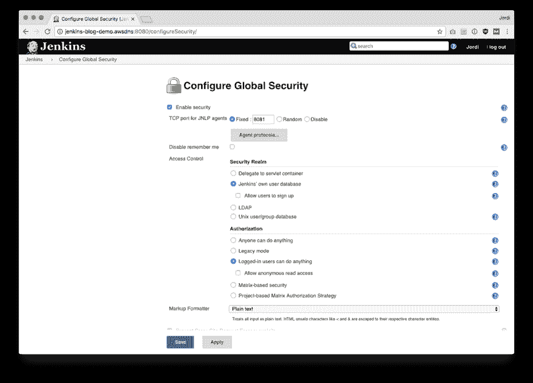T2】](https://res.cloudinary.com/practicaldev/image/fetch/s--C9tIpjVr--/c_limit%2Cf_auto%2Cfl_progressive%2Cq_auto%2Cw_880/https://bugfender.com/wp-content/uploads/2017/11/jenkins-4-2-configure-global-secuirty.png)

### 第三步:在**詹金斯** > **管理节点**中创建一个新节点

[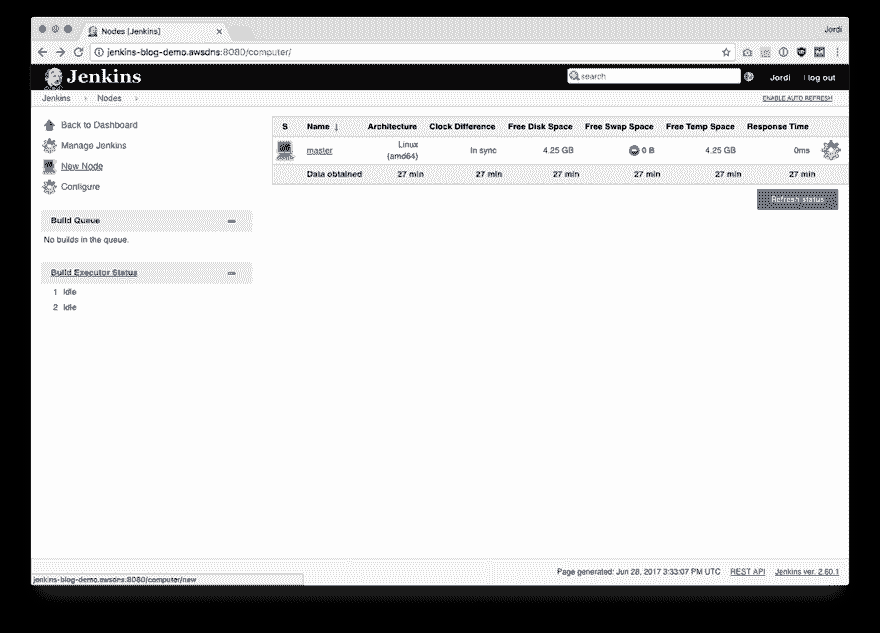T2】](https://res.cloudinary.com/practicaldev/image/fetch/s--Mk7Z3er2--/c_limit%2Cf_auto%2Cfl_progressive%2Cq_auto%2Cw_880/https://bugfender.com/wp-content/uploads/2017/11/jenkins-4-3-nodes.png)

选择**新节点**。

```
<ul> 
```

Enter fullscreen mode Exit fullscreen mode*   为其命名，例如 macmini。它可以是任何东西。

```
<li>Enter a Remote root directory: <code>/tmp</code></li>

<li>Choose Launch method: <strong>Java web start</strong></li>

<li>Add a Label: <strong>mac</strong>. (This label will be important when you need to specify where jobs should be executed each time you configure them. Using this label, you can make sure Mac projects exclusively run on your mac machine. More on this below.)</li></ul> 
```

Enter fullscreen mode Exit fullscreen mode

保存后，您将在节点列表中看到新添加的节点。

[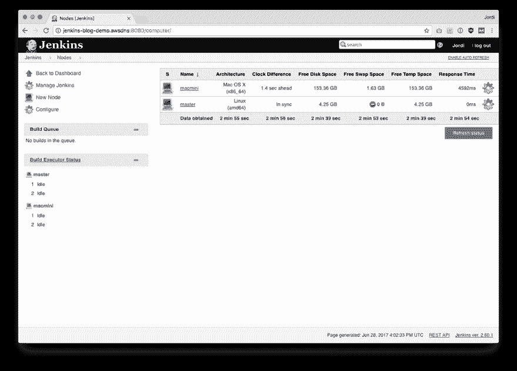T2】](https://res.cloudinary.com/practicaldev/image/fetch/s--vTyjjJ1A--/c_limit%2Cf_auto%2Cfl_progressive%2Cq_auto%2Cw_880/https://bugfender.com/wp-content/uploads/2017/11/jenkins-4-4-new-node.png)

### 第四步:打开你刚刚创建的节点，你会发现一个命令

将该命令复制并粘贴到从机的终端中。

[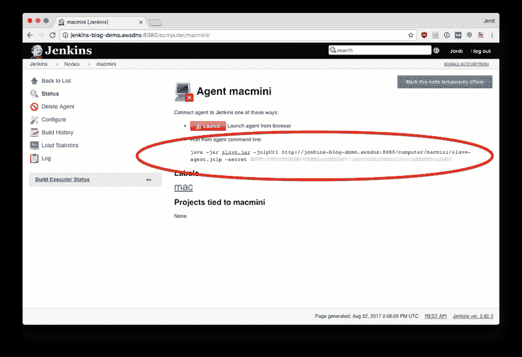T2】](https://res.cloudinary.com/practicaldev/image/fetch/s--0_KssIX7--/c_limit%2Cf_auto%2Cfl_progressive%2Cq_auto%2Cw_880/https://bugfender.com/wp-content/uploads/2017/11/jenkins-4-5-slave.png)

几秒钟后，您将在节点列表中启动并运行该节点。

[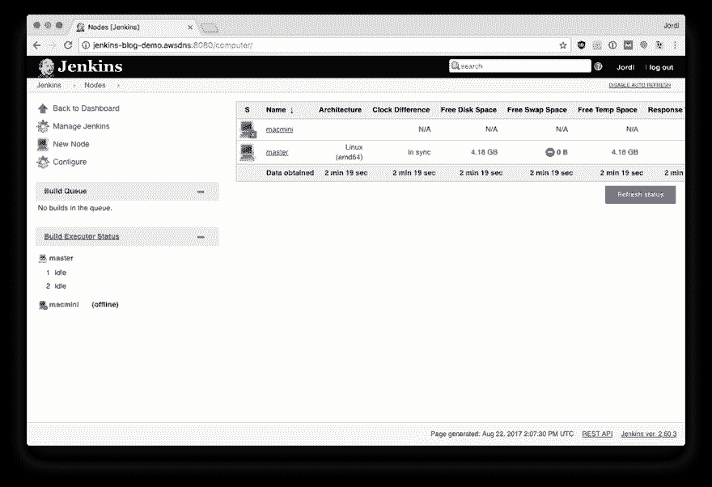T2】](https://res.cloudinary.com/practicaldev/image/fetch/s--Ff8wEU7A--/c_limit%2Cf_auto%2Cfl_progressive%2Cq_auto%2Cw_880/https://bugfender.com/wp-content/uploads/2017/11/jenkins-4-6-node-2.png)

现在您的节点已经准备好接受构建作业了！

### 第五步:下载 Xcode

由于您计划构建 iOS 项目，您将需要下载 **Xcode** 。你可以在应用商店里找到它。

命令行工具:安装 Xcode 后，打开终端并键入:

```
xcode-select --install
```

## 配置 iOS 作业

现在你有了一台 Mac 工作机，你可以开始构建 iOS 应用了。

**第一步:**在浏览器上打开`[https://your-ci-server-name.com](https://your-ci-server-name.com)`，选择**新项目**

指定新工作的名称，并选择**自由式项目**:

[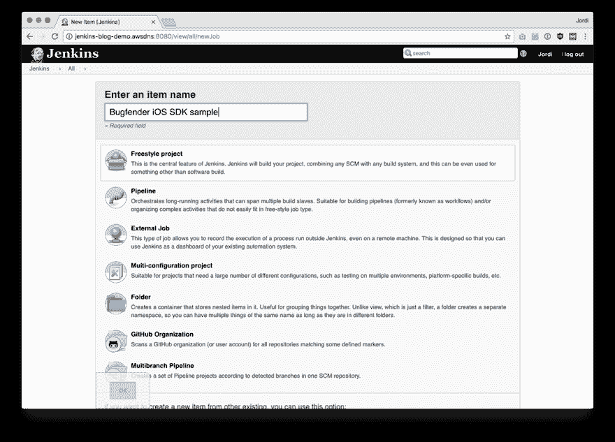T2】](https://res.cloudinary.com/practicaldev/image/fetch/s--XMBddVkh--/c_limit%2Cf_auto%2Cfl_progressive%2Cq_auto%2Cw_880/https://bugfender.com/wp-content/uploads/2017/11/jenkins-4-7-project.png)

第二步:确保你的构建只在 Mac 机器上运行。

为此，在 **General** 选项卡中，选择“**Restrict where this project can run**”并将 mac 编写为标签表达式(该标签与我们在上面的节点配置中为 Mac worker 选择的标签相匹配)。

[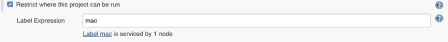T2】](https://res.cloudinary.com/practicaldev/image/fetch/s--IWC1DlU_--/c_limit%2Cf_auto%2Cfl_progressive%2Cq_auto%2Cw_880/https://bugfender.com/wp-content/uploads/2017/11/jenkins-4-8-restrict.png)

**步骤 3:** 在源代码管理下，指定您的存储库的 URL。

对于我们的示例，我们正在构建 [Bugfender SDK 示例应用程序](https://github.com/bugfender/BugfenderSDK-iOS):

[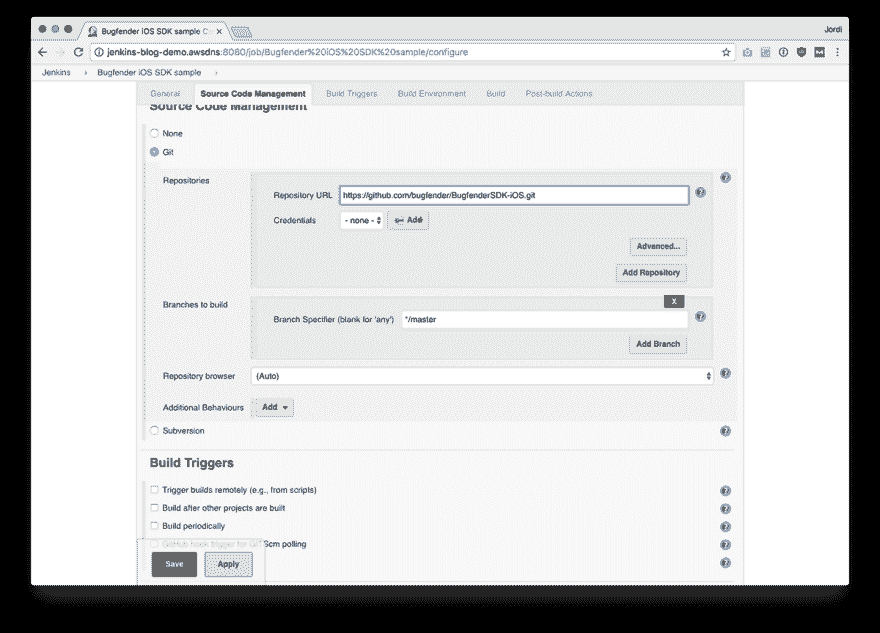T2】](https://res.cloudinary.com/practicaldev/image/fetch/s--UyNAzQo1--/c_limit%2Cf_auto%2Cfl_progressive%2Cq_auto%2Cw_880/https://bugfender.com/wp-content/uploads/2017/11/jenkins-4-9-sample-app.png)

**步骤 4:** 配置自动化构建触发器。

如果您不想手动触发它们，您可以为您的构件选择自动触发器。通常，您应该对其进行配置，以便每次提交时自动进行新的构建，或者定期进行构建(例如每夜构建):

[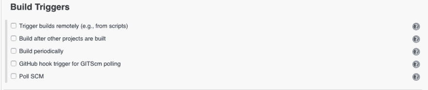T2】](https://res.cloudinary.com/practicaldev/image/fetch/s--tzZ6ox30--/c_limit%2Cf_auto%2Cfl_progressive%2Cq_auto%2Cw_880/https://bugfender.com/wp-content/uploads/2017/11/jenkins-4-10-build-triggers.png)

**第五步:**一旦下载了代码，我们需要指定如何构建它。

在**构建**部分，我们将**添加一个**类型的构建步骤**执行 shell** ，我们将执行 xcodebuild，如下所示:

[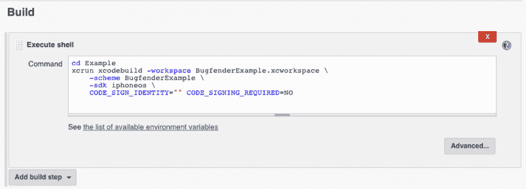T2】](https://res.cloudinary.com/practicaldev/image/fetch/s--BLxOtKzR--/c_limit%2Cf_auto%2Cfl_progressive%2Cq_auto%2Cw_880/https://bugfender.com/wp-content/uploads/2017/11/jenkins-4-11-build-xcode.png)

```
cd Example # in our example, the project is not in the root of the repository

xcrun xcodebuild -workspace BugfenderExample.xcworkspace \

    -scheme BugfenderExample \
    -sdk iphoneos \
    CODE_SIGN_IDENTITY="" CODE_SIGNING_REQUIRED=NO
```

这将触发 iOS 设备应用程序的构建，类似于在 Xcode 中使用**产品>构建来运行**。

确保您添加了**CODE _ SIGN _ IDENTITY = " " CODE _ SIGNING _ REQUIRED = NO**位，以防止 Xcode 尝试对构建的应用程序进行签名，否则您将需要在该机器上配置您的预置描述文件和开发者证书，这使一切变得有点复杂。

## 添加测试

如果您想要运行测试，您可以使用另一个构建步骤来设置它们:

[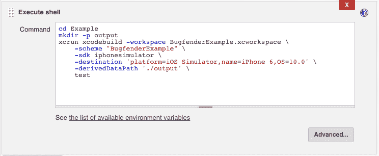T2】](https://res.cloudinary.com/practicaldev/image/fetch/s--ElML1pwl--/c_limit%2Cf_auto%2Cfl_progressive%2Cq_auto%2Cw_880/https://bugfender.com/wp-content/uploads/2017/11/jenkins-4-12-adding-tests.png)

代码:

```
cd Example # again, we need to move directory

mkdir -p output # this directory will contain the output of the tests

xcrun xcodebuild -workspace BugfenderExample.xcworkspace \

    -scheme "BugfenderExample" \

    -sdk iphonesimulator \

    -destination 'platform=iOS Simulator,name=iPhone 6,OS=10.0' \

    -derivedDataPath './output' \

    test
```

就是这样！您已经准备好构建和测试我们的 iOS 示例应用程序了:

[T2】](https://res.cloudinary.com/practicaldev/image/fetch/s---s8fR-wk--/c_limit%2Cf_auto%2Cfl_progressive%2Cq_auto%2Cw_880/https://bugfender.com/wp-content/uploads/2017/11/jenkins-4-13-completed.png)

寻找更多关于开发应用程序的信息？检查:

*   [测试 iOS 应用的顶级设备](https://bugfender.com/blog/top-devices-testing-ios-apps/)

* * *

欲了解本系列的更多帖子，请查看:

*   什么是 Jenkins，为什么您应该使用它？
*   [如何在 Ubuntu 中安装 Jenkins](https://bugfender.com/blog/how-to-install-jenkins-in-ubuntu/)
*   [如何给詹金斯添加你的第一份 Android 工作](https://bugfender.com/blog/how-to-add-your-first-android-job-to-jenkins/)

* * *

这篇文章由 Sarabeth Flowers Lewis 编辑，她是一名自由作家，也是 Lewis 商业写作的联合创始人，专门从事 SEO 和直接回应内容创作。她目前和她的姜黄色丈夫一起远程工作，为科技、非营利组织和房地产写作。点击这里查看更多她的作品。

*这篇文章最初发表在我们的[博客](https://bugfender.com/blog/how-to-add-your-first-ios-job-to-jenkins/)上。*