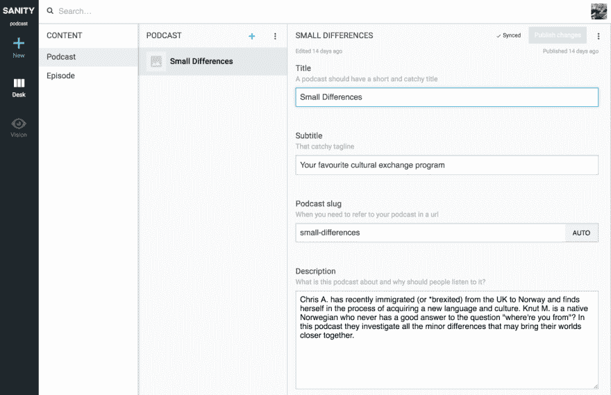
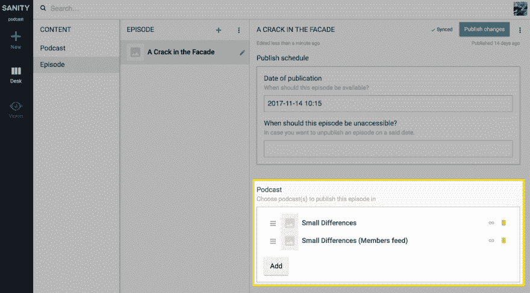
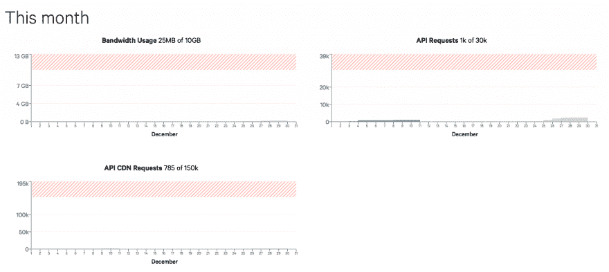
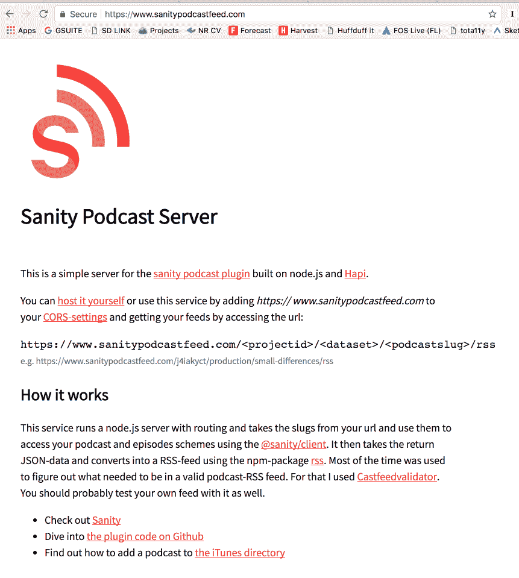

# 打造自己的播客平台！

> 原文：<https://dev.to/kmelve/make-your-own-podcasting-platform-e5o>

*TL；博士:运行`sanity install podcast`并按照【www.sanitypodcastfeed.com T2】*上的指示

Sanity 是一个完全可定制的无头 CMS，如果你懂一些基本的 JavaScript，你可以在两分钟内安装并开始使用它。只需运行`npm install -g @sanity/cli && sanity init`即可开始，然后[按照这些指令](https://www.sanity.io/docs/introduction/getting-started)进行操作。

为了保持理智，也可以扩展和编写插件。如果您知道 React，您可以在 Content Studio 中创建自己的自定义输入字段或自定义工具。您还可以用现成的字段和内容类型引导内容模型。我之所以知道是因为我最近这样做是为了让理智地主持你自己的播客(是的，是复数)成为可能。只需运行`sanity install podcast`和*播客*和*剧集*将作为新的内容类型出现在您的工作室中。

[T2】](https://res.cloudinary.com/practicaldev/image/fetch/s--U-qm1OU9--/c_limit%2Cf_auto%2Cfl_progressive%2Cq_auto%2Cw_880/https://thepracticaldev.s3.amazonaws.com/i/ajkbw71mxaivj5ioqawr.png)

我不确定这是否有意义，但这种设置也允许你将一集连接到多个播客。也许你想要一个只有付费支持者或类似的独家饲料？现在你可以了！

[T2】](https://res.cloudinary.com/practicaldev/image/fetch/s--720srjTY--/c_limit%2Cf_auto%2Cfl_progressive%2Cq_auto%2Cw_880/https://thepracticaldev.s3.amazonaws.com/i/we0m3m3lbl0zy52gzuo8.png)

你将理智地保存你的 mp3 文件，并通过 CDNs 在一个相当快的网络上获得它们。在[健全控制面板](https://manage.sanity.io/)中，你也可以很好地控制带宽的使用。

[T2】](https://res.cloudinary.com/practicaldev/image/fetch/s--P6uvF-wW--/c_limit%2Cf_auto%2Cfl_progressive%2Cq_auto%2Cw_880/https://thepracticaldev.s3.amazonaws.com/i/2z0yweve1b8pqr24ulxa.png)

然而，单靠健全性并不能真正完成所有的工作，因为它只输出 JSON。如果你做一个网站，Alexa-skill 或者其他东西，这通常是很棒的，但是大多数播客收集者和目录需要 RSS 订阅。所以我也为你做了这个。

你可以去[www.sanitypodcastfeed.com](https://www.sanitypodcastfeed.com/)并按照那里的简单指示让你的 RSS 源立即可用，或者如果需要更多的控制和定制，你可以在你自己的上[派生、托管并调整它。它只是一个简单的 node.js 服务器，运行哈比神，并将来自 Sanity 的数据转换成 RSS 提要。](https://github.com/kmelve/sanity-podcast-server)

插件和播客订阅服务仍处于测试阶段。[随时让我知道它如何为你工作](https://github.com/kmelve/sanity-plugin-podcast/issues)，尤其是如果它不工作！

[T2】](https://www.sanitypodcastfeed.com)