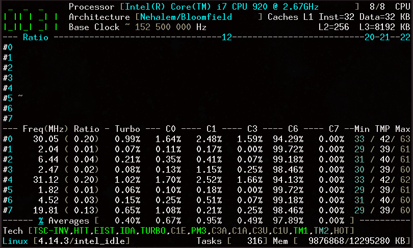

# CoreFreq

> 原文:[https://dev.to/cyring/uncore-in-corefreq-923](https://dev.to/cyring/uncore-in-corefreq-923)

# 一款 CPU 监控软件

CoreFreq 是为 64 位处理器设计的。
最后一次提交添加了非核心频率，该频率在 Nehalem 和 Broadwell 处理器上运行正常。
我将感谢英特尔 Skylake、Coffe lake、Haswell、SandyBridge 和许多其他架构的任何测试回报。
(到目前为止，除了基本的性能计数器之外，很少有 AMD 支持)。
*CoreFreq* 是一个实验性的低水平项目，因此**保存&关闭您的文件**然后再尝试。
禁用 NMI 看门狗和无虚拟机作为先决条件。查看常见问题中的说明。
克隆，从 [GitHub 下载源代码](http://github.com/cyring/CoreFreq)
欢迎截图。
问候，
西灵
法兰西
