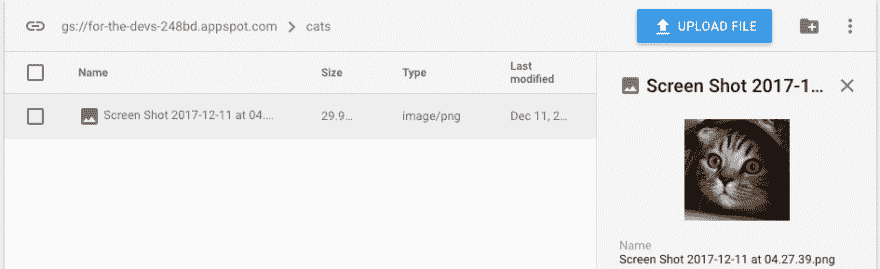

# Firebase 存储简介

> 原文：<https://dev.to/aurelkurtula/introduction-to-firebases-storage-e12>

在[firebase 实时数据库简介](https://dev.to/aurelkurtula/introduction-to-firebases-real-time-database-89l)教程中，我解释了我们如何使用 firebase 在非 sql 实时数据库中存储、检索和编辑数据。

存储是 firebase 提供的另一项服务。使用这项服务，我们能够上传和使用谷歌的云文件。基本上，我们能够上传我们的网页资产，并使用它们，就像它们托管在我们自己的服务器上一样。

## 设置我们的文件

上一个教程讲述了如何建立一个火焰基地项目。如果你还没有读过，你一定要读一读。然后，你可以简单地继续这个教程。

欢迎回来:)

所以，我们有两个文件，HTML 和 JavaScript 文件。HTML 将有一个文件输入按钮，这就是我们将如何上传文件。

```
 <!DOCTYPE html>
    <html lang="en">
    <head>
        <meta charset="UTF-8">
        Firebase Storage
        <script type="text/javascript" src="https://www.gstatic.com/firebasejs/4.8.0/firebase.js"></script>
    </head>
    <body>
        <div id="uploading">
                <progress value="0" max="100" id="progressBar">0%</progress>
                <label for="submit">Click to upload</label>
                <input type="file" value="upload" id="submitButton" />  
        </div>  
        <script type="text/javascript" src="script.js"></script>
    </body>
    </html> 
```

Enter fullscreen mode Exit fullscreen mode

正如上一篇教程所介绍的，我们在顶部有 filebase 库，在底部有我们的脚本文件。上传文件的输入框，标签和进度只是为了装饰！

我将把 css 留给你，但是为了说明我们正在做什么，这是我所拥有的(在 css 的帮助下)

[T2】](https://res.cloudinary.com/practicaldev/image/fetch/s--MqVTUapB--/c_limit%2Cf_auto%2Cfl_progressive%2Cq_auto%2Cw_880/https://thepracticaldev.s3.amazonaws.com/i/zrx3ji1lm68heqdki8hv.png)

我们将需要使用初始的 Firebase 配置代码，就像我们在[上一篇教程](https://dev.to/aurelkurtula/introduction-to-firebases-real-time-database-89l)中所做的那样，除了关于数据库的部分。将以下内容添加到`script.js`:

```
 var config = {
      apiKey: "*******************",
      authDomain: "******.firebaseapp.com",
      databaseURL: "https://******.firebaseio.com",
      projectId: "******",
      storageBucket: "******.appspot.com",
      messagingSenderId: "***************"
    };
    firebase.initializeApp(config); 
```

Enter fullscreen mode Exit fullscreen mode

## 设置存储限制

就像我们对数据库所做的那样，为了使用存储，我们需要取消限制，这样我们就可以在不需要身份验证的情况下进行读写。在生产中这样做显然不是一个好主意，但这只是为了给我们独立学习这个服务的自由。

你需要做的就是导航到`Storage`然后`rules`，然后编辑读写权限为真

[T2】](https://res.cloudinary.com/practicaldev/image/fetch/s--fz88ruGT--/c_limit%2Cf_auto%2Cfl_progressive%2Cq_auto%2Cw_880/https://thepracticaldev.s3.amazonaws.com/i/o0j15pp6kvhnp3728dgv.png)

## 与`storage()`一起工作

如果您导航到`Storage`，然后`files`您将看到消息，“这里还没有文件”。我们在本教程中的目标是从我们的 web 应用程序/网站添加文件。

就这么办吧。

在`script.js`中，让我们初始化`Storage()`服务。

```
const storage = firebase.storage() 
```

Enter fullscreen mode Exit fullscreen mode

将文件上传到存储器需要两个步骤。首先，我们需要指定文件的存放位置和文件名。

```
let locationRef = storage.ref('cats/cat1.jpg') 
```

Enter fullscreen mode Exit fullscreen mode

上面我们说调用文件`cat1.jpg`并将其添加到冷文件夹`cats`。

到目前为止，这只是一个引用，它什么也不做，它只是等待文件被`put`放入其中。下面一行实际上将本地文件推送到 firebase 服务器。

```
locationRef.put([the file]) 
```

Enter fullscreen mode Exit fullscreen mode

### 上传文件到 firebase 存储器

如您所见，只需三行代码就可以将资产存储在 firebase 存储中。现在让我们结合普通的 JavaScript 来进行实际的上传。

在我们的 HTML 中，我们有这样的代码

```
<label for="submit">Click to upload</label>
<input type="file" value="upload" id="submitButton" /> 
```

Enter fullscreen mode Exit fullscreen mode

用户点击输入/标签，然后被要求选择一个资产，最后我们想上传该资产到 firebase

```
const storage = firebase.storage()
const submitButton = document.getElementById('submitButton');
submitButton.addEventListener('change', (e)=>{
  let file = e.target.files[0];
  let locationRef = storage.ref('cats/' + file.name)
  locationRef.put(file)
}) 
```

Enter fullscreen mode Exit fullscreen mode

如你所见，完全相同的线条。这一次文件的名称将与本地文件的名称相同，而被推送到服务器的文件就是文件本身。

如果你回到 firebase 控制台，到`Storage`，你会看到你的猫文件夹，里面有你的猫照片！

[T2】](https://res.cloudinary.com/practicaldev/image/fetch/s--ShajxEe7--/c_limit%2Cf_auto%2Cfl_progressive%2Cq_auto%2Cw_880/https://thepracticaldev.s3.amazonaws.com/i/65hooqflvqctkoc037uy.png)

### 从流程中获得反馈

通常当考虑用户体验时，我们需要能够在整个过程中提供信息。例如，知道以下情况是很酷的:

*   上传需要多长时间？
*   实际上传成功了吗？
*   新的位置地址是什么？

类似于`database()`服务，`storage()`也有一个`on()`方法来观察`state_changed`观察者，在这个方法中，我们能够观察上传过程，捕捉任何错误，并知道上传何时完成。

```
submitButton.addEventListener('change', (e)=>{
  let file = e.target.files[0];
  let locationRef = storage.ref('cats/' + file.name)
  let task = locationRef.put(file)
  task.on('state_changed',
      function progress(snapshot){
        // whilst uploading
      },
      function error(error){
        //error handling
      },
      function complete(){
        // on completion
      }
  )
}) 
```

Enter fullscreen mode Exit fullscreen mode

请注意我们是如何将`locationRef.put(file)`附加到变量上的，现在我们能够在整个过程中观察它的状态:

```
task.on('state_changed', 
  function progress(snapshot){ //progress
    let per = (snapshot.bytesTransferred / snapshot.totalBytes) *100;
    uploader.value = per;
  },
  function error(error){ },
  function complete(){
    console.log('Done') 
  }
) 
```

Enter fullscreen mode Exit fullscreen mode

第一个函数监视这个过程，如您所见，它给出了原始文件的总字节数，以及已经上传的字节数。我们用这些数字得到一个百分比，并把它加入到进度中。为了防止混淆，`uploader`指的是`progress`元素:

```
<progress value="0" max="100" id="progressBar">0%</progress>    
let uploader = document.getElementById('progressBar') 
```

Enter fullscreen mode Exit fullscreen mode

## 从存储器中读取文件

为了从存储器中取出一个文件，你需要知道它所在的文件夹和它的文件名。这样就可以找到完整的网址。

```
let storageRef = storage.ref('cats')
let image = storageRef.child('cat1.png'); 
```

Enter fullscreen mode Exit fullscreen mode

上述内容可以写成一行，我们稍后会看到:

```
let storageRef = storage.ref('cats/cat.png'); 
```

Enter fullscreen mode Exit fullscreen mode

要获取实际的 url 并将其显示在页面上:

```
image.getMetadata().then(function(metadata) {
  document.getElementById('img').src = metadata.downloadURLs[0]
}).catch(function(error) { /*error handling*/ }); 
```

Enter fullscreen mode Exit fullscreen mode

假设我们有一个 id 为`img`的图像标签，那么来自存储库的猫将被放置在浏览器上:)

## 删除文件

删除和其他事情一样简单，遵循相同的模式:指向文件，然后对其运行`delete()`

```
let storageRef = storage.ref('cats/cat.png');
storageRef.delete().then(function() {
  // removed
}).catch(function(error) {
  // not removed :(
}); 
```

Enter fullscreen mode Exit fullscreen mode

## 存储与数据库相结合

我应该在这里结束本教程，但我认为 google 提供 firebase 存储的主要原因是它可以用于数据库，所以我现在要将二者结合起来！

让我们重新回顾一下上面的事件监听器:

```
submitButton.addEventListener('change', (e)=>{
  let file = e.target.files[0];
  let locationRef = storage.ref('cats/' + file.name)
  let task = locationRef.put(file)
  task.on('state_changed',
      ...
      function complete(){
        // on completion
      }
  )
}) 
```

Enter fullscreen mode Exit fullscreen mode

上传完成后，我们希望将完整的 url 存储到数据库中。

你可以通过遵循[上一篇教程](https://dev.to/aurelkurtula/introduction-to-firebases-real-time-database-89l)来轻松做到这一点

```
const database = firebase.database()
const ref = database.ref('cats');
submitButton.addEventListener('change', (e)=>{
  ...
  task.on('state_changed',
      ...
      function complete(){
        storageRef.getMetadata().then(metadata=>{
         ref.push({
          url: metadata.downloadURLs[0]
        })
        })
      }
  )
}) 
```

Enter fullscreen mode Exit fullscreen mode

与上一篇教程中的[完全一样，在第 1-2 行中，我们定义了数据库服务以及内容应该放在哪里。在`complete`函数内部(如你所知，它不必有名字),我们将数据推送到数据库。现在，如果您检查数据库，您将看到一个`cats`节点和一个带有 cat url 的子节点。**注意`metadata`给出了更多的信息，比如文件上传的时间，这样你就可以得到更多的信息存储在数据库中。**](https://dev.to/aurelkurtula/introduction-to-firebases-real-time-database-89l)

## 结论

这很有趣。请继续关注更多关于 firebase 的教程。我要介绍身份验证和生产模式(介绍如何保护配置设置)，然后是我可能想到的关于 conserning firebase 服务的任何其他内容。