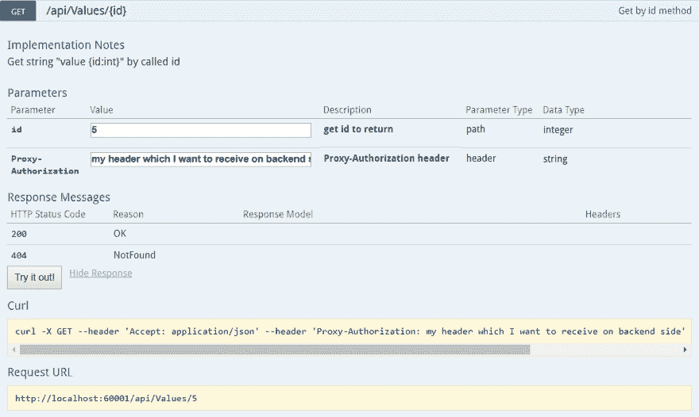
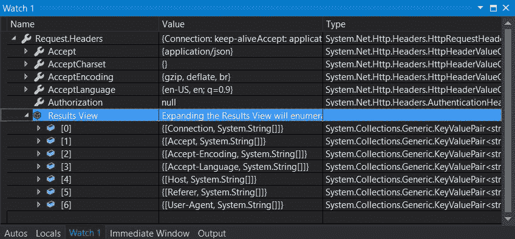
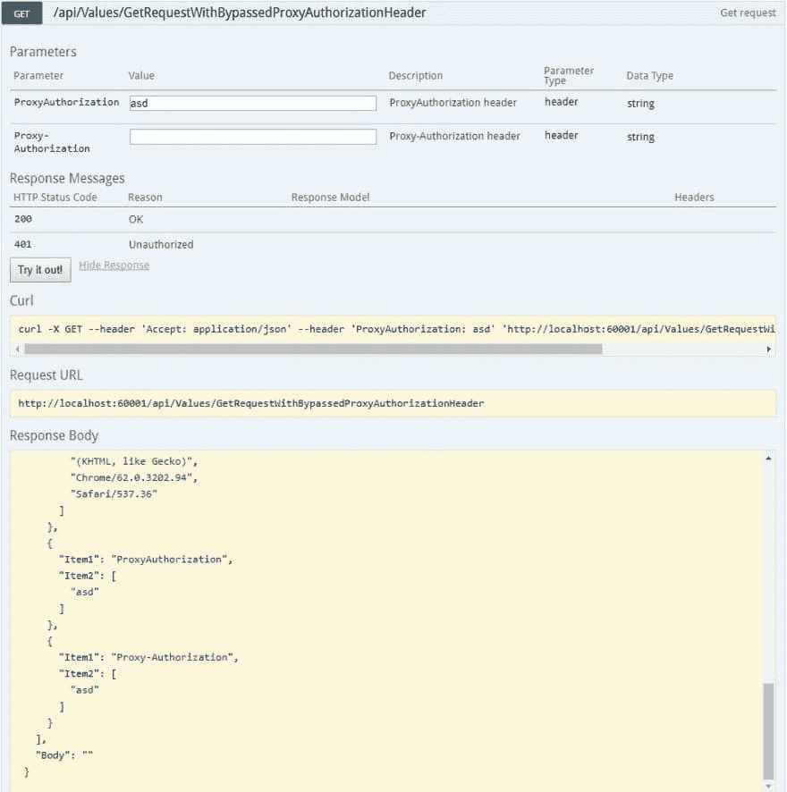

# 禁止的 Http 头

> 原文：<https://dev.to/meanin/forbidden-http-headers-e8g>

# 用 [Swagger](https://swagger.io/) 记录 API

你们都知道斯瓦格，对吧？它用于记录您的 API，并为测试您的调用提供第一个前端。作为一名. net 开发者，我正在使用 [swashbuckle](https://github.com/domaindrivendev/Swashbuckle/wiki) 来生成 [swagger-ui](https://github.com/swagger-api/swagger-ui) 。它的配置相当简单，并且提供了必要的功能。“必要的”，这一次我的意思是让用户有机会插入进行适当调用所需的参数。头、路径或主体参数。在这种情况下，最后两个是最简单的。基本上，您唯一需要做的事情就是创建与您的 API 类和/或方法相关的自我解释的 xml 注释。不错吧。

正如他们所说，Http 头是最难的部分。为 http 头参数创建一个字段。net swashbuckle，你必须实现 IOperationFilter(在最简单的解决方案中，有更多的方法可以实现)。同样，这并不困难，它只有一个方法:

```
public void Apply(Operation operation, OperationFilterContext context)
{
    if (operation.parameters == null)
        operation.parameters = new List<IParameter>();

    if (operation.parameters.All(p => p.name != "MyCustomHeader"))
    {
        operation.parameters.Add(new Parameter
        {
            name = "MyCustomHeader",
            @in = "header",
            description = "MyCustomHeader header",
            required = true,
            type = "string"
        });
    }
} 
```

Enter fullscreen mode Exit fullscreen mode

当你试图应用一个被禁止的标题时，真正的困难就开始了。你认识他们吗？我不知道有些标题是被禁止的。但是`forbidden`是什么意思呢？

# 我的案例

我试图验证带有`Proxy-Authorization`头的 API 调用。所以，我用标准的方法创建了一个新的操作过滤器。测试时，我运行应用程序，导航到 swagger ui，填写字段并测试一个呼叫。
[](https://res.cloudinary.com/practicaldev/image/fetch/s--KBecYnRh--/c_limit%2Cf_auto%2Cfl_progressive%2Cq_auto%2Cw_880/https://raw.githubusercontent.com/meanin/dev-to-articles/master/img/2017-12-11-forbidden-http-headers/proxy-header.jpg) 
Curl 被正确地生成，包括了所有的头，但是它没有在调用中传播。这里描述了一切。还有，我在 [stackoverflow](https://stackoverflow.com/questions/47509258/add-proxy-authorization-header-in-swagger) 上提出了这个问题。
[](https://res.cloudinary.com/practicaldev/image/fetch/s--OxpyMKBB--/c_limit%2Cf_auto%2Cfl_progressive%2Cq_auto%2Cw_880/https://raw.githubusercontent.com/meanin/dev-to-articles/master/img/2017-12-11-forbidden-http-headers/no-proxy-header.jpg)

幸运的是，swashbuckle 的一个贡献者(如果你正在阅读，谢谢)参与进来并帮助了我。他让我创建一个[演示项目](https://github.com/meanin/swashbuckle-proxy-authorization-header)，以一种非常简单的方式展示整个问题。创建完成后，我在 stack 上发布了一个答案，等待回复。时间过得很快，这里[swagger-API/swagger-ui](https://github.com/swagger-api/swagger-ui)[问题](https://github.com/swagger-api/swagger-ui/issues/3956)被创建。在这里，您可以找到一个简短的解释，说明为什么不能从设置了`proxy-authorization`标题的浏览器进行呼叫。基本上，有一些[头](https://developer.mozilla.org/en-US/docs/Glossary/Forbidden_header_name)是不可能在用户代理端创建的。在这种情况下，用户代理是一个浏览器。我不知道那件事。我近期的目标是学习更多关于 http 流的东西。请查看下面的禁用标题列表:

*   代理-
*   秒-
*   接受字符集
*   接受编码
*   访问控制请求报头
*   访问控制请求方法
*   关系
*   内容长度
*   饼干
*   饼干
*   日期
*   DNT
*   预期
*   主持
*   保持活力
*   起源
*   代理-
*   秒-
*   推荐人
*   你呢
*   拖车
*   传输编码
*   提升
*   通过

# 工作区

我们需要测试来自 swagger 的 API 方法。我们已经考虑了一段时间。几天后，我的一个同事想出了这个主意。当然，从用户代理设置`forbidden`头是不可能的，但是没有人禁止我们设置一个自定义的头，并在后端将其重写为合适的头。

```
public override void OnAuthorization(HttpActionContext context)
{
    var proxyAuthorizationHeader = context.Request.Headers.SingleOrDefault(
        h => h.Key == "ProxyAuthorization");

    if(context.Request.Headers.ProxyAuthorization == null 
        && proxyAuthorizationHeader.Value != null)
        context.Request.Headers.Add("Proxy-Authorization", 
            proxyAuthorizationHeader.Value);

    base.OnAuthorization(context);
} 
```

Enter fullscreen mode Exit fullscreen mode

当然，这不是一个永久的解决方案，但它在开发环境中是有效的。我们可以配置我们的应用程序来支持这种行为，它是 5 分钟或更少。要写几个属性，设置编译器指令，一切都很好。我们可以测试它，即使是大摇大摆。
[](https://res.cloudinary.com/practicaldev/image/fetch/s--8eAw9bsL--/c_limit%2Cf_auto%2Cfl_progressive%2Cq_auto%2Cw_880/https://raw.githubusercontent.com/meanin/dev-to-articles/master/img/2017-12-11-forbidden-http-headers/proxy-header-filled.jpg)

* * *

你怎么想？你早就知道这些了吗？在 swagger 上还能遇到哪些陷阱？