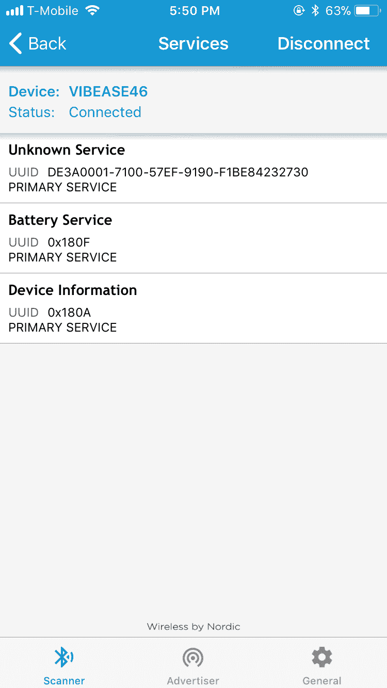
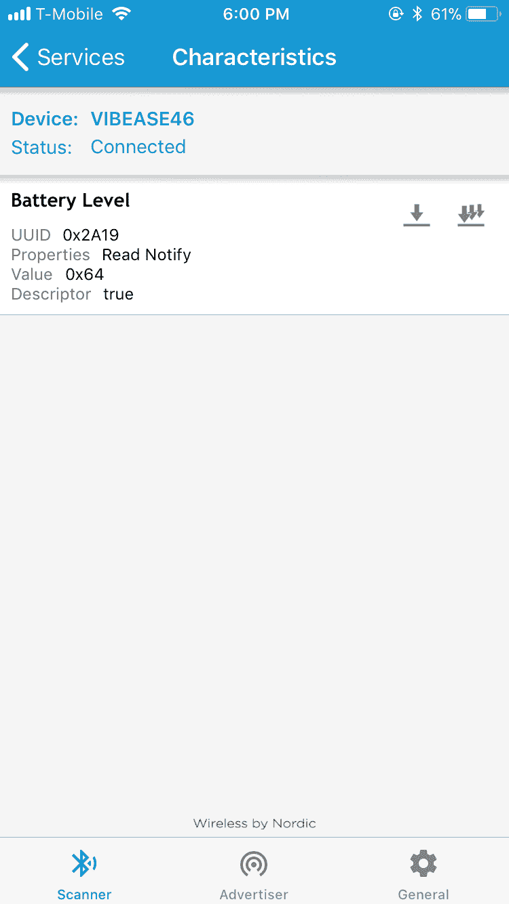
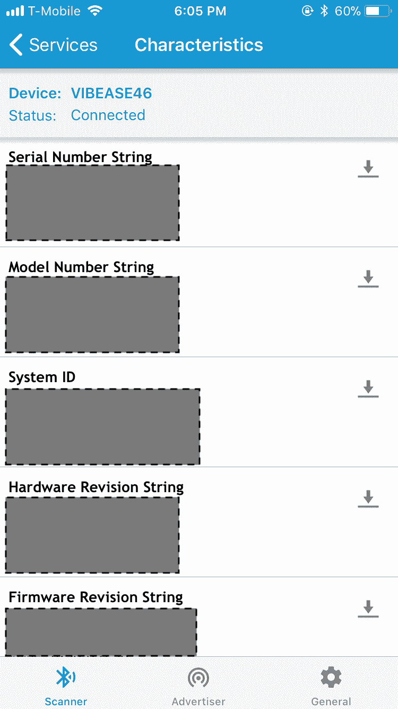
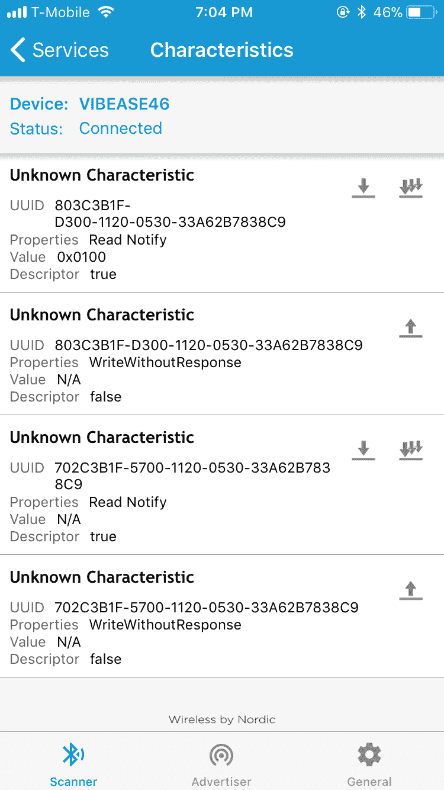
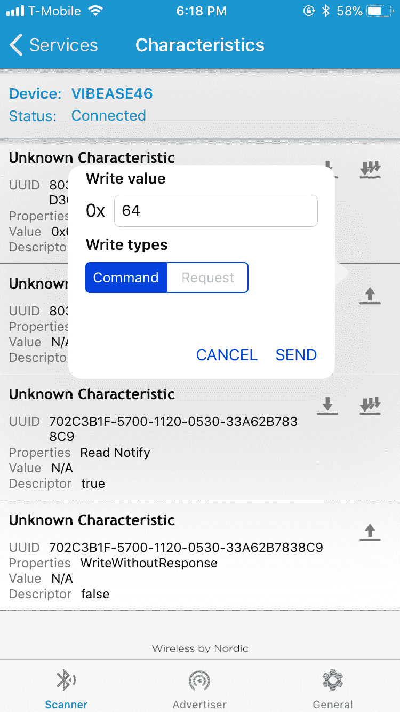
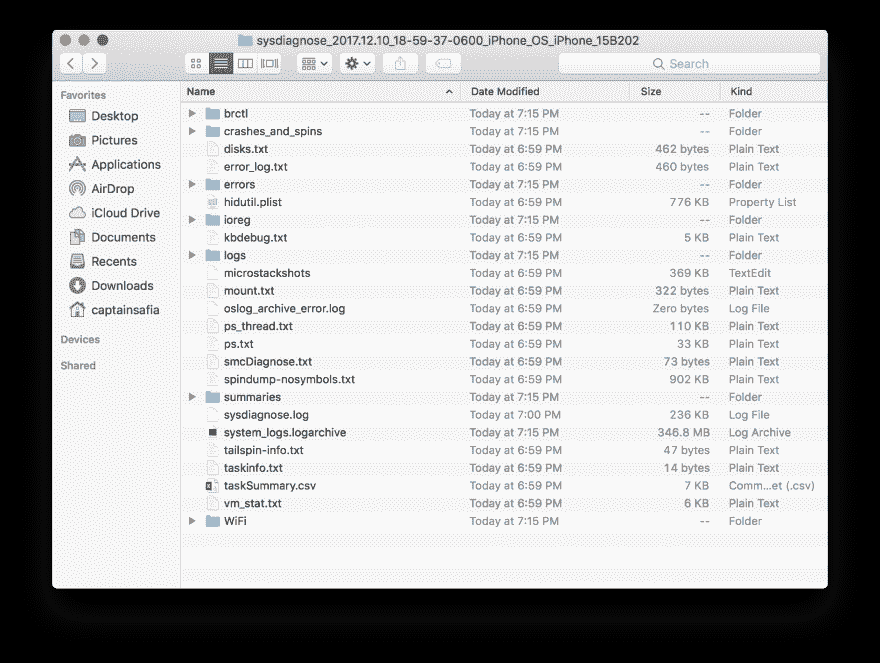
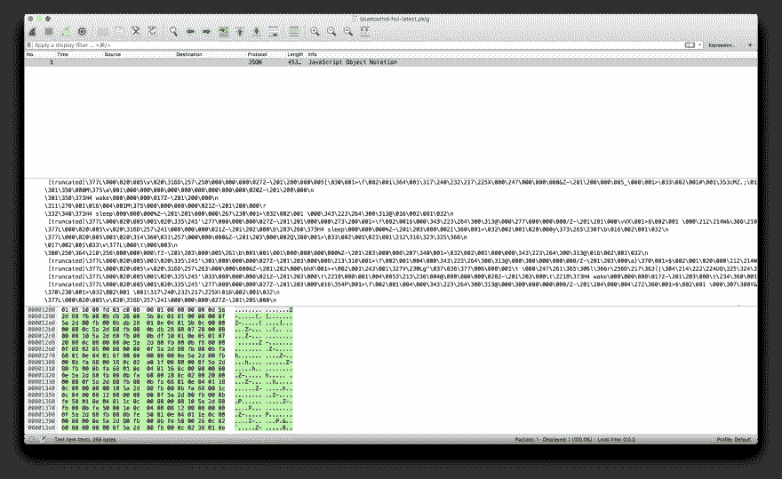

# 当我试图破解我的智能振动器时，我学到了什么

> 原文：<https://dev.to/captainsafia/what-i-learned-when-i-tried-to-hack-my-smart-vibrator-14a1>

我拥有智能振动器已经一年多了。对于那些可能不熟悉的人来说，智能振动器是一种可以通过蓝牙连接由应用程序控制的振动器。通常，该应用程序连接到互联网，因此远程用户可以通过该应用程序控制振动器。在这种情况下，远程用户向应用程序发送消息，应用程序通过蓝牙将消息转发给振动器。

我没有做很多关于硬件或互联网连接设备的有趣项目，所以我认为侵入我的振动器来了解更多关于物联网设备的信息会很有趣。在这个具体的例子中，我说的“黑”是指“逆向工程振动器和应用程序用来相互通信的通信协议。”我将要进行逆向工程的特殊振动器是 [Vibease](https://www.vibease.com/ordernow) 。请那些可能在办公室、公共图书馆或者在火车上坐在爱管闲事的人旁边的人注意:那个链接会把你带到一个出售性玩具的电子商务页面。希望我帮你避免了一些不必要的尴尬！

我首先对一般使用蓝牙的物联网设备做了一些研究。我认为，或者我应该说希望，会有一些关于物联网设备如何利用蓝牙的标准化或协议。

我首先弄清楚的是蓝牙和蓝牙低能耗的区别。低能耗蓝牙(有时也称为蓝牙 4.0)是一个比以前版本能耗更低的蓝牙版本。这对物联网设备尤其有利，因为这意味着它们可以长时间耗尽电池。我可以证实这一点。一次充满电后，我对振动器的使用次数感到非常惊讶。这种“低能量”的区别是由于 BLE 模块在不使用时保持在“睡眠模式”,因此使用较少的能量。你可以在[链接](https://www.link-labs.com/blog/bluetooth-vs-bluetooth-low-energy)上了解更多关于差异的信息。

我决定四处看看，看看是否有其他关于逆向工程物联网设备的文章，并偶然发现了这篇文章。在这篇文章中，作者对一个智能灯泡进行了逆向工程。在这一点上，我没有吹牛的知识，但我觉得我正在尝试做的事情可能会更困难一些。首先，虽然控制灯泡颜色的应用程序只需要修改 LED 显示的颜色，但振动器由几个电机组成，有时需要一前一后激活。尽管如此，这篇文章还是让我对 BLE 设备有了一些很好的了解。

特别是，这篇文章概述了外围设备(如振动器)如何使用 BLE 连接到代表设备不同方面的服务(如电池或振动器的电机)，以读取和写入某些特征(如设备的电池电量或电机的每分钟转数)。这篇文章提到了使用一个名为 NRF 连接的应用程序与蓝牙设备进行交互。我去了我的 iPhone 上的应用商店，下载了应用程序，打开了我的振动器，并使用应用程序连接到它。

一旦我连接到振动器，应用程序检测到三种不同的服务。第一个是电池服务，第二个是设备信息服务。从它们的名字可以很明显地推断出这些服务的用途。我认为它们都是只读服务，允许应用程序(和像我一样的史努比动物)读取关于电池电量的信息和振动器的细节。第三个服务被 NRF 连接工具标记为“未知”。我认为这是负责读取和写入振动器上电机状态的服务。

[T2】](https://res.cloudinary.com/practicaldev/image/fetch/s--hzeJseNR--/c_limit%2Cf_auto%2Cfl_progressive%2Cq_auto%2Cw_880/https://cldup.com/IstyJ2nFQs.PNG)

我决定浏览“电池服务”，看看我能在那里找到什么信息。正如我所怀疑的，“电池服务”包含一个“电池水平”特征，即“读取通知”，并包含一个值“0x64”。这是一个十六进制(以 16 为基数)的数字，转换成十进制的 100。已经充满电，随时可以出发！

[T2】](https://res.cloudinary.com/practicaldev/image/fetch/s--QaI4x4Up--/c_limit%2Cf_auto%2Cfl_progressive%2Cq_auto%2Cw_880/https://cldup.com/N1MASiuKMp.PNG)

我导航到“设备信息”服务，注意到它有几个与序列号、型号和设备的其他细节相关的“读取”特征。这里有一个屏幕截图，上面的某些细节被模糊了。

[T2】](https://res.cloudinary.com/practicaldev/image/fetch/s--W8h7jryt--/c_limit%2Cf_auto%2Cfl_progressive%2Cq_auto%2Cw_880/https://cldup.com/LwCrj0carN.PNG)

所有这些都相当容易，但我仍然需要弄清楚应用程序如何与电机接口。我导航到一个不吉利的名字“未知服务”,看看我是否能弄清楚什么。

[T2】](https://res.cloudinary.com/practicaldev/image/fetch/s--XWFpwpK4--/c_limit%2Cf_auto%2Cfl_progressive%2Cq_auto%2Cw_880/https://cldup.com/0WjjHQHlmB.PNG)

有意思！该服务混合了“读取通知”和“写入无响应”特征。有两个“读取通知”特征和两个“写入无响应”特征。我推测这些特征中的每一个都与振动器上的马达相匹配。也就是说，振动器有两个电机，每个电机都可以读取数据，也可以写入数据。这符合振动器的物理特性。它的两端各有一个马达，两者相互独立运行。

我注意到与马达相关的两个“读取通知”特征有点奇怪。一个特征读取值为‘0x 0000’(上面的屏幕截图显示值为‘0x 0100’，因为我是在收集初始读数后一段时间获取的。我不确定为什么在我第一次看到它和我记得截图之间的一个小时里，这个值发生了变化。更多的谜团。哇，这个括号变得有点长了…)这对应于一个马达是关闭的(或者，所以我猜)，另一个读取的值是“N/A”。在那个时间点，振动器是开着的，但没有振动，所以我发现很奇怪，一个电机会发送零值，另一个会发送空值。我决定快速搜索一下，看看这是不是 BLE 设备的常见问题，但找不到任何有用的东西。

旁注:当你在学习新的东西时，有效的谷歌搜索是非常困难的，所以我可能不会以一种带来良好响应的方式来表达我的查询。如果你知道一些关于 BLE 的事，以及为什么会发生这种事，[一定要让我知道](https://blog.safia.rocks/ask)！

无论如何，我注意到 NRF 连接应用程序提供了一个选项来写入可写的特征。在这一点上，我做了任何一个优秀的工程师都会做的事情，我测试了随机值。我尝试发送与十进制值 100 相对应的“0x64 ”,以查看该特性是否设置了电机的功率水平。没有骰子！

[T2】](https://res.cloudinary.com/practicaldev/image/fetch/s--1YK5Si5h--/c_limit%2Cf_auto%2Cfl_progressive%2Cq_auto%2Cw_880/https://cldup.com/PzXe1iJLwa.PNG)

我注意到其中一个特征读取的零值是一个有 4 位的十六进制数，所以我尝试发送' 0xffff ',但也不起作用。烦！

[T2】](https://res.cloudinary.com/practicaldev/image/fetch/s--RR7JdXBu--/c_limit%2Cf_auto%2Cfl_progressive%2Cq_auto%2Cw_880/https://cldup.com/TD27vLRTUe.PNG)

所以在这一点上，我想我会尝试一些别的东西。我会打开手机上的 Vibease 应用程序，设置应用程序的振动，并查看“读取通知”特征发出的值，而不是猜测值。棘手的是，我不能在手机上同时使用 NRF 连接和 Vibease 应用程序，所以我必须想办法从笔记本电脑上连接到振动器。我在 Mac App Store 上找到了一个名为 [LightBlue](https://itunes.apple.com/us/app/lightblue/id639944780?mt=12) 的应用程序，我想我可以尝试使用它来读取每个特性的值，同时从应用程序中控制振动器。由于一些奇怪的原因，我无法通过手机上的应用程序连接到我的笔记本电脑上的振动器。这实际上并不奇怪，完全有道理。如果我正在构建一个智能振动器，我不希望多个设备同时连接到它。

我决定看看有没有 iOS 的蓝牙嗅探器。我想要一个可以在后台运行并记录我手机通过 BLE 发送的所有信息的东西。我知道苹果对安全性的关注，我认为这样的应用可能无法在未越狱的 iPhone 上使用，但我还是试了试运气。通过谷歌搜索，我找到了这篇 StackOverflow 帖子，它提供了一些关于在 iOS 上以“诊断模式”运行蓝牙的细节。我不确定我能从苹果提供的日志中获得什么样的信息，但我认为这值得一试。我最终按照 StackOverflow 帖子中链接的 iOS 蓝牙登录的[官方说明生成了我的日志。](https://download.developer.apple.com/iOS/iOS_Logs/Bluetooth_Logging_Instructions.pdf)

旁注:苹果是怎么了，他们让你按下所有离谱的键/按钮组合来访问他们产品的诊断功能？我的意思是，我理解为什么他们让用户很难接触到这些功能，但是天啊，在这一切结束的时候我会得关节炎的！

该诊断记录的结果是一个`.tar.gz`文件，位于上述说明中指定的目录下。我解压了目录，发现它由几个诊断文件组成。

[T2】](https://res.cloudinary.com/practicaldev/image/fetch/s--wy3xp02x--/c_limit%2Cf_auto%2Cfl_progressive%2Cq_auto%2Cw_880/https://cldup.com/tC69IjCMVF.png)

哦，孩子，我现在让自己陷入了什么？在这一点上，我决定利用一个最久经考验和专家推荐的解决问题的技术。它叫做“点击一堆，阅读一堆”，包括打开和阅读大量文件，直到你找到一个有意义的。

我发现一些文件似乎与蓝牙日志记录有关，但在 Wireshark 中打开它们会呈现一些真正无意义的数据。

[T2】](https://res.cloudinary.com/practicaldev/image/fetch/s--6iDQX58t--/c_limit%2Cf_auto%2Cfl_progressive%2Cq_auto%2Cw_880/https://cldup.com/R4WEL6PARr.png)

我还找到了一些引用我用来控制振动器的 Vibease 应用程序的文件。它们最终只是崩溃报告文件。事实证明，每当我试图在应用程序连接到振动器的情况下从另一台设备连接到振动器时，Vibease 应用程序就会崩溃。好玩！

在这一点上，我已经尝试了足够多的选项，再次回到绘图板。通过做一些研究，我[发现](https://stackoverflow.com/questions/23877761/sniffing-logging-your-own-android-bluetooth-traffic)嗅探 BLE 信号并获得一个在 Wireshark 中相当容易解析的日志在 Android 中是相当微不足道的。感觉苹果的生态系统真的把我限制在这里了，但是我还是个新手，可能不知道该用什么工具。我做了更多的谷歌搜索，看看是否有任何其他蓝牙嗅探器可用于 iOS 或 Mac，但没有碰到任何东西。大多数解决方案建议购买一种类似于 [Ubertooth One](https://greatscottgadgets.com/ubertoothone/) 的设备，该设备旨在帮助蓝牙实验。但是这个设备的价格相当昂贵。它的零售价从 120 美元到 200 美元不等，有点超出我的大学生预算。我无法像在安卓系统中那样，在 iOS 系统中从手机上嗅出 BLE 信号。

我想我应该在这里暂停这个小实验，照原样发布这篇博文。如果你认为自己是物联网专家，并对我应该如何前进有一些建议，[一定要让我知道](https://blog.safia.rocks/ask)。

虽然我没有达到逆向工程我的振动器和它的应用程序之间的通信协议的最终目标，但我在这个小冒险中学到了不少东西。

*   当我们使用具有 BLE 连接的设备时，有很多事情正在发生。这让我想起了那些展示如果我们能看到 WiFi 信号的世界会是什么样子的图片。有如此多的信息不断被传递，以至于我们也是象征性的和字面上的盲人。
*   在 iOS 应用上运行诊断会产生大量信息。这是我第一次描述和记录我的 iPhone，看到所有可用的信息很有趣。我可能会做一些类似的事情来诊断我经常使用的应用程序的问题。如果我有时间，我可能会在这里写一篇博文。
*   逆向工程很有趣(有时令人沮丧)。

下次见！