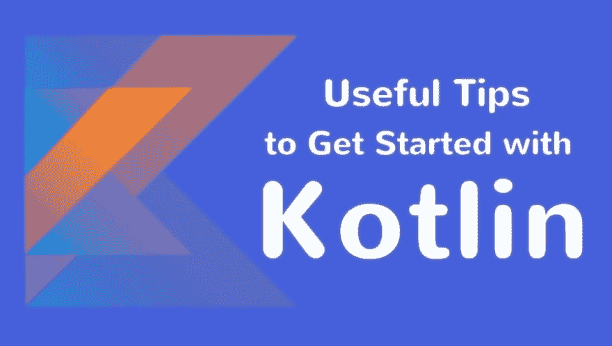

# Kotlin 入门实用技巧

> 原文：<https://dev.to/ryanmiller/useful-tips-to-get-started-with-kotlin-d6e>

[T2】](https://res.cloudinary.com/practicaldev/image/fetch/s--Yw_C6NWN--/c_limit%2Cf_auto%2Cfl_progressive%2Cq_auto%2Cw_880/https://thepracticaldev.s3.amazonaws.com/i/n45gkz8w3awkqanub5t4.jpg)

对于程序员来说，掌握最新的技术和编程工具以跟上数字化转型的步伐至关重要。Kotlin 就是这样一种编程语言，于 2016 年推出，在很短的时间内就受到了欢迎和好评。

它最初是作为编程语言引入的，但很快它就作为插件集成到了 Android Studio 中。程序员对这个插件持怀疑态度，但渐渐地，他们决定在一些更小更简单的项目上尝试一下。该语言提供的可用性商数令人印象深刻，它选择了速度，邀请越来越多的开发人员使用它。

Kotlin 的主要亮点是它是用户友好的，需要最少的切换工作，这使 Android 应用程序开发人员保持参与。此外，它区分业务逻辑和功能的能力节省了时间，并使其成为全球大多数顶级 Android 应用程序开发公司的首选语言。

Kotlin 是由 JetBrains 开发的，目的是减轻 Android 开发者的负担，让应用程序比以往表现得更好。以下是一些使用 Kotlin 获得最大收益的技巧。

## 延迟加载特性

Kotlin 的这个特性可以算是至关重要的特性之一，对开发者和用户都有好处。开发人员可以自由设置应用程序每个元素的加载时间，这使得它可以根据标准指令而不是默认指令运行。这有助于节省内存，并在指定的时间加载所需的元素。此外，应用程序的启动时间也可以优化，这有助于用户比正常情况下更快地访问内容。

## getter 和 setters 特性

Kotlin 包括另一个开发人员喜欢的重要特性，“getters 和 setters”特性。它允许开发人员私有地设置和获取字段，同时保持方法的公共性，以便它可以被多个包和框架访问。它有助于避免复杂性，并且可以使用访问语法获得值。

## Lambdas

Lambdas 在降低代码复杂性方面非常强大和有用。它通过减少特定源文件中的代码行总数来简化 Android 项目的代码，并实现了许多在 Java 中似乎不可能实现的事情。重要的部分是 Android build 的主要配置保持不变。Kotlin 通过根据需要编写有意义和有用的代码块，让您自由构建自己的语言。

## 集合过滤器

Android 应用程序开发人员在使用 API 时需要处理大量的集合。通常，需要改变集合的内容。这就是 Kotlin 集合过滤器发挥作用的地方。它们使工作变得简单而精确。开发人员可以很快到达需要修改的地方。它使代码清晰，保持整洁，对新开发人员来说可读。

## 空安全

空引用也被认为是“十亿美元的错误”,在 Java 中很常见，是程序员经常犯的错误之一。Kotlin 可以有效地消除代码中空引用的危险。Kotlin 中的类型系统能够区分可以或不可以保存空引用的引用——这使它成为一个有价值的组成部分。

## 最后的话

Kotlin 在最近几年成功吸引了众多编程天才。当然，受欢迎的原因是它的简单性、用户友好性、多平台应用支持、强大的资源库和简洁的编码能力以及谷歌支持(I/O 2017)。从 Java 转换到 Kotlin 并不困难，但它带来的好处是巨大的。因此，开始使用 Kotlin，像许多其他顶级 Android 应用程序开发公司一样体验一个全新的开发多样性和简单性的世界。