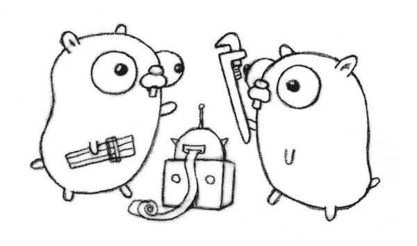

# 围棋工具牛逼

> 原文：<https://dev.to/plutov/go-tools-are-awesome-bom>

[T2】](https://res.cloudinary.com/practicaldev/image/fetch/s--ncK_bZLG--/c_limit%2Cf_auto%2Cfl_progressive%2Cq_auto%2Cw_880/http://pliutau.com/gotools.jpeg)

是的，他们是。这就是我喜欢围棋的原因。几乎所有重要的工具都随 Go 安装一起提供，但是也有一些你可以根据你的需要额外安装:golint，errcheck 等等。

让我们从标准的围棋工具开始。

### 去拿

安装 Go 包最常见的方法是使用`go get`。如果你需要固定版本，你可以使用 [dep](https://github.com/golang/dep) 进行依赖管理。`go get`下载由导入路径命名的包，以及它们的依赖项。然后它会安装指定的包，比如`go install`。

```
go get github.com/golang/lint/golint 
```

Enter fullscreen mode Exit fullscreen mode

有一些有用的标志:

*   `-u`强制工具与最新版本的回购同步。
*   如果您只想将一个存储库克隆到您的 GOPATH 并跳过构建和安装阶段。

### 开始构建/开始安装

这两个命令编译包和依赖项。在没有附加参数的情况下运行时，`go install`和`go build`都将编译当前目录中的包。如果这个包是`package main`，go build 会把生成的可执行文件放在当前目录下。go install 将把它放入`$GOPATH/bin`(如果有多个元素，使用$GOPATH 的第一个元素)。另外`go install`将在`$GOPATH/pkg`安装编译后的依赖项。为了达到与`go build`相同的效果，使用`go build -i`。
如果软件包不是主软件包，go install 将编译软件包并将其安装在`$GOPATH/pkg`中。

`go build`命令允许您在您的平台上为任何 Go 支持的目标平台构建一个可执行文件。这意味着您可以测试、发布和分发您的应用程序，而无需在您希望使用的目标平台上构建那些可执行文件。

```
GOOS=windows GOARCH=amd64 go build github.com/mholt/caddy/caddy 
```

Enter fullscreen mode Exit fullscreen mode

如果您对 Go 工具链感到好奇，或者使用一个 cross-C 编译器，并且想知道传递给外部编译器的标志，或者怀疑一个链接器错误，使用`-x`查看所有调用。

```
go build -x
WORK=/var/folders/2g/_fnx086940v6k_yt88fdtqw80000gn/T/go-build614085896
mkdir -p $WORK/github.com/plutov/go-snake-telnet/_obj/
mkdir -p $WORK/github.com/plutov/go-snake-telnet/_obj/exe/
... 
```

Enter fullscreen mode Exit fullscreen mode

在构建 Go 程序时，我经常使用`-ldflags`选项:

*   为了[优化 Go 二进制大小](http://pliutau.com/optimize-go-binary-size/)。
*   在生成过程中设置变量值。

```
go build -ldflags="-X main.Version 1.0.0" 
```

Enter fullscreen mode Exit fullscreen mode

`go build -gcflags`用于将标志传递给 Go 编译器。`go tool compile -help`列出所有可以传递给编译器的标志。

### 去考试

这个命令有很多选项，但我经常使用的是:

*   `-race`去跑步[去赛跑检测器](https://blog.golang.org/race-detector)。
*   `-run`通过正则表达式和-run 标志过滤要运行的测试:`go test -run=FunctionName`。
*   `-bench`运行基准测试。
*   `-cpuprofile cpu.out`退出前将 CPU 配置文件写入指定文件。
*   `-memprofile mem.out`在所有测试通过后，将内存配置文件写入文件。
*   我一直用`-v`。它打印测试名称、状态(失败或通过)、运行测试花费的时间、测试用例的日志等等。
*   `-cover`测量运行一组测试时执行的代码行的百分比。

### 围棋列表

它列出了由导入路径命名的包，每行一个。

### 走 env

打印 Go 环境信息:

```
go env
GOARCH="amd64"
GOBIN="/Users/pltvs/go/bin"
... 
```

Enter fullscreen mode Exit fullscreen mode

### go fmt

对我来说最常用的工具，因为我在文件保存时运行它。它会根据 Go 的标准重新格式化你的代码。

还有基于`gofmt`的`goimports`,它更新您的 Go 导入行，添加缺失的行并删除未引用的行。

### go vet

我还在保存时运行它，`go vet`检查 Go 源代码并报告可疑的构造，比如参数与格式字符串不一致的`Printf`调用。

### 去生成

在 Go 1.4 中加入了`go generate`命令，“在编译前自动运行工具生成源代码。”

Go 工具扫描与当前包相关的文件，寻找带有形式为`//go:generate command arguments`的“神奇注释”的行。这个命令不需要做任何与 Go 或代码生成相关的事情。比如:

```
package project

//go:generate echo Hello, Go Generate!

func Add(x, y int) int {
    return x + y
} 
```

Enter fullscreen mode Exit fullscreen mode

```
$ go generate
Hello, Go Generate! 
```

Enter fullscreen mode Exit fullscreen mode

### 阅读代码的工具

我们花在阅读代码上的时间比写代码的时间多，因此，帮助我们阅读代码的工具对于任何优秀的 gopher 来说都是一个重要的补充。

### go doc / godoc

这听起来很像 javadoc 和其他类似的工具，但是 Go 文档没有任何额外的格式规则。一切都是纯文本。

例如，我们可以获得关于 json 的信息。编码器通过运行:

```
go doc json.Encoder
package json // import "encoding/json"

type Encoder struct {
        // Has unexported fields.
}
... 
```

Enter fullscreen mode Exit fullscreen mode

如果`go doc`能够给我们关于 GOPATH 中任何标识符的信息，`godoc`能够以文本形式提供包的完整文档:

```
godoc errors
use 'godoc cmd/errors' for documentation on the errors command

PACKAGE DOCUMENTATION

package errors
... 
```

Enter fullscreen mode Exit fullscreen mode

### 非标准围棋工具

让我们看看 community 创造了什么工具来让 Gophers 开心。

### 戈林特

我也在文件保存时运行它。

```
go get -u github.com/golang/lint/golint 
```

Enter fullscreen mode Exit fullscreen mode

### 错误检查

```
go get github.com/kisielk/errcheck 
```

Enter fullscreen mode Exit fullscreen mode

该工具检测错误何时被忽略。这意味着对于至少返回一个错误的函数，我们忽略了对返回值的检查。

给定一个`foo() error`函数，我们会说:

*   `foo()`是默默地省略了错误，而
*   `_ = foo()`是显式省略错误。

### P.S

Go 社区非常活跃，总是在创造新的有用的工具，如果你知道一些其他有用的工具，请留下评论。

[我博客中的原帖](http://pliutau.com/go-tools-are-awesome/)