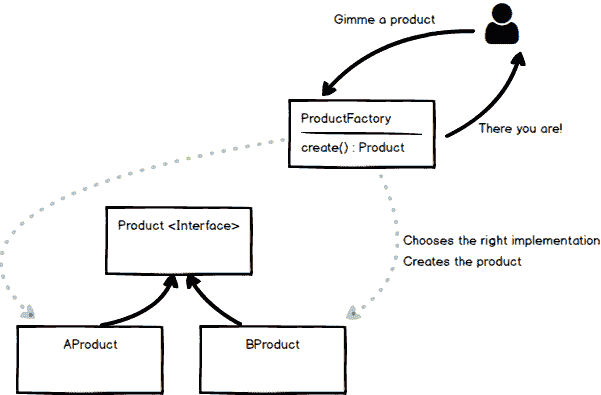

# 科特林与工厂模式的乐趣

> 原文:[https://dev . to/geraldcroes/kot Lin-fun-with-the-factory-pattern-1 nmb](https://dev.to/geraldcroes/kotlin-fun-with-the-factory-pattern-1nmb)

[T2】](https://res.cloudinary.com/practicaldev/image/fetch/s--YpdY19dv--/c_limit%2Cf_auto%2Cfl_progressive%2Cq_auto%2Cw_880/https://cdn-images-1.medium.com/max/1024/1%2Ac_5J7SGs24bGbFFjzf8wWw.jpeg)

当你读到“让我们拿工厂模式来玩一玩”时，我同意你应该怀疑作家的热情，自己去看。但是，当我写一些代码来玩这种我最近爱上的语言时，我问自己，“我应该如何写一个工厂方法？”

这个简单的问题引导我做了一些实验。

### 可以找点乐子，但是……工厂是什么？

对于那些需要提醒的人来说，工厂是在通常被称为“GOF”的书中列出的一种创造模式。如果你还没有听说过或读到过它，还有时间赶上。如果它落在 TL 中；博士类，不要犹豫谷歌模式世界；互联网上有很多可用的资源(维基百科是一个令人满意的快速介绍)。

工厂的目标是向客户交付一个现成的对象。工厂隐藏了为工作创建和选择正确对象的复杂性。

因为我们都喜欢 UML，所以我将画一个看起来有点像 UML 的草图(在周六晚上),这样我们就在同一页上了。

[T2】](https://res.cloudinary.com/practicaldev/image/fetch/s--bI9F7aah--/c_limit%2Cf_auto%2Cfl_progressive%2Cq_auto%2Cw_880/https://cdn-images-1.medium.com/max/601/1%2AyUDdxb-0B6eGrL9UmIHgRw.png)

### GOF 的工厂

既然我们都记得工厂是什么(我知道你知道，但以防万一)，让我们编写第一个坦诚的 Kotlin 实现。

假设我们有一个叫做 FileParser 的*产品*,我们需要它，这样我们就可以从文件中读取信息，否则我们会忘记。