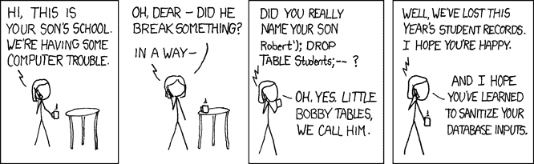

# 爱阿达的理由。#1:强打字

> 原文:[https://dev.to/pinotattari/reasons-for-loving-ada-720](https://dev.to/pinotattari/reasons-for-loving-ada-720)

是的，是的，我知道...我对 Ada 编程有点奇怪。当这个问题在谈话中出现时，我通常被要求为我的选择辩护。为了将来的参考(也许也是为了帮助其他人了解这种漂亮的语言)，我决定写几篇关于我喜欢 Ada 的文章。

# 历史和其他东西

在深入讨论细节之前，让我花一些时间来介绍这种语言。许多人从未听说过 Ada，许多听说过的人对它有一些偏见。

Ada 语言是以[拜伦](https://en.wikipedia.org/wiki/Lord_Byron)的女儿[阿达·洛芙莱斯](https://en.wikipedia.org/wiki/Ada_Lovelace)命名的(是的，*就是那个*拜伦)，被认为是历史上第一个[程序员](https://en.wikipedia.org/wiki/Ada_Lovelace#First_computer_program)。

> 顺便说一句，你注意到我写的是“ADA”而不是“Ada”吗？这是因为它是一个人的名字，而不是缩写。在论坛/新闻组中使用“ADA ”,你很快就会得到纠正...

Ada 是在 80 年代根据国防部的想法开发的。(我不会在这里重复其他地方的有趣历史。)从那以后，它大约每十年更新一次，产生了几个版本，非正式地称为年数(Ada 83、Ada 95、Ada 2005 和 Ada 2012，下一个版本可能是 Ada 2020)。Ada 是一种非常活跃和现代语言，它有几个在别处不容易找到的特性:契约、类型不变量、形式检查、私有包、分布式编程、本机多任务等等...

> Ada 非常灵活:它用于在航空电子设备中编写百万行代码，也用于控制类似于 [STM32](http://blog.adacore.com/tag/STM32) 的小型设备。例如，这款 [segway 由多任务代码控制的乐高 mindstorm](https://www.youtube.com/watch?v=MWYHBxHTW54) 实现(16 位处理器和 64K 内存！)[在 FOSDEM](https://people.cs.kuleuven.be/~dirk.craeynest/ada-belgium/events/12/120204-fosdem/07-ada-segway-robot.pdf) 亮相。

# 你为什么爱阿达？

简单回答？减少调试时间:我的个人经验是，如果与类似复杂度的 C 代码相比，Ada 代码可能需要 1/10 的调试时间。原因是 Ada 编译器比 C“严格”得多，以至于程序编译的时候有一个内部的连贯性，防止了很多傻 bug 的存在(而大部分 bug 就是傻！)在 C 代码中幸存下来(函数没有返回，在`switch`中缺少`break` / `case`，悬空指针，缓冲区溢出)...).剩下的错误很容易被编译器添加到代码中的许多*错误陷阱*(我喜欢这个术语)捕获。在 Ada 中编程就像进行 [*成对编程*](https://en.wikipedia.org/wiki/Pair_programming) ，但是*编译器*扮演*观察者*的角色。

> 请注意*我不是*声称通过使用 Ada 你的代码将*自动*可读、可维护并且没有错误。你可以在 Ada 中写出糟糕的代码，你只需要努力...:-)
> 说真的，人们常说代码的质量主要取决于程序员的技能，而不是工具的类型。然而，使用正确的工具将帮助你达到事半功倍的效果。

## 好了，好了，我明白了...但你能给我举个例子吗？

当然，我是为此而来的。也许 Ada 帮助你编写健壮软件的最简单的特征就是*类型系统*，尤其是它的*强类型*特性。我举个例子解释一下:如果用 C 写

```
typedef int serial_number;
typedef int port; 
```

<svg width="20px" height="20px" viewBox="0 0 24 24" class="highlight-action crayons-icon highlight-action--fullscreen-on"><title>Enter fullscreen mode</title></svg> <svg width="20px" height="20px" viewBox="0 0 24 24" class="highlight-action crayons-icon highlight-action--fullscreen-off"><title>Exit fullscreen mode</title></svg>

您可以毫无问题地将类型为`port`的变量赋给类型为`serial_port`的变量，因为两者都是整数；但是如果你在阿达

```
type Serial_Number is new Integer;
type Port          is new Integer; 
```

<svg width="20px" height="20px" viewBox="0 0 24 24" class="highlight-action crayons-icon highlight-action--fullscreen-on"><title>Enter fullscreen mode</title></svg> <svg width="20px" height="20px" viewBox="0 0 24 24" class="highlight-action crayons-icon highlight-action--fullscreen-off"><title>Exit fullscreen mode</title></svg>

你*不能*将一个`Port`类型的变量赋给一个`Serial_Number`类型的变量，尽管两者都被实现为整数。这是因为它们实际上*代表了两种不同的东西*，尽管在最底层以同样的方式实现。嗯，有道理，不是吗？为什么要使用 TCP 端口作为序列号？最有可能的是，如果你试图做这样的事情，某个地方有错误。

> 如果你真的需要使用一个端口作为序列号呢？没问题，可以用`Serial := Serial_Number(Client_Port);`转换。请注意，这种转换没有成本，因为两者都是整数；它只是告诉编译器“听着，这不是一个错误，我知道我想要什么，请原谅我并赋予这个值。”
> 
> 请注意，对于不是关键字的名称，使用了“带下划线的骆驼大小写”。这种风格在现代 Ada 代码中很常见。当然，这不是强制性的，但就我个人而言，我觉得它很有可读性。还请注意 Ada 是不区分大小写的，因此您可以编写，例如，`serial_number`。哦，对了，还有用“:=”赋值。

其实上面的代码并不是最好的选择。你怎么知道一个`Integer`会大到足以保存一个序列号或者一个端口？嗯，在当前的 Intel 处理器(32 位整数)上，这很合理，但是如果你有一个 16 位整数的小型微控制器呢？嗯，也许最好的办法是让编译器通过编写
来决定

```
type Serial_Number is range 0 .. 999_999;
type Port          is range 0 .. 2**16-1; 
```

<svg width="20px" height="20px" viewBox="0 0 24 24" class="highlight-action crayons-icon highlight-action--fullscreen-on"><title>Enter fullscreen mode</title></svg> <svg width="20px" height="20px" viewBox="0 0 24 24" class="highlight-action crayons-icon highlight-action--fullscreen-off"><title>Exit fullscreen mode</title></svg>

> 请注意在数字中使用“_”作为分隔符。一件简单的事情，但真的很方便...

注意我们如何做*而不是*告诉编译器使用哪个底层实现，而是我们需要哪些*特征*，并让编译器决定如何处理它们。在具有 16 位`int`的微控制器上，可能`Serial_Number`将被实现为`long int`，而`Port`将被实现为`unsigned int`。但是谁真的在乎呢？让编译器来处理这些无聊的事情吧...

> 如果你需要`Serial_Number`有一个特定的大小，比如 24 位(因为，比如，你需要把它写在一个包里)呢？就写

```
type Serial_Number is range 0 .. 999_999 with Size => 24; 
```

<svg width="20px" height="20px" viewBox="0 0 24 24" class="highlight-action crayons-icon highlight-action--fullscreen-on"><title>Enter fullscreen mode</title></svg> <svg width="20px" height="20px" viewBox="0 0 24 24" class="highlight-action crayons-icon highlight-action--fullscreen-off"><title>Exit fullscreen mode</title></svg>

> 我不想深究 Ada 类型系统，但是我忍不住要告诉你两种在别处不常见的类型。如果你写`type Volt is delta 0.125 range 0.0 .. 255.0;``Volt`类型的变量将持有一个 [*定点实数*](https://en.wikipedia.org/wiki/Fixed-point_arithmetic) 范围在 0 V 区间..255 V，步长为 0.125 V。定点数通常以整数形式实现，例如，在一些运行于小型处理器上的 DSP 应用中使用，无需浮点运算。另一种不常见的类型是用类似`type Money is delta 0.01 digits 15;`的东西定义的*十进制定点*类型。我会让你[发现他们](https://en.wikipedia.org/wiki/Fixed-point_arithmetic#Binary_vs._decimal)。另请参见相应的[参考手册页](http://www.adaic.org/resources/add_content/standards/12rm/html/RM-3-5-9.html)。

# 举例:清理用户输入

让我们制作一个利用 Ada 严格类型的玩具(但不那么玩具)例子。

> 有人可能会反对说，还有其他方法来处理这里考虑的问题。是的，我知道，但是我只需要一个简单的例子来展示你可以通过严格的输入来做什么。我并不声称这是唯一的*(或*最好的*)解决方案(尽管，我认为它相当好)。*

 *众所周知，在任何使用用户输入的应用中，在使用用户输入时必须小心，因为它可能会打开安全漏洞。以下 [xkcd 漫画](https://xkcd.com/327)堪称经典

[T2】](https://res.cloudinary.com/practicaldev/image/fetch/s--KT-c06nV--/c_limit%2Cf_auto%2Cfl_progressive%2Cq_auto%2Cw_880/https://imgs.xkcd.com/comics/exploits_of_a_mom.png)

当然，我们可以在净化用户输入之前尽可能不使用它，但是如果应用程序非常大，并且所有东西都是一个`String`(或`char*`)的话，就有可能出现问题...类型严格性在这里可以帮助我们。我们只需要定义一个新的类型`Dirty_String`，让所有的用户输入函数返回一个`Dirty_String`，而不是一个字符串(这更容易检查)。在普通的`String`中转换一个`Dirty_String`的唯一方法是通过一个特殊的`Sanitize`函数。

让我们深入细节。我们将定义以下包*规格*

```
package Dirty_Strings is 
  type Dirty_String(<>) is private;

  function Sanitize(X : Dirty_String) return String;

  function Taint(X : String) return Dirty_String;
private
  type Dirty_String is new String; 

  function Taint(X : String) return Dirty_String
  is (Dirty_String(X));
end Dirty_Strings; 
```

<svg width="20px" height="20px" viewBox="0 0 24 24" class="highlight-action crayons-icon highlight-action--fullscreen-on"><title>Enter fullscreen mode</title></svg> <svg width="20px" height="20px" viewBox="0 0 24 24" class="highlight-action crayons-icon highlight-action--fullscreen-off"><title>Exit fullscreen mode</title></svg>

> 在 Ada 中，一个包被分成两部分:它的 *specs* 指定包输出的“资源”,以及它的*主体*和实际的实现。*规范*进一步分为*公共*部分(对代码的其余部分可见)和可选的*私有*部分。

这个包定义了一个类型`Dirty_String`。在*公共*部分(在`private`之前)类型被定义为`private`，即*不关你的事*。此外，该包导出了两个函数，可用于从`Dirty_String`转换为正常的`String`，反之亦然。

然而，在*私有部分*中，我们看到`Dirty_String`只是...一个`String`。将它的定义放在私有部分可以防止*从`Dirty_String`到`String`的快捷转换*，并迫使程序员通过函数`Sanitize`，我们猜测，这个函数会引用特殊字符。相反，普通`String`到`Dirty_String`的转换只是一种类型转换，因为不需要改变它。这允许我们将它定义为一个*表达式函数*(参见 [RM](http://www.adaic.org/resources/add_content/standards/12rm/html/RM-6-8.html) )，它很可能会被编译器“内联”。

# 运行期约束

让我用 Ada 2012 的一个我觉得很可爱(也很有用)的特性来做个总结。几年前，我从 Ada 写了一个写 Matlab 文件的小程序包。有一天我发现这个包正在写一些无法从 Matlab 中读取的文件。原因是 Matlab 文件中的变量名不是有效的 Matlab 名。在修正了 bug 之后，我决定在代码中添加一个新的 *bug 陷阱*。我将用于变量名的类型定义为

```
type Matlab_Name is new
     String
   with Dynamic_Predicate =>
     (for all I in Matlab_Name'Range =>
        Is_Alphanumeric (Matlab_Name (I)) or Matlab_Name (I) = '_')
     and
       Is_Letter (Matlab_Name (Matlab_Name'First)); 
```

<svg width="20px" height="20px" viewBox="0 0 24 24" class="highlight-action crayons-icon highlight-action--fullscreen-on"><title>Enter fullscreen mode</title></svg> <svg width="20px" height="20px" viewBox="0 0 24 24" class="highlight-action crayons-icon highlight-action--fullscreen-off"><title>Exit fullscreen mode</title></svg>

如果你有一点编程经验，你应该能够理解上面的代码，即使你不知道 Ada。如你所见,`Matlab_Name`是一个`String`(但是你不能把它和其他字符串混合在一起，比如文件名！)，但是它还必须满足一个`Dynamic_Predicate`(如果您要求编译器这样做，那么这个条件会在运行时被检查)。条件可以一分为二，第一部分

```
 (for all I in Matlab_Name'Range =>
        Is_Alphanumeric (Matlab_Name (I)) or Matlab_Name (I) = '_') 
```

<svg width="20px" height="20px" viewBox="0 0 24 24" class="highlight-action crayons-icon highlight-action--fullscreen-on"><title>Enter fullscreen mode</title></svg> <svg width="20px" height="20px" viewBox="0 0 24 24" class="highlight-action crayons-icon highlight-action--fullscreen-off"><title>Exit fullscreen mode</title></svg>

要求名称中的每个字符必须是字母、数字或下划线，而第二部分

```
Is_Letter (Matlab_Name (Matlab_Name'First)); 
```

<svg width="20px" height="20px" viewBox="0 0 24 24" class="highlight-action crayons-icon highlight-action--fullscreen-on"><title>Enter fullscreen mode</title></svg> <svg width="20px" height="20px" viewBox="0 0 24 24" class="highlight-action crayons-icon highlight-action--fullscreen-off"><title>Exit fullscreen mode</title></svg>

要求第一个字符必须是字母。如果启用了检查，并且在某个时候您的代码生成了一个错误的名称，那么就会在错误发生的地方引发一个异常。(这种对错误的精确定位对调试很有帮助...)

> *效率呢*？是的，我能听到你们，效率爱好者。在运行时进行检查的想法似乎违背了效率的理念。是的，运行时检查在效率方面是有代价的，但是根据我的经验，你甚至不会注意到它。除非你有非常严格的时间预算(或者除非你有非常复杂的检查),否则让它们保持运行来捕捉可能的错误通常更方便。只有在发现无法承受检查时，才应该决定关闭检查，并且应该只关闭那些计算量最大的部分(可能在彻底测试后)。
> 
> 另一种方法是在[SPARK](https://en.wikipedia.org/wiki/SPARK_(programming_language))(Ada 的子集，与 Apache 无关)中编码，以便正式检查您的代码。我会让你发现火花的快乐...:-)*