# 硬件黑客:超级愚蠢的黑客马拉松

> 原文:[https://dev . to/惠晶/hardware-hacks-super-silly-hackathon-315 f](https://dev.to/huijing/hardware-hacks-super-silly-hackathon-315f)

今年我有机会做了一些旅行，并设法会见了许多来自世界各地的开发人员。在我们的对话中，有一个话题是我们当地的技术社区是什么样的。我绝对喜欢回答这个问题。

在我看来，新加坡拥有世界上最好的科技社区之一。当然，这是一个相当小的国家，但这是为什么我们是一个如此紧密团结的社区的重要因素。我们有许多强有力的社区领袖，他们为老手和新手建立了坚实的支持基础。

想开始自己的约会吗？我们在[建造时有大量资源可用！](http://webuild.sg/)，这是一个了解新加坡所有科技领域、正在举办的活动、如何开始自己的聚会等信息的平台。几乎所有的 meetup 谈话都是由[的工程师录制的。SG](https://engineers.sg/) 。用他们的话说，他们是一个非营利性的社区倡议，旨在帮助记录新加坡的技术和创业场景。

长话短说，我的朋友们举办了一次黑客马拉松，灵感来自[愚蠢的狗屎没有人需要&可怕的想法黑客马拉松](http://www.stupidhackathon.com/)并决定举办我们自己的[超级愚蠢的黑客马拉松](https://supersillyhackathon.sg/)。太棒了。我度过了最美好的时光🙆。还有，他们的网站很牛逼。它有一个对角线卷轴。[林志昂](https://cheeaun.com/)设计并建造了它。看看他的演讲。另外，猫。

<figcaption>Unicat 表示喵</figcaption>

[](https://res.cloudinary.com/practicaldev/image/fetch/s--40uh6p7L--/c_limit%2Cf_auto%2Cfl_progressive%2Cq_auto%2Cw_880/https://www.chenhuijing.cimg/posts/supersilly/unicat.svg)

## 团队 486

在我出生之前，我家里就一直有一台电脑。据我的兄弟姐妹说，我们甚至在某个时候有了一台 Apple II。它要么在我出生前就死了，要么是我们搬到南方时留下的。或者别的什么，但是现在已经没有了😩。我记得的是 386，或者可能是 486，在上面我学到了足够多的 DOS 操作游戏的知识。

<figcaption>直接访问，DOS menuing shell 由台达科技国际</figcaption>

[](https://res.cloudinary.com/practicaldev/image/fetch/s--67uFi_AX--/c_limit%2Cf_auto%2Cfl_progressive%2Cq_auto%2Cw_880/https://www.chenhuijing.cimg/posts/vintage/da2-640.jpg)

去年回忆 90 年代的时候，我谈了很多。就在那时，我认识了另一位复古技术爱好者，[杨坤明](http://yeokhengmeng.com/)。他是最棒的家伙，因为他设法让 [Windows 3.11 在现代硬件](http://yeokhengmeng.com/2016/09/windows-for-workgroups-3-11-on-vintage-and-modern-hardware-in-2016/)上运行，并在新加坡每月一次的硬件黑客聚会 [Hackware](https://www.meetup.com/Hackware/) 上展示了它。这不是他唯一令人敬畏的地方，只是其中之一。

无论如何，我一直计划在这个黑客马拉松上露面，随便逛逛，但后来 Kheng Meng 问我是否有兴趣尝试在旧的 486 上运行现代 Linux 系统。当然，答案是响亮的是。他在网上某个地方买了一台旧机器，经过一些简短的讨论，我们决定继续这个计划。

<figcaption>看这个美女</figcaption>

[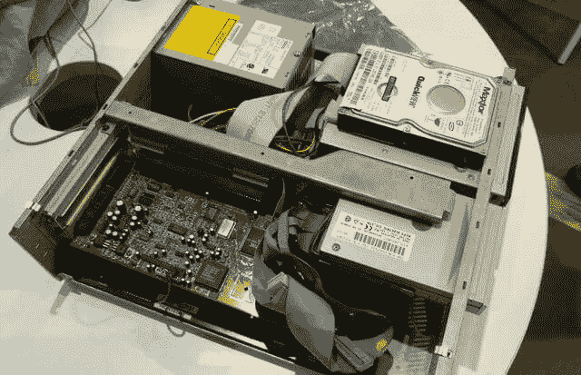](https://res.cloudinary.com/practicaldev/image/fetch/s--qjpsCtk2--/c_limit%2Cf_auto%2Cfl_progressive%2Cq_auto%2Cw_880/https://www.chenhuijing.cimg/posts/supersilly/486-640.jpg)

球队的名字是很久以后才出现的，当时我们被告知我们必须有一个名字。给事物命名很难。所以我们选择了显而易见的方法。486 队。

## 黑客马拉松赛前准备

Kheng Meng 有比我多得多的硬件，并且在黑客马拉松之前做了一些实验。我们与 IBM PS/1 顾问 2133 19C 一起工作，其硬件规格如下:

*   运行在 133mhz 的 AMD 5X86
*   64MB RAM
*   IBM 光盘驱动器
*   3.5 英寸 1.44mb 软驱
*   171 mb 硬盘
*   声霸 16 卡
*   VGA 图形
*   10Mbps 3Com Etherlink III 3c509B

*更新:Kheng Meng 补充说 [Am5x86](https://en.wikichip.org/wiki/amd/am5x86) 是 AMD 的英特尔 80486 的高性能克隆。因为大多数人把 486 芯片和英特尔联系在一起，但是不，我的朋友们，当我说芯片是 AMD 的时候，我没有打错。此外，该机器根本没有 PCI 总线。网卡使用 ISA 插槽。*

它在当时是相当高端的机器，但我们试图在它上面运行相对现代的软件，所以开始寻找最小的 Linux 发行版。Kheng Meng 做了一些研究，发现有人在使用 Gentoo Linux 的 486 上取得了成功。我们也考虑了 [Slackware](http://www.slackware.com/) 。但结果是我们的机器不能处理这些。

我记得几年前在一台旧奔腾 2 上安装了[该死的小 Linux](http://www.damnsmalllinux.org/) ，但是它已经有一段时间没有更新了。所以我们转而关注[微内核 Linux](https://mirrors.dotsrc.org/tinycorelinux/) 。Kheng Meng 事先准备了许多启动光盘，但也带来了他值得信赖的 Thinkpad T430，它可以多次启动到 Linux Mint、Windows 10、Windows XP 和 FreeDos(只是因为)。

我们有办法刻录 CD 图像和软盘图像，所以不要扔掉工作的旧硬件，伙计们。你永远不知道它们什么时候会派上用场。

## 就这样开始了……

那个硬盘真的很小，所以孟用他的 80gb 迈拓硬盘代替了它，我们只是把它放在机器的顶部。我设法购买了一个 19 英寸的 VGA 显示器，并带了一个迷你 wifi 路由器，因为我们必须四处摆弄才能让我们的机器以某种方式连接到互联网。孔孟带来了 100 多吨的装备，所以他有一个漂亮的手提箱.

今天的第一个问题，大概 15 分钟后。显示器看不清我们 486 的输出。一无所获。但是我们抢到了一个很好的位置，就在这个位置的投影仪输入端旁边，所以我们劫持了一整天的投影仪。基本上，会场在房间周围有 3 个投影屏幕，每个人都可以看到我们当天在做什么，即使他们不明白我们在做什么。我认为是当今最好的风水。

劫持他们的港口！ [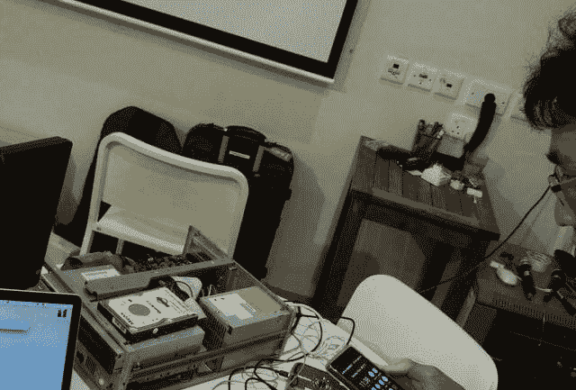](https://res.cloudinary.com/practicaldev/image/fetch/s--kdJb2v_P--/c_limit%2Cf_auto%2Cfl_progressive%2Cq_auto%2Cw_880/https://www.chenhuijing.cimg/posts/supersilly/location-640.jpg)

在我们最终得到要输出的显示之后，下一步是引导和安装 Linux。我们选择的操作系统是微内核 Linux，我们有两个版本刻录到光盘，微内核和微内核。我们从微小的核心开始，但它不需要。每次尝试启动内核时，机器都会重新启动。

因此，我们接下来尝试了微核心版本，但由于它们是在相同的系统上构建的，所以当相同的问题再次出现时就不足为奇了。就在重启发生之前，出现了一个短暂的错误信息，因此，作为足智多谋的问题解决者，Kheng Meng 拿出了他可以录制 60fps 视频的手机，并在重启之前捕捉了屏幕画面。

我总是使用 Quicktime 来编辑我的视频，我喜欢的功能之一是 *Trim* 功能。它允许您通过按住滑块一秒钟来进行精细的逐帧编辑。无论如何，镜头捕捉到了以下错误信息:

> 错误:进程 swapper/0 pfs:007d4 中的错误页面状态

当你的眼睛不够快时... [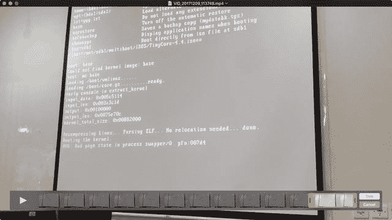](https://res.cloudinary.com/practicaldev/image/fetch/s--fZiCh_8z--/c_limit%2Cf_auto%2Cfl_progressive%2Cq_auto%2Cw_880/https://www.chenhuijing.cimg/posts/supersilly/quicktime-640.jpg)

谷歌搜索不是特别有帮助，所以我们决定给该死的小 Linux (DSL)一个尝试，因为它相对较老，它可能会与 486 更好地工作，谁知道呢？所以我们把图像刻录到一张可擦写的 CD 上，再试一次。

令人惊讶的是，它设法启动(借助软盘上的智能引导加载程序)而没有崩溃，但不知何故，它无法读取光盘上的图像。原来，驱动器不能识别可重写光盘。幸运的是，我们离 IT 商城只有 100 米远，所以 20 分钟后，我们就有了一堆空白 CD 可以使用。

同样，有多种版本的 DSL 可供我们使用，我们决定使用 4.4.10 和 4.11.RC2 的 CD 映像。如果所有其他方法都失败了，我们会选择软盘，因为我们可以💪。

这就是我记忆模糊的地方。我不记得我们是否试过 RC2 版本，在我出去买 CD-r 之前还是之后遇到了一些错误。但关键是，我们设法在 4.4.10 上从启动选项菜单一直到启动顺序。

## 4 小时安装一个 OS

当我在 IT-mall-blank-CD 购买的时候，是午餐时间，所以当我大口大口地吃东西的时候，有很多用一个手指打字的事情。哦，但是当我们到了所有的硬件组件都被正确识别的部分，快乐的舞蹈💃。

在又折腾了半个小时左右的启动选项后，我们意识到我们应该在启动提示符出现时输入`install`😠。在我们看来，说明是这样的:

哦，只是，来吧... [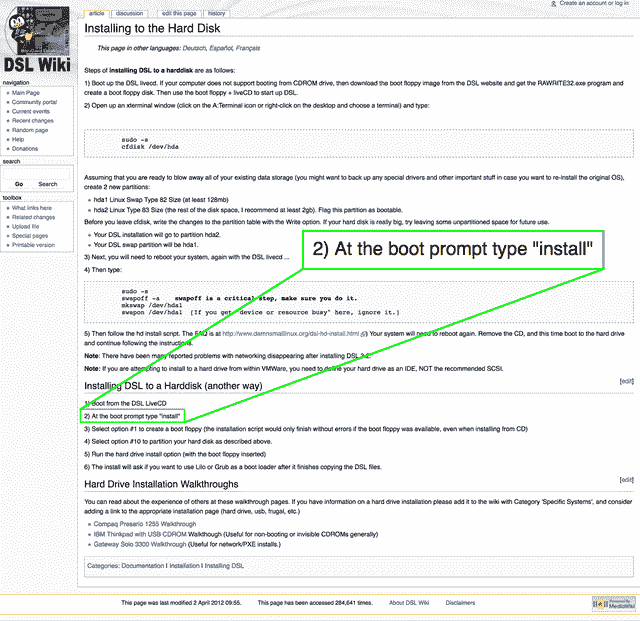](https://res.cloudinary.com/practicaldev/image/fetch/s--Qy5m7e7g--/c_limit%2Cf_auto%2Cfl_progressive%2Cq_auto%2Cw_880/https://www.chenhuijing.cimg/posts/supersilly/install2-640.png)

不过都挺好的。当涉及到对硬件做非正统的事情时，这样的事情是意料之中的。等着看我们遇到的其他障碍吧。这是乐趣的一部分，我的朋友。

在安装到光盘上之前，我们擦除了现有内容并对驱动器进行了重新分区。我们第一次这样做时，我们雄心勃勃地分配了 512mb 用于交换，剩余的空闲空间作为工作驱动器，这将是可引导的。大约是 75.7gb 左右？坏主意。

<figcaption>这不会是最后一次</figcaption>

[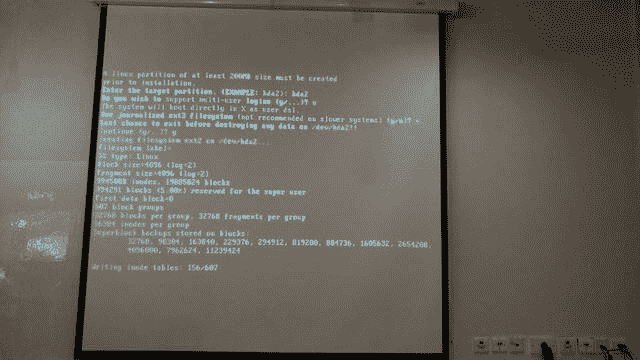](https://res.cloudinary.com/practicaldev/image/fetch/s--jQYEYB5n--/c_limit%2Cf_auto%2Cfl_progressive%2Cq_auto%2Cw_880/https://www.chenhuijing.cimg/posts/supersilly/install-640.jpg)

写这封信花了太长时间。我想我把它询问是否应该安装引导加载程序的部分搞砸了，我按下了`Enter`，假设会选择默认选项`(y)`，而不是明确输入`y`。所以要么是启动加载程序没有安装，要么是我们分配了太多的空间让系统无法识别。我认为是前者。但不管怎样，系统不会从硬盘启动，所以采取 2。

我们第二次尝试安装到光盘时，引导加载程序无法读取光盘映像，即使我们尝试用不起毛的微纤维布清洁它😩。幸运的是，我们有那一叠多余的空白 CD，所以孟肯刻录了一张新的拷贝，并对光盘进行了验证。它确实有效，我们不知道为什么。

这一次，我们为两个分区分配了更少的空间，这加快了速度。虽然它不是很快，但比我们第一次安装时快多了。伙计们，灌注就是一切。

<figcaption>我们生活和学习了</figcaption>

[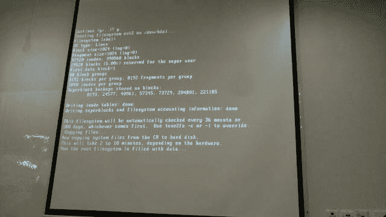](https://res.cloudinary.com/practicaldev/image/fetch/s--v4ZQmPtT--/c_limit%2Cf_auto%2Cfl_progressive%2Cq_auto%2Cw_880/https://www.chenhuijing.cimg/posts/supersilly/install3-640.jpg)

## 我们的宝宝来玩了

当我们让 DSL 成功启动硬盘时，大约是下午 3 点。所以我们比计划提前了(在我看来)，我开始跳了几次快乐舞。下一个问题是，我们需要做些什么。

DSL 已经有了很多特性，如果你参考一下[什么能装在 50 兆字节里？！](http://www.damnsmalllinux.org/wiki/about_damn_small_linux.html)部分，你会看到完整的列表。它带有 SSH，一个网络服务器和媒体播放器。第一个想法是用我们可爱的 486 服务黑客马拉松网站。反正网站的所有代码都是在 Github 上开源的。

但是我们还没有解决网络连接的问题。Kheng Meng 和我都带了便携式 wifi 路由器，但他的功能更多。我们意识到场馆 wifi 有很多局限性。最初的计划是使用他的路由器作为客户端，然后通过以太网连接到 486，这可以工作，但不能上网。最终，这种设置让他的手机成为了移动热点🤷。

我们在做生意！算是吧。尽管路由器可以访问互联网，但 486 似乎没有分配 IP 地址。也许 DCHP 服务器没有运行？但是谷歌马上给我提供了答案。我无法解释我的谷歌搜索技术，除了凭直觉决定使用哪个关键词，选择哪个结果。我意识到我几乎从不选择第一个选项，想想吧。

那是我们！ [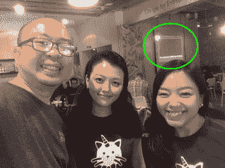](https://res.cloudinary.com/practicaldev/image/fetch/s--hciFcbXd--/c_limit%2Cf_auto%2Cfl_progressive%2Cq_auto%2Cw_880/https://www.chenhuijing.cimg/posts/supersilly/hijack.jpg)

<figcaption>全天提供实时更新</figcaption>

[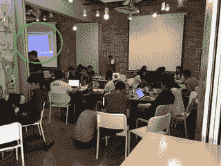](https://res.cloudinary.com/practicaldev/image/fetch/s--5fnFw5Lu--/c_limit%2Cf_auto%2Cfl_progressive%2Cq_auto%2Cw_880/https://www.chenhuijing.cimg/posts/supersilly/hijack2.jpg)

不管怎样，这是我第一次选择的结果[，也许“小费”这个词让我感觉更好。我不禁惊叹道:“那`pump`是做什么的呢？”就在我进入司令部的时候，因为我们俩以前都没见过。但是你瞧，我们的宝宝上网了！](http://damnsmalllinux.org/static/act-Print/f-7/t-20219.html)

我们还启动了用于文件传输和并发访问的 SSH 客户端。原来 DSL 上的 SSH 版本太旧了，我的 Mac 无法连接，但肯·孟然在他的 T430 上安装了 Linux Mint，效果很好。这就是我们的文件传输策略(因为我们不想在一个下午毁掉 Kheng Meng 的所有数据)。

<figcaption>最大的桌子。所有的硬件。</figcaption>

[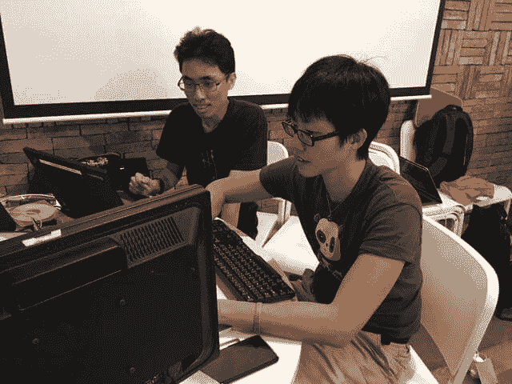](https://res.cloudinary.com/practicaldev/image/fetch/s--T4DanQK5--/c_limit%2Cf_auto%2Cfl_progressive%2Cq_auto%2Cw_880/https://www.chenhuijing.cimg/posts/supersilly/hustling-640.jpg)

我的便携式 wifi 路由器被调用来建立一个单独的网络(不幸的是没有连接到互联网)，毫无创意地称为 486，供其他设备访问我们的机器。

1.  从我的 Mac 上下载任何文件，连接到场馆无线网络
2.  通过 USB 闪存驱动器将上述文件传输至 T430
3.  连接到 486 网络，并将文件安全复制到机器上

## 服务网站

DSL 自带的网络服务器是[猴子](http://monkey-project.com/)。理论上，我们所要做的就是将我们的网站文件转储到`/opt/monkey-0.9.2/htdocs/`文件夹中，然后启动服务器。文件传输不是问题，但我就是不知道如何运行服务器，因为说明是针对桌面环境的，而我们是在终端中，因为 X 有问题。

最终，孟发现这个命令是

```
/opt/monkey/bin/banana start 
```

<svg width="20px" height="20px" viewBox="0 0 24 24" class="highlight-action crayons-icon highlight-action--fullscreen-on"><title>Enter fullscreen mode</title></svg> <svg width="20px" height="20px" viewBox="0 0 24 24" class="highlight-action crayons-icon highlight-action--fullscreen-off"><title>Exit fullscreen mode</title></svg>

我们将它添加到`/opt/bootlocal.sh`文件中，这样它会在重启时自动启动。我说过我喜欢猴子香蕉的概念吗？🐒🍌

Web 服务器，完成！只要你连接到我们的 486 网络，你就可以通过 80 端口访问网站，没问题。

## 播放音乐

DSL 带有媒体播放器，但那是在桌面环境中。默认情况下，两者都没有启用 Apt。但是重新打开它并不困难。

```
sudo dpkg-restore 
```

<svg width="20px" height="20px" viewBox="0 0 24 24" class="highlight-action crayons-icon highlight-action--fullscreen-on"><title>Enter fullscreen mode</title></svg> <svg width="20px" height="20px" viewBox="0 0 24 24" class="highlight-action crayons-icon highlight-action--fullscreen-off"><title>Exit fullscreen mode</title></svg>

做了恶作剧和

```
apt-get update 
```

<svg width="20px" height="20px" viewBox="0 0 24 24" class="highlight-action crayons-icon highlight-action--fullscreen-on"><title>Enter fullscreen mode</title></svg> <svg width="20px" height="20px" viewBox="0 0 24 24" class="highlight-action crayons-icon highlight-action--fullscreen-off"><title>Exit fullscreen mode</title></svg>

运行没有任何问题。

Kheng Meng 安装了 Sox，这样我们就可以从命令行播放音频文件，并在他个人电脑上的随机文件上进行了测试，这是《星球大战》中的酒吧主题(我们现在进入了《星球大战》的氛围，不是吗)。一旦成功，我的垃圾大脑想播放 8 位风格的音乐。

我看到了 Vinheteiro 勋爵的这幅杰作:

还记得我们被连接到会场的投影仪系统，其中包括声音。因此，当每个人都在忙碌的时候，他们会听到我们试图播放的音频文件的断断续续的片段。当然，我们不想让人讨厌，他们每次运行几秒钟，足够我们测量音量控制等。

## 那个 X 显示器怎么样？

在这一点上，我们认为我们应该尝试解决 X 问题。因为错误信息确实建议我们使用`xsetup.sh`配置 X，我们就是这么做的。在安装过程中，我们使用了`xfbdev`,因为提示提到它是针对低端系统的。

这次我们使用了`xvesa`,从我们可以使用的最低分辨率设置开始，4 位色深的 640x480。这确实有效，我们进入了桌面环境。不幸的是，试图打开除了终端窗口以外的任何东西都行不通。应用程序在加载前就崩溃了。

这是我们从未弄清楚的一部分，因为我们使用`xsetup.sh`配置和重新配置了超过 10 次，但是我们在桌面上只看到了 2 处变化。第一次(因为我们没有拍照，你只能相信我的话🤷)几乎是一个灰度事件，背景的透明度模拟相当糟糕，涉及到大量的像素化。桌面上有一个内置的系统统计窗口，但是因为这个原因很难阅读。

我们将设置调整为 800x600 和 8 位色深，但反复重启似乎并不坚持。然后，出乎意料的，颜色出现了，尽管我们不知道这是好事还是坏事。因为增加的色深也使对比度变得很糟糕。如果你向上滚动到显示我们如何劫持会场投影仪的图片，你就可以看到这一点。

我还学会了如何使用
将背景设置为纯色

```
bsetbg -solid COLOUR 
```

<svg width="20px" height="20px" viewBox="0 0 24 24" class="highlight-action crayons-icon highlight-action--fullscreen-on"><title>Enter fullscreen mode</title></svg> <svg width="20px" height="20px" viewBox="0 0 24 24" class="highlight-action crayons-icon highlight-action--fullscreen-off"><title>Exit fullscreen mode</title></svg>

有趣的是，颜色并不像他们所说的那样。例如，黑色原来是蓝色，白色原来是黑色，绿色给了我这种粉红色的色调，橙色给了我紫色等等。最终我们选定了`red`，因为它给了我们一个可爱的霓虹绿背景，让黑色的文字显示得相当清楚。

<figcaption>我们应该多拍些照片</figcaption>

[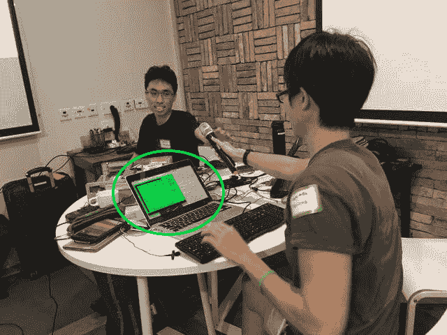](https://res.cloudinary.com/practicaldev/image/fetch/s--MYKPVk0n--/c_limit%2Cf_auto%2Cfl_progressive%2Cq_auto%2Cw_880/https://www.chenhuijing.cimg/posts/supersilly/neon-640.jpg)

一旦有了颜色，桌面环境似乎也稳定了下来，我们可以使用所有安装的应用程序而不会崩溃。我想是权衡吧。在这里的某个地方有一堂人生课。

## 演示时间

有相当多的团队，许多团队都有非常有趣和荒谬的想法。组织者可能会在未来的某个地方进行一次全面的总结，我不知道。当轮到我们的时候，我们有太多的事情要做，不能站在所有人面前。所以我们在圆桌会议上做了陈述。

<figcaption>而那双挥舞的手却伸出了</figcaption>

[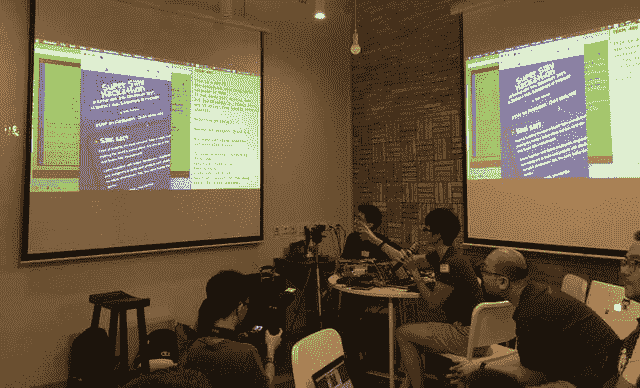](https://res.cloudinary.com/practicaldev/image/fetch/s--viKccUe9--/c_limit%2Cf_auto%2Cfl_progressive%2Cq_auto%2Cw_880/https://www.chenhuijing.cimg/posts/supersilly/presentation-640.jpg)

更新:发布会的视频已经发布。对于不是来自新加坡或马来西亚，不知道这种光荣的语言是什么的人来说，这是新加坡式英语听起来最经典的例子。

黑客马拉松的整体气氛非常轻松和有趣，因此人群的反应比典型的聚会更加热情。这本身并不是一件坏事，但在新加坡和马来西亚，普通的 meetup 观众(这是我的轶事经验，不可全信)非常保守，很少提问或评论。不过今晚不行😆。

最后，我们成功地获得了第三名的足够票数！给我和孔孟的点心！🎉我度过了最愉快的时光，我们设法实现了最初的目标，所以我认为这是成功的一天。和孟庚一起工作真的很棒，希望我们能很快再黑一些其他的老硬件。

<figcaption>486 队！</figcaption>

[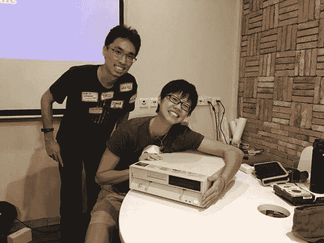](https://res.cloudinary.com/practicaldev/image/fetch/s--EGfuq7rQ--/c_limit%2Cf_auto%2Cfl_progressive%2Cq_auto%2Cw_880/https://www.chenhuijing.cimg/posts/supersilly/team486-640.jpg)

*最初发布于[www.chenhuijing.com](https://www.chenhuijing.com/blog/hardware-hacks-super-silly-hackathon/)2017 年 12 月 10 日。*