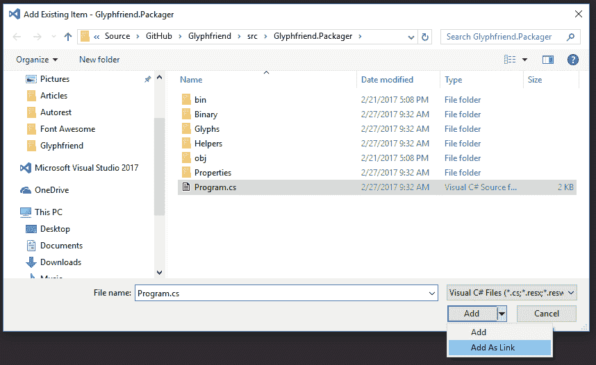
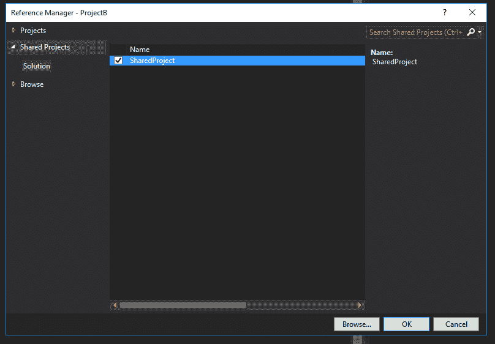

# 分享即关怀:在 ASP.NET 使用共享项目

> 原文：<https://dev.to/rionmonster/sharing-is-caring-using-shared-projects-in-aspnet-e17>

*这篇文章最初发表在[我的博客](http://rion.io)上。*

作为软件开发人员，复制粘贴一些代码或几个文件并把它们放在多个地方总是令人讨厌的。有几种不同的方法可以避免这种冗余，但是这篇文章将关注一个似乎不太经常被提及的方法:**共享项目**。

## 通过链接避免冗余

在介绍共享项目之前，我将简要回顾一下为什么要介绍共享项目本身，以及在它们发布之前，您可能已经完成了类似的行为。

随着 Visual Studio 在过去几年中跨平台的发展，出现了一个问题，即如何组织可以跨多个平台访问的代码，而不是简单地复制粘贴。答案就是传说中的“添加为链接”选项:

[T2】](https://res.cloudinary.com/practicaldev/image/fetch/s--6Zg3S-QV--/c_limit%2Cf_auto%2Cfl_progressive%2Cq_auto%2Cw_880/http://rion.io/conteimg/2017/03/add-as-link.PNG)

您可以简单地点击一个项目，选择添加现有文件选项，然后选择对话框中出现的“添加为链接”选项。这实际上会创建一个指向原始文件的指针，它会出现在两个项目中。

问题是——太乏味了。您一次只能选择一个文件，想象一下，如果您不得不跨多个平台引用多个文件，那该有多好？一想到这就足以让你的手腕发麻。

必须有一个更好的方法，以及建议的解决方案:共享项目。

## 什么是共享项目？

共享项目的概念是在 Visual Studio 2013 RC 2 中引入的，简而言之，允许您引用整个项目，而不是像类库那样只引用单个程序集。

[T2】](https://res.cloudinary.com/practicaldev/image/fetch/s--rpGV7OxU--/c_limit%2Cf_auto%2Cfl_progressive%2Cq_auto%2Cw_880/http://rion.io/conteimg/2017/03/shared-projects-in-solution.PNG)

这是如何工作的？项目中包含了我可能不想使用的所有类型的东西？如何处理共享项目中的引用？那些东西呢？

值得注意的是，术语“共享项目”也可以是“共享代码桶”，因为它更像是一个占位符项目，您可以在其中存储所有代码和其他文件，如资源。在编译时，任何引用这个共享项目的项目都将拥有所有的文件(包括文件夹结构等。)合并到它们中，然后它们将被编译，或者换句话说:

> 共享项目不会被单独编译，而是项目中的代码将被合并到引用它的每个程序集中，并在其中编译。

既然您已经对什么是共享项目有了一个相当不错的概念，那么让我们来看看如何在您的应用程序中使用它。

## 使用共享项目

共享项目就像其他文件或文件夹一样容易创建，通常只需要点击几下就可以启动并运行。

**要将共享项目添加到现有的解决方案中，右键单击该解决方案并选择“添加项目”，然后从 Visual C#选项卡中选择“共享项目:**

[T2】](https://res.cloudinary.com/practicaldev/image/fetch/s--QNNf2u8a--/c_limit%2Cf_auto%2Cfl_progressive%2Cq_auto%2Cw_880/http://rion.io/conteimg/2017/03/shared-project-example.PNG)

您将看到共享项目出现在解决方案资源管理器中，从这一点上，您可以开始向其中添加任何类型的文件。在这个例子中，我们将创建一个类，该类将公开一个我们希望在另外两个项目中可以访问的函数。

对于这个例子，我们将创建一个新的文件，试图添加，但不是很好:

```
namespace Common
{
    public static class Math
    {
        /// 
        /// An unreliable addition method
        ///
        public static int DefunctAdd(int x, int y)
        {
            return (x + y) + 3;
        }
    }
} 
```

Enter fullscreen mode Exit fullscreen mode

接下来，我们将在另一个项目中添加对此的引用。这与您过去习惯于添加引用的方式类似。**右键单击要在其中使用共享项目的项目，选择“添加引用”，并在左侧出现的“共享项目”选项卡下选择共享项目:**

[T2】](https://res.cloudinary.com/practicaldev/image/fetch/s--VQNHWDcI--/c_limit%2Cf_auto%2Cfl_progressive%2Cq_auto%2Cw_880/http://rion.io/conteimg/2017/03/adding-a-shared-project-as-a-reference.PNG)

在将它添加为引用之后，您现在可以简单地使用下面的代码在您的目标项目中访问这个方法:

```
var result = Common.Math.DefunctAdd(3, 7); 
```

Enter fullscreen mode Exit fullscreen mode

这里没什么特别的。这是你一直都能做到的事。好吧，让我们通过应用条件编译属性来增加一点趣味，让函数基于目标平台表现不同:

```
public static int DefunctAdd(int x, int y)
{
#if NETCOREAPP1_1
            return (x + y) + 3;
#else
            return (x + y) + 13;
#endif
} 
```

Enter fullscreen mode Exit fullscreen mode

由于该文件将由引用它的每个项目独立编译，我们可以在两个独立的应用程序中引用共享项目，并产生以下结果:

```
// .NET Core 1.1
Common.DefunctAdd(3, 7); // returns 13
// .NET Core 1.0
Common.DefunctAdd(3, 7); // returns 23 
```

Enter fullscreen mode Exit fullscreen mode

这是一个相当简单的例子，但是如果你正在构建一个跨平台的应用程序或者需要共享资源(例如图像、CSS、XAML 等),用例会扩展很多。)跨过他们。

现在你可能会问自己，我为什么要做这些？难道我不能用一个可移植的类库来完成这个任务吗？是的，你当然可以，但是这是解决你的问题的最好方法吗？

像在软件世界中一样，这要视情况而定，在下一节中，我们将比较这两种方法，看看它们有什么不同。

## 共享项目 vs 可移植类库

关键的区别在于如何编译这些实体，以及如何重用它们:

*   **可移植类库**按照你已经了解和期望的方式编译，重用的单位是汇编它(即你在你的其他项目中引用 YourLibrary.dll)。

*   共享项目本身不被编译，而是包含在项目中的代码在编译前被合并到引用共享项目的每个程序集中。因此，共享项目中的重用单元实际上是源代码本身(也就是说，您引用了一个想要包含在另一个项目中的代码“容器”)。

现在，共享项目的一个常见用例是，您必须构建一个面向多个平台的应用程序。通常，您可能会考虑构建一个可移植类库(PCL ),但是让我们来看看它与共享项目的区别:

|  | 共享项目 | 可移植类库 |
| **代码重用级别** | 源代码(例如，您引用了一个包含您想要使用的所有源代码的项目) | 组件(即引用 YourLibrary.dll 文件) |
| 编译时会发生什么？ | 共享项目中的所有源代码都被复制到每个引用的项目中，并在其中进行编译 | 这里没有什么新东西，它的编译和预期的一样 |
| **Visual Studio 支持** | 自 Visual Studio 2013 更新 2 以来 | 自从有时间以来 |
| **#IFDEF 支持** | 全力支持 | 不支持(因为每个平台都是单独编译的，必须通过 IoC 完成) |
| **。NET 框架支持** | 全力支持 | 有限(功能将基于目标平台的子集) |

## 我为什么要用一个对方？

在构建跨平台应用程序时，经常会遇到共享项目和可移植类库，这是理所当然的。

跨多个项目和潜在的不同平台和架构共享代码的想法非常吸引人。当你考虑将它扩展到不仅是代码，还有资源、XAML，甚至 Javascript、CSS 和其他客户端文件时，它真正展示了这些概念的力量。

虽然这两种机制都可以用来避免冗余，但首选项将取决于项目所需的特定重用级别(以及何时需要重用内容)。

由于共享项目涵盖了通常涉及可移植类库的大多数场景，因此在使用可移植类库之前，需要考虑以下几点:

*   在您的场景中，组装重要吗？如果这就是你需要分享的全部，那么 PCL 可能就可以了。
*   **除了一些 C#代码比如 Javascript 或者其他资源，还需要分享其他东西吗？**共享项目最适合这种情况。
*   您是否需要多个应用程序以不同的方式(通过不同的引用程序集或通过指令)编译相同的代码？你真的只能通过共享项目来实现这一点。
*   你知道你的目标是哪个版本的框架吗？如果是这样，那么可以使用一个可移植的类库。
*   需要代码分区，而不是共享一切？对于一个共享的项目，要么全有，要么全无(至少不用大费周章去忽略一些东西)，所以一个可移植的类库将允许你只共享你需要的东西。
*   **需要单元测试一切吗？**可移植类库将更好地帮助他们进行单元测试，因为共享项目将在多个项目中编译一个给定的文件(这可能导致不同的结果)。

因此——正如构建应用程序时的大多数事情一样，这要视情况而定。

## 关于共享项目的收尾思路

制表符还是空格？反应还是角度？共享项目还是可移植类库？所有这些都是在构建应用程序或做出与之相关的决策时常见的讨论，每个人都有自己对哪个是正确的看法。

> 就个人而言，我是共享项目的忠实粉丝，在我看来，它们比 PCL 更通用，当你可以使用它们时，允许你快速添加新的平台特定的特性，而没有大量不必要的复杂性。

然而，这是有代价的，尤其是当你不仅仅是共享代码，而是面向多个平台的时候。条件编译指令会使您的代码难以测试，这反过来会引入错误，直到您实际编译了应用程序后才知道这些错误。

因此，如果您只是需要跨业务应用程序共享一些核心类，或者需要跨多个平台共享功能，那么您可以尝试一下共享项目。正如在这篇文章中多次提到的，它们并不总是适用于每个人或每个场景，但是当它们合适的时候，我发现它们可以让你的生活变得更加轻松。