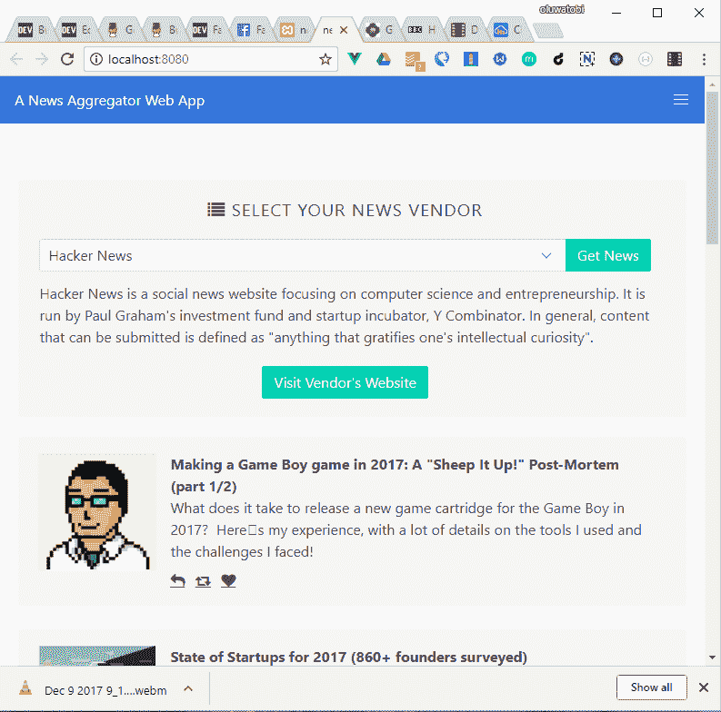

# 使用 VueJs 构建新闻聚合应用程序

> 原文:[https://dev . to/algorithm Sam/building-a-news-aggregation-application-using-vuejs-74p](https://dev.to/algorithmsam/building-a-news-aggregation-application-using-vuejs-74p)

所以最近我用 VueJs 做了很多实验，并尝试在 VueJs 中实现我能想到的任何东西。这是我想到的。

[T2】](https://res.cloudinary.com/practicaldev/image/fetch/s--RUn2hUXN--/c_limit%2Cf_auto%2Cfl_progressive%2Cq_auto%2Cw_880/http://res.cloudinary.com/algorithm-sam/image/upload/v1512812723/demo_tpslag.png)

在本文中，我们将构建一个新闻聚合应用程序，该应用程序的基本功能是，允许您从供应商列表中选择一个新闻供应商，从所选供应商检索新闻，并在 web 应用程序上显示新闻。谈够了，让我们开始吧。

我们将使用 Vue-cli 为我们的 Vue 应用程序生成一个启动模板。这是一个用于快速应用程序开发的工具，因为它创建了一个 Vue 应用程序的基本模式。但是首先我们需要安装 Vue 和 Vue-cli。

*   这个项目假设 javascript 的基础知识，它还假设你有一个与 newsapi.org 的 API 密钥，如果没有，请访问[newsapi.org](//newsapi.org)获得一个 API 密钥，然后继续。

要安装 Vue，Vue-cli 和 Vue-resource 让我们在终端中键入以下命令。

```
 $ npm install vue

$ npm install vue-resource

$ npm install --global vue-cli 
```

<svg width="20px" height="20px" viewBox="0 0 24 24" class="highlight-action crayons-icon highlight-action--fullscreen-on"><title>Enter fullscreen mode</title></svg> <svg width="20px" height="20px" viewBox="0 0 24 24" class="highlight-action crayons-icon highlight-action--fullscreen-off"><title>Exit fullscreen mode</title></svg>

完成后，我们需要创建/导航到我们的工作目录并运行下面的命令

```
$ vue-init webpack-simple 
```

<svg width="20px" height="20px" viewBox="0 0 24 24" class="highlight-action crayons-icon highlight-action--fullscreen-on"><title>Enter fullscreen mode</title></svg> <svg width="20px" height="20px" viewBox="0 0 24 24" class="highlight-action crayons-icon highlight-action--fullscreen-off"><title>Exit fullscreen mode</title></svg>

上述命令将使用 webpack-simple 模板创建一个新的应用程序，webpack-simple 模板附带了一些功能，如热重新加载、vue-loader 等。您可以从 vue-js 文档网站上阅读有关 web back 模板的更多信息。

在运行 vue-init 命令的当前工作目录中，输入以下命令。

```
# install dependencies and go!
$ npm install
$ npm run dev 
```

<svg width="20px" height="20px" viewBox="0 0 24 24" class="highlight-action crayons-icon highlight-action--fullscreen-on"><title>Enter fullscreen mode</title></svg> <svg width="20px" height="20px" viewBox="0 0 24 24" class="highlight-action crayons-icon highlight-action--fullscreen-off"><title>Exit fullscreen mode</title></svg>

进入命令后，我们应该准备好了。让我们开始编写应用程序。

基本上，除了根组件之外，应用程序将有两个组件，新闻组件和选择新闻组件。

新闻组件将控制网页上每篇新闻文章的外观，而选择新闻组件将控制选择新闻供应商的界面。

让我们从根组件 App.vue 开始。

我们必须将我们的子组件[selectNews，news]导入我们的根组件 App.vue。

```
 import Selectnews from './components/selectNews'
import News from './components/news' 
```

<svg width="20px" height="20px" viewBox="0 0 24 24" class="highlight-action crayons-icon highlight-action--fullscreen-on"><title>Enter fullscreen mode</title></svg> <svg width="20px" height="20px" viewBox="0 0 24 24" class="highlight-action crayons-icon highlight-action--fullscreen-off"><title>Exit fullscreen mode</title></svg>

然后，我们将导入的组件注册为根组件的子组件。

```
export default {
  name: 'app',
  components:{
    'select-news':Selectnews,
    'news':News

  },
 data () {
    return {
      source:'',
      articles:[]
    }
  } 
```

<svg width="20px" height="20px" viewBox="0 0 24 24" class="highlight-action crayons-icon highlight-action--fullscreen-on"><title>Enter fullscreen mode</title></svg> <svg width="20px" height="20px" viewBox="0 0 24 24" class="highlight-action crayons-icon highlight-action--fullscreen-off"><title>Exit fullscreen mode</title></svg>

此外，在 App.vue 组件的模板部分，我们需要指定希望子组件出现的位置。

```
 <div class="container" id="main_container">
        <select-news v-on:newVendor="newVendor"/>

        <news :articles="articles"/>
   </div> 
```

<svg width="20px" height="20px" viewBox="0 0 24 24" class="highlight-action crayons-icon highlight-action--fullscreen-on"><title>Enter fullscreen mode</title></svg> <svg width="20px" height="20px" viewBox="0 0 24 24" class="highlight-action crayons-icon highlight-action--fullscreen-off"><title>Exit fullscreen mode</title></svg>

在我们的标记中，您会注意到 v-on 指令的使用，它用于将事件侦听器附加到 Vue 元素。在上面的标记中，我们正在侦听 select-news 组件上的 newVendor 事件。注意:这是一个我们将在这个应用程序中使用的自定义事件。该事件在 select-news 组件上触发，并在根组件上处理。

基本上，我们在这里所做的是从 select-news 组件中冒泡 newVendor 事件，并使用$http 方法，该方法通过我们之前引入的 vue-resource 对我们可用。

```
 methods:{
    newVendor:function(value){
      this.source=value;
      this.$http.get('https://newsapi.org/v2/top-headlines?                
       sources='+this.source+'&apiKey={your api key}')
      .then(function(response){
        return JSON.parse(response.bodyText);
      })
      .then(function(response){
        this.articles=response.articles;
      })
      .catch(function(err){
        console.log(err);
      })
    }
  } 
```

<svg width="20px" height="20px" viewBox="0 0 24 24" class="highlight-action crayons-icon highlight-action--fullscreen-on"><title>Enter fullscreen mode</title></svg> <svg width="20px" height="20px" viewBox="0 0 24 24" class="highlight-action crayons-icon highlight-action--fullscreen-off"><title>Exit fullscreen mode</title></svg>

现在让我们前往 selectNews 组件，看看我们得到了什么。

selectNews 组件的标记如下所示

```
 <select name="country" @change="sourceChanged">
        <option v-for="(source,index) in sources" :key="index"             
           :value="source.name">{{source.name}} </option>
     </select>

     <div v-if="source" class="selectFooter">
       <p class="vendor-information">
         {{ source.description }}
       </p>
      <p class="controls"> <a class="button is-primary" target="_blank" 
       :href="source.url"> Visit Vendor's Website</a> </p>
</div> 
```

<svg width="20px" height="20px" viewBox="0 0 24 24" class="highlight-action crayons-icon highlight-action--fullscreen-on"><title>Enter fullscreen mode</title></svg> <svg width="20px" height="20px" viewBox="0 0 24 24" class="highlight-action crayons-icon highlight-action--fullscreen-off"><title>Exit fullscreen mode</title></svg>

```
<script>
    export default {
  name: 'selectNews',
  data () {
    return {
      description:'',
      sources:[],
      source:''
    }
  },
  methods:{

    sourceChanged:function(evt){

      var that=this;
       Object.values(this.sources).map(function(elem,index){
            if(elem.name==evt.target.value){
              that.source=elem;
           }
       });
      this.$emit('newVendor',this.source.id);
    }
  },
    created:function(){
    this.$http.get('https://newsapi.org/v1/sources?language=en')
    .then(function(response){
      if(response.body.status!='ok'){
        throw new Error('Could not fetch the list of supported sources');
      }
      return JSON.parse(response.bodyText);
    }).then(function(response){
        this.sources=response.sources;
    }).catch(function(err){
      console.log(err.stack);
    });
  }
}
</script> 
```

<svg width="20px" height="20px" viewBox="0 0 24 24" class="highlight-action crayons-icon highlight-action--fullscreen-on"><title>Enter fullscreen mode</title></svg> <svg width="20px" height="20px" viewBox="0 0 24 24" class="highlight-action crayons-icon highlight-action--fullscreen-off"><title>Exit fullscreen mode</title></svg>

在上面的标记中，每当从下拉列表中选择一个新的供应商时，就会调用 souceChanged 函数，该函数主要做的是收集所选供应商的唯一标识符，然后发出一个名为 new vendor 的自定义事件，我们将在根/父组件中捕获并处理该事件。

上面创建的函数是 Vue 提供给我们的许多生命周期钩子中的一个，这个方法在组件挂载之前运行，这是一个执行组件中任何操作/逻辑的好地方，比如我们上面做的 Api 调用。

做完这些，现在让我们检查新闻组件的代码。

下面是标记

```
 <ul class="container is-semi-fluid">
              <li v-for="article in articles" :key="article.url" class="notification">
                <article class="media">
                  <figure class="media-left">
                    <a :href="article.url" class="image is-128x128" target="_blank">
                      
                    </a>
                  </figure>
                  <div class="media-content">
                    <div class="content">
                      <p>
                        <strong>{{article.title}}</strong>
                        <br>
                        {{article.description}}
                      </p>
                    </div>
                    <nav class="level is-mobile">
                      <div class="level-left">
                        <a class="level-item">
                          <span class="icon is-small"><i class="fa fa-reply"></i></span>
                        </a>
                        <a class="level-item">
                          <span class="icon is-small"><i class="fa fa-retweet"></i></span>
                        </a>
                        <a class="level-item">
                          <span class="icon is-small"><i class="fa fa-heart"></i></span>
                        </a>
                      </div>
                    </nav>
                  </div>
                </article>
              </li>
      </ul> 
```

<svg width="20px" height="20px" viewBox="0 0 24 24" class="highlight-action crayons-icon highlight-action--fullscreen-on"><title>Enter fullscreen mode</title></svg> <svg width="20px" height="20px" viewBox="0 0 24 24" class="highlight-action crayons-icon highlight-action--fullscreen-off"><title>Exit fullscreen mode</title></svg>

在上面的标记中，我们使用 v-for 指令遍历了一个新闻文章列表。这基本上是允许我们重复包含在父元素中的相同标记，即包含 v-for 元素的元素，
，然后我们可以在列表项块中使用每次迭代返回的数据。

现在让我们检查这个组件的脚本部分

```
 <script>
export default {
  name: 'news',
  props: ['articles'],

  data () {
    return {

    }
  }
}
</script> 
```

<svg width="20px" height="20px" viewBox="0 0 24 24" class="highlight-action crayons-icon highlight-action--fullscreen-on"><title>Enter fullscreen mode</title></svg> <svg width="20px" height="20px" viewBox="0 0 24 24" class="highlight-action crayons-icon highlight-action--fullscreen-off"><title>Exit fullscreen mode</title></svg>

我们基本上只接受一个名为 articles 的属性，它是来自根组件的一个数组，然后遍历该数组并输出各个内容。

因此，阅读完本文后，我们应该有了新闻聚合应用程序的工作原型。我们可以根据个人喜好的风格，然后准备测试。

这个项目的完整源代码可以在我的 github repo 中的[处找到](https://github.com/algorithm-sam/news-aggregator)