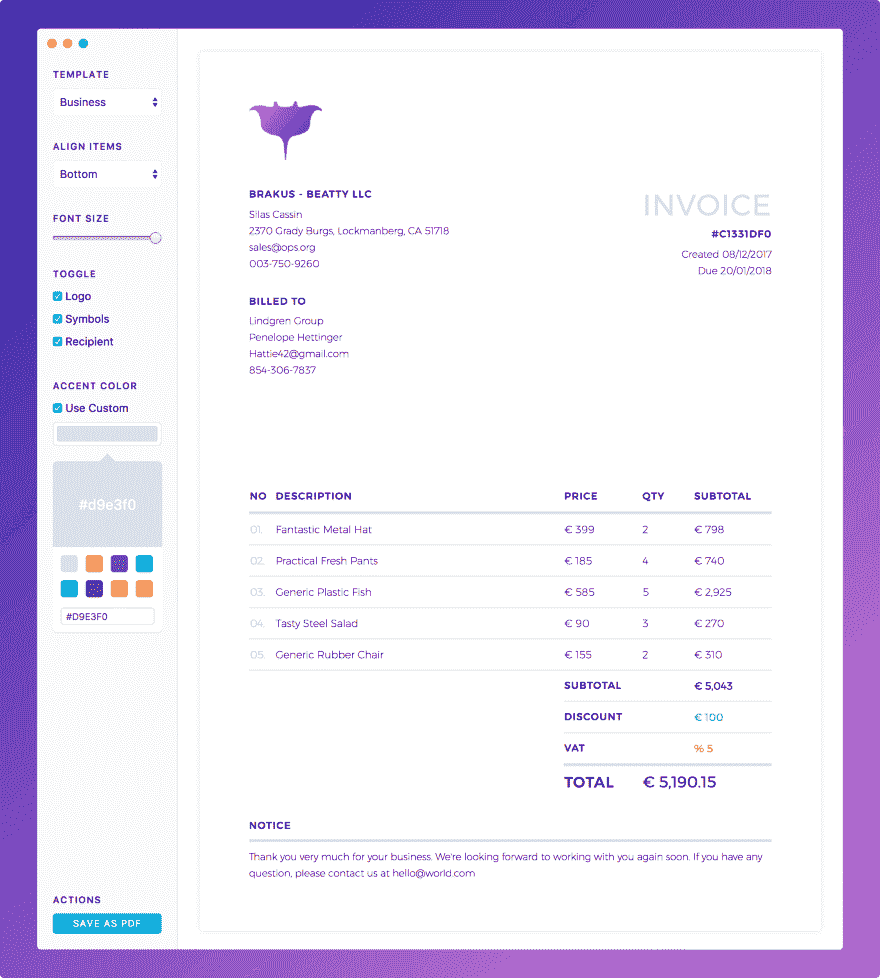

# 介绍 Manta -一个灵活的自由职业者发票应用程序。[免费赠品]

> 原文：<https://dev.to/hql287/introducing-manta---a-flexible-invoicing-app-for-freelancers-freebie-43k>

[T2】](https://res.cloudinary.com/practicaldev/image/fetch/s--pVWt1Jyh--/c_limit%2Cf_auto%2Cfl_progressive%2Cq_auto%2Cw_880/https://thepracticaldev.s3.amazonaws.com/i/zm7ew4bqq2u9n9afx03r.jpg)

所以在多次拖延之后😅，我终于完成了这个项目，今天想和大家分享一下。

[Manta](https://manta.life) 是一款灵活的发票桌面应用程序，允许您快速创建漂亮的发票，而无需使用 Photoshop、InDesign 或 Sketch 等设计软件。

### 为什么？

我决定开发这个工具的主要原因是，我需要一个简单的工具来创建好看的发票、预算和收据，但却找不到一个适合我需要的工具。我不以开发票为生，但我确实不时需要它。所以对我来说，一个理想的开票 app 只需要擅长一件事，而且只擅长一件事，就是开发票。

我真的不需要一个成熟的记账或会计软件，我相信有很多人，比如自由设计师、开发人员、摄影师或作家...也有这样的需要。

### 出现了问题。

我发现的大多数(如果不是全部)发票产品都有问题，它们归结为两件事**复杂性**和**隐私**:

*   现在大多数的发票产品都是基于网络的，这意味着需要互联网连接。
*   如果连接不好，会危及整个体验
*   仅仅为了在几个月内开一两张发票而维持一个账户(通常会产生月费)是没有意义的。
*   当然，有一些开源产品可以自托管，但它回避了问题:谁来安装产品？谁来维护服务器？谁将支付费用？...
*   当你使用网络服务时，大多数时候，无论你是否需要，你都在放弃你的数据。财务数据是敏感的，我相信除了你自己，没有人应该知道你的数据。

### 目标。

所以我知道曼塔需要满足这些标准:

*   🚀快！！！。
*   👍友好的用户界面和 UX。
*   🎉有好看的模板。
*   🔒不接触用户的数据。
*   💰免费！:)

### 结果。

经过几个月的设计、开发和 2 个原型，最终的蝠鲼具有以下特点:

*   🎚灵活的形式。必要时可以切换字段。
*   🏗拖放以重新排序项目。这使得编辑更容易。
*   📐允许使用 SVG 的标志->更好的印刷。
*   🎨2 定制设计和高度可定制的模板。将在未来版本中添加更多内容。
*   📊导出 PDF 用于打印或电子邮件。
*   🔒隐私。您的数据会留在属于它的地方。
*   💯完全免费。

您可以去[网站下载最新版本](https://manta.life)并立即试用。

### 还有一件事。

我还决定开源这个项目，这样每个人都可以让它变得更好，让 Manta 以他们想要的方式工作。如果你感兴趣，这里有回购:[https://github.com/hql287/Manta](https://github.com/hql287/Manta)

该项目从昨天开始就一直停留在 GitHub 趋势中，现在它在所有语言中排名前 10，在 JavaScript 中排名前 3。对于不怎么做 OSS 的人来说，我觉得这很鼓舞人心。所以非常感谢你的爱。它对我来说真的很重要:)

我坚信曼塔可以节省你的时间，也可能给你的客户留下深刻印象。

请尝试一下，我很想听听你的想法。随时欢迎反馈、想法和建议。

祝你周末愉快！:)