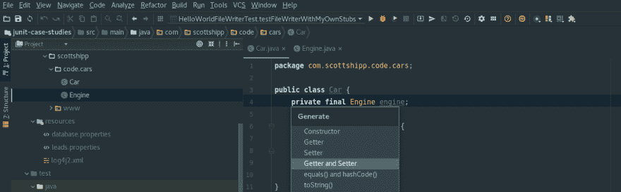

# 尽可能避免使用 getters 和 setters

> 原文:[https://dev . to/scottshipp/avoid-getters-and-setters-anywhere-possible-c8m](https://dev.to/scottshipp/avoid-getters-and-setters-whenever-possible-c8m)

[](https://res.cloudinary.com/practicaldev/image/fetch/s--Sj6eccpk--/c_limit%2Cf_auto%2Cfl_progressive%2Cq_auto%2Cw_880/https://thepracticaldev.s3.amazonaws.com/i/m1pjbvj6wr7paw0z2sfg.png) 
**Noooo！！！不要点击生成 getters 和 setters 选项！！！**

我喜欢这条规则:“不要使用访问器和赋值器。”就像任何好的规则一样，这条规则注定要被打破。但是什么时候？

首先，让我明确一下我要说的话:*在考虑了一系列更好的选择之后，将 getter 和 setter 添加到 OO 类应该是最后的手段。*我相信仔细分析会得出这样的结论:在大多数情况下，*getter 和 setters 是有害的*。

### 有什么危害？

首先让我指出，我所说的“伤害”可能根本不是什么伤害。下面是，在某些情况下，完全合理的类:

```
// Car1.java

public class Car1 {
  public Engine engine;
} 
```

<svg width="20px" height="20px" viewBox="0 0 24 24" class="highlight-action crayons-icon highlight-action--fullscreen-on"><title>Enter fullscreen mode</title></svg> <svg width="20px" height="20px" viewBox="0 0 24 24" class="highlight-action crayons-icon highlight-action--fullscreen-off"><title>Exit fullscreen mode</title></svg>

但是，请注意，当你看到这样的东西时，你可能会感觉到胃部紧缩，头发竖起，肌肉紧张。

现在，我想指出的是，在那个类(一个具有公共类成员的公共类)和下面的类(一个具有私有成员的公共类，由 getters 和 setters 公开)之间没有有意义的功能差异。在这两个班级中，*Car1.java*和*Car2.java*，我们得到了基本相同的结果。

```
// Car2.java

public class Car2 {
  private Engine engine;

  public Engine getEngine() {
    return engine;
  }

  public void setEngine(Engine engine) {
    this.engine = engine;
  }
} 
```

<svg width="20px" height="20px" viewBox="0 0 24 24" class="highlight-action crayons-icon highlight-action--fullscreen-on"><title>Enter fullscreen mode</title></svg> <svg width="20px" height="20px" viewBox="0 0 24 24" class="highlight-action crayons-icon highlight-action--fullscreen-off"><title>Exit fullscreen mode</title></svg>

为了展示这一点，我在*Car1.java*或*Car2.java*:
中读写引擎

```
// Car1 member read and write
Car1 car1 = new Car1();
logger.debug("Car1's engine is {}.", car1.engine);
car1.engine = new HemiEngine();

// Car2 member read and write
Car2 car2 = new Car2();
logger.debug("Car2's engine is {}.", car2.getEngine());
car2.setEngine(new HemiEngine(); 
```

<svg width="20px" height="20px" viewBox="0 0 24 24" class="highlight-action crayons-icon highlight-action--fullscreen-on"><title>Enter fullscreen mode</title></svg> <svg width="20px" height="20px" viewBox="0 0 24 24" class="highlight-action crayons-icon highlight-action--fullscreen-off"><title>Exit fullscreen mode</title></svg>

这里的要点是，我能和*Car2.java、*做的任何事情，我都能和*、Car1.java、*做，反之亦然。这很重要，因为我们被教导当我们看到 Car1.java 时会感到恶心。我们看到公众坐在那里，我们说，*不安全！* *发动机*是*不是*受什么保护！任何人都可以做任何事！aaaaaaaagggghhhhh！

然而，由于某种原因，当我们看到 Car2.java 时，我们松了一口气。很抱歉，我个人认为这很有趣，因为这两种东西的保护措施完全相同(不存在)。

### 会出什么差错？

以下是直接公开单个私有成员、同名且不提供其他功能的公共 getters 和 setters 的一些缺点。

#### getter 和 setters 都是孤立变化的假保单

getter 和 setter 的一个假定的优点是，万一类成员的类型需要更改，可以通过使现有的 getter 简单地从内部类型转换为先前公开的类型，将更改限制在类内部。

```
// Car2.java, engine changed to motor

public class Car2 {
  private Motor motor;

  public Engine getEngine() {
    return convertToEngine(motor);
  }

  public void setEngine(Engine engine) {
    this.motor = convertToMotor(engine);
  }
} 
```

<svg width="20px" height="20px" viewBox="0 0 24 24" class="highlight-action crayons-icon highlight-action--fullscreen-on"><title>Enter fullscreen mode</title></svg> <svg width="20px" height="20px" viewBox="0 0 24 24" class="highlight-action crayons-icon highlight-action--fullscreen-off"><title>Exit fullscreen mode</title></svg>

我的问题是，工作中的程序员多久不得不这样做一次？我不记得在我做软件的这些年里曾经这样做过。我从来没有利用过 getters 和 setters 提供的假保险单。

此外，如果`engine`从一开始就没有公开过(假设它是私有的或者是包私有的)，那么这个争论就变得毫无意义。只需公开行为，而不是状态，您永远不需要担心更改实现的灵活性。

这个私有成员不应该被暴露的认识引发了另一个认识，即这个参数是重复的。getter 和 setters 公开私有成员，并把它们的存在建立在私有成员被公开的基础上。

### getter 和 setters 公开实现细节

假设我只给你下面这个汽车对象的 API:

```
 _________________________________
| Car                             |
|---------------------------------|
| + getGasAmount(): Liters        |
| + setGasAmount(liters: Liters)  |
|_________________________________| 
```

<svg width="20px" height="20px" viewBox="0 0 24 24" class="highlight-action crayons-icon highlight-action--fullscreen-on"><title>Enter fullscreen mode</title></svg> <svg width="20px" height="20px" viewBox="0 0 24 24" class="highlight-action crayons-icon highlight-action--fullscreen-off"><title>Exit fullscreen mode</title></svg>

如果你假设这是一辆以升为单位的汽油动力车，那么你 99.999%的时间都是正确的。这真的很糟糕，这也是 getters 和 setters 暴露实现/违反封装的原因。现在这段代码很脆弱，很难修改。如果我们想要一辆氢燃料汽车呢？我们现在必须抛弃整个汽车类。如果有像`fillUp(Fuel fuel)`这样的行为方法就更好了。

诸如此类的事情就是著名的图书馆有可怕的遗留类的原因。你有没有注意到大多数语言都有一个`Dictionary`数据结构，但在 Java 中它被称为`Map`？`Dictionary`实际上是在 JDK 1.0 中引入的一个接口，但它有问题，最终不得不由`Map`取代。

### Getters 和 setters 实际上是危险的

让我给你讲一个关于一个朋友的故事。 OK？我说的一个朋友！！！

有一天这位朋友上班，发现世界各国几十个知名网站都有母公司主网站的页眉和导航(不是自己的)，而且都在用*英式英语*。运营团队疯狂地重启全球数百台服务器，因为在这些服务器运行的最初半小时左右，一切运行正常。然后(嘭！)突然会发生一些事情，使整个事情变得不顺利。

罪魁祸首是一个 *setter 方法*,它深入到所有这些不同站点都在使用的共享平台的内部。一小段按时间表运行的代码碰巧在这次失败后更新了，通过调用 setter 改变了决定站点标题和语言的基本值。

如果你只有一个吸气剂，事情可能会一样糟糕。至少在 Java 中，从 getter 返回一个引用类型会将该引用提供给调用者，现在调用者可以以意想不到的方式操纵它。让我来演示一下。

```
public class Debts {
  private List<Debt> debts;

  public List<Debt> getDebts() {
    return debts;
  }
} 
```

<svg width="20px" height="20px" viewBox="0 0 24 24" class="highlight-action crayons-icon highlight-action--fullscreen-on"><title>Enter fullscreen mode</title></svg> <svg width="20px" height="20px" viewBox="0 0 24 24" class="highlight-action crayons-icon highlight-action--fullscreen-off"><title>Exit fullscreen mode</title></svg>

好的，这似乎很合理。我需要能够看到一个人的债务给他们一个声明。啊？你说什么？现在可以加债了？妈的！怎么会这样！

```
Debts scottsDebts = DebtTracker.lookupDebts(scott);
List<Debt> debts = scottsDebts.getDebts();

// add the debt outside scotts debts, outside the debt tracker even
debts.add(new Debt(new BigDecimal(1000000))); 

// prints a new entry with one million dollars
DebtTracker.lookupDebts(scott).printReport(); 
```

<svg width="20px" height="20px" viewBox="0 0 24 24" class="highlight-action crayons-icon highlight-action--fullscreen-on"><title>Enter fullscreen mode</title></svg> <svg width="20px" height="20px" viewBox="0 0 24 24" class="highlight-action crayons-icon highlight-action--fullscreen-off"><title>Exit fullscreen mode</title></svg>

Eek！

防止这种情况的一种方法是返回一个副本。另一种方法是拥有一个不可变的成员。不过，最好的方法是不要以任何方式公开成员，而是在类中引入操作成员的行为。这实现了实现的完全隔离，并且只创建了一个更改的地方。

### 当吸气器有意义

等一下！如果访问器和变异器有这么多缺点，为什么还要使用它们呢？

我确信只返回一个类成员的 getters 和 setters 几乎没有意义。但是你可以写一些东西*来关闭*getter/setter 功能，只要你确实在那个方法中做了一些事情。

两个例子:

*   在 setter 中，在根据一些输入更新这个对象的状态之前，我们验证输入。输入验证是附加功能。

*   getter 的返回类型是一个*接口。*因此，我们将实现从公开的接口中分离出来。

看，我在这里真正提倡的是对 getters 和 setters 的不同立场和哲学。与其说*永远不要使用访问器和赋值器，*我想给你一个在使用一个之前我尝试用尽的选项列表:

*   我的“默认”是从私有的 final 成员开始，只由构造函数设置。没有 getter 或 setter！

*   如果另一个类绝对需要看到这个成员，我会考虑为什么。我尝试看看是否有一个行为可以公开，并为该行为创建一个方法。

*   如果出于某种原因绝对有必要，那么我放宽到 package-private(在 Java 中),只将成员暴露给同一个包中的其他类，而不是更多。

*   好的，那么数据用例呢？实际上，我可能需要一个对象来跨越某种接口边界传递数据(比如说文件系统、数据库、web 服务或其他什么)。我仍然不和 getters 和 setters 混在一起。我创建了一个包含所有包私有成员的类，我把它当作一个属性包来使用。我试图在应用程序的边界将这些限制在它们自己的包和层中。

*   我会考虑在一个公共 API 中为数据用例创建一个 getter 和 setter，比如说我正在编写一个库，打算在许多其他应用程序中作为一个依赖项使用。但我只会在穷尽了所有这些清单项目之后才会考虑它。

### 智慧大师

简短的附言。显然，世界上有关于 getters 和 setters 的争论。很重要的一点是要知道，显然有一个像 Robert c .(“Bob 叔叔”)Martin 这样的“大师”阵营支持避免 getters 和 setters。在《干净的代码》一书中，马丁在第 6 章中写道:

> Beans 拥有由 getters 和 setters 操作的私有变量。beans 的准封装似乎让一些 OO 纯粹主义者感觉更好，但通常不会提供其他好处。

Josh Bloch 在 *Effective Java、* *Item 14* 中有一个微妙的立场，即稍微支持公共类的 getters 和 setters，稍微反对其他类。他最后基本上说他真正关心的是可变性，这一点我在上面提到过:

> 总之，公共类不应该公开可变字段。对于公共类来说，公开不可变字段的危害较小，尽管仍然有问题。然而，有时包私有或私有嵌套类公开可变或不可变的字段是可取的。

#### 进一步阅读

这里有一些来自比我聪明的人的有用的想法。

[告诉，不要问](https://pragprog.com/articles/tell-dont-ask)

[为什么 getter 和 setter 方法是邪恶的](https://www.javaworld.com/article/2073723/core-java/why-getter-and-setter-methods-are-evil.html)

[访问者是邪恶的](http://wiki.c2.com/?AccessorsAreEvil)