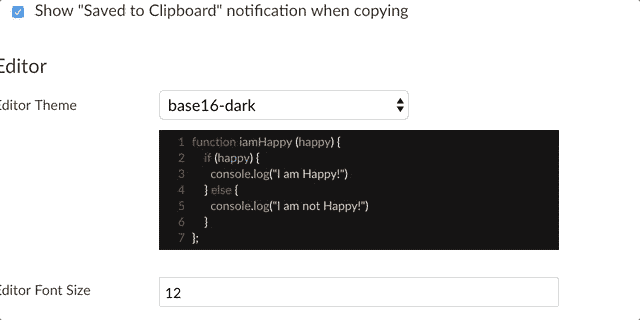

# 用 CodeMirror 制作时尚的编辑器。

> 原文:[https://dev . to/Daniel 123/make-the-style-editor-with-code mirror-bi2](https://dev.to/daniel123/make-the-stylish-editor-with-codemirror-bi2)

我一直在使用 Codemirror 制作一个名为 [Boostnote](https://github.com/BoostIO/Boostnote) 的 markdown 编辑器。
使你能够在编辑器中切换主题，在 Markdown 预览中切换代码块，我在这篇文章中写了如何实现这个功能。

## 特征

*   在 Boostnote 的 markdow 预览中的编辑器和代码块中切换主题
*   用户可以选择自己喜欢的主题。

[T2】](https://res.cloudinary.com/practicaldev/image/fetch/s--nj-snNQp--/c_limit%2Cf_auto%2Cfl_progressive%2Cq_66%2Cw_880/https://thepracticaldev.s3.amazonaws.com/i/cshkx1chcbm25rskcghe.gif)

## 如何制作

**①安装代码镜。**

由于我们在制作 Boostnote 时主要使用 React，所以使用 npm 安装包。
`npm install codemirror --save`

**②检查已安装的 codemirror 包的内容。**T3`cd node_modules/codemirror/theme`

许多种类的主题是自动安装的。

它们和这里的一样。[https://github.com/codemirror/CodeMirror/tree/master/theme](https://github.com/codemirror/CodeMirror/tree/master/theme)

**③介绍已安装的主题！**
1 .默认

2.3024 日

3.3024 夜

4 . abcdef
[T3】](https://res.cloudinary.com/practicaldev/image/fetch/s--YOdVcwUo--/c_limit%2Cf_auto%2Cfl_progressive%2Cq_auto%2Cw_880/https://cdn-images-1.medium.com/max/1600/1%2AAcycwSf3UGbNhSqDC2hLAQ.png)

5 .氛围-移动

6 .环境 

7 . base 16-黑暗

8.base16-light

9 .贝斯平
[T3】](https://res.cloudinary.com/practicaldev/image/fetch/s--7cvaFW-l--/c_limit%2Cf_auto%2Cfl_progressive%2Cq_auto%2Cw_880/https://cdn-images-1.medium.com/max/1600/1%2AJbn7ZhzWH8rBfm-EE6a7Fw.png)

10 .黑板

11 .钴

12.colorforth

13 .德拉库拉

14 .双色调-暗

15 .双色调光

16 .日食

17 .优雅的

18 .二郎神

19 .跳房子
[T3】](https://res.cloudinary.com/practicaldev/image/fetch/s--6d39jcGa--/c_limit%2Cf_auto%2Cfl_progressive%2Cq_auto%2Cw_880/https://cdn-images-1.medium.com/max/1600/1%2AwbQ0XZ-7qFadn8fjkruUqg.png)

20 .编码器

21 .同位素
[T3】](https://res.cloudinary.com/practicaldev/image/fetch/s--WV9LRpmG--/c_limit%2Cf_auto%2Cfl_progressive%2Cq_auto%2Cw_880/https://cdn-images-1.medium.com/max/1600/1%2A7qRCWrMmJF_oincElQtkTQ.png)

22 .稍暗

23 . liqui byte
[T3】](https://res.cloudinary.com/practicaldev/image/fetch/s--zwYo30M8--/c_limit%2Cf_auto%2Cfl_progressive%2Cq_auto%2Cw_880/https://cdn-images-1.medium.com/max/1600/1%2An4OkjRWjdWYmpIt8v-zjeg.png)

24 .材料

25.mbo
！25]([https://cdn-images-1.medium.com/max/1600/1*O-UBKKw-7t _ ehrmxg 8 p-g . png](https://cdn-images-1.medium.com/max/1600/1*O-UBKKw--7t_EhRMXG8p-g.png))

26 . MDN-like
[T3】](https://res.cloudinary.com/practicaldev/image/fetch/s--zdR2tC-I--/c_limit%2Cf_auto%2Cfl_progressive%2Cq_auto%2Cw_880/https://cdn-images-1.medium.com/max/1600/1%2AXQN9HS0y5fmFJAWpqqdULQ.png)

27 .午夜

28 .单凯 

29 .整齐的

30 . neo
[T3】](https://res.cloudinary.com/practicaldev/image/fetch/s--U7hgKfkD--/c_limit%2Cf_auto%2Cfl_progressive%2Cq_auto%2Cw_880/https://cdn-images-1.medium.com/max/1600/1%2AfBdx9j5Mr89ju7-J3vQoNQ.png)

31 .夜晚

32 . panda-语法

33 .黑暗

34 .等光

35 .深色粉彩

36 .铁路运输

37 .卢布(t0)

38.seti

39 .日晒雨淋的黑暗

1.  曝晒灯

41 .矩阵

42 .明日之夜

43 .明晚八十年代

44 . ttcn
[T3】](https://res.cloudinary.com/practicaldev/image/fetch/s--iavblUe---/c_limit%2Cf_auto%2Cfl_progressive%2Cq_auto%2Cw_880/https://cdn-images-1.medium.com/max/1600/1%2AzDZLWkjRkLyJ3mEQdeyyMw.png)

45 .暮色

46 .活力墨

47 . xq-黑暗

48.xq-light

49.yeti

50.zenburn

仅此而已；)

CodeMirror docs 在这里是。

享受 CodeMirror 和 [Boostnote](https://boostnote.io/) ！

* * *