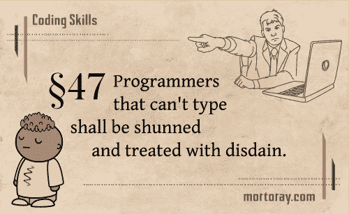

# 不会打字的程序员应该被避开，受到鄙视。

> 原文:[https://dev . to/mortoray/programmers-than-cant-type-shall-shun-and-treat-with the-鄙夷-3p6](https://dev.to/mortoray/programmers-that-cant-type-shall-be-shunned-and-treated-with-disdain-3p6)

[T2】](https://res.cloudinary.com/practicaldev/image/fetch/s--DNCCzzqU--/c_limit%2Cf_auto%2Cfl_progressive%2Cq_auto%2Cw_880/https://i.imgur.com/tOomtOg.png)

你知道，学习如何打好字，而不是不停地看着键盘和使用你所有的手指，对任何整天在键盘上的人来说都是一项基本技能。每当我遇到不会打字的程序员时，我就很痛苦。

我觉得是很多同事的挫败点。你想帮助某人，但看着他们不停地敲击键盘试图让自己的想法平静下来并不有趣。

我最近做了很多采访，这是一个反复出现的问题。一些受访者根本不会做这个问题，因为他们不能正确输入。即使他们的问题解决得还可以，我也会有不好的印象，因为产生代码需要太长的时间。

你有什么想法？

*注:*如果没说清楚，这些小漫画是为了漫画效果而夸张的。我有一整个系列。我决定将这些讨论作为系列的一点背景。很明显，我从不提倡对某人的真正蔑视。