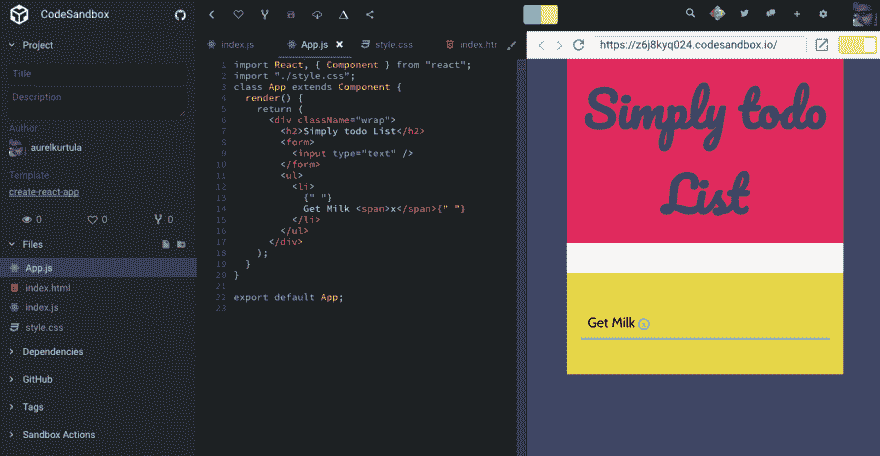

# React 简介

> 原文：<https://dev.to/aurelkurtula/introduction-to-react-532>

启动 react 项目有许多方法。如果您对终端和 npm/yarn 有信心，您只需要全局安装`create-react-app`包，然后使用它来创建您的 react 项目，如下所示:

```
create-react-app todo-app 
```

Enter fullscreen mode Exit fullscreen mode

然而，对于那些对此感到不舒服的人，你可能会喜欢玩 [codesandbox](https://codesandbox.io/s) ，只需选择 react，我们就可以开始了。这就是我正在做的，所以跟着走。

在`./index.js`中，我们有下面的代码，在整个基础教程中不会改变

```
import React from "react";
import ReactDOM from "react-dom";
import App from "./App";
ReactDOM.render(<App />, document.getElementById("root")); 
```

Enter fullscreen mode Exit fullscreen mode

我们正在导入两个包:`react`和`react-dom`。可以清楚的看到，`render`是`react-dom`提供的方法之一。它获取组件`App`并将其呈现在浏览器中，在 id 为`root`的节点内

`root`位于`index.html`内部

## 创建第一个组件

在第 3 行中，我们导入了一个`App`组件。

它还不存在，所以让我们创建`./App.js`并添加以下代码

```
import React, { Component } from "react";
import "./style.css";
class App extends Component {
  render() {
    return (
      <div className="wrap">
        <h2>Simply todo List</h2>
        <form>
          <input type="text" />
        </form>
        <ul>
          <li>Get Milk <span>x</span></li>
        </ul>
      </div>
    );
  }
}
export default App; 
```

Enter fullscreen mode Exit fullscreen mode

`App`是一个简单的类，从 react 的`Component`父类扩展而来。这样做，它得到了诸如`render`之类的方法，用于返回 JSX，从上面的内容判断，这是一个简单的 html——但是具有扩展的功能，我们将在后面看到。

最后，请注意，我们如何在组件中直接导入常规 css，这理想地给了我们完全模块化每个组件的能力。

## 结果至此

到目前为止，我们已经创建了一个简单的表单和一个包含一个条目的无序列表。最终结果会是这样的

[T2】](https://res.cloudinary.com/practicaldev/image/fetch/s--lDeycPlH--/c_limit%2Cf_auto%2Cfl_progressive%2Cq_auto%2Cw_880/https://thepracticaldev.s3.amazonaws.com/i/hp3t0ot5o2mgxhbeu4e3.png)

## 工作状态

从我们的`App`组件返回的内容只是静态 html，不是很有用。然而，react 类组件能够创建本地状态，这将使渲染的 JSX 更加动态。让我们更改`App`组件以利用本地状态。

初始状态在类构造函数中设置，可通过所有类方法访问

```
class App extends Component {
  constructor(props){
    super(props)
    this.state = {
      title: 'simple Todo List',
      items: [
        'Get milk',
        'Boil water',
        'Bake tea'
      ]
    }
  }
  ... 
```

Enter fullscreen mode Exit fullscreen mode

接受一个对象，它的内容可以是我们想要的任何东西。所以我们指定了一个标题和一个条目数组。构造函数将`props`作为一个参数，并且必须调用`super(props)`,以便我们的`App`类从父类继承数据(T4 对象),也就是所谓的超类。

现在，让我们编辑 JSX，在适当的地方呈现州数据

```
 render() {
    return (
      <div className="wrap">
        <h2>{this.state.title}</h2>
        <form>
          <input type="text" />
        </form>
        <ul>
            {
              this.state.items.map( (item,id)=>
                <li key={id}>{item}</li>)
            }
        </ul>
      </div>
    );
  }
} 
```

Enter fullscreen mode Exit fullscreen mode

请注意，在花括号中，我们能够运行纯 JavaScript 来遍历状态中的`items`数组。

两个 when things there: `this.state` get's 我们之前指定的状态对象。而且，每次我们遍历一个列表时，reach 都需要在`li`标签中使用唯一的`key`，这样 Reach 就可以精确定位哪里发生了变化，并更快地修改 DOM。

## 通过用户动作修改状态

我们现在能够根据用户输入操作状态。

我们上面呈现的表单有两个可能的动作。我们可以在`input`字段中绑定一个`onChange`事件，在实际表单上绑定一个`onSubmit`事件。

```
class App extends Component {
  ....
  render() {
    return (
      <div className="wrap">
        ..
        <form onSubmit={this.submitItem}>
          <input type="text" onChange={this.inputChanged} />
        </form>
        ..
      </div>
    );
  }
} 
```

Enter fullscreen mode Exit fullscreen mode

上面我们提到了两种还不存在的方法。让我们来创造它们

```
class App extends Component {
  ...
  submitItem(e){
    e.preventDefault();
    console.log('Form Submited')
  }
  inputChanged(e){
     console.log(e.target.value)
  }
  ...
} 
```

Enter fullscreen mode Exit fullscreen mode

有了这些，我们每次在输入字段中输入内容时都会在控制台中打印出值，并且每次在表单中按 enter 键时都会得到消息`Form Submitted`。

但那不是很有用。理想情况下，我们希望在这些事件被触发时改变状态。为了改变状态，我们将运行`setState`方法。它看起来有点像`this.setState()`。但是，如果我们用上述任何一种方法安慰`this`，它将返回`null`，因为`this`并不引用`inputChanged`或`submitItem`中的任何内容。我们需要将这些方法绑定到类。有两种方法可以做到这一点。我们可以在构造函数中绑定这些方法，就像这样:

```
 constructor(props){
    super(props)
    this.submitItem = this.submitItem.bind(this)
    this.inputChanged = this.inputChanged.bind(this)
    ...
  } 
```

Enter fullscreen mode Exit fullscreen mode

或者我们可以在使用方法时创建绑定。

```
...
<form onSubmit={this.submitItem.bind(this)}>
  <input type="text" onChange={this.inputChanged.bind(this)} />
</form>
... 
```

Enter fullscreen mode Exit fullscreen mode

两者工作方式相同。很明显，在构造函数中添加所有的绑定给了我们一个在大型项目中有用的组织层次。

现在，`this`在我们的两个方法中是指组件本身，因此，`this.state` get 是我们想要改变的状态对象。

### 让我们更改提交时的状态

请记住我们正在处理的状态。我们已经在构造函数中定义了它:

```
class App extends Component {
  constructor(props){
    super(props)
    this.state = {
      title: 'simple Todo List',
      items: [
        'Get milk',
        'Boil water',
        'Bake tea'
      ]
    }
  }
  ... 
```

Enter fullscreen mode Exit fullscreen mode

当提交表单时，我们想要修改上面的`items`数组。咱们就这么办吧，然后谈谈到底是怎么回事

```
submitItem(e){
  e.preventDefault();
  let items = this.state.items;
  items.push(e.target[0].value)
  this.setState({
    items
  })
} 
```

Enter fullscreen mode Exit fullscreen mode

第一行，我们只是阻止表单以它默认的方式运行，简而言之，我们阻止它的默认行为。

其次，我们得到我们要修改的那部分状态。`this.state`给了我们状态对象。然后在第三行，我们将表单值推送到`items`数组，最后我们重置状态，其中`this.state.items`将包含我们推送的新内容。

默认情况下，组件将重新呈现，导致`render()`方法遍历新数组并显示更改。

### 让我们在改变时改变状态

回到表单，我们有另一个方法，每次用户修改输入字段时都会触发这个方法

```
...
<form onSubmit={this.submitItem.bind(this)}>
  <input type="text" onChange={this.inputChanged.bind(this)} />
</form>
... 
```

Enter fullscreen mode Exit fullscreen mode

让我们在输入发生变化时向状态对象添加一个属性

```
inputChanged(e){
  this.setState({
    ValuePlaceholder: e.target.value
  })   
} 
```

Enter fullscreen mode Exit fullscreen mode

这又可以在`submitItem`方法中访问，我们获取输入值的方式可以从

```
submitItem(e){
  ...
  items.push(e.target[0].value)
  ...
} 
```

Enter fullscreen mode Exit fullscreen mode

从国家获取价值

```
submitItem(e){

  ...

  items.push(this.state.ValuePlaceholder)

  ...

} 
```

Enter fullscreen mode Exit fullscreen mode

## 
 [T3】
结论](#conclusion) 

这是如何在 react 中创建一个简单的 todo 应用程序的基础。

正如我已经提到的，我使用 **codesandbox** 创建了这个项目，这是一个奇妙的体验，编辑器非常棒，设置非常简单。**尤其是对终端**不熟悉的新手。

这也给了我将这个项目推进 github 的能力，所以请随意查看[库](https://github.com/aurelkurtula/Intro-to-react)，当然，也可以查看演示，在 [codesandbox](https://codesandbox.io/s/z6j8kyq024)