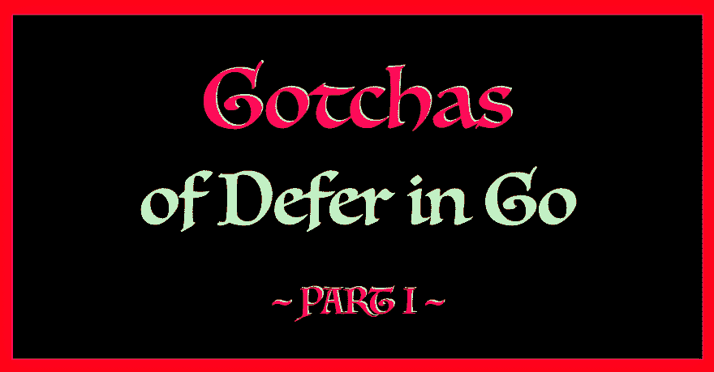

# Go 中延迟的 5 个陷阱—第一部分

> 原文:[https://dev.to/inancx/5-gotchas-of-defer-in-gopart-i-1b2](https://dev.to/inancx/5-gotchas-of-defer-in-gopart-i-1b2)

[T2】](https://blog.learngoprogramming.com/gotchas-of-defer-in-go-1-8d070894cb01)

## 里面是什么？

*   延期零函数
*   在循环内延迟
*   作为包装推迟
*   整体延期
*   延迟方法陷阱

**👉[按此阅读新文章](https://blog.learngoprogramming.com/gotchas-of-defer-in-go-1-8d070894cb01)T3。**

两周后见！

* * *

[学习围棋编程](https://blog.learngoprogramming.com)

👉我几乎每天都在推特上发布关于围棋的技巧和诀窍，[在推特上关注我](https://twitter.com/inancgumus)并获取它们。