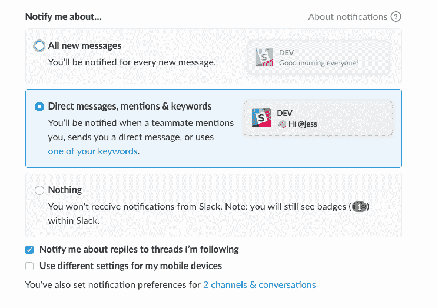
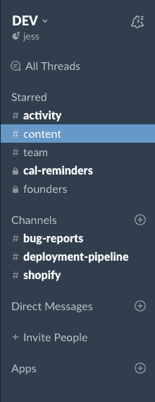
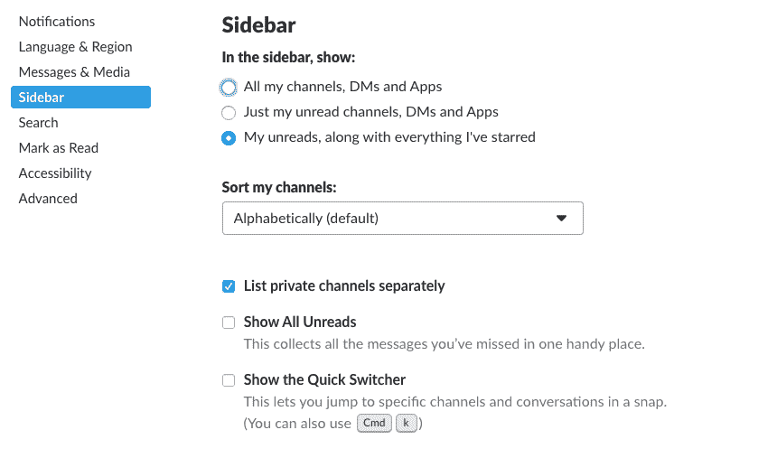

# 我如何为生产力和健全性配置 Slack

> 原文:[https://dev.to/jess/how-i-avoid-slacking-off-on-slack-8lj](https://dev.to/jess/how-i-avoid-slacking-off-on-slack-8lj)

而 Slack 的意思是让人们的工作生活更简单、更愉快、更有效率...它很容易做完全相反的事情。我是 13 个松散团队的一员，我一直让他们保持开放。如果不超过 slack 的默认设置，我将无法完成任何工作。

以下是我保持理智的三件简单的事情:

### 1。限制通知

我喜欢成为许多渠道的一部分，但我绝对不需要每封信都通知我。我会情不自禁地*阅读东西*，所以如果我的眼睛一直被吸引到屏幕的右上角，我就会一直分心。我的团队知道通过“提及”或“发短信”来吸引我的注意力。限制通知是过滤任何噪音并确保你关注重要内容的一个非常好的方法。

[T2】](https://res.cloudinary.com/practicaldev/image/fetch/s--aRZQexwv--/c_limit%2Cf_auto%2Cfl_progressive%2Cq_auto%2Cw_880/https://thepracticaldev.s3.amazonaws.com/i/efokt48ukld8ksh5m3tj.png)

### 2。保持侧边栏简单

这也是关于限制噪音的！在 dev.to slack 中，我是每个频道的一部分。但是你看的话，我只看到我主演过的或者有什么活动的。这些是我在任务进行中时知道要检查的渠道。

[T2】](https://res.cloudinary.com/practicaldev/image/fetch/s--WyDBmXEv--/c_limit%2Cf_auto%2Cfl_progressive%2Cq_auto%2Cw_880/https://thepracticaldev.s3.amazonaws.com/i/zqe7kfid3tx24epygqer.png)

如果我看到侧边栏中列出了不活跃的频道，我就必须上下滚动，看看我是否应该在任何地方签到。再说一次，我忍不住要阅读一些东西，所以限制可见的东西有助于保持我的精神能量。

以下是减少侧边栏的方法:

[T2】](https://res.cloudinary.com/practicaldev/image/fetch/s--thsx5J3N--/c_limit%2Cf_auto%2Cfl_progressive%2Cq_auto%2Cw_880/https://thepracticaldev.s3.amazonaws.com/i/lr08voqfdwzvv576s7uk.png)

你也可以打开`show all unreads`,但我个人不喜欢以提要的形式看到我的未读内容，因为这会减少上下文。我还喜欢能够选择先读哪些未读的内容，因为我对每个频道都有不同的优先级。

### 3。知道捷径

我最常用的快捷键是频道切换(⌘ + T)和团队切换(⌘+[数字])。像任何其他捷径一样，它帮助我更快地移动，到达我想去的地方。这里有一个其他快捷方式的完整列表，可以改变你的操作方式！

除了这三件事，下面是我还做过的一些个人事情:

*   把我所有的日历事件拉进来，得到我一天的快照，每天早上 8 点我都会收到通知。有其他方法可以做到这一点，但我选择了 slack。
*   当我在路上的时候，不断地给自己做记录，这是一种快速记笔记的方式。
*   我不像 Peter 那样经常使用提醒，他也是一个生产率呆子(他写了[这篇关于提升你的电子邮件游戏](https://dev.to/peter/programmers-should-be-good-at-email-too-here-is-my-guide-to-leveling-up-your-gmail-game)的文章)，但是我很高兴当我需要它的时候它就在那里。我喜欢用它来设置频道提醒，就像要求每个人在我们每周的复古开始前十分钟准备好玫瑰，荆棘，花蕾！

作为一个团队，我们也有许多松散的集成。这里有一些想到的:github，codeship，shopify，最重要的是，任何提交的滥用报告(*我们有一个垃圾邮件发送者！*)或者任何被报告的 bug。

有很多方法可以让 slack 成为一个强大的沟通和生产力工具。我很想知道你是如何使用 slack 的，以及是否有你所信赖的集成/技巧/窍门！