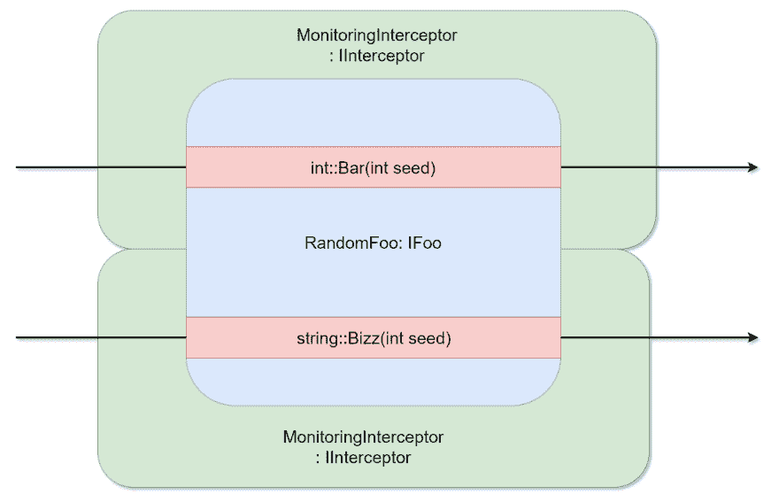

# 现实生活场景中的面向方面编程(AOP)。

> 原文:[https://dev . to/rafalpienkowski/aspect-oriented-programming-AOP-in-real-life-scenario-3ha](https://dev.to/rafalpienkowski/aspect-oriented-programming-aop-in-real-life-scenario-3ha)

### 简介

* * *

在本文中，我想向您展示一个 AOP 在. Net 真实场景中使用的例子。我的目标是向您展示使用内置的 [RealProxy](https://msdn.microsoft.com/en-us/library/system.runtime.remoting.proxies.realproxy(v=vs.110).aspx) 类轻松拦截插件。

首先，我想让你说几句关于面向方面编程(AOP)的话。我非常喜欢维基百科的定义:

> 面向方面编程(AOP)是一种编程范式，旨在通过允许分离横切关注点来增加模块化。它通过向现有代码添加额外的行为来实现这一点，而无需修改代码本身。

听起来很容易，也很简单。面向方面的编程范式帮助我们从*坚实的原则*中实现*开/关原则*。顺便说一下，*开/关原理*代表缩写 SOLID 中的 *O* 。如果你不熟悉开/关或固体原理，我鼓励你读一些从 [dev .到](https://dev.to/theodesp/understanding-solid-principles-open-closed-principle-5h0)的文章，或者在你喜欢的任何网络搜索引擎中输入“固体”。

AOP 可以通过两种主要方式实现，即:

*   [装饰图案](https://en.wikipedia.org/wiki/Decorator_pattern)
*   [拦截器模式](https://en.wikipedia.org/wiki/Interceptor_pattern)

使用*的第一种方法装饰模式*更精确。我们可以将 AOP 应用于具体实现中的具体方法。另一方面，与*一起工作，拦截器模式*将在需要更通用方法的场景中更有益。

我有意没有深入 AOP 的细节。这是一门独立的科学。我假设您对 AOP 知之甚少，并且您想知道是否或者如何在日常工作中应用 AOP。在我看来，理解一个问题最简单的方法就是用一个例子，所以让我们开始我们的故事...

### 故事背景

* * *

让我们想象这样一个场景。一位经理找到我们，告诉我们:

> 我们的应用程序性能有问题。你是我们公司最好的开发人员。您需要尽快调查并解决性能不佳的问题。

顺便问一下，你过去听过多少次类似的演讲？你不必回答。

[T2】](https://i.giphy.com/media/wrBURfbZmqqXu/giphy.gif)

### 例题解答

* * *

我建立了一个 [GitHub 库](https://github.com/rafalpienkowski/aop-simpleinjector-consoleapp)，在那里我创建了一个简单的控制台应用程序，它使用 AOP，使用 [SimpleInjector](https://simpleinjector.org/index.html) 依赖注入(DI)库。

让我们把这个项目视为我们的低性能，遗留的应用程序。

幸运的是，之前的开发团队使用了依赖倒置原则。他们已经创建了定义良好的 IFoo 接口，这对我们的应用程序至关重要。它由两种方法组成:*杠*和*巴兹*。下面你可以看到这个界面的代码片段:

```
public interface IFoo
{
    int Bar(int seed);
    string Baz(int seed);
} 
```

<svg width="20px" height="20px" viewBox="0 0 24 24" class="highlight-action crayons-icon highlight-action--fullscreen-on"><title>Enter fullscreen mode</title></svg> <svg width="20px" height="20px" viewBox="0 0 24 24" class="highlight-action crayons-icon highlight-action--fullscreen-off"><title>Exit fullscreen mode</title></svg>

我们只有一个在我们的应用中使用的 IFoo 接口的实现。它基于内置的随机类生成一些随机整数和字符串。下面是 RandomFoo 类的代码片段，它是 IFoo 的具体实现:

```
public class RandomFoo : IFoo
{
    private Random _random;
    private const string _chars = "ABCDEFGHIJKLMNOPQRSTUVWXYZ0123456789";

    public int Bar(int seed)
    {
        _random = new Random(seed);
        return _random.Next(0, 100);
    }

    public string Baz(int seed)
    {
        _random = new Random(seed);
        return new string(Enumerable.Repeat(_chars, _random.Next(1,30))
            .Select(s => s[_random.Next(s.Length)]).ToArray());
    }
} 
```

<svg width="20px" height="20px" viewBox="0 0 24 24" class="highlight-action crayons-icon highlight-action--fullscreen-on"><title>Enter fullscreen mode</title></svg> <svg width="20px" height="20px" viewBox="0 0 24 24" class="highlight-action crayons-icon highlight-action--fullscreen-off"><title>Exit fullscreen mode</title></svg>

下面的清单显示了使用 IFoo 接口的基本应用功能:

```
static void Main(string[] args)
{
    var foo = Container.GetInstance<IFoo>();
    Console.WriteLine($"Result for Bar(): {foo.Bar(DateTime.Now.Millisecond)}");
    Console.WriteLine($"Result for Baz(): {foo.Baz(DateTime.Now.Millisecond)}");
    Console.ReadKey();
} 
```

<svg width="20px" height="20px" viewBox="0 0 24 24" class="highlight-action crayons-icon highlight-action--fullscreen-on"><title>Enter fullscreen mode</title></svg> <svg width="20px" height="20px" viewBox="0 0 24 24" class="highlight-action crayons-icon highlight-action--fullscreen-off"><title>Exit fullscreen mode</title></svg>

我们的应用程序输出的一个例子类似于:

```
Result for Bar(): 8
Result for Baz(): MIMRKA9BJUKQ 
```

<svg width="20px" height="20px" viewBox="0 0 24 24" class="highlight-action crayons-icon highlight-action--fullscreen-on"><title>Enter fullscreen mode</title></svg> <svg width="20px" height="20px" viewBox="0 0 24 24" class="highlight-action crayons-icon highlight-action--fullscreen-off"><title>Exit fullscreen mode</title></svg>

现在你知道我们的处境了。你想做的第一步是什么？你是否在考虑改变 RandomFoo 的当前实现？添加一些[系统。诊断秒表](https://msdn.microsoft.com/en-us/library/system.diagnostics.stopwatch(v=vs.110).aspx)检查方法执行时间？

[T2】](https://res.cloudinary.com/practicaldev/image/fetch/s--_Mptoh_4--/c_limit%2Cf_auto%2Cfl_progressive%2Cq_66%2Cw_880/https://i.makeagif.com/media/5-04-2015/ehcG6h.gif)

你考虑过 AOP 吗？没有吗？我将向您展示如何使用 AOP 和*拦截器*的概念来解决这个问题，而无需更改 *RandomFoo* concrete 中的任何一行代码。

首先我要向你解释什么是拦截器？一个*拦截器*包装了对方法的调用，因此我们可以在实际调用正确的 *RandomFoo* 实现之前和之后添加一些逻辑。下图显示了*拦截器*的概念及其用法:

[T2】](https://res.cloudinary.com/practicaldev/image/fetch/s--ZCHG8HKN--/c_limit%2Cf_auto%2Cfl_progressive%2Cq_auto%2Cw_880/https://thepracticaldev.s3.amazonaws.com/i/8pa9o868t8tr885zf8xt.png)

所以让我们开始工作吧。首先我们需要做的是实现一个 *IInterceptor* 接口，它是 *SimpleInjector* 框架的一部分。该接口由一个必须在派生类中实现的方法`void Intercept(IInvocation)`组成。

下面显示了 **MonitoringInterceptor** 类的一个示例实现:

```
public class MonitoringInterceptor : IInterceptor
{
    private readonly ILogger _logger;

    public MonitoringInterceptor(ILogger logger)
    {
        _logger = logger;
    }

    public void Intercept(IInvocation invocation)
    {
        var watch = Stopwatch.StartNew();

        // Calls the decorated instance.
        invocation.Proceed();

        var decoratedType = invocation.InvocationTarget.GetType();

        _logger.Log($"{decoratedType.Name}.{invocation.GetConcreteMethod().Name}()
     executed in {watch.ElapsedMilliseconds} ms.");
    }
} 
```

<svg width="20px" height="20px" viewBox="0 0 24 24" class="highlight-action crayons-icon highlight-action--fullscreen-on"><title>Enter fullscreen mode</title></svg> <svg width="20px" height="20px" viewBox="0 0 24 24" class="highlight-action crayons-icon highlight-action--fullscreen-off"><title>Exit fullscreen mode</title></svg>

正如我们可以看到的， *IInterceptor* 的接口方法的实现包装了每个调用。允许我们在每次调用前后添加一些额外的代码。在我们的例子中，我添加了一个[秒表](https://msdn.microsoft.com/en-us/library/system.diagnostics.stopwatch(v=vs.110).aspx)来计算方法的执行时间，这个时间由 *ILogger* 实现记录。

***注意:*** *在我的资源库中，我已经在 IInterceptor 接口和它的具体实现之间引入了一个额外的抽象(我希望我没有在。为了让这个例子更清晰，我向你展示了没有额外抽象的代码。[链接](https://github.com/rafalpienkowski/aop-simpleinjector-consoleapp/blob/master/SimpleConsoleApplication/SimpleConsoleApplication/Interceptors/CustomBaseInterceptor.cs)T7】*

在我创建了一个拦截器之后，我唯一需要做的事情就是注册它。在拦截器的注册过程中，我们需要指定将在哪个接口方法上使用它。

拦截器的注册示例如下:

```
//Interceptor registration
Container.InterceptWith<MonitoringInterceptor>(type => type == typeof(IFoo)); 
```

<svg width="20px" height="20px" viewBox="0 0 24 24" class="highlight-action crayons-icon highlight-action--fullscreen-on"><title>Enter fullscreen mode</title></svg> <svg width="20px" height="20px" viewBox="0 0 24 24" class="highlight-action crayons-icon highlight-action--fullscreen-off"><title>Exit fullscreen mode</title></svg>

在我完成我的第一个拦截器的实现后，我意识到记录方法的参数和响应也有好处。所以我创建了第二个拦截器来覆盖这个功能。下面列出:

```
public class LoggingInterceptor : IInterceptor
{
    private readonly ILogger _logger;

    public LoggingInterceptor(ILogger logger)
    {
        _logger = logger;
    }

    public void Intercept(IInvocation invocation)
    {
        _logger.Log($"{invocation.GetConcreteMethod().Name} argument(s):                 {string.Join(", ",invocation.Arguments.Select(a => a))}"); 
        // Calls the decorated instance.
        invocation.Proceed();

        _logger.Log($"{invocation.GetConcreteMethod().Name} result                    {invocation.ReturnValue}"); 
    }
} 
```

<svg width="20px" height="20px" viewBox="0 0 24 24" class="highlight-action crayons-icon highlight-action--fullscreen-on"><title>Enter fullscreen mode</title></svg> <svg width="20px" height="20px" viewBox="0 0 24 24" class="highlight-action crayons-icon highlight-action--fullscreen-off"><title>Exit fullscreen mode</title></svg>

在添加了 *Monitoring-* 和 *LoggingInterceptor* 之后，我们程序的输出显示在下面的代码片段中:

```
Bar argument(s): 908
RandomFoo.Bar() executed in 0 ms.
Bar result 8
Result for Bar(): 8

Baz argument(s): 922
RandomFoo.Baz() executed in 4 ms.
Baz result MIMRKA9BJUKQ
Result for Baz(): MIMRKA9BJUKQ 
```

<svg width="20px" height="20px" viewBox="0 0 24 24" class="highlight-action crayons-icon highlight-action--fullscreen-on"><title>Enter fullscreen mode</title></svg> <svg width="20px" height="20px" viewBox="0 0 24 24" class="highlight-action crayons-icon highlight-action--fullscreen-off"><title>Exit fullscreen mode</title></svg>

我认为有了这些知识，我们可以进行一些测试，并开始应用程序性能改进的工作。

### 总结

* * *

我们以日志和性能监控更加丰富的应用程序来结束我们的一天。我们实现了这一点，而没有对具体实现做任何改变。此外，我们可以利用我们的拦截器是其他(甚至没有创建)接口及其实现的未来。此外，我们可以通过几个步骤将应用程序恢复到以前的状态。不需要任何恢复合并。依赖配置的改变就足够了。

注意改变方法结果的值。你不应该那样做。这不是一个好的实践，它可能会在将来使你困惑，因为不容易找到价值在哪里以及为什么被改变。拦截器不是为这种事情设计的。

[T2】](https://res.cloudinary.com/practicaldev/image/fetch/s--yaTfeIwN--/c_limit%2Cf_auto%2Cfl_progressive%2Cq_auto%2Cw_880/http://assets8.heart.co.uk/2012/39/oops-1348495688-large-article-1.jpg)

在给定的例子中，我使用了 SimpleInjector DI 框架。大多数 DI 框架都支持 AOP。这里是一些 DIs 的列表，链接到描述如何实现面向方面编程范例的文档。检查你的 DI 是否也支持 AOP。

*   单向器
*   [统一](https://msdn.microsoft.com/en-us/library/dn178466(v=pandp.30).aspx)
*   [自动飞行控制](http://autofaccn.readthedocs.io/en/latest/advanced/interceptors.html)

我希望你喜欢这篇文章。我试图向你展示新的可能性，并帮助你在谷歌上输入什么，如果你将来会面临这样的问题。你可以用我的建议，也可以不用。选择权在你。

### 加贺

* * *

*   我已经用 [draw.io](https://www.draw.io/) 完成了抽签
*   你想知道为什么我在这篇文章的开头贴了一张汽车的图片吗？答案很简单。这辆车的名字叫[詹森拦截者](https://en.wikipedia.org/wiki/Jensen_Interceptor)，在英国制造。我开的这样一个玩笑。