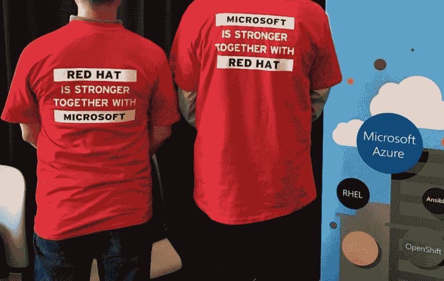

# 科技会议的 5 个技巧

> 原文:[https://dev.to/fred_meews/5-tips-for-tech-conferences-2bl](https://dev.to/fred_meews/5-tips-for-tech-conferences-2bl)

[T2】](https://res.cloudinary.com/practicaldev/image/fetch/s--kN7ttrmy--/c_limit%2Cf_auto%2Cfl_progressive%2Cq_auto%2Cw_880/http://fredmeews.github.img/redhat.jpg)

我的职业生涯始于互联网的早期...很久以前就存在像堆栈溢出这样的技术资源。当你遇到一个框架或操作系统的棘手问题时，你能去的地方是有限的。书籍经常过时或水平太高，供应商支持可能很昂贵&需要时间来获得，还有一些像雅虎小组这样的专业论坛，参与者因主题而异。

那时候，会议是直接从供应商那里获得深入技术信息的一个很好的方式，你在网上根本找不到这些信息。此外，您可以找到与您面临相同内核错误的人。你会兴奋地交换笔记和电子邮件地址，扩展你的世界观。

如今，就成本与收益而言，派你的团队成员去参加会议是有争议的。这已经成为一项大生意...根据美国劳工统计局的数据，近十年来翻了一番。与典型的商务旅行相比，注册和旅行费用很高。此外，供应商的任何重大公告都会立即在推特上发布，通常完整内容会在接下来的几周内通过博客和 youtube 发布。

然而，仍然有很好的理由让你的团队成员参加科技会议或你自己参加。这里有一些帮助你充分利用投资的建议...

### 1。网络

午餐/早餐午餐时，不要和公司的其他人坐在一起...让自己有点不舒服&坐到另一张桌子上。如果这些人不说话(在我们这个行业内向的人可能会这样)，那就换到另一张桌子。

找出在一次谈话中提出你要问的问题的那个人——很可能他也有类似的问题。

### 2。连接扬声器

我越来越多地看到这些会议通过灯光秀、大屏幕、重低音和奢华的会后派对来窃取摇滚音乐会的创意。

所有这些奇观会给人留下这样的印象:演讲者本身(就像摇滚明星一样)是高不可攀的名人。他们不是。大多数人都像你一样在键盘前度过了正常的一天。如果你有更深层次的问题没有在谈话中提及，那就去寻找它们吧！我运气好，通常会在演讲结束后逗留，但如果那不可行，就通过电子邮件或 Twitter 联系他们，稍后一起喝咖啡。

### 3。沉浸其中

你的经理可以说*我希望你下周花 100%的时间学习技术 X* ...但在实践中，分心的事物将不可避免地悄然而至。
把会议作为从日常琐事中“撤退”,让自己连续几天专注于一个主题，这有很多好处。

设定你不在办公室的时间，让团队知道你白天没钱，避免阅读你的电子邮件，和你的经理一起决定不接电话/不参加会议，除非是紧急情况。

### 4。让爱传出去

不要等到你回来才写一份旅行报告。仔细记下此刻的体验，着眼于产品的适用性。在回家的路上把它浓缩成一篇博文。如果你能在现场演示你学到的一些技术和技巧，你会得到加分。

### 5。赃物

最后也是最不重要的是赃物。虽然我会第一个承认我挤过人群拿到了一个塑料小玩意，但让我们承认这东西通常是垃圾。但是嘿免费就是免费！

###

照片是你可能不会在会议之外穿着的装饰品。