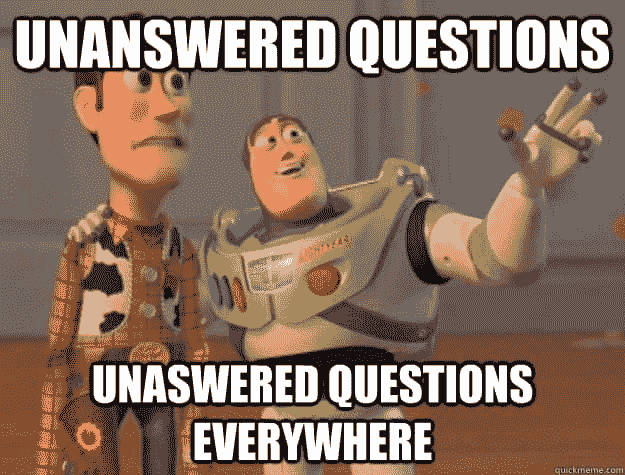
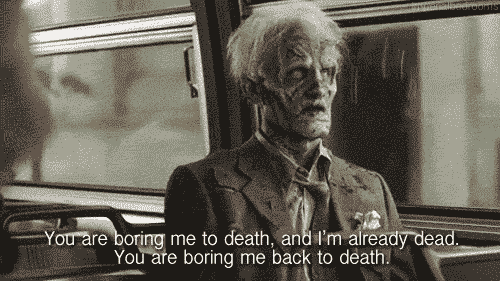

# 网页设计:清除解释(HTML)。

> 原文:[https://dev . to/inidaname/web-design-clearing-the-explain-html-42l](https://dev.to/inidaname/web-design-clearing-the-explanation-html-42l)

有一次我问我的一个很亲密的朋友，“当我提到 ***网页设计*** 你会怎么想？”回答是，“这只是建造一些游客会去的地方。”

[T2】](https://res.cloudinary.com/practicaldev/image/fetch/s--J4pY398o--/c_limit%2Cf_auto%2Cfl_progressive%2Cq_auto%2Cw_880/https://thepracticaldev.s3.amazonaws.com/i/ub3d6wmxw8xd4ju9kj2g.jpg)

我沉默了将近 30 秒。这到底意味着什么？

最近我交了一些新朋友，那些开发应用的朋友忽略这个词。这并不意味着我要换朋友，我需要所有的朋友。

我确实发现很难解释“我是做什么的？”

你有没有试过…向你的非技术类朋友解释软件/网络开发？尤其是当他们对学习感兴趣的时候，你会注意到此时他们正处于肾上腺素分泌期。

突然你变成了他们的谷歌，别忘了当你没有给他们一个明确的答案时，尤其是当你告诉他们 *Java* 和 *JavaScript* 没有关系时，你得到的是背叛的表情。

[T2】](https://res.cloudinary.com/practicaldev/image/fetch/s--8Iqca4Cq--/c_limit%2Cf_auto%2Cfl_progressive%2Cq_66%2Cw_880/https://thepracticaldev.s3.amazonaws.com/i/grg5zcoe9ak0ggdaseu3.gif)

当你提到像**变量**或**赋值**这样的词时，情况变得更糟。

等等…

让我猜猜你是一个非技术型的朋友，我可能开始听起来像你的困惑的朋友，或者你是一个技术型的朋友，我仍然听起来像你一样。

好的，在这篇文章中，我会试着解释一些容易混淆的术语。

尽管我不想成为这里的维基百科。这就是我如何向我的朋友解释网页设计的。

首先，我用我自己非常可能的方式定义了网页，不是谷歌不能帮忙，而是我希望它是非技术性的。我对网页的定义

> 网页是用某些开发者的工具构建的结构化文档，用于通过互联网或在本地设备上向预期的访问者、观众或用户提供可访问的数据或信息。这不是来自谷歌搜索

我仍然向他推荐了一个更专业、更详细的定义[https://en.wikipedia.org/wiki/Web_page](https://en.wikipedia.org/wiki/Web_page)

我希望有两件事:我的定义能解决一些问题，我还不够无聊，但在某个时刻，那种表情又出现了，我注意到了

[T2】](https://res.cloudinary.com/practicaldev/image/fetch/s--Cz6JR7_w--/c_limit%2Cf_auto%2Cfl_progressive%2Cq_auto%2Cw_880/https://cdn-images-1.medium.com/max/800/0%2AndN3kmGaLhxR6GEc.jpg)

我意识到这是我多说的机会。

### 现在那些特定的开发者工具是什么

我将按照相关的顺序列出它们。

1.  个人电脑或智能手机。(我不知道你什么时候会读到这篇文章)
2.  [网络浏览器](https://en.wikipedia.org/wiki/Web_browser) (Internet Explorer、Firefox 或 Chrome)
3.  文本编辑器 —记事本就可以了
4.  HTML —超文本标记语言
5.  [CSS](https://en.wikipedia.org/wiki/css) —级联样式表
6.  [JavaScript](https://en.wikipedia.org/wiki/javascript)

其他工具可能包括[PHP](https://en.wikipedia.org/wiki/php)——*超文本预处理器*、 [MySQL](https://en.wikipedia.org/wiki/mysql) (这真的不是我的，只是一个名字)等等。在不久的将来，我们可能会谈论这些事情。

现在请记住，上面列出的项目可能有替代方案，但我将使用这些。

网页设计是所有这些事情的开端。

> 提示:上面列出的所有条目都有一个指向其维基百科页面的可点击参考

### 网页设计

> 网页设计是创建网站的过程。它包含几个不同的方面，包括网页布局、内容制作和图形设计。虽然网页设计和网页开发这两个术语经常被互换使用，但从技术上来说，网页设计是网页开发的一个子集。-科技术语计算机词典

[T2】](https://res.cloudinary.com/practicaldev/image/fetch/s--fZBXYLQI--/c_limit%2Cf_auto%2Cfl_progressive%2Cq_auto%2Cw_880/https://cdn-images-1.medium.com/max/800/0%2Ad91Cb6_y54sHelyr.jpg)

### 我的比喻

想象一下:你需要一所房子，房子必须有地址，建造房子你需要一块地，开始建造你需要一个建筑师，你需要一个地基，瓦工，油漆工，木匠，你的房子需要电力和供水。

[T2】](https://res.cloudinary.com/practicaldev/image/fetch/s--kJHJMn8Q--/c_limit%2Cf_auto%2Cfl_progressive%2Cq_66%2Cw_880/https://i.imgur.com/kTd8v0l.gif)

在这里，网页设计师(可能是你或你的技术朋友)不是建筑师，在这种情况下，他/她只是房子的主人，随着我们的继续，我一定会把你介绍给建筑师。

先说房子地址，工地。这是页面将驻留的地方，如果在本地机器上，它将在一个文件夹中，而在互联网上，它将是一个类似于的域名。

暂停一下，我想带你进入未来，在那里你已经完成了建筑，此时你想告诉你的朋友关于新的建筑，他们需要拜访你。

把访问者带到你家的过程在这种情况下你的网页就是浏览器所处理的，每个浏览器都有一个地址栏，更像是你如何向某人问路，现在某人就是你的地址栏。

你还在读这封信吗？那么，也许我正在阐明一些观点。

让我们回到你的建筑工地，现在我介绍一下砌砖工，在这种情况下你的砌砖工是 HTML。作为一个砌砖工，HTML 所做的只是建造墙壁，这些墙壁可能只是形成一个个堆叠在一起的房间，在这里，砌砖工/HTML 没有协调地工作。

下面是一个典型的 HTML 文件的外观。这里是你需要我在上面的列表中提到的文本编辑器来创建一个 HTML 文件的地方，你的文件可以被命名为类似于`building.html`的任何名称，只要确保它在结尾有`.html`，一个很好的建议是不要给名字空格`this is the file name.html`更可取的是`thisisthefilename.html` `itCouldBeAsLongAsYouWantItToBeWithAnyCase.html`就个人而言，请不要将你的文件命名为这样的名称。谢谢你

`building.html`文件，这里我会写一些基本的`HTML`代码。