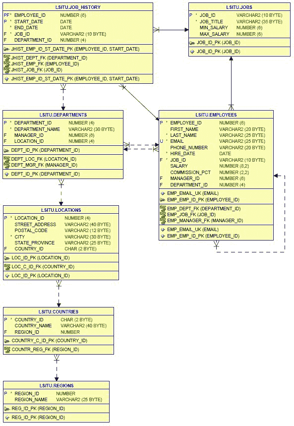
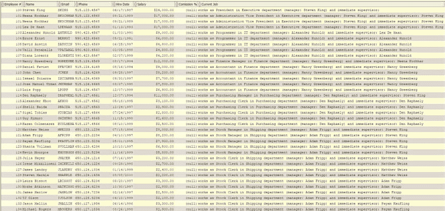
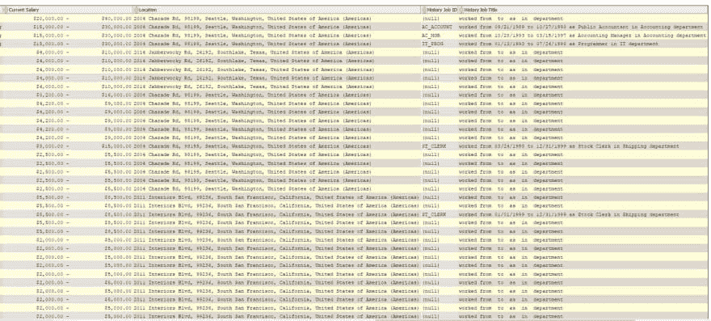

# 从数据库中获取尽可能多的数据的复杂 SQL 查询示例。

> 原文:[https://dev . to/tyzia/example-of-complex-SQL-query-to-get-尽可能多的从数据库中获取数据-9he](https://dev.to/tyzia/example-of-complex-sql-query-to-get-as-much-data-as-possible-from-database-9he)

我想分享一个复杂 SQL 查询的例子，它将从数据库返回所有可能的数据。

数据库模式如下所示:

[T2】](https://res.cloudinary.com/practicaldev/image/fetch/s--Urf0my4u--/c_limit%2Cf_auto%2Cfl_progressive%2Cq_auto%2Cw_880/https://thepracticaldev.s3.amazonaws.com/i/tnt5zexcct26gj7nfqlm.JPG)

任务是“显示所有员工及其相关信息，即使有些信息丢失。尽可能多地获得关于雇员的信息”。

我最后的 SQL 查询如下:

```
SELECT
  e.employee_id AS "Employee #"
  , e.first_name || ' ' || e.last_name AS "Name"
  , e.email AS "Email"
  , e.phone_number AS "Phone"
  , TO_CHAR(e.hire_date, 'MM/DD/YYYY') AS "Hire Date"
  , TO_CHAR(e.salary, 'L99G999D99', 'NLS_NUMERIC_CHARACTERS = ''.,'' NLS_CURRENCY = ''$''') AS "Salary"
  , e.commission_pct AS "Comission %"
  , 'works as ' || j.job_title || ' in ' || d.department_name || ' department (manager: '
    || dm.first_name || ' ' || dm.last_name || ') and immediate supervisor: ' || m.first_name || ' ' || m.last_name AS "Current Job"
  , TO_CHAR(j.min_salary, 'L99G999D99', 'NLS_NUMERIC_CHARACTERS = ''.,'' NLS_CURRENCY = ''$''') || ' - ' ||
      TO_CHAR(j.max_salary, 'L99G999D99', 'NLS_NUMERIC_CHARACTERS = ''.,'' NLS_CURRENCY = ''$''') AS "Current Salary"
  , l.street_address || ', ' || l.postal_code || ', ' || l.city || ', ' || l.state_province || ', '
    || c.country_name || ' (' || r.region_name || ')' AS "Location"
  , jh.job_id AS "History Job ID"
  , 'worked from ' || TO_CHAR(jh.start_date, 'MM/DD/YYYY') || ' to ' || TO_CHAR(jh.end_date, 'MM/DD/YYYY') ||
    ' as ' || jj.job_title || ' in ' || dd.department_name || ' department' AS "History Job Title"

FROM employees e
-- to get title of current job_id
  JOIN jobs j 
    ON e.job_id = j.job_id
-- to get name of current manager_id
  LEFT JOIN employees m 
    ON e.manager_id = m.employee_id
-- to get name of current department_id
  LEFT JOIN departments d 
    ON d.department_id = e.department_id
-- to get name of manager of current department
-- (not equal to current manager and can be equal to the employee itself)
  LEFT JOIN employees dm 
    ON d.manager_id = dm.employee_id
-- to get name of location
  LEFT JOIN locations l
    ON d.location_id = l.location_id
  LEFT JOIN countries c
    ON l.country_id = c.country_id
  LEFT JOIN regions r
    ON c.region_id = r.region_id
-- to get job history of employee
  LEFT JOIN job_history jh
    ON e.employee_id = jh.employee_id
-- to get title of job history job_id
  LEFT JOIN jobs jj
    ON jj.job_id = jh.job_id
-- to get namee of department from job history
  LEFT JOIN departments dd
    ON dd.department_id = jh.department_id

ORDER BY e.employee_id;
```

让我们一步一步来看:

在创建最终的 Select 语句之前，让我们看看哪些表需要左连接，哪些不需要。我们需要这种检查，因为左连接比内连接慢，所以为了提高效率，我们将尽可能使用(内)连接。

检查每个雇员都有一个 job_id。如果有结果(雇员的 id ),那么我们需要 LEFT JOIN，因为有些雇员没有(IS NULL == true) job_id。否则(IS NULL == false)我们只使用 JOIN:

```
SELECT employee_id FROM employees WHERE job_id IS NULL;
```

结果:空。结论:我们对“jobs”表使用 JOIN。

与上面相同的检查，这次检查 department_id:

```
SELECT employee_id FROM employees WHERE department_id IS NULL;
```

结果:178。结论:我们对“部门”表使用左连接。

因为有一个雇员没有 department_id，所以未来连接的整个链(部门-位置-国家-地区)也应该保持连接，尽管这些表可以在单独的查询中相互内部连接。

与上面相同的检查，这次检查 manager_id:

```
SELECT employee_id FROM employees WHERE manager_id IS NULL;
```

结果:100。结论:我们对“雇员”表使用左连接(自连接)。这意味着，一个员工没有经理。

以及对最后一个查询的一些一般性评论:

```
AS
```

*   我们用它来定义别名，结果表中的列名看起来更易读。

    ```
    ||
    ```

*   我们用它来连接字符串

    ```
    'text'
    ```

*   我们用单引号将任何文本括起来

    ```
    TO_CHAR(e.hire_date, 'MM/DD/YYYY')
    ```

*   这样我们就可以设置日期的格式

    ```
    TO_CHAR(e.salary, 'L99G999D99', 'NLS_NUMERIC_CHARACTERS = ''.,'' NLS_CURRENCY = ''$''')
    ```

*   这样我们就可以用分隔符输出货币。[我关于它的详细帖子可以在这里找到。](http://2x2.ur3.ca/?p=1372)

    ```
    JOIN jobs j ...
    ```

*   这个“j”表示表名的别名。同一个表可以连接到自身(自连接)，因此同一个表的表别名可以也应该是不同的。

该查询返回了 110 个结果，尽管只有 107 名雇员。因为在 107 名员工中，有 3 人有两项工作历史记录。结果的前几行如下所示:

[T2】](https://res.cloudinary.com/practicaldev/image/fetch/s--fzboHKiY--/c_limit%2Cf_auto%2Cfl_progressive%2Cq_auto%2Cw_880/https://thepracticaldev.s3.amazonaws.com/i/f1lay63nivyypg2z57uc.JPG)

[T2】](https://res.cloudinary.com/practicaldev/image/fetch/s--zde1O03k--/c_limit%2Cf_auto%2Cfl_progressive%2Cq_auto%2Cw_880/https://thepracticaldev.s3.amazonaws.com/i/0x71vsd1k5xo91jj77ys.JPG)

我们当然可以更进一步，获得关于部门的所有信息，根据工作历史条目，有几个员工在那里工作，但我认为这太多了。

最初在我的网站上发布[。](http://2x2.ur3.ca/?p=1406)

希望这个例子对新手有用。对于那些有经验的人，我想回答一些问题:

1.  应用哪个连接真的很重要吗:左连接还是内连接？我的意思是生产率真的提高了吗？
2.  将所有可能的信息打包到一个查询中是一种好的做法吗？或者将它拆分成小查询是更好的方法？
3.  如果有的话，在这个查询中犯了什么错误？

保重！