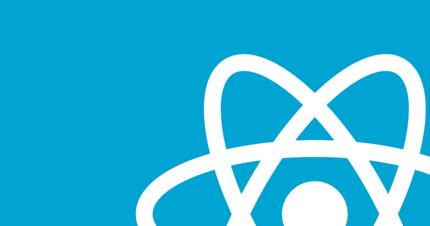

# 让我们试试不带 Node.js 的 React

> 原文:[https://dev.to/luispa/lets-try-react-without-nodejs-3a7](https://dev.to/luispa/lets-try-react-without-nodejs-3a7)

[T2】](https://res.cloudinary.com/practicaldev/image/fetch/s--YPqzSSWz--/c_limit%2Cf_auto%2Cfl_progressive%2Cq_auto%2Cw_880/https://thepracticaldev.s3.amazonaws.com/i/8i1bx8y9p3t9x223bjhf.png)

## 上下文的反应

React 是一个用于构建用户界面的开源 JavaScript 库。由脸书创建和支持。

你可以在这里找到文档:[https://reactjs.org/tutorial/tutorial.html#overview](https://reactjs.org/tutorial/tutorial.html#overview)

如果你是一名能够处理 HTML 、 **CSS** 和 **JavaScript** 的 web 开发人员，你可以尝试在没有 Node.js 或任何其他复杂工具的情况下使用 React。

易如反掌！

# 1。用 react，react-dom 和 babel 参考创建一个 index.html。

你可以在你的文本编辑器中使用它。

```
 <!DOCTYPE html>
<html lang="en">

<head>
  <meta charset="UTF-8">
  <meta name="viewport" content="width=device-width, initial-scale=1.0">
  <meta http-equiv="X-UA-Compatible" content="ie=edge">
  <title>React Local</title>
<!-- Import the React, React-Dom and Babel libraries from unpkg -->
  <script type="application/javascript" src="https://unpkg.com/react@16.0.0/umd/react.production.min.js"></script>
  <script type="application/javascript" src="https://unpkg.com/react-dom@16.0.0/umd/react-dom.production.min.js"></script>
  <script type="application/javascript" src="https://unpkg.com/babel-standalone@6.26.0/babel.js"></script>
</head>

<body>
  <div id="root"></div>

<script type="text/javascript">

</script>

</body>

</html> 
```

# 2。添加文本/巴别塔脚本标签

替换脚本标签:

```
<script type="text/javascript">

</script> 
```

对于

```
<script type="text/babel">

</script> 
```

# 3。在你的新文本/巴别塔脚本标签中写下任何一个 react 例子

你有最基本的环境去尝试 react，那就试试吧！

```
<!DOCTYPE html>
<html lang="en">

<head>
  <meta charset="UTF-8">
  <meta name="viewport" content="width=device-width, initial-scale=1.0">
  <meta http-equiv="X-UA-Compatible" content="ie=edge">
  <title>React Local</title>
  <script type="application/javascript" src="https://unpkg.com/react@16.0.0/umd/react.production.min.js"></script>
  <script type="application/javascript" src="https://unpkg.com/react-dom@16.0.0/umd/react-dom.production.min.js"></script>
  <script type="application/javascript" src="https://unpkg.com/babel-standalone@6.26.0/babel.js"></script>
</head>

<body>
  <div id="root"></div>

<script type="text/babel">
// Obtain the root 
    const rootElement = document.getElementById('root')
// Create a ES6 class component 
    class ShoppingList extends React.Component { 
// Use the render function to return JSX component 
    render() { 
        return (
        <div className="shopping-list">
        <h1>Shopping List for {this.props.name}</h1>
          <ul>
            <li>Instagram</li>
            <li>WhatsApp</li>
            <li>Oculus</li>
          </ul>
        </div>
      );
      } 
    }
// Create a function to wrap up your component
function App(){
  return(
  <div>
    <ShoppingList name="@luispagarcia on Dev.to!"/>
  </div>
  )
}

// Use the ReactDOM.render to show your component on the browser
    ReactDOM.render(
      <App />,
      rootElement
    )
</script>

</body>

</html> 
```

### 就是这样！

您可以将这个 index.html 文件拖到浏览器中，您将首次尝试 react 界面。

重要的是要清楚，这种方式是构建 react 应用程序最弱和最简单的方式，如果你想探索更多，你可以在这个免费课程中学习 react 基础知识:[https://egghead.io/courses/the-beginner-s-guide-to-reactjs](https://egghead.io/courses/the-beginner-s-guide-to-reactjs)

我希望你能试一试，做任何事情总有简单易行的方法。