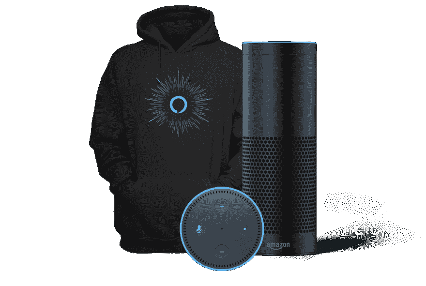
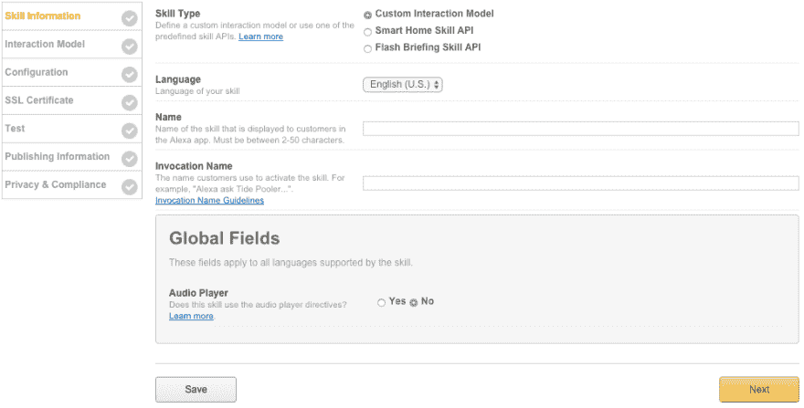
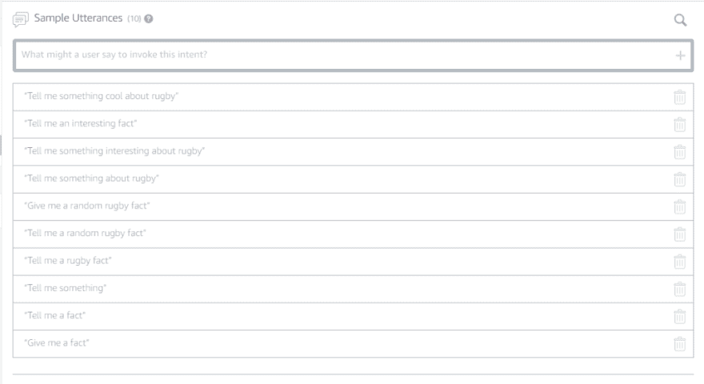
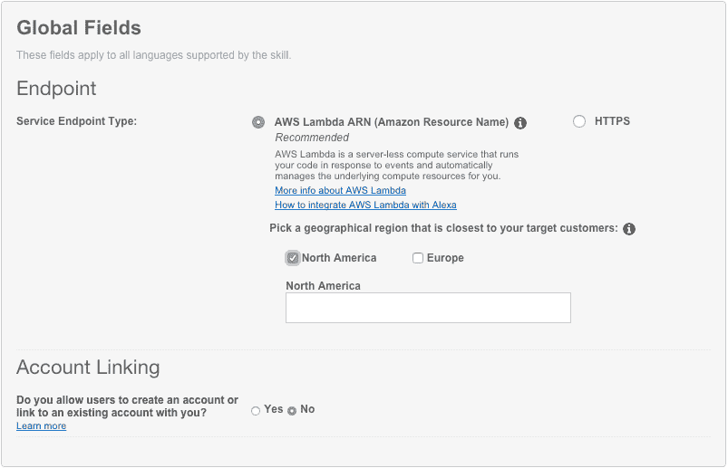
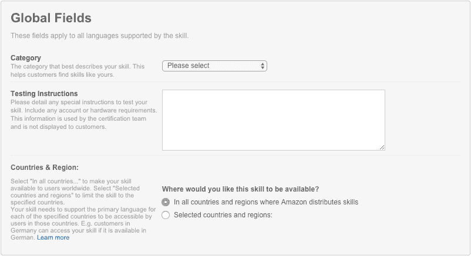

# 建立我的第一个 Alexa 技能——橄榄球事实

> 原文:[https://dev.to/willvelida/building-my-first-alexa-skill-橄榄球-事实-doc](https://dev.to/willvelida/building-my-first-alexa-skill--rugby-facts-doc)

更新:[这个技能现在可以下载了](https://www.amazon.com/dp/B077YVFVY8/ref=sr_1_2?s=digital-skills&ie=UTF8&qid=1512709685&sr=1-2&keywords=rugby)！如果你有任何反馈或者想表达你的爱，我很乐意收到你的来信！

亚马逊目前正在为开发 Alexa 技能的人举办一场比赛。规定很简单，开发一项新技能，获得一件闪亮的新 Alexa 连帽衫！如果超过 75 名客户在 Alexa 技能商店的前 30 天内启用该技能，您可以赢得一个回声点！

[T2】](https://res.cloudinary.com/practicaldev/image/fetch/s--jfbzWimK--/c_limit%2Cf_auto%2Cfl_progressive%2Cq_auto%2Cw_880/https://cdn-images-1.medium.com/max/1024/1%2AKh9hfXY1rg_VXB1stYRQaw.png)

听起来很酷，对吧？我已经把目标定得比那低了一点。我只想要那件帽衫。另外，我一直想为语音助手开发一些东西，所以这似乎是一个学习一些很酷的东西并可能从中获得一些东西的好机会。

对于那些稍微了解我的人来说，你们会知道我是一个橄榄球迷，我喜欢认为我对这项运动非常了解。在亚马逊 Alexa 技能集的初学者教程中，有一个创建事实技能的非常基础的教程，它经历了构建基于某个主题为用户提供事实的技能所需的步骤。这似乎是一个很容易与我对橄榄球的热爱结合起来的概念。所有这些都是为了获得一件免费的连帽衫！我还想要什么？这篇文章不会试图浏览教程(你可以自己做[这里](https://developer.amazon.com/alexa-skills-kit/tutorials))我只是想提供一些评论，说明创建一个非常简单的技能并尝试 Alexa 技能开发是多么容易。

在我们开始之前，在写作的时候，我的技能已经提交认证。

#### 第一步:在开发者门户中设置你的 Alexa 技能

首先，我们需要建立我们的技能。非常简单。你必须注册一个亚马逊开发者账户，但这本身很简单，而且是免费的。开发者控制台很容易操作，创造一个新技能只需要点击正确的按钮。一旦你创建了一个新技能，你会遇到另一个创建该技能的简单清单(见下文):

[T2】](https://res.cloudinary.com/practicaldev/image/fetch/s--w8lKC9hX--/c_limit%2Cf_auto%2Cfl_progressive%2Cq_auto%2Cw_880/https://cdn-images-1.medium.com/max/999/0%2Ax4wXaFjDilk_V0U-.png)

这里唯一真正关心的是选择一个调用名(用户用来激活技能的名称)。为了简单起见，我用了这个技能的名字。

接下来，我们转向交互模型。由于教程指导我使用技能生成器，我就跟着做了。对于那些有使用微软 luis.ai 的经验的人来说，这几乎是一回事。你创造一个新的意图，并为你的技能添加一些简单的话语，就像这样:

[T2】](https://res.cloudinary.com/practicaldev/image/fetch/s--SWzTXtZ7--/c_limit%2Cf_auto%2Cfl_progressive%2Cq_auto%2Cw_880/https://cdn-images-1.medium.com/max/1024/0%2AfKr-JwvWTNgeCNzo.png)

保存并构建(我的构建时间大约是一分钟，一点也不算长)。

#### 步骤 2:使用 Amazon Web Services 设置 Lambda 函数

这是一个有趣的部分。对于这一步，我们去 AWS 为我们的技能设置和配置一个 Lambda 函数。我使用 AWS 的经验很少，但我以前从未使用过 Lambda。在撰写本文时，Lambda 仅在美国东部和爱尔兰有效。对我来说非常方便，因为我住在英国，而我的“客户”将在英国。

创建函数非常简单。这只是我为 Alexa 技能包选择一个蓝图，使用 Alexa 技能包作为触发器，并第一次设置一个 Lambda 角色。我只能在函数创建后设置触发器，所以在教程中有一点差异，但不是什么大问题。

#### 第三步:将你的语音用户界面连接到你的 Lambda 函数

再次，另一个非常简单的步骤(希望在你的头脑中形成一个模式)。只是将我的 AWS 功能与语音用户界面连接起来的一个例子。这听起来太复杂了，但这只是填表而已。作为一项基本的事实技能，这里没有任何实际工作要做。将来，我可能会在更复杂的应用程序中遇到复杂性。

[T2】](https://res.cloudinary.com/practicaldev/image/fetch/s--4VzrGcxh--/c_limit%2Cf_auto%2Cfl_progressive%2Cq_auto%2Cw_880/https://cdn-images-1.medium.com/max/803/0%2AVU2STtJ58vlamjHQ.png)

#### 第四步:测试你的 Alexa 技能

一切正常吗？当然可以。本教程向您展示了如何测试语音模拟器和服务模拟器，以确保一切正常。在 AWS Lambda 中创建测试事件也非常简单。老实说，为了简单地得到一件免费的帽衫，我真的很高兴亚马逊为我做了大部分工作。我刚刚在功能门户内部测试了服务，但是你可以使用 [Echosim.io](https://echosim.io/welcome) 或者单元测试来测试你的技能。我也没有。

#### 第五步:定制属于你的技能

有趣的部分！这是我定制技能的地方，包括橄榄球的事实！模板技能具有关于空间的事实，因此需要做一些工作来使该技能产生橄榄球事实。整个过程中最乏味的部分实际上是找到足够多的关于橄榄球的事实来使这项技能变得有价值。亚马逊建议你至少有 25 个事实，但我达到了大约 50 个。在未来的版本中，我想尝试生产 200 个。

我不得不在亚马逊的 GitHub repos 上做了一些探索，以找到定制技能所需的 index.js 文件(我在教程中提供的链接上得到了 404)，但我很快就在这里找到了它。同样，这里所需要的是在“真正显而易见的待办事项”注释下向数据数组添加新的事实，并更改数据数组上方的一些常量(更改技能名称以匹配我的名称，更改帮助消息等)。)

我几乎不会说英语，更不用说其他语言了，所以我不需要做任何翻译工作。我的技能的观众将基于英国市场(因为这是一个英国的竞争)。

#### 第六步:认证并公布你的技能

和我认识的大多数开发人员一样，我不喜欢用(:P)进行营销/着色，但是这个过程相当简单。我所要做的就是为技能设置一个类别，向亚马逊的好朋友提供一些测试说明，并选择一个国家和地区。

[T2】](https://res.cloudinary.com/practicaldev/image/fetch/s---_gQoE1k--/c_limit%2Cf_auto%2Cfl_progressive%2Cq_auto%2Cw_880/https://cdn-images-1.medium.com/max/802/0%2AU6ge9kdyzdzWw1RZ.png)

然后我不得不写一个技能描述。基本的营销方面的东西。我们还必须为该技能提供一些示例短语，让客户知道他们可以如何与该技能互动。我只是 Ctrl+C 我在技能生成器中提供的示例语句。这是亚马逊推荐的，否则你为什么要这么做。我的意思是，给顾客提供与你的技能不匹配的示例短语可能很有趣，但这并不酷。

我讨厌为我的应用程序创建图像。我不擅长画画，更不用说 GIMP 或者 Photoshop 了。我制作了一些蹩脚的图片，符合亚马逊商店的要求。这不是很好，但我只是在玩它，所以我不会担心这些小事。

最后，我不得不回答几个隐私问题。同样(和整个过程一样)非常简单:

[T2】](https://res.cloudinary.com/practicaldev/image/fetch/s----vII-Fu--/c_limit%2Cf_auto%2Cfl_progressive%2Cq_auto%2Cw_880/https://cdn-images-1.medium.com/max/803/0%2Aeq4DpHZzNIdZeXe-.png)

一旦一切完成，你就可以提交认证。你收到一封电子邮件，说需要 7 天时间才能得到反馈，所以希望我能很快得到消息。我在 Google Play 和 Windows Store 上的提交速度都非常快，所以希望这次也能如此。

**最终想法**

这是度过一个下午的一种非常有趣的方式！我学到了一些新东西，希望能从中得到一件连帽衫。我热衷于使用亚马逊技能工具包进行更深入的探索。你可以制作游戏，查找联系信息，创造技能等等。我也很想看看高级技能集，看看创造一些更有意义的技能，而不仅仅是一个随机的事实生成器。

我听说过一些关于 Alexa 的疯狂的锡箔东西，但我必须承认我有兴趣得到一个，这样我就可以为它建立更酷的东西。我很高兴明年它将来到新西兰，所以我将有机会在那里利用业余时间培养技能。

希望这篇文章能激发你自己探索 Alexa 技能包并为它做些什么。在撰写本文时(2017 年 12 月)，英国正在举办一场跑步技能培养比赛，所以我鼓励你参与进来。

谁知道呢？你很可能会造出更好的东西，为自己赢得一个回音！