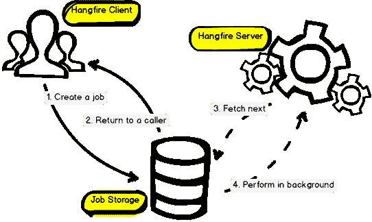

# ASP.NET 核心中的后台任务

> 原文:[https://dev . to/samueleresca/background-tasks-in-aspnet-core-8l 7](https://dev.to/samueleresca/background-tasks-in-aspnet-core-8l7)

*原贴于[https://samueleresca.net](https://samueleresca.net)T3】*

有时有必要为我们的[安排和创建长期运行的方法。网络核心应用](https://samueleresca.net/2016/01/future-of-aspnet-is-open-source-and-cross-platform/)。管理预定和长期运行的方法是复杂的。例如，与请求无关的线程中的未处理异常将停止进程。其次，如果您在多个实例上运行您的站点，可能会导致同时运行相同的任务。最后，应用程序域可以下去，并带着它拿下你的后台任务。为了提高我们服务的安全性和稳定性，最好避免在应用程序中管理它们，因为它们会导致您的服务不负责任。为了消除等待，您应该将您的**长期运行的方法调用放到后台任务**中。然而，在云世界中有不同的方式来调度后台任务:

*   Azure WebJobs: 它们内置了 Azure 内部许多不同事件的触发器，例如:存储队列、blobs、服务总线队列、主题和时间表触发器。这意味着可以建立一个 WebJob 来监视新项目的 blob 存储帐户；
*   Azure Functions: 他们从 WebJobs 中吸取了一些概念，并以一些有趣的方式对它们进行了改进。首先，函数支持大量新的触发器类型。HTTP 触发器还释放了构建非常小的 webhooks 的能力，可以以非常低的成本进行部署；

那么**内部解决方案**呢？
T3 再来说说[挂火](https://www.hangfire.io/)。在中执行后台处理的简单方法。NET 和。NET 核心应用程序。您可以安全地重启您的应用程序，并将 [Hangfire](https://www.hangfire.io/) 用于 ASP.NET，而不用担心应用程序池回收。

## 后台任务使用 Hangfire

下面的例子使用 [Hangfire](https://www.hangfire.io/) 来触发和管理 ASP.NET 核心应用上的后台任务。为了使用 Hangfire，您应该使用以下命令安装相关的软件包:`PM> Install-Package Hangfire`

### 它是如何工作的？

[Hangfire](https://www.hangfire.io/) 负责处理你的后台任务。为了管理我们的任务，它使用了一个持久存储:SQL Server、Redis、PostgreSQL、MongoDB。以下是 hangfire 工作流的概述:[caption id = " attachment _ 3179 " align = " align center " width = " 542 "][【http://docs.hangfire.io/en/latest/】](http://docs.hangfire.io/en/latest/)
这种分布式处理任务的方式，使我们能够抛出未处理的异常或终止您的应用程序，后台作业将自动重试。

### 配置 hangfire

我们来看看如何配置 hangfire。ASP.NET 核心使用`Startup.cs`文件来初始化服务和外部依赖。`Startup.cs`文件包含以下方法:

*   `ConfigureServices`是向容器注册依赖关系的地方；
*   `Configure`是定义中间件管道的地方。它控制应用程序如何响应请求；

为了配置 hangfire，我们应该添加以下代码: