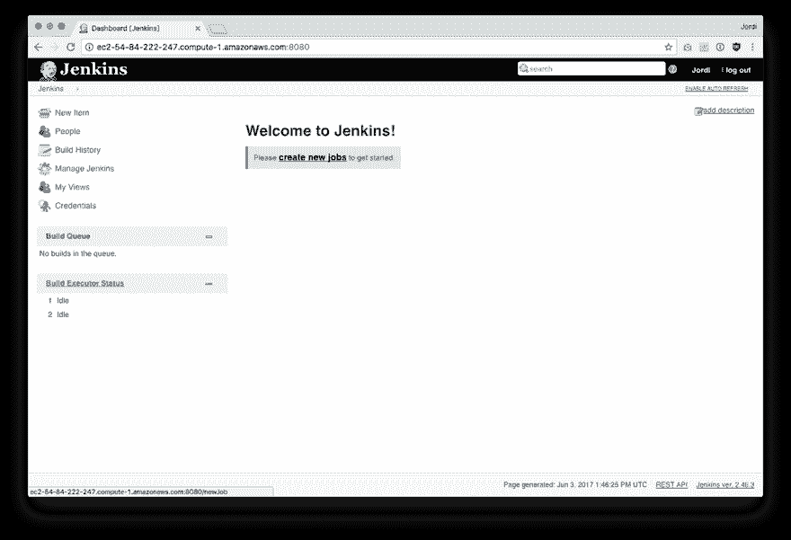
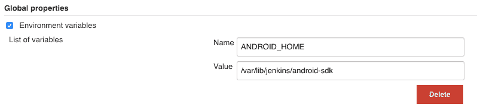
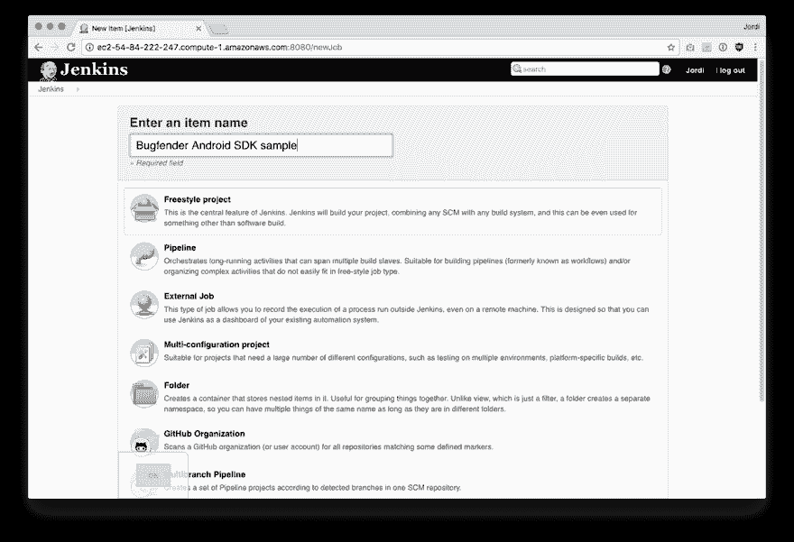
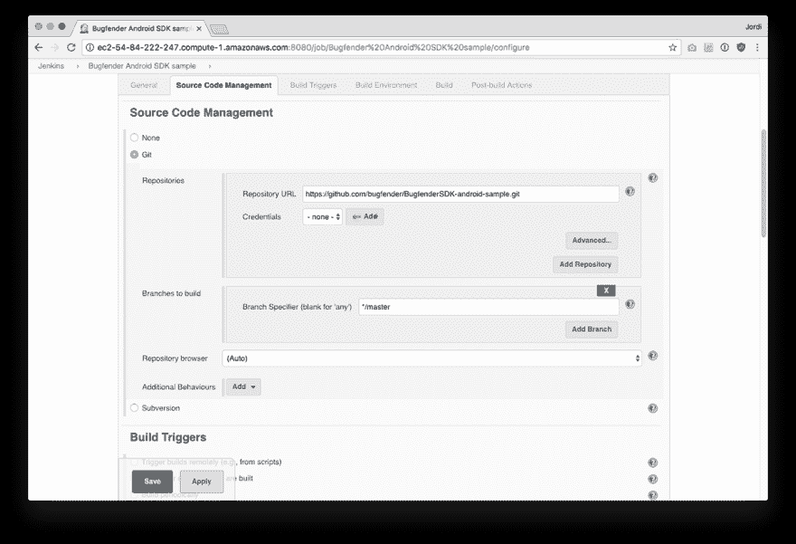
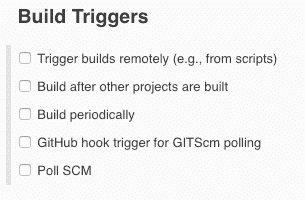
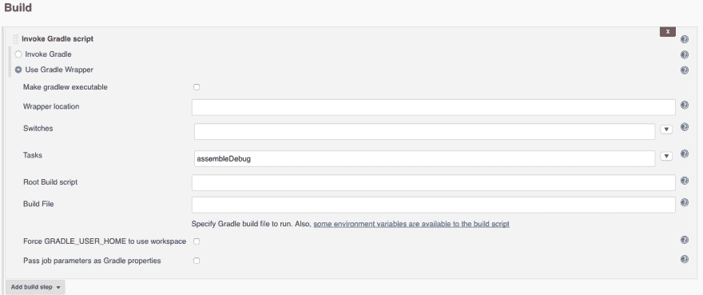
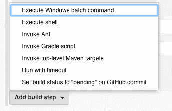
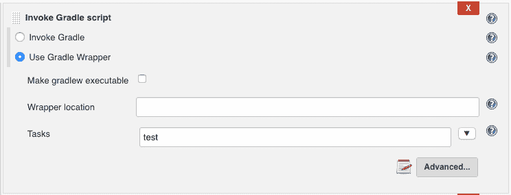

# 如何将你的第一份 Android 工作添加到 Jenkins

> 原文：<https://dev.to/bugfenderapp/how-to-add-your-first-android-job-to-jenkins-7la>

*这篇文章最初发表在我们的[博客](https://bugfender.com/blog/how-to-add-your-first-android-job-to-jenkins/)上。*

如果你错过了本系列的前几篇文章，或者你不确定 Jenkins 或 CI 是什么，请回头阅读:[什么是 Jenkins，你为什么要使用它？](https://bugfender.com/blog/what-is-jenkins-and-why-should-you-be-using-it/)

* * *

这是如何设置 Jenkins 来构建和测试 Android 应用程序的分步指南。在这个演示中，我们将使用一个在 Android 中使用 Bugfender SDK 的示例应用程序[。很明显，你会希望使用你自己构建的 Android 应用程序或库。将您自己的 Android 项目添加到 Jenkins 的步骤是相同的。](https://github.com/bugfender/BugfenderSDK-android-sample)

*构建 iOS 应用？请关注本系列即将发布的下一篇文章。*

首先，你需要准备机器来编译和运行 Android 应用程序。如果你还没有安装 Jenkins，你可以按照上一篇文章中的步骤在你的服务器上安装 Jenkins。

## 在 Jenkins 中配置 Android 应用程序版本

### 步骤 1:安装 Java JDK

```
sudo apt-get install java-8-openjdk
```

### 第二步:安装 Android SDK

转到[【https://developer.android.com/studio/index.html#downloads】](https://developer.android.com/studio/index.html#downloads)，并抓取表格中列出的链接**获取 Linux 的命令行工具** >。什么都不要下载，直接复制链接。

```
sudo apt-get install unzip

# here you paste the link you grabbed in the developer.android.com site

sudo -iu jenkins wget https://dl.google.com/android/repository/sdk-tools-linux-3859397.zip

sudo -iu jenkins mkdir android-sdk

sudo -iu jenkins unzip sdk-tools-linux-3859397.zip -d android-sdk

# this step is important to accept the Android SDK license

yes |sudo -iu jenkins android-sdk/tools/bin/sdkmanager --licenses
```

### 步骤 3:配置 Jenkins

然后，登录 Jenkins 并配置您刚刚安装的 Android SDK:

在浏览器上打开`[https://your-ci-server-name.com](https://your-ci-server-name.com)`。您会看到类似这样的内容:

[T2】](https://res.cloudinary.com/practicaldev/image/fetch/s--SGCLhBfn--/c_limit%2Cf_auto%2Cfl_progressive%2Cq_auto%2Cw_880/https://bugfender.com/wp-content/uploads/2017/11/jenkins-3-1-welcome.png)

*   转到管理 Jenkins >配置系统
*   检查“环境变量”
*   添加名称:ANDROID_HOME
*   增值:/var/lib/jenkins/android-sdk
*   点击“应用”,然后点击“保存”

[T2】](https://res.cloudinary.com/practicaldev/image/fetch/s--_W3dFdv_--/c_limit%2Cf_auto%2Cfl_progressive%2Cq_auto%2Cw_880/https://bugfender.com/wp-content/uploads/2017/11/jenkins-3-2-global-properties.png)

### 步骤 4:创建一个 Android 作业

现在回到主页。点击**新项目**。输入您的项目名称，然后选择“自由式项目”

[T2】](https://res.cloudinary.com/practicaldev/image/fetch/s--dcS9kg96--/c_limit%2Cf_auto%2Cfl_progressive%2Cq_auto%2Cw_880/https://bugfender.com/wp-content/uploads/2017/11/jenkins-3-3-new-item.png)

### 步骤 5:将代码下载到 Jenkins

接下来，您需要添加一个到您的存储库的链接，以便 Jenkins 可以下载您的代码。在源代码管理部分指定您的存储库的 Git URL。如上所述，我们将使用这个示例存储库:[https://github . com/bugfender/BugfenderSDK-Android-sample . git](https://github.com/bugfender/BugfenderSDK-android-sample.git)。

如果您有一个 Mercurial 或 Subversion 存储库，它们的工作方式完全相同。如果您有一个私有的存储库，您还可以创建 SSH 密钥来使用 git 协议访问您的存储库。

[T2】](https://res.cloudinary.com/practicaldev/image/fetch/s--qLCZI7nc--/c_limit%2Cf_auto%2Cfl_progressive%2Cq_auto%2Cw_880/https://bugfender.com/wp-content/uploads/2017/11/jenkins-3-4-source-code-management.png)

### 步骤 6:配置 Jenkins 构建触发器

您还可以指定将为您自动构建项目的构建触发器。当有人将代码推送到存储库时，最好使用钩子来自动触发构建。

[T2】](https://res.cloudinary.com/practicaldev/image/fetch/s--IE-bl_cN--/c_limit%2Cf_auto%2Cfl_progressive%2Cq_auto%2Cw_880/https://bugfender.com/wp-content/uploads/2017/11/jenkins-3-5-build-triggers.png)

对于 BitBucket、Gitlab 和大多数 Git 提供者，可以使用“远程触发构建”选项。这将给出一个 URL，您可以在您的提供程序中将其配置为 webhook，以自动开始构建。

对于 GitHub 用户来说，最简单的方法是找到并安装“GitHub 插件”(在管理 Jenkins >管理插件中)，一个 GitHub 特定的选项就会出现。这将为您安装 webhook。

### 第七步:构建

一旦在 Jenkins 中有了源代码，就该构建了。如果你的项目有一个 Gradle 包装器，那就是你应该使用的。在我们的例子中，我们将创建一个调用 Gradle 脚本构建步骤，如下所示:

[T2】](https://res.cloudinary.com/practicaldev/image/fetch/s--F3g_6_4G--/c_limit%2Cf_auto%2Cfl_progressive%2Cq_auto%2Cw_880/https://bugfender.com/wp-content/uploads/2017/11/jenkins-3-6-build.png)

如果你有一个基于 Ant 的项目，还有一个**调用 Ant** 构建步骤，或者为了最大的灵活性，你可以使用**执行 shell** 构建步骤。

[T2】](https://res.cloudinary.com/practicaldev/image/fetch/s--w8O2S1RP--/c_limit%2Cf_auto%2Cfl_progressive%2Cq_auto%2Cw_880/https://bugfender.com/wp-content/uploads/2017/11/jenkins-3-7-invoke-ant.png)

按“保存”测试您的构建

仅此而已。您的第一个 Android 项目已添加到 Jenkins。现在你可能要考虑加速 Gradle 并在 Jenkins 中设置自动化测试。

## 加速梯度(可选)

如果您正在运行基于 Gradle 的构建，您可以通过将 Gradle 作为守护进程运行来节省一些构建时间。为了让它运行，请执行以下操作:

```
mkdir -p /var/lib/jenkins/.gradle

echo org.gradle.daemon=true | sudo -iu jenkins tee -a /var/lib/jenkins/.gradle/gradle.properties
```

## 运行单元测试

如果您想要运行单元测试，您可以通过添加另一个带有测试梯度任务的构建步骤来实现，如下所示:

[T2】](https://res.cloudinary.com/practicaldev/image/fetch/s--jKBHzevw--/c_limit%2Cf_auto%2Cfl_progressive%2Cq_auto%2Cw_880/https://bugfender.com/wp-content/uploads/2017/11/jenkins-3-8-invoke-gradle.png)

## 运行集成测试

为了设置 UI 测试，您需要运行一个模拟器。即使 Jenkins 有一个 **Android 模拟器插件**，我们发现它没有更新，并且不再与最新版本的 Android SDK 一起工作。以下是我们建议的解决方法:

**第一步:**下载仿真器。要列出可用的 SDK，请运行:

```
sudo -iu jenkins android-sdk/tools/bin/sdkmanager --list --verbose
```

关于选择适合您的映像的快速说明:基于 x86 的映像运行速度更快，但也需要硬件加速。您可能需要在服务器中启用 KVM 加速(sudo modprobe kvm ),并且您的服务器不能是虚拟机。出于这个原因，我们选择 ARM 映像，它运行速度较慢，但工作正常。

**步骤 2:** 在我们的例子中，我们希望在 Android SDK level 25 上运行我们的应用程序，因此**系统映像；安卓-25；google _ apisarmeabi-v7a** 似乎合适，那么我们这样安装它:

```
sudo -iu jenkins android-sdk/tools/bin/sdkmanager 'system-images;android-25;google_apis;armeabi-v7a'
```

**步骤 3:** 安装完成后，我们用它创建一个 Android 虚拟设备(仿真器实例):

```
echo no | $ANDROID_SDK_ROOT/tools/bin/avdmanager -v create avd --force --package 'system-images;android-25;google_apis;armeabi-v7a' --name Android25 --tag google_apis --abi armeabi-v7a
```

第四步:然后我们使用 [Supervisord](http://supervisord.org) 将 Android 模拟器作为系统服务运行，始终在后台运行。为了安装它:

```
sudo apt-get install supervisor
```

然后，在`/etc/supervisor/conf.d/emulator.conf`中创建一个配置文件:

```
[program:emulator]

command=/var/lib/jenkins/android-sdk/emulator/emulator -avd Android25 -no-window -noaudio -no-boot-anim -accel on -ports 5556,5557

autostart=true

user=jenkins

environment=ANDROID_SDK_ROOT=/var/lib/jenkins/android-sdk
```

**步骤 5:** 完成后，重启 supervisord 以应用更改:

```
sudo service supervisor restart
```

模拟器应该在后台启动。可能需要 1-2 分钟。准备就绪后，您会看到模拟器设备出现在设备列表中:

```
sudo -iu jenkins android-sdk/platform-tools/adb devices
```

**步骤 6:** 在 Jenkins 作业中，添加一个执行 shell 构建步骤，如下所示:

[T2】](https://res.cloudinary.com/practicaldev/image/fetch/s--jGg9YOtZ--/c_limit%2Cf_auto%2Cfl_progressive%2Cq_auto%2Cw_880/https://bugfender.com/wp-content/uploads/2017/11/jenkins-3-9-execute-shell.png.png)

代码:

```
ANDROID_SERIAL=emulator-5556

# wait for emulator to be up and fully booted, unlock screen

$ANDROID_HOME/platform-tools/adb wait-for-device shell 'while [[ -z $(getprop sys.boot_completed) ]]; do sleep 1; done; input keyevent 82'

./gradlew connectedAndroidTest
```

## 后续步骤

有更多的选项，如运行 Android 模拟器，安装应用程序，并在其上运行各种测试。

此外，还有一些非常有趣的插件可供您使用:

*   Android 模拟器插件 -目前，这个插件不能与最新的 Android SDK 正常工作。但我们最好的猜测是，他们将修复它，它将很快再次工作。作为替代，您可以使用旧版本的 SDK。
*   [安卓签约插件](https://wiki.jenkins.io/display/JENKINS/Android+Signing+Plugin)
*   [Google Play Android Publisher 插件](https://wiki.jenkins.io/display/JENKINS/Google+Play+Android+Publisher+Plugin)

* * *

欲了解本系列的更多帖子，请查看:

*   什么是 Jenkins，为什么您应该使用它？
*   [如何在 Ubuntu 中安装 Jenkins](https://bugfender.com/blog/how-to-install-jenkins-in-ubuntu/)
*   如何添加您的第一份 iOS 工作(即将推出)

* * *

这篇文章由 Sarabeth Flowers Lewis 编辑，她是一名自由作家，也是 Lewis 商业写作的联合创始人，专门从事 SEO 和直接回应内容创作。她目前和她的姜黄色丈夫一起远程工作，为科技、非营利组织和房地产写作。点击这里查看更多她的作品。

*这篇文章最初发表在我们的[博客](https://bugfender.com/blog/how-to-add-your-first-android-job-to-jenkins/)上。*