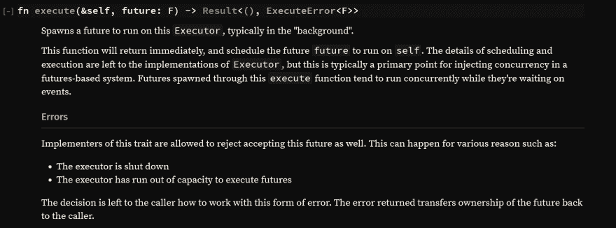

# 锈期货:一个未受教育，短，希望不无聊的教程-第 5 部分-流

> 原文:[https://dev . to/mind flavor/rust-futures-an-uneducated-short-and-hope-not-boring-tutorial-part-5-streams-5i 8](https://dev.to/mindflavor/rust-futures-an-uneducated-short-and-hopefully-not-boring-tutorial---part-5---streams-5i8)

## [T1】简介](#intro)

在我们的上一篇文章中，我们看到了如何构建一个完整的未来。作为一个人为的例子，我们看到了对未来的期望:不要尽可能地阻塞，只在必要的时候才打开任务。在本帖中，我们将扩展未来以返回一个`stream`值。

流类似于迭代器:随着时间的推移，它们会产生多个相同类型的输出。这里唯一的区别是我们如何消费它们。我们不使用 Rust 的`for`语句，而是让我们的`reactor`为我们做这件事。怎么会？

## ForEach 组合子

我们使用一个名为[的特定组合子来代替手工在一个`stream`的条目之间迭代。但是...`ForEach`实现了`Future`,所以我们可以将它传递给`reactor`,甚至是链、连接等...有了其他的未来！真的很酷。](http://alexcrichton.com/futures-rs/futures/stream/trait.Stream.html#method.for_each)

我们造一个吧，好吗？

## 导入流

`Stream`特征与`Future`特征非常相似:

```
pub trait Future {
    type Item;
    type Error;
    fn poll(&mut self) -> Poll<Self::Item, Self::Error>;

    // <-- CUT -->
}

pub trait Stream {
    type Item;
    type Error;
    fn poll(&mut self) -> Poll<Option<Self::Item>, Self::Error>;

    // <-- CUT -->
} 
```

<svg width="20px" height="20px" viewBox="0 0 24 24" class="highlight-action crayons-icon highlight-action--fullscreen-on"><title>Enter fullscreen mode</title></svg> <svg width="20px" height="20px" viewBox="0 0 24 24" class="highlight-action crayons-icon highlight-action--fullscreen-off"><title>Exit fullscreen mode</title></svg>

这两种特征都有更多的功能；因为那些函数有默认值，所以如果你不需要的话，你就不需要实现它们。让我们来关注一下`poll`函数:

```
 // Future
    fn poll(&mut self) -> Poll<Self::Item, Self::Error>;

    // Stream
    fn poll(&mut self) -> Poll<Option<Self::Item>, Self::Error>; 
```

<svg width="20px" height="20px" viewBox="0 0 24 24" class="highlight-action crayons-icon highlight-action--fullscreen-on"><title>Enter fullscreen mode</title></svg> <svg width="20px" height="20px" viewBox="0 0 24 24" class="highlight-action crayons-icon highlight-action--fullscreen-off"><title>Exit fullscreen mode</title></svg>

特性可以选择返回一个项目。未来必须这样做。这里的约定是:如果您的流有更多的数据要生成并且随时可用，则返回一个`Ok(Async::Ready(Some(t)))`。如果要生成的数据还没有准备好，返回一个`Ok(Async::NotReady)`。如果你完成了返回`Ok(Async::Ready(None))`。如果有错误，你可以照常返回`Err(e)`。所以，总结一下:

| 情况 | `Future` | `Stream` |
| --- | --- | --- |
| 准备退货的项目 | `Ok(Async::Ready(t))` | `Ok(Async::Ready(Some(t)))` |
| 要退回的项目未准备好 | `Ok(Async::NotReady)` | `Ok(Async::NotReady)` |
| 没有更多的项目要返回 | 不适用 | `Ok(Async::Ready(None))` |
| 错误 | `Err(e)` | `Err(e)` |

## 简单流

让我们构建一个非常简单的`stream`:返回从 0 到 x 的整数。让我们先看看代码:

```
struct MyStream {
    current: u32,
    max: u32,
}

impl MyStream {
    pub fn new(max: u32) -> MyStream {
        MyStream {
            current: 0,
            max: max,
        }
    }
}

impl Stream for MyStream {
    type Item = u32;
    type Error = Box<Error>;

    fn poll(&mut self) -> Poll<Option<Self::Item>, Self::Error> {
        match self.current {
            ref mut x if *x < self.max => {
                *x = *x + 1;
                Ok(Async::Ready(Some(*x)))
            }
            _ => Ok(Async::Ready(None)),
        }
    }
} 
```

<svg width="20px" height="20px" viewBox="0 0 24 24" class="highlight-action crayons-icon highlight-action--fullscreen-on"><title>Enter fullscreen mode</title></svg> <svg width="20px" height="20px" viewBox="0 0 24 24" class="highlight-action crayons-icon highlight-action--fullscreen-off"><title>Exit fullscreen mode</title></svg>

这里重要的部分是`poll`函数。`poll`接受了`self`的可变引用，因此我们可以改变内部字段。我们这样做是为了检查我们是否返回了最后一个数字(`max`)，然后要么终止流，要么返回实际的数字并递增它。

请注意，虽然这里我们有一个上限，但并不强迫您指定它。所以我们可以从这里返回所有的数字到无穷大(或者溢出，以先出现的为准:)。

## 消耗一个流

要使用一个流，我们可以使用前面看到的`for_each`组合子。让我们打印这些数字:

```
let mut reactor = Core::new().unwrap();
let my_stream = MyStream::new(5);

let fut = my_stream.for_each(|num| {
    println!("num === {}", num);
    ok(())
}); 
```

<svg width="20px" height="20px" viewBox="0 0 24 24" class="highlight-action crayons-icon highlight-action--fullscreen-on"><title>Enter fullscreen mode</title></svg> <svg width="20px" height="20px" viewBox="0 0 24 24" class="highlight-action crayons-icon highlight-action--fullscreen-off"><title>Exit fullscreen mode</title></svg>

我不会公布结果来破坏惊喜:)。无论如何，注意每个闭包本身都是一个`future`。您可以看出这一点，因为我们正在调用`ok(())`小写函数。
我们可以像往常一样调用其他期货，将其连锁等等。在我们的例子中，我们只是返回 ok。

## 在事件循环期间产生期货

有时，当在流中生产项目时，我们可能希望产生其他未来。这样做有各种原因(主要是:能帮就不要挡！).Rust 的`future`允许你使用`reactor`的[执行](https://docs.rs/futures/0.1/futures/future/trait.Executor.html#tymethod.execute)功能将期货添加到现有的事件循环中。然而，有一个问题:衍生的未来不能返回任何东西。函数签名是这样的:

[T2】](https://res.cloudinary.com/practicaldev/image/fetch/s--cAIokJpd--/c_limit%2Cf_auto%2Cfl_progressive%2Cq_auto%2Cw_880/https://thepracticaldev.s3.amazonaws.com/i/7no57mi1pa9ex1cwcxln.png)

例如，我们使用了之前文章中写的稍微修改过的*等待另一个线程* `future`。我们这样修改我们的流:

```
impl Stream for MyStream {
    type Item = u32;
    type Error = Box<Error>;

    fn poll(&mut self) -> Poll<Option<Self::Item>, Self::Error> {
        use futures::future::Executor;

        match self.current {
            ref mut x if *x < self.max => {
                *x = *x + 1;

                self.core_handle.execute(WaitInAnotherThread::new(
                    Duration::seconds(2),
                    format!("WAIT {:?}", x),
                ));
                Ok(Async::Ready(Some(*x)))
            }
            _ => Ok(Async::Ready(None)),
        }
    }
} 
```

<svg width="20px" height="20px" viewBox="0 0 24 24" class="highlight-action crayons-icon highlight-action--fullscreen-on"><title>Enter fullscreen mode</title></svg> <svg width="20px" height="20px" viewBox="0 0 24 24" class="highlight-action crayons-icon highlight-action--fullscreen-off"><title>Exit fullscreen mode</title></svg>

这里重要的部分是`execute`代码。在这里，我们在事件循环中产生了另一个未来(一个只等待两秒钟然后打印`WAIT <number>`的未来)。记住，这应该是一个类似*守护进程的* `future`，所以它不能返回任何东西(除了一个错误)。

为了测试这一点，我们将使用以下代码:

```
fn main() {
    let mut reactor = Core::new().unwrap();

    // create a Stream returning 5 items
    // Each item will spawn an "inner" future
    // into the same reactor loop
    let my_stream = MyStream::new(5, reactor.handle());

    // we use for_each to consume
    // the stream
    let fut = my_stream.for_each(|num| {
        println!("num === {:?}", num);
        ok(())
    });

    // this is a manual future. it's the same as the
    // future spawned into our stream
    let wait = WaitInAnotherThread::new(Duration::seconds(3), "Manual3".to_owned());

    // we join the futures to let them run concurrently
    let future_joined = fut.map_err(|err| {}).join(wait);

    // let's run the future
    let ret = reactor.run(future_joined).unwrap();
    println!("ret == {:?}", ret);
} 
```

<svg width="20px" height="20px" viewBox="0 0 24 24" class="highlight-action crayons-icon highlight-action--fullscreen-on"><title>Enter fullscreen mode</title></svg> <svg width="20px" height="20px" viewBox="0 0 24 24" class="highlight-action crayons-icon highlight-action--fullscreen-off"><title>Exit fullscreen mode</title></svg>

这里我们还展示了如何将一个`stream`和一个`future`连接起来。像以前一样，需要“T2”舞蹈来兼容错误(见 [Rust futures:一个未受教育的、简短的、希望不无聊的教程——第二部分](https://dev.to/mindflavor/rust-futures-an-uneducated-short-and-hopefully-not-boring-tutorial---part-2-8dd))。

如果我们运行这段代码，您会看到如下输出:

```
num === 1
num === 2
num === 3
num === 4
num === 5
"Manual3" starting the secondary thread!
"Manual3" not ready yet! parking the task.
"WAIT 1" starting the secondary thread!
"WAIT 1" not ready yet! parking the task.
"WAIT 2" starting the secondary thread!
"WAIT 2" not ready yet! parking the task.
"WAIT 3" starting the secondary thread!
"WAIT 3" not ready yet! parking the task.
"WAIT 4" starting the secondary thread!
"WAIT 4" not ready yet! parking the task.
"WAIT 5" starting the secondary thread!
"WAIT 5" not ready yet! parking the task.
"WAIT 1" the time has come == 2017-12-06T10:23:30.853796527Z!
"WAIT 1" ready! the task will complete.
"WAIT 2" the time has come == 2017-12-06T10:23:30.853831227Z!
"WAIT 2" ready! the task will complete.
"WAIT 3" the time has come == 2017-12-06T10:23:30.853842927Z!
"WAIT 3" ready! the task will complete.
"WAIT 5" the time has come == 2017-12-06T10:23:30.853856927Z!
"WAIT 5" ready! the task will complete.
"WAIT 4" the time has come == 2017-12-06T10:23:30.853850427Z!
"WAIT 4" ready! the task will complete.
"Manual3" the time has come == 2017-12-06T10:23:31.853775627Z!
"Manual3" ready! the task will complete.
ret == ((), ()) 
```

<svg width="20px" height="20px" viewBox="0 0 24 24" class="highlight-action crayons-icon highlight-action--fullscreen-on"><title>Enter fullscreen mode</title></svg> <svg width="20px" height="20px" viewBox="0 0 24 24" class="highlight-action crayons-icon highlight-action--fullscreen-off"><title>Exit fullscreen mode</title></svg>

注意，即使我们在任务 4 的之后产生了任务 5 的**,完成顺序也是混乱的。此外，您的输出可能会有所不同。**

但是，如果我们不加入“等待 3 秒钟”会怎么样？

修改后的代码是这样的:

```
fn main() {
    let mut reactor = Core::new().unwrap();

    // create a Stream returning 5 items
    // Each item will spawn an "inner" future
    // into the same reactor loop
    let my_stream = MyStream::new(5, reactor.handle());

    // we use for_each to consume
    // the stream
    let fut = my_stream.for_each(|num| {
        println!("num === {:?}", num);
        ok(())
    });

    // let's run the future
    let ret = reactor.run(fut).unwrap();
    println!("ret == {:?}", ret);
} 
```

<svg width="20px" height="20px" viewBox="0 0 24 24" class="highlight-action crayons-icon highlight-action--fullscreen-on"><title>Enter fullscreen mode</title></svg> <svg width="20px" height="20px" viewBox="0 0 24 24" class="highlight-action crayons-icon highlight-action--fullscreen-off"><title>Exit fullscreen mode</title></svg>

我们会注意到代码几乎会立即返回这个输出:

```
num === 1
num === 2
num === 3
num === 4
num === 5
ret == () 
```

<svg width="20px" height="20px" viewBox="0 0 24 24" class="highlight-action crayons-icon highlight-action--fullscreen-on"><title>Enter fullscreen mode</title></svg> <svg width="20px" height="20px" viewBox="0 0 24 24" class="highlight-action crayons-icon highlight-action--fullscreen-off"><title>Exit fullscreen mode</title></svg>

*背景*期货没有得到运行的机会。

## 下一步

在接下来的文章中，我们至少会涉及到`await!`宏观，以简化我们的未来。

* * *

快乐编码

弗朗切斯科·科努