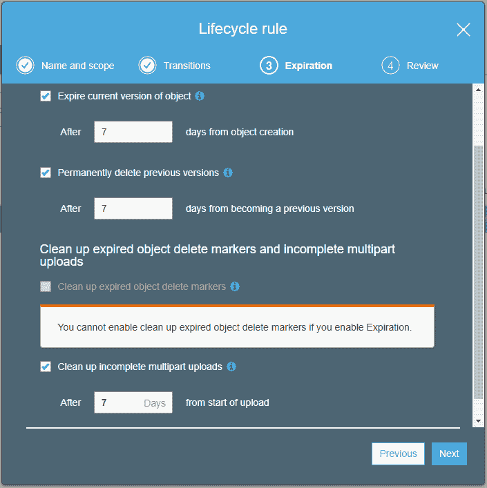

# MS SQL Server 备份到 S3—在 Linux 上！

> 原文:[Linux 上的 https://dev.to/lukebearl/ms-sql-server-backups-to-s3 丹](https://dev.to/lukebearl/ms-sql-server-backups-to-s3--on-linux-dan)

这原本是写在[卢克的个人博客](https://lukebearl.com/2017/12/ms-sql-server-backups-to-s3-on-linux/)上。

今天，我将介绍在 Linux 上对 SQL Server Express 进行完整备份和事务日志备份的必要条件。SQL Express 的一个很大的局限性是它不包括 SQL 代理，因此通常可以在 SSMS 中设计和实现的大多数维护任务都需要重新考虑。令人欣慰的是，微软为 Linux 发布了`sqlcmd`,这使得通过 cron 调度简单的 bash 脚本进行备份变得非常容易。

## 先决条件

这篇文章不会介绍安装 SQL Server 和相关工具的所有步骤，但是微软已经在他们的文档网站上做了很好的记录。为了将备份推送到 S3，我们需要`s3cmd`工具:

```
apt install s3cmd
s3cmd --configure 
```

您需要有一个 IAM 身份，至少有足够的权限写入您在脚本中指定的 S3 存储桶。在配置提示中包括键，并指定您想要默认的区域。

## 脚本

为了进行备份，需要两个脚本:一个用于完整备份，另一个用于事务日志备份。我选择了一个非常简单的结构，因为我只关心一个数据库，修改脚本为每个数据库生成备份应该不是很难，但是我将把它留给读者作为练习:)。

### 完整数据库备份(fullBackup.sh)

```
TIMESTAMP=$(date +"%F")
BACKUP_DIR="/var/opt/mssql/backup/$TIMESTAMP"
SA_USER="SA"
SA_PASS="<Your_SA_User_Password>"

mkdir -p "$BACKUP_DIR"

chown -R mssql:mssql $BACKUP_DIR

sqlcmd -S localhost -Q "BACKUP DATABASE [<DBNAME>] TO DISK = N'$BACKUP_DIR/<DBNAME>.bak' WITH NOFORMAT, NOINIT, SKIP, NOREWIND, STATS=10" -U $SA_USER -P $SA_PASS

s3cmd put "$BACKUP_DIR/<DBNAME>.bak" "s3://<BUCKET_NAME>/$TIMESTAMP/<DBNAME>.bak"
rm -f "$BACKUP_DIR/<DBNAME>.bak" 
```

### 事务日志备份(logBackup.sh)

```
DATESTAMP=$(date +"%F")
TIMESTAMP=$(date +"%H%M%S")
BACKUP_DIR="/var/opt/mssql/backup/$DATESTAMP/logs/$TIMESTAMP"
SA_USER="SA"
SA_PASS="<Your_SA_User_Password>"

mkdir -p "$BACKUP_DIR"

chown -R mssql:mssql $BACKUP_DIR

sqlcmd -S localhost -Q "BACKUP LOG [<DBNAME>] TO DISK = N'$BACKUP_DIR/<DBNAME>_log.bak' WITH NOFORMAT, NOINIT, SKIP, NOREWIND, NOUNLOAD, STATS=5" -U SA -P $SA_PASS

s3cmd put "$BACKUP_DIR/<DBNAME>_log.bak" "s3://<BUCKET_NAME>/$DATESTAMP/logs/$TIMESTAMP/<DBNAME>_log.bak"

rm -f "$BACKUP_DIR/<DBNAME>_log.bak" 
```

然后在 cron 中调度它们:

```
0 0 * * * /root/bin/fullBackup.sh
*/15 * * * * /root/bin/logBackup.sh 
```

按照我的默认计划，完整备份在午夜进行，事务日志备份每 15 分钟进行一次。

## S3 生命周期

虽然脚本做了很好的清理工作，但 S3(根据设计)永远不会删除你的数据，除非你明确告诉它这样做。S3 有一个叫做“生命周期”的漂亮特性，它允许我们为对象保留指定规则(这是一个强大的特性，也可以用于许多其他事情)。要访问它，请到 AWS 控制台并进入您的 S3 桶。按照以下步骤设置对象保留:

1.  选择管理选项卡
2.  选择生命周期
3.  单击+添加生命周期规则
4.  给规则起一个描述性的名字(“过期所有文件”)。将前缀留空
5.  将配置转换留空
6.  在到期设置以下选项:
7.  单击保存

## 如此而已

此时，我们已经配置了完整备份和事务日志备份，并将它们推送到非现场的亚马逊 S3。这些备份在 7 天后被软删除，在 14 天后被完全删除。