# 重新实现脸书的反应动画

> 原文：<https://dev.to/huytd/re-implementing-facebooks-reaction-animation-bee>

*最初发布于[我的博客](https://huytd.github.io/reimplementing-facebook-animation.html)T3】*

* * *

**免责声明:**我不是脸书的工程师，也不知道他们是怎么做出来的。这只是我自己的实现。它可能没有最好的性能，我只是在 Chrome 上进行了测试😅

[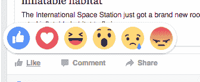](https://res.cloudinary.com/practicaldev/image/fetch/s--RIF-5tza--/c_limit%2Cf_auto%2Cfl_progressive%2Cq_auto%2Cw_880/https://cdn-images-1.medium.com/max/800/1%2AFcJ1dMlhikUNkUv7GSlv3A.png) 
*脸书的反应弹出——或者随便它叫什么*

如果你是一个 Facebooker 用户，你可能会每天使用这个弹出窗口。

在这篇博文中，我们将学习如何实现它。HTML/CSS 和一点 JavaScript。

# 分解动画

好的。让我们一步一步地分解，这样我们会详细地看到和理解动画。

动画有两个阶段:**显示阶段**和**鼠标悬停阶段**。

为了简单起见，这是您的新闻订阅源的简化版本。绿色矩形是 Like 按钮所在的位置，当你将鼠标悬停在它上面时，会出现一个黄色的弹出窗口(实际上是白色的)。

[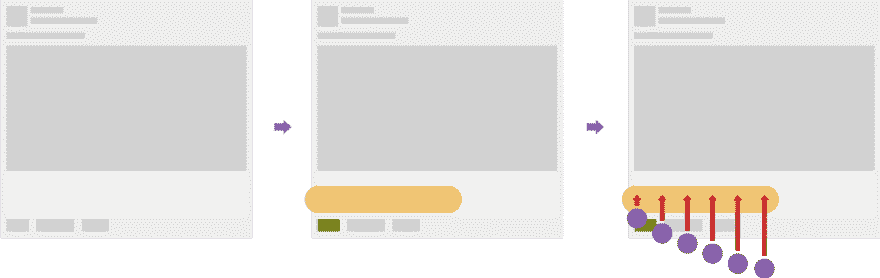T2】](https://res.cloudinary.com/practicaldev/image/fetch/s--gvPpHYtP--/c_limit%2Cf_auto%2Cfl_progressive%2Cq_auto%2Cw_880/https://cdn-images-1.medium.com/max/1000/1%2ANzur1ShozSVqzDh9nwgrBg.png)

然后，表情符号上升，一个接一个。这里的红色箭头告诉我们表情符号的动画方向。

如果我们仔细观察每个表情符号，你会发现它在动画中有缓和效果，就像这样:

[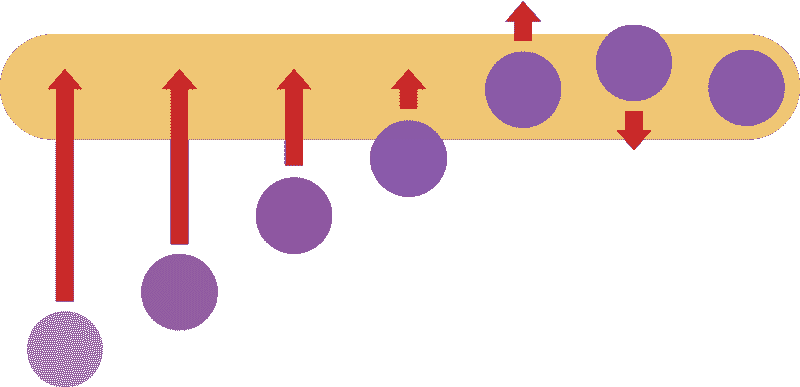T2】](https://res.cloudinary.com/practicaldev/image/fetch/s--R3JbGlUM--/c_limit%2Cf_auto%2Cfl_progressive%2Cq_auto%2Cw_880/https://cdn-images-1.medium.com/max/800/0%2A5Ky7VV0gTNcl0koU.png)

当所有表情完成其动画，第一阶段(显示)完成。

当用户将鼠标悬停在表情图标上时，第二阶段(鼠标悬停)开始。

[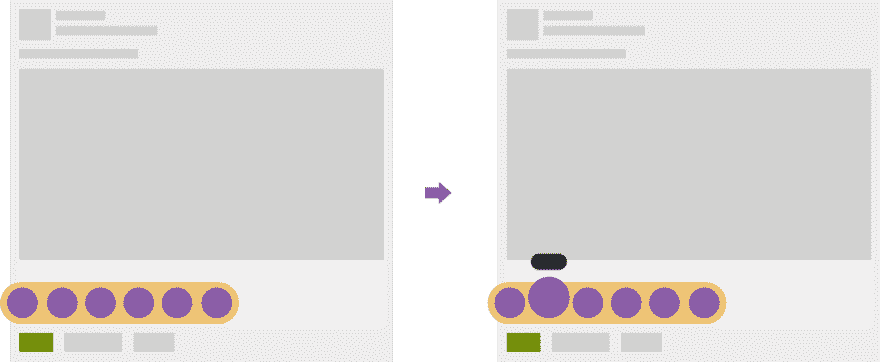T2】](https://res.cloudinary.com/practicaldev/image/fetch/s--IB_OWMRO--/c_limit%2Cf_auto%2Cfl_progressive%2Cq_auto%2Cw_880/https://cdn-images-1.medium.com/max/1000/1%2AuMheySPloQiUHzoipvqVBQ.png)

选中的表情会放大一点，顶部会出现一个黑色标签，告诉我们这个表情的名字是什么。

没那么复杂吧。

# 生实现

现在，我们开始实施。开始时，我们只是实现原始的 HTML 结构，用 CSS 添加一些基本的动作，这部分没有动画。

建议使用 Codepen.io 进行原型制作，因此我们有了实时预览、移动中的 SCSS 编译……

但是你可以在你的本地机器上写代码，这取决于你。我们所需要的是:HTML、SCSS 和 jQuery(或者你可以将本文末尾的 jQuery 代码转换成普通的 JS 或任何你想要的东西)

## 构建新闻订阅源的原型

因此，我们想创建一个新闻提要条目，并向它添加一个 Like 按钮。

HTML 代码:

```
<div class="feed"> 
  <a class="like-btn"></a> 
</div> 
```

Enter fullscreen mode Exit fullscreen mode

CSS (SCSS):

```
html,
body {
    padding: 20px;
    font-family: sans-serif;
}
.feed {
    width: 500px;
    height: 473px;
    background-image: url(<path-to-placeholder-image>);
    position: relative;
    .like-btn {
        width: 44px;
        height: 25px;
        background: #D0D0D0;
        position: absolute;
        bottom: 13px;
        left: 13px;
        cursor: pointer;
        &:hover {
            background: #718C00;
        }
    }
} 
```

Enter fullscreen mode Exit fullscreen mode

您可以复制下面图片的 URL 并替换为`<path-to-placeholder-image>`，或者在 Imgur 上使用上传的图片[。](http://i.imgur.com/HckmGbj.png)

[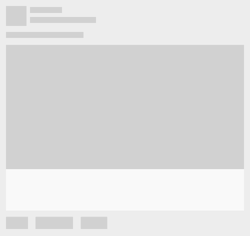](https://res.cloudinary.com/practicaldev/image/fetch/s--rCjJBNlU--/c_limit%2Cf_auto%2Cfl_progressive%2Cq_auto%2Cw_880/https://cdn-images-1.medium.com/max/800/1%2AxJwaLxGbCvBVBVcRZl_sjA.png) 
*复制这张图片的 URL 作为占位符图片*

现在你有了新闻提要的原型，试着将鼠标悬停在 Like 按钮上，看到了吗？是绿色的！现在天气凉爽了，不是吗？

## 显示反应框

下一步是添加反应盒。这将是一个带圆角的 **312x55** 像素矩形。

只有当用户悬停在 Like 按钮上时，反应框才会出现。

好，我们创建一个 div，类名是`reaction-box`，放在 Like 按钮里面。

HTML 代码:

```
<div class="feed"> 
  <a class="like-btn"> 
    <div class="reaction-box"></div> 
  </a> 
</div> 
```

Enter fullscreen mode Exit fullscreen mode

我们的反应框将被隐藏，所以我们将其显示属性设置为 none。在 Like button 的`:hover`事件中，我们将其设置回`block`。

CSS (SCSS):

```
.like-btn { 
  ... 

  .reaction-box { 
    position: absolute; 
    width: 312px; height: 55px; 
    background: #F0C674; 
    border-radius: 28px; 
    left: -25px; bottom: 25px; 
    display: none; 
  } 

  &:hover { 
    ... 

    .reaction-box { 
      display: block; 
    } 
  } 
} 
```

Enter fullscreen mode Exit fullscreen mode

这是结果:

[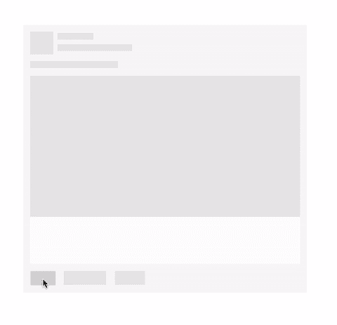T2】](https://res.cloudinary.com/practicaldev/image/fetch/s--XMdh_KyM--/c_limit%2Cf_auto%2Cfl_progressive%2Cq_66%2Cw_880/https://cdn-images-1.medium.com/max/800/0%2A4oEgO5pJQP54ZznK.gif)

## 添加表情符号

现在我们已经显示了反应框，让我们添加一些表情符号，这样看起来就像真正的脸书🤗

因为我们只是在做原型，所以，就用小圆圈来代表我们的表情符号。

这是一个表情符号的 HTML 结构:

```
<div class="reaction-icon"> 
  <label>Like</label> 
</div> 
```

Enter fullscreen mode Exit fullscreen mode

我们还需要一个标签，这样我们就可以向用户显示这个表情的名称。

让我们添加 6 个反应图标来代表真实的脸书的反应:*喜欢，喜欢，哈哈，哇，难过*和*生气*。把它们放在反应箱里。

然后，我们使用 CSS 变换来放大鼠标悬停事件中的这些表情符号。

HTML 代码:

```
...
<div class="reaction-box">
    <div class="reaction-icon">
        <label>Like</label>
    </div>
    <div class="reaction-icon">
        <label>Love</label>
    </div>
    <div class="reaction-icon">
        <label>Haha</label>
    </div>
    <div class="reaction-icon">
        <label>Wow</label>
    </div>
    <div class="reaction-icon">
        <label>Sad</label>
    </div>
    <div class="reaction-icon">
        <label>Angry</label>
    </div>
</div> 
... 
```

Enter fullscreen mode Exit fullscreen mode

将此 CSS 插入反应框:

CSS (SCSS):

```
.reaction-box {
  ...
  // insert here
  .reaction-icon {
    width: 40px;
    height: 40px;
    display: inline-block;
    background: #8959A8;
    border-radius: 20px;
    margin: 8px -1px 0 8px;
    text-align: center;

    label {
      padding: 3px 5px 3px 5px;
      position: relative;
      top: -24px;
      border-radius: 10px;
      font-size: 11px;
      color: #FFF;
      background: #333;
    }
  }
} 
```

Enter fullscreen mode Exit fullscreen mode

并将其插入 Like 按钮的`:hover`事件中。

```
&:hover {
  ... 

  .reaction-box {
    ... 

    .reaction-icon:hover {   // changed here!
      transform: scale(1.4);
      transform-origin: bottom;
    }
  }
} 
```

Enter fullscreen mode Exit fullscreen mode

当用户将鼠标悬停在喜欢按钮上时，我们将表情放大 1.4 倍。我们还将`transform-origin`属性设置为 bottom，因此放大效果的原点将在表情的底部边缘。

这就是结果:

[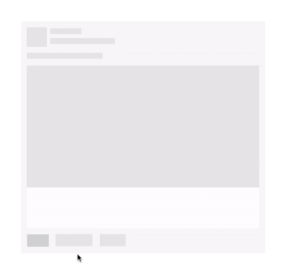T2】](https://res.cloudinary.com/practicaldev/image/fetch/s--krMGGkD9--/c_limit%2Cf_auto%2Cfl_progressive%2Cq_66%2Cw_880/https://cdn-images-1.medium.com/max/800/0%2A3WebZQ_7XuIOB9TN.gif)

## 你看到 bug 了吗？

您可能会注意到，反应框离“喜欢”按钮太近了，不应该这样。向上移动一点怎么样？

好了，既然反应盒有一个绝对位置，让我们把它的底部属性从`25px`改成`35px` (10px 上)

```
.reaction-box { 
  ... left: -25px; bottom: 35px; 
  ... 
```

Enter fullscreen mode Exit fullscreen mode

现在看起来好多了，对吧？但是等等！WT*？？坏了！我再也不能把鼠标悬停在反应框上了！！你做了什么？？？你为什么打破我的密码？？？

[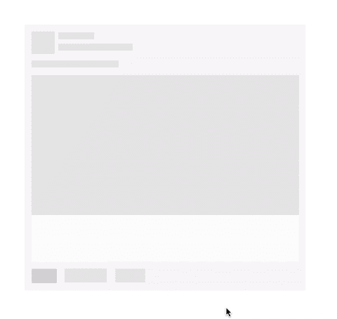T2】](https://res.cloudinary.com/practicaldev/image/fetch/s--xNzMmaxY--/c_limit%2Cf_auto%2Cfl_progressive%2Cq_66%2Cw_880/https://cdn-images-1.medium.com/max/800/0%2AYlU4lgZ8s7kYk1zv.gif)

好的。冷静点。让我们后退一步，看看代码。

原因是反应框和 Like 按钮之间的距离现在增加到了`10px`，因此，当您试图将光标移动到反应框时，它会离开 Like 按钮的悬停区域，因此会触发鼠标离开事件。如果你看一下 CSS 规则，你可以看到我们根据 Like 按钮的悬停事件来显示反应框。在鼠标离开时，反应框将回到其原始状态(`display: none`)

解决方法是:增加 Like 按钮的悬停区域，这样可以填充到反应框的距离。

有许多方法可以做到这一点，我们将采取最简单的方法:添加`::before`伪元素到 Like 按钮，它将是一个大小为`44x10`的框，它是透明的，所以用户看不到它，但它会填充到反应框的距离。

```
.like-btn { 
  ... 

  &::before { 
    content: "."; 
    opacity: 0; 
    display: block; 
    width: 44px; height: 10px; 
    position: absolute; 
    top: -10px; left: 0; 
  } 
```

Enter fullscreen mode Exit fullscreen mode

现在您可以刷新页面了。现在应该没事了:)

## 仅在鼠标悬停时显示表情标签

接下来要做的是隐藏所有表情符号的标签，并在用户悬停在每个表情符号上时显示它们。

```
label { 
   ... visibility: hidden; 
} 
```

Enter fullscreen mode Exit fullscreen mode

然后在反应图标的`:hover`事件中显示出来(表情)。

```
.reaction-icon:hover { 
   ... 
   label { 
      visibility: visible; 
   } 
} 
```

Enter fullscreen mode Exit fullscreen mode

这是结果:

[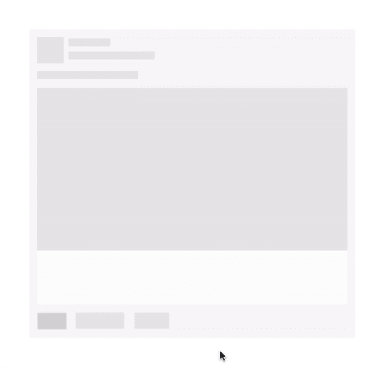T2】](https://res.cloudinary.com/practicaldev/image/fetch/s--vIp1tvaM--/c_limit%2Cf_auto%2Cfl_progressive%2Cq_66%2Cw_880/https://cdn-images-1.medium.com/max/800/0%2AgANROpNDCZ71L6lE.gif)

好吧，让我们在这里休息一下。帖子很长，你需要休息，我也是=]]

你可以在这里修改这个原始实现阶段的完整代码:[Codepen——脸书反应动画——第一部分](http://codepen.io/huytd/pen/ZOEoMe)。

# 添加动画

现在，让痛苦开始吧。在这一部分，我们将实现一些动画来给用户更好的感觉。

## 表情缩放动画

先说最简单的。我们会通过添加过渡来慢慢缩放表情:全 0.3s 表情符号的属性:

CSS (SCSS):

```
reaction-icon { 
   ... 
   // Animation  transition: all 0.3s; 
```

Enter fullscreen mode Exit fullscreen mode

通过添加带有`all`和`0.3s`参数的过渡，我们告诉浏览器，表情符号的所有属性都可以在`0.3`秒的持续时间内动画化(缓慢变化)。

这是我们的第一个动画:

[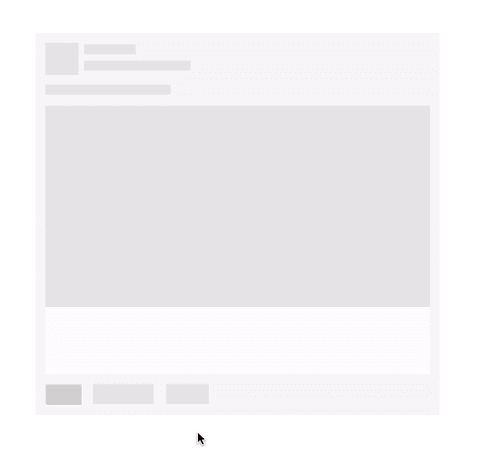T2】](https://res.cloudinary.com/practicaldev/image/fetch/s--MAJcGnvs--/c_limit%2Cf_auto%2Cfl_progressive%2Cq_66%2Cw_880/https://cdn-images-1.medium.com/max/800/0%2A2ne_o-UDUnQ8eexr.gif)

如果你对`transition`一无所知，你可能想阅读这篇文章[使用 CSS 转换——MDN](https://developer.mozilla.org/en-US/docs/Web/CSS/CSS_Transitions/Using_CSS_transitions)。

## 表情的展示动画

让我们再看一遍展示动画:

[T2】](https://res.cloudinary.com/practicaldev/image/fetch/s--Ti35fvsl--/c_limit%2Cf_auto%2Cfl_progressive%2Cq_auto%2Cw_880/https://cdn-images-1.medium.com/max/800/0%2AYC6_ONVx03CkCIzn.png)

这个动画可以用图表来表示:

[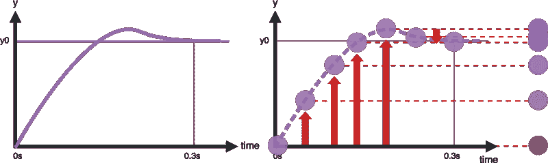T2】](https://res.cloudinary.com/practicaldev/image/fetch/s--3LJBppbb--/c_limit%2Cf_auto%2Cfl_progressive%2Cq_auto%2Cw_880/https://cdn-images-1.medium.com/max/800/0%2AXjJATseUYcp6n4nP.png)

如你所见，y 轴代表表情在一段时间内的 y 位置。

代表上图的函数也是我们可以控制属性如何随时间变化的方式，他们称之为:缓动函数(或计时函数)。

在 CSS 转换中，我们可以使用 transition-timing-function 属性来设置元素的计时功能。

你应该在这里阅读更多关于定时功能的内容[定时功能— MDN](https://developer.mozilla.org/en-US/docs/Web/CSS/timing-function) 。

我们这里要使用的计时函数是`easeOutBack`，它是一个贝塞尔曲线，可以在 CSS 中使用`cubic-bezier()`函数来定义。

我们将使用预定义的`cubic-bezier()`函数为`easeOutBack` from here [缓动函数— easeOutBack](http://easings.net/#easeOutBack) 。

```
cubic-bezier(0.175, 0.885, 0.32, 1.275) 
```

Enter fullscreen mode Exit fullscreen mode

将此功能添加到`reaction-icon`的`transition`属性:

```
.reaction-icon { 
   ... 
   // Animation  transition: all 0.3s cubic-bezier(0.175, 0.885, 0.32, 1.275); 
```

Enter fullscreen mode Exit fullscreen mode

表情符号将出现，起始不透明度为 0，缩放比例为 0，位置距离所需位置 100 像素——我们称之为第一状态。

```
.reaction-icon { 
   ... 
   // Animation  opacity: 0; 
   transform: translate(0, 100px) scale(0); 
```

Enter fullscreen mode Exit fullscreen mode

现在我们添加一个新的类来定义它动画的最终状态，姑且称之为`.show`，放在喜欢按钮的`:hover`事件:

```
&:hover { 
   ... 
   .reaction-box { 
      ... 
      .reaction-icon { 
         &.show { 
            opacity: 1; 
            transform: translate(0, 0) scale(1); 
         } 
```

Enter fullscreen mode Exit fullscreen mode

那么，这里会发生什么？当用户悬停在 Like 按钮上时，我们搜索表情图标并分配类`.show`来激活动画。我们可以用 JavaScript 来做(jQuery - lol，没关系，别的都可以):

```
$(function() {
    $(".like-btn").hover(function() {
        $(".reaction-icon").each(function(index, element) {
            setTimeout(function() {
                $(element).addClass("show");
            }, index * 100);
        });
    }, function() {
        $(".reaction-icon").removeClass("show")
    });
}) 
```

Enter fullscreen mode Exit fullscreen mode

你可能注意到了`setTimeout()`，我们用它来延迟每个表情符号上的`addClass`动作，基于它的索引。从第一个表情符号(指数= 0)到最后一个表情符号(指数= 5)，我们有特定的延迟时间是 0，100 毫秒，200 毫秒，300 毫秒，400 毫秒和 500 毫秒。于是我们就有了表情包秀出来的追逐效应。

现在刷新并查看:

[T2】](https://res.cloudinary.com/practicaldev/image/fetch/s--b7i1PyG2--/c_limit%2Cf_auto%2Cfl_progressive%2Cq_66%2Cw_880/https://cdn-images-1.medium.com/max/800/0%2AiZ0mNTv2DGVWzo9e.gif)

我们完了！

如果你在这篇文章中间的某个地方迷路了，不要惊慌，让我们前往这个页面查看源代码: [Codepen —脸书反应动画—第二部分](http://codepen.io/huytd/pen/beGKWB)。

剩下要做的是重新定义元素，以获得更真实的结果，如下所示:

[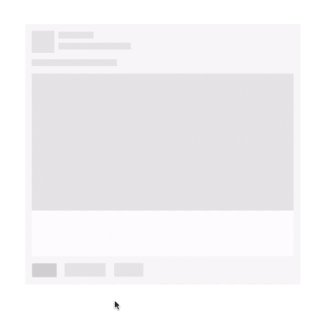T2】](https://res.cloudinary.com/practicaldev/image/fetch/s--elwUIX4z--/c_limit%2Cf_auto%2Cfl_progressive%2Cq_66%2Cw_880/https://cdn-images-1.medium.com/max/800/0%2A18lv6hj6T_R-epu8.gif)

点击这里查看更高分辨率的视频[https://gfycat.com/ZigzagForthrightCob](https://gfycat.com/ZigzagForthrightCob)。

如果你想要更多的改进，你可以考虑亚马逊的神奇三角(以及[在这里的实现](https://css-tricks.com/dropdown-menus-with-more-forgiving-mouse-movement-paths/))在移动光标时更加稳定。

希望你喜欢这篇文章。如果您发现任何错误或有任何问题，请随时留下评论，以便我们讨论。

下一篇文章再见。快乐的^^