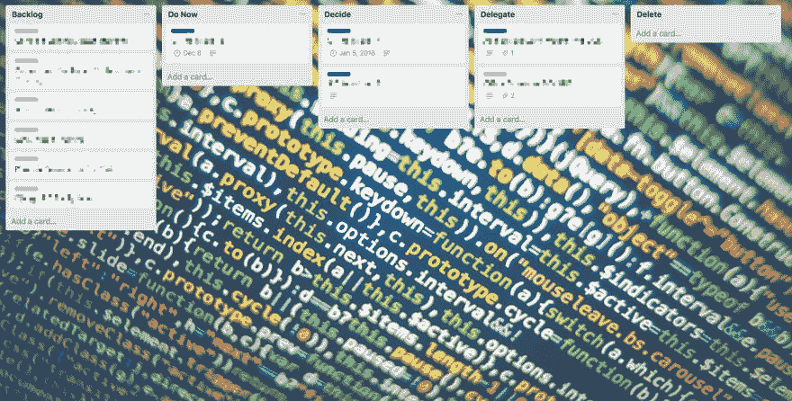

# 用艾森豪威尔矩阵粉碎软件缺陷

> 原文:[https://dev . to/nikoheikkila/squashing-software-defects-with-Eisenhower-matrix-792](https://dev.to/nikoheikkila/squashing-software-defects-with-eisenhower-matrix-792)

*这篇文章最初以另一种语言出现在我的 [LinkedIn 个人资料](https://www.linkedin.com/in/nikoheikkila/)中。*

在我的工作和个人生活中，我使用过太多的项目管理工具，但只有 Trello 坚持下来了。然而，即使是特雷罗也是无用的，除非你开始系统地管理你的董事会。

当然，特雷罗的半敏捷默认流程(*做* → *做* → *完成*)很简单，但尤其对我来说，它带有不开始实际工作的明显风险。令人高兴(或悲伤)的是，这些卡片一直留在我不断增长的待办事项清单上。

我更喜欢使用的是一种流行的方法，通常被称为[艾森豪威尔矩阵](http://eisenhower-matrix.com/)。简而言之，它包括四个类别(或 Trello 中的列表)。他们如下:

1.  现在就做:接下来或尽快做这些事情。
2.  决定:你不需要现在就做这些事情，但一定要在不久的将来设定一个截止日期。
3.  不要在这些事情上浪费你的脑力，看看是否有其他人可以代替你。
4.  有时，即使经过最仔细的研究，你也不得不放弃或拒绝一项任务，要么太含糊，要么暂时无关紧要。

[T2】](https://res.cloudinary.com/practicaldev/image/fetch/s--neizJeNH--/c_limit%2Cf_auto%2Cfl_progressive%2Cq_auto%2Cw_880/https://thepracticaldev.s3.amazonaws.com/i/hkn3o4fh3vq1pny63qva.jpg)

我还使用了一个名为 **Backlog** 的附加列表，在那里我收集了所有的想法，然后决定它们在矩阵中的位置。这个列表应该尽可能用像 *IFTTT* 和 *Zapier* 这样的工具自动化。例如，电子邮件、推文、短信、笔记和其他材料可以通过定制的触发器轻松转发到 backlog。

理想情况下，矩阵的当前状态应该在每周开始时进行检查，但是不时地从您的移动应用程序检查状态并不太麻烦。

现在你可能会想，这个建议有多普遍。嗯，它可以应用于许多用例。以开源软件项目中的质量保证为例。

您会自动将用户的所有 bug 报告和问题收集到您的 **Backlog** 中。重大缺陷将直接发送至列表**立即执行**。那些需要进一步讨论的将会在**决定**的名单中。或许某个第三方依赖在其最新版本中引入了一些你自己无法修复的不需要的东西，那就是列出**委托**。当然，并不是所有的 bug 报告生来都是平等的，所以抛弃用户的错误，列出**删除带有信息性评论的**。如果你的董事会是公开的(省略了安全缺陷),这种方法将进一步受益，这样其他人可以查看任务并可能在任务上进行合作。

最后，为了不使这听起来像一个 0.02 美元的产品广告，矩阵可以在[许多其他应用](https://support.todoist.com/hc/en-us/articles/210762449-Eisenhower-Matrix-with-Todoist)中实现，甚至可以结合一支笔、一些纸和一个纸板盒。