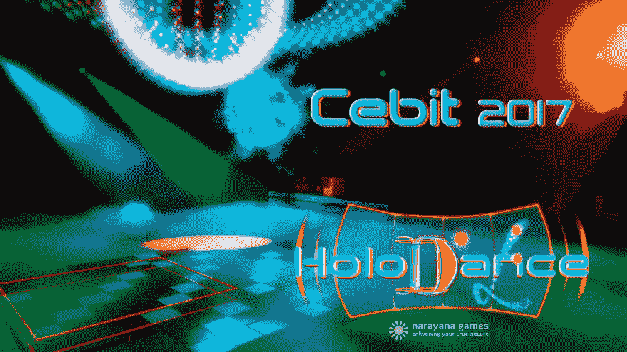
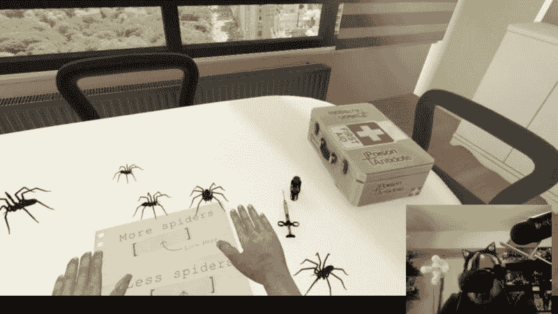
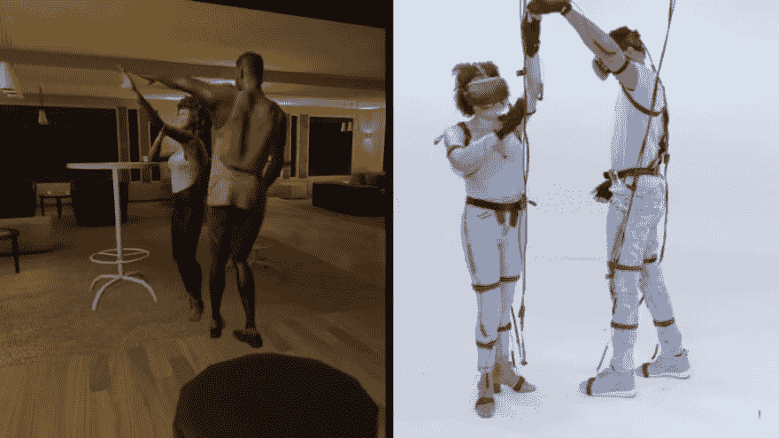
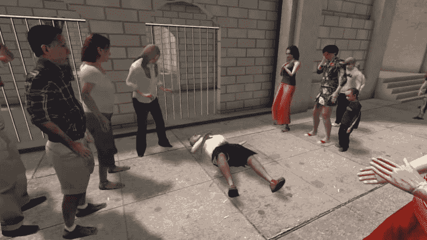

# 虚拟现实无处不在

> 原文：<https://dev.to/guergana/virtual-reality-is-fascinating-1nd>

多年来，我知道虚拟现实就在那里...但是我没有费心去尝试或者研究它。最近，主要是因为我工作了几个月的公司有一台 HTC Vive，并用它开发了一个 faire 装置，我与它的接触越来越多，每次我使用它都是一种令人兴奋的体验。

上周末，我参加了康拉德创客节，是的，这是一个非常商业化的活动，各品牌基本上都在推广他们的产品，特别是现在圣诞节就要到了，真是太巧了！至少有几个 VR 展台，一个是 Playstation 的 PS4 VR，另一个是 HTC Vive。

我两个都试过了。

我尝试的 Playstation PS4 体验是一次深潜任务，你只能四处看看。我在一个笼子里，作为任务的一部分，有一些海洋无人机游来游去。看着水下发光的海洋生物感觉很棒，但是几分钟后，一条鲨鱼出现了，开始咬我的虚拟身体所在的笼子，并吃掉了我的一个备用氧气罐...从那以后，一些石头开始向我砸来。我不得不摘下耳机...这种焦虑是真实的，尽管这些图片仍然不是照片现实主义的。

[T2】](https://res.cloudinary.com/practicaldev/image/fetch/s---ywtLKzA--/c_limit%2Cf_auto%2Cfl_progressive%2Cq_auto%2Cw_880/https://i.ytimg.com/vi/_WzpLtCw9r0/maxresdefault.jpg)

[视频-深渊](https://www.youtube.com/embed/q4ZfnZf8osA)

在 HTC 上，我尝试了这款由 Narayana Games 开发的游戏，该公司位于德国南部的拜仁。它非常快，让你锻炼，最后我开始出汗。

[T2】](https://res.cloudinary.com/practicaldev/image/fetch/s--B0KKb1GG--/c_limit%2Cf_auto%2Cfl_progressive%2Cq_auto%2Cw_880/https://i.vimeocdn.com/video/626667681.jpg%3Fmw%3D1920%26mh%3D1080)

这个游戏的名字叫全息舞蹈。[视频](https://player.vimeo.com/video/223256084)

所有这些都提醒了我，我两个月前注册了 Coursera 的“虚拟现实入门”，它提供了非常详细的信息，介绍了虚拟现实硬件、软件、应用程序以及开始从事这一领域工作所需的一切。我推荐给任何感兴趣的人。我发现最有趣的一个应用是心理学领域的 VR。在新闻中，虚拟现实被广泛用于治疗退伍军人的创伤后精神障碍。虚拟现实在战争训练和军事任务中有很多应用。我没有想到的是治疗恐惧症的应用程序，例如，我有非常严重的恐高症，是的，现在有一些应用程序可以帮助你克服恐惧，或者让你更加害怕...我甚至看着这个视频都感到紧张，我在视频上评论了这一点，他们回答说我应该寻求专业帮助，哈哈:

[视频](https://www.youtube.com/embed/2F4XIQWL75c)

我不知道[这个人](https://kotaku.com/virtual-reality-arachnophobia-therapy-is-a-definite-nop-1780550604)在尝试这个应用程序来克服他的蜘蛛恐惧症时是否非常成功:

[T2】](https://res.cloudinary.com/practicaldev/image/fetch/s--riziBvsx--/c_limit%2Cf_auto%2Cfl_progressive%2Cq_auto%2Cw_880/https://i.kinja-img.com/gawker-media/image/upload/s--9N9yIMbr--/c_scale%2Cfl_progressive%2Cq_80%2Cw_800/h7nzjpi93okbbid08avh.jpg)

查看视频的链接。

即使你知道你在一个安全的环境中，这是一个虚拟的空间，但当你沉浸在这种体验中时，它确实感觉是真实的。对于没有尝试过的人来说很难描述。

有趣的是，我想写一篇关于这个主题的帖子的原因是，到处都有这种有趣而奇怪的应用程序，就像这两个:

这是一个新的约会程序:[虚拟约会](https://nypost.com/2017/08/30/virtual-reality-dating-is-here-and-it-is-terrible/)

[T2】](https://res.cloudinary.com/practicaldev/image/fetch/s--ojJVKk4z--/c_limit%2Cf_auto%2Cfl_progressive%2Cq_auto%2Cw_880/https://cdn.uploadvr.com/wp-content/uploads/2017/08/Virtual-Dating-1024x576.png)

[视频](https://www.youtube.com/embed/U58rsdA9Aa8)

当然，新的研究领域正在开辟(科学研究变得越来越有趣...或者可能只是我变老了):

社交焦虑和自信的男人与一个主动的虚拟女人互动:一项实验研究

也有关于虚拟现实在新闻领域的工作。看看 Nonny de la Peñ在现实生活中创造同理心的工作。

视频- TED 演讲，诺尼·德拉培尼亚,《新闻的未来？虚拟现实

[T2】](https://res.cloudinary.com/practicaldev/image/fetch/s--8NFr8fC3--/c_limit%2Cf_auto%2Cfl_progressive%2Cq_auto%2Cw_880/https://roadtovrlive-5ea0.kxcdn.com/wp-content/uploads/2015/11/Hunger-in-LA-Nonny-de-la-Pena.jpg)

沉浸式新闻，艰难的工作。我发现糖尿病的例子特别感人...在洛杉矶，这个叫做*饥饿。*

VR 的哪些应用让你觉得很惊喜？你认为这会在哪里结束？