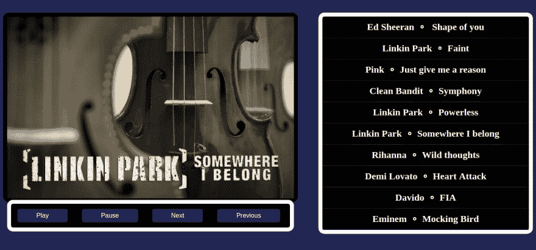
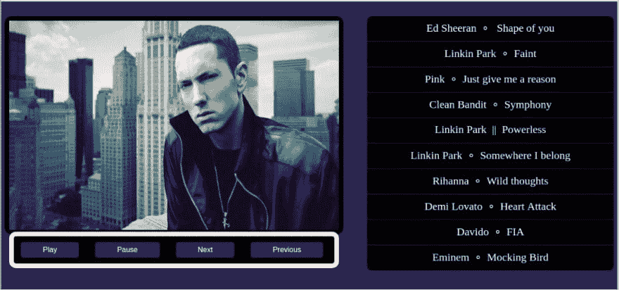
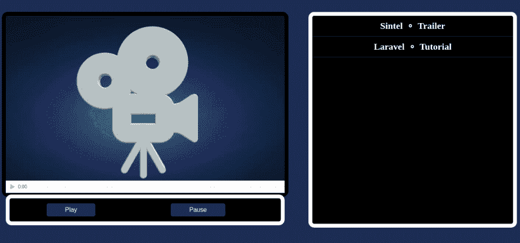
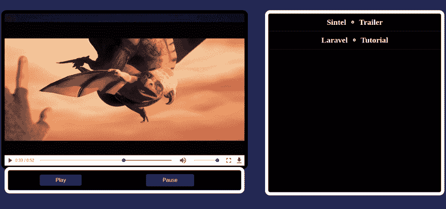

# 带 VueJS 的音乐和视频播放器|第 2 天和第 3 天[30 天代码]

> 原文:[https://dev . to/Jordan irabor/music-and-video-player-with-vue js-day-2-3-30-days-of-code-c24](https://dev.to/jordanirabor/music-and-video-player-with-vuejs--day-2--3-30-days-of-code-c24)

大家好，在我的 30 天代码挑战中，我为第一个项目写了第一篇技术文章，之后我离开了一段时间。

我现在回来了，我正在写我在第二天和第三天报道的两个项目。

这些项目可能看起来有点仓促，因为我当时很忙，但无论如何我还是要写下来🔥

音乐播放器的源代码可以在 [Github](https://github.com/Jordanirabor/vueMusicPlayer/) 获得

视频播放器的源代码可以在 [Github](https://github.com/Jordanirabor/vueVideoPlayer/) 获得

# 用 VueJS 构建一个基本的音乐播放器

VueJS 是一个很棒的 JS 库，它消除了压力，让一切变得更酷。

这是音乐播放器最终结果的可视化表示:

[T2】](https://res.cloudinary.com/practicaldev/image/fetch/s--oYQV6znn--/c_limit%2Cf_auto%2Cfl_progressive%2Cq_auto%2Cw_880/https://thepracticaldev.s3.amazonaws.com/i/2ux4dvts1rf5bsodpawm.png)

[T2】](https://res.cloudinary.com/practicaldev/image/fetch/s--rTxCAM8n--/c_limit%2Cf_auto%2Cfl_progressive%2Cq_auto%2Cw_880/https://thepracticaldev.s3.amazonaws.com/i/qo4ws7tpczu2jzhc7psl.jpeg)

说够了，让我们开始建设吧！

## 设置 VueJS

出于本教程的考虑，我们将使用 Vue CLI 进行安装和设置，另一种方法是从 CDN
引用 Vue

```
 https://unpkg.com/vue 
```

<svg width="20px" height="20px" viewBox="0 0 24 24" class="highlight-action crayons-icon highlight-action--fullscreen-on"><title>Enter fullscreen mode</title></svg> <svg width="20px" height="20px" viewBox="0 0 24 24" class="highlight-action crayons-icon highlight-action--fullscreen-off"><title>Exit fullscreen mode</title></svg>

我们可以用这个命令安装 Vue CLI:

```
$ npm install --global vue-cli 
```

<svg width="20px" height="20px" viewBox="0 0 24 24" class="highlight-action crayons-icon highlight-action--fullscreen-on"><title>Enter fullscreen mode</title></svg> <svg width="20px" height="20px" viewBox="0 0 24 24" class="highlight-action crayons-icon highlight-action--fullscreen-off"><title>Exit fullscreen mode</title></svg>

接下来，让我们创建一个新项目:

```
$ vue init webpack-simple vueMusicPlayer 
```

<svg width="20px" height="20px" viewBox="0 0 24 24" class="highlight-action crayons-icon highlight-action--fullscreen-on"><title>Enter fullscreen mode</title></svg> <svg width="20px" height="20px" viewBox="0 0 24 24" class="highlight-action crayons-icon highlight-action--fullscreen-off"><title>Exit fullscreen mode</title></svg>

在响应了一些终端提示后，我们应该已经设置好了一切。

让我们导航到工作目录，安装依赖项并启动我们的应用程序:

```
$ cd vueMusicPlayer
$ npm install
$ npm run dev 
```

<svg width="20px" height="20px" viewBox="0 0 24 24" class="highlight-action crayons-icon highlight-action--fullscreen-on"><title>Enter fullscreen mode</title></svg> <svg width="20px" height="20px" viewBox="0 0 24 24" class="highlight-action crayons-icon highlight-action--fullscreen-off"><title>Exit fullscreen mode</title></svg>

## 定义 Vue 组件

对于这个应用程序，我们将定义两个组件，第一个组件将在屏幕左侧显示歌曲的缩略图和音乐帧，而另一个组件将在屏幕右侧显示播放列表。

首先，让我们在`src`目录下创建一个`components`文件夹【这不是必须的，但是我喜欢保持一个干净的工作目录】。

接下来，我们在`components`目录中创建两个组件。我们将称它们为:

```
musicFrame.vue

playList.vue 
```

<svg width="20px" height="20px" viewBox="0 0 24 24" class="highlight-action crayons-icon highlight-action--fullscreen-on"><title>Enter fullscreen mode</title></svg> <svg width="20px" height="20px" viewBox="0 0 24 24" class="highlight-action crayons-icon highlight-action--fullscreen-off"><title>Exit fullscreen mode</title></svg>

该音乐播放器组件背后的逻辑是:

> 根组件[ App.vue ]包含两个子组件[ musicFrame 和 playList ],并监听它们不时发出的事件。每当点击播放列表(右边)中的一首歌曲时，根组件捕获一个新事件(也有一些数据)并更新代表当前播放歌曲的变量。

太好了！

## 构建 MusicFrame 组件

让我们快速看一下 musicFrame 组件的模板结构:

```
<template>

<div id="musicframe">

<div id="border">


<div id="controls" @click="audioFunction">

<audio ref="audio" id="audio">

<source v-bind:src="currentSong">

Your browser does not support the audio element.

</audio>
<button>Play</button>
<button>Pause</button>

</div>

</div>
</div>

</template> 
```

<svg width="20px" height="20px" viewBox="0 0 24 24" class="highlight-action crayons-icon highlight-action--fullscreen-on"><title>Enter fullscreen mode</title></svg> <svg width="20px" height="20px" viewBox="0 0 24 24" class="highlight-action crayons-icon highlight-action--fullscreen-off"><title>Exit fullscreen mode</title></svg>

`musicFrame`有一个带有类“musicFrame”的包装`div`标签，在这个标签中，有一个边界`div`标签，它隐藏了其他内部标签。

一个``标签位于 border 标签的正下方，它的“src”属性的值绑定到一个`currentImage` Vue 变量【每当选择一首新歌时，该变量更新歌曲的缩略图】。

现在，对于更明显的部分，一个 id 为“controls”的`div`标签包装了 HTML5 音频元素，它还监听`onclick`函数并调用一个`audioFunction`函数作为处理程序。

酷！

标签带有一个`ref` [它将有助于明确地寻址标签],而嵌套的<source>标签有一个动态的`src`属性，允许动态的音乐行为。

这是非常累人的细节，让我们看看脚本标记的内部是什么。

```
<script>
import { bus } from '../main';
export default {
  name: 'music-frame',
props : {

 currentSong: {
  type : String
 },
 currentImage: {
  type : String
 }
  },
  data () {
    return {
    }
  },
  methods: {
    audioFunction: function(e){
      let value = e.target.innerText;
      switch(value) {
        case "Play" : {
              console.log(this.$refs.audio.play());
              break;
        }
        case "Pause" : {
              this.$refs.audio.pause();
              break;              
        }
      }
    }
  },
  created(){
    bus.$on('reload', () => {
    this.$refs.audio.load();
    this.$refs.audio.play();
    })
  }
}
</script> 
```

<svg width="20px" height="20px" viewBox="0 0 24 24" class="highlight-action crayons-icon highlight-action--fullscreen-on"><title>Enter fullscreen mode</title></svg> <svg width="20px" height="20px" viewBox="0 0 24 24" class="highlight-action crayons-icon highlight-action--fullscreen-off"><title>Exit fullscreen mode</title></svg>

嗯，对于这一点来说，它并不像乍看起来那么复杂。我们走吧。

首先，我们正在导入一个总线[这只是在全局`main.js`文件中定义的 Vue 对象的一个实例]，因为我们需要它来驱动子组件[ musicFrame 和 playList ]之间的事件和数据。

在导出 default [创建一个可重用模块]之后，我们从根组件[ App.vue ]中获取`props`。在这个组件中，我们不会注册任何变量[这就是数据函数返回空对象的原因]。

接下来，我们注册单个的`audioFunction`方法，这是每当单击`controls` div 的任何一个`<button/>`子节点时由该 div 调用的方法。这个方法通过一个`switch`语句来控制目标元素上的`innerText`，并且能够切换媒体控制，例如播放、暂停等

最后，我们将一个生命周期挂钩附加到这个组件上，这个挂钩在应用程序一创建就触发。它的目标是在导入的总线上[从播放列表组件]监听一个`reload`，并在捕捉到该事件时播放一首歌曲【这是帮助确保当选择一首新歌时播放的逻辑】。

这就是 musicFrame 组件的全部内容。

## 构建播放列表组件

像前面的组件一样，让我们从检查模板结构开始:

```
<template>

  <div id="playlist">

    <div id="secborder" ref="playlist" @click="changeSource">

    <div class="song" url-value="http://sami-server.info/hossein2/95/11/Music/06/Ed%20Sheeran%20-%20Shape%20Of%20You.mp3" picture-value="https://www.billboard.com/files/media/ed-sheeran-july-2017-billboard-1548.jpg"> Ed Sheeran  &nbsp;∘ &nbsp; Shape of you </div>
    <div class="song" url-value="http://jweb.taconic.net/music/linkin_park-faint.mp3" picture-value="https://orig00.deviantart.net/65e3/f/2009/335/6/2/linkin_park__faint_by_jimeye.jpg">Linkin Park &nbsp;∘&nbsp; Faint</div>
    <div class="song" url-value="http://dl.asra-music.com/foreign%20full%20album/Pink/Pink%20-%20The%20Truth%20About%20Love%20(2012)/04%20-%20Just%20Give%20Me%20A%20Reason.mp3" picture-value="https://i.ytimg.com/vi/3pDj1U6Zd08/maxresdefault.jpg">Pink &nbsp;∘&nbsp; Just give me a reason</div>
    <div class="song" url-value="http://tegos.kz/new/mp3_full/Clean_Bandit_-_Symphony.mp3" picture-value="https://i.ytimg.com/vi/jtTI-XuW8i8/maxresdefault.jpg"> Clean Bandit &nbsp;∘&nbsp; Symphony</div>    <div class="song" url-value="http://zaycev-mp3.net/mp3/linkin_park_powerless_[zaycev-mp3.net].mp3" picture-value="https://wallpapercave.com/wp/ufT9VZa.jpg">Linkin Park &nbsp;∘&nbsp; Powerless</div>
    <div class="song" url-value="http://rm.sina.com.cn/wm/VZ2008072314565310537VK/music/MUSIC0807231507294087.mp3" picture-value="https://i.ytimg.com/vi/oY5BYjsrIHk/maxresdefault.jpg">Linkin Park &nbsp;∘&nbsp; Somewhere I belong</div>
    <div class="song" url-value="http://s4.faz-dl.xyz/mr-reese/single/july2017/week1/Rihanna%20-%20Wild%20Thoughts%20Solo%20Version%20-%20MP3%20320.mp3" picture-value="http://thetropixs.com/wp-content/uploads/2017/06/Rihanna-Wild.jpg"> Rihanna &nbsp;∘&nbsp; Wild thoughts</div>
    <div class="song" url-value="http://a.tumblr.com/tumblr_mirhiitqaC1roewk4o1_r1.mp3" picture-value="https://i.ytimg.com/vi/vAsztnDeZ1Q/maxresdefault.jpg">Demi Lovato &nbsp;∘&nbsp; Heart Attack</div>
    <div class="song" url-value="https://70mack.co/wp-content/upload/2017/10/Davido_FIA.mp3" picture-value="https://3.bp.blogspot.com/-J7w5lyePAfw/WgbF1knkwJI/AAAAAAAAVdI/t2ZOSjmLtssuxuT-czWbETE-hc2DC9wIACK4BGAYYCw/w1200-h630-p-k-no-nu/Davido%2BFia.png"> Davido &nbsp;∘&nbsp; FIA</div>    
    <div class="song" url-value="http://img0.liveinternet.img/attach/b/3/3656/3656927_eminem__mockingbird.mp3" picture-value="https://wallpapercave.com/wp/WlHnNj6.jpg">Eminem &nbsp;∘&nbsp; Mocking Bird</div>    

    </div>

  </div>

</template> 
```

<svg width="20px" height="20px" viewBox="0 0 24 24" class="highlight-action crayons-icon highlight-action--fullscreen-on"><title>Enter fullscreen mode</title></svg> <svg width="20px" height="20px" viewBox="0 0 24 24" class="highlight-action crayons-icon highlight-action--fullscreen-off"><title>Exit fullscreen mode</title></svg>

凌乱的东西。我知道。

这个组件的模板非常简单，它只是一堆包含自定义属性的`<div/>`标签:`url-value`和`picture-value`，每当播放列表中的歌曲【div】被点击时，我们需要这些值为和  标签提供动态数据。

接下来，`<script/>`部分:

```
<script>
import { bus } from '../main';
export default {
  name: 'playlist',
  props : {

 currentSong: {
  type : String
 },
 currentImage: {
  type : String
 }
  },
  data () {
    return {
    }
  },

  methods: {
    changeSource : function(e) {
      let songValue = e.target.attributes[1].value;
      let songImage = e.target.attributes[2].value;
      this.$emit('updateData', [songValue, songImage]);
      bus.$emit('reload');
    }
  }
}
</script> 
```

<svg width="20px" height="20px" viewBox="0 0 24 24" class="highlight-action crayons-icon highlight-action--fullscreen-on"><title>Enter fullscreen mode</title></svg> <svg width="20px" height="20px" viewBox="0 0 24 24" class="highlight-action crayons-icon highlight-action--fullscreen-off"><title>Exit fullscreen mode</title></svg>

还记得上一个组件导入的总线吗？是的。该总线、该组件也必须导入它，这样两者之间就有了一个通信媒介。

在接下来的步骤中，我们做一些基本的事情，比如从根组件接收`props`，不声明任何变量[这并不是因为我们太便宜而负担不起]。

最后，我们声明一个方法,`ChangeSource`,它的工作就像它的名字一样:

这个方法从播放列表中选择的歌曲[div]中获取新的值[歌曲和图像的 URL，向根方法发出一个事件[带有前面检索到的两个值]。该方法还使用`bus`发出一个‘reload’事件。

太棒了。

## 现在为根构件

根组件负责协调在两个子组件之间运行的数据，并使之有意义。让我们看看这个组件在地毯下面有什么。

像往常一样，首先检查模板部分:

```
<template>

<div id="app">

<videoframe v-bind:currentVideo="currentVideo"></videoframe>

<playlist v-bind:currentVideo="currentVideo" @updateData="swapData($event)"></playlist>

</div>

</template> 
```

<svg width="20px" height="20px" viewBox="0 0 24 24" class="highlight-action crayons-icon highlight-action--fullscreen-on"><title>Enter fullscreen mode</title></svg> <svg width="20px" height="20px" viewBox="0 0 24 24" class="highlight-action crayons-icon highlight-action--fullscreen-off"><title>Exit fullscreen mode</title></svg>

与其他两个组件不同，根组件有一个漂亮、精确和简洁的模板。id 为“app”的根标签`div`包装了两个嵌套的子组件。

子组件有两个绑定到其动态属性的变量。在 playlist 上，根组件监听“updateData”事件，并用“swapData”函数处理它。

漂亮，精确，简洁。

是时候一睹脚本了:

```
 <script>
import videoframe from './components/videoFrame'
import playlist from './components/playList'
export default {
  name: 'app',
  components: {
  'videoframe' : videoframe,
  'playlist' : playlist
},
  data () {
    return {
      currentVideo : ''
    }
  },
  methods: {
    swapData: function(data) {
     this.currentVideo = data;
    }
  }
}
</script> 
```

<svg width="20px" height="20px" viewBox="0 0 24 24" class="highlight-action crayons-icon highlight-action--fullscreen-on"><title>Enter fullscreen mode</title></svg> <svg width="20px" height="20px" viewBox="0 0 24 24" class="highlight-action crayons-icon highlight-action--fullscreen-off"><title>Exit fullscreen mode</title></svg>

首先，我们导入`musicFrame`和`playList`[显然是因为我们需要它们]，然后我们将它们注册为组件。

我们在数据函数中定义了两个`key/value`对，第一个将保存当前歌曲播放的数据，而另一个将首先保存 musicFrame 横幅的默认图像横幅，并动态改变缩略图。

最后，我们定义了一个名为`swapData`的方法，该方法接收子组件 child 在事件中发出的数据，并动态切换值。

可怕的🔥

这就是音乐播放器应用程序的全部，现在是视频播放器的时间了。

这是我们将要创建的音乐播放器应用程序的可视化表示:

[T2】](https://res.cloudinary.com/practicaldev/image/fetch/s--FXOxzi5t--/c_limit%2Cf_auto%2Cfl_progressive%2Cq_auto%2Cw_880/https://thepracticaldev.s3.amazonaws.com/i/0p6fp8s6r9c6gpdp8g53.png)

[T2】](https://res.cloudinary.com/practicaldev/image/fetch/s--o3DSoRgN--/c_limit%2Cf_auto%2Cfl_progressive%2Cq_auto%2Cw_880/https://thepracticaldev.s3.amazonaws.com/i/j2ya1hls9zu2p6xhj8kt.png)

我也会深入解释视频播放器应用程序，但事实是，它在逻辑上与音乐播放器应用程序非常相似，所以真的没有任何必要。

# 结论

厉害！🔥这就是在 VueJS 中构建音乐播放器和视频播放器所需要的一切。

为了简洁起见，我可能在本文中省略了一些实际代码。

要在本地运行这些项目，请在终端中键入以下命令。

```
-- clone the repository --

git clone https://github.com/Jordanirabor/vueMusicPlayer

OR

git clone https://github.com/Jordanirabor/vueVideoPlayer

-- navigate into the directory --

cd vueMusicPlayer

OR

cd vueVideoPlayer

-- install dependencies --

npm install 

-- serve with hot reload at localhost:8080 --

npm run dev

-- build for production with minification --

npm run build 
```

<svg width="20px" height="20px" viewBox="0 0 24 24" class="highlight-action crayons-icon highlight-action--fullscreen-on"><title>Enter fullscreen mode</title></svg> <svg width="20px" height="20px" viewBox="0 0 24 24" class="highlight-action crayons-icon highlight-action--fullscreen-off"><title>Exit fullscreen mode</title></svg>

明天我将会建造和写另一个项目，敬请关注🔥🔥🔥