# 用 ASTs 提升自己的解析水平

> 原文:[https://dev . to/vaidehijoshi/leveling-up-ones-parsing-game-with-asts-4ha](https://dev.to/vaidehijoshi/leveling-up-ones-parsing-game-with-asts-4ha)

<figure> 

<figcaption>用 ASTs 练级解析游戏！</figcaption>

</figure>

在我开始尝试学习计算机科学的旅程之前，有一些术语和短语让我想往另一个方向跑。

但我没有跑，而是假装知道，在谈话中点头附和，假装我知道有人在说什么，尽管事实是我不知道，而且当我听到那个超级可怕的计算机科学术语时，我实际上已经完全停止听了。在本系列的整个过程中，我已经设法覆盖了许多领域，其中许多术语实际上已经变得不那么可怕了！

不过，有一个大问题，我一直在回避。直到现在，每当我听到这个术语，我都感到麻木。它出现在聚会的非正式谈话中，有时也出现在会议谈话中。每一次，我都想到机器在旋转，计算机吐出一串难以理解的代码，除了我周围的其他人*可以* *实际上* *破译* *它们*所以实际上只有我不知道发生了什么(哎呀，这是怎么发生的？！).

也许我不是唯一有这种感觉的人。但是，我想我应该告诉你们这个术语实际上是什么，对吗？好吧，准备好，因为我指的是永远难以捉摸并且看起来令人困惑的*抽象语法树*，或者简称为 *AST* 。在被恐吓多年后，我很兴奋终于不再害怕这个术语，并真正理解它到底是什么。

是时候直面抽象语法树的根——提升我们的解析游戏了！

### 从具体到抽象

每一个好的探索都从一个坚实的基础开始，我们揭开这个结构的神秘面纱的任务也应该以完全相同的方式开始:当然是有一个定义！

一棵 ***抽象语法树*** (通常简称为 ***AST*** )实际上只不过是一棵解析树的简化、浓缩版本。在编译器设计的上下文中，术语“*AST”*与 ***语法树*** 可互换使用。

<figure>[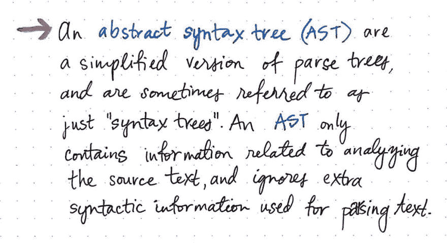](https://res.cloudinary.com/practicaldev/image/fetch/s--GWDTpiHp--/c_limit%2Cf_auto%2Cfl_progressive%2Cq_auto%2Cw_880/https://cdn-images-1.medium.com/max/1024/1%2AmhIbxxlr1hyvUemAMMeNCw.jpeg) 

<figcaption>抽象语法树:一个定义</figcaption>

</figure>

我们经常将语法树(以及它们是如何构造的)与它们的对应解析树进行比较，后者[我们已经非常熟悉了](https://dev.to/vaidehijoshi/grammatically-rooting-oneself-with-parse-trees-16a)。我们知道*解析树*是包含我们代码语法结构的树形数据结构；换句话说，它们包含了出现在代码“句子”中的所有句法信息，并且直接来源于编程语言本身的语法。

另一方面,*抽象语法树*忽略了大量语法信息，否则解析树将包含这些信息。

> 相比之下，ast 只包含与分析源文本相关的信息，并跳过解析文本时使用的任何其他额外内容。

如果我们关注 AST 的“抽象性”,这种区别就变得更有意义了。

我们将回忆起一个 ***解析树*** 是一个句子的语法结构的图示版本。换句话说，我们可以说解析树确切地代表了表达式、句子或文本的样子。这基本上是对文本本身的直接翻译。我们把句子的每一小段——从标点符号到表达方式再到标记——都变成了一个树形数据结构。它揭示了文本的具体语法，这就是为什么它也被称为 ***具体语法树*** ，或 ***CST*** 。我们使用术语混凝土来描述这种结构，因为它是我们代码的语法副本，以树的形式逐个标记。

但是是什么让事物变得具体而不是抽象呢？嗯，抽象语法树不会像解析树那样向我们确切地展示表达式的样子。

<figure>[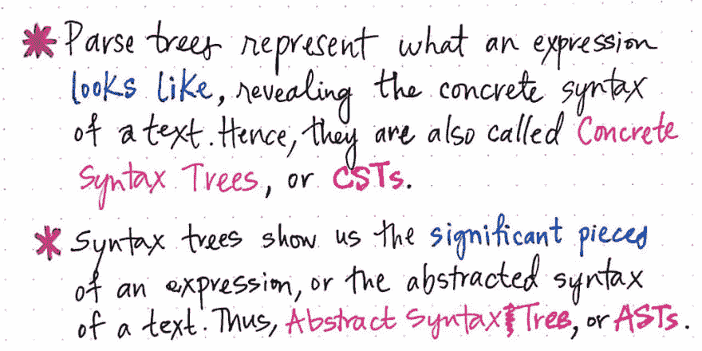](https://res.cloudinary.com/practicaldev/image/fetch/s--BeH6ffKk--/c_limit%2Cf_auto%2Cfl_progressive%2Cq_auto%2Cw_880/https://cdn-images-1.medium.com/max/1024/1%2AOOHu35k6ivk8f3s3CM_YRg.jpeg) 

<figcaption>具体与抽象语法树</figcaption>

</figure>

相反，抽象语法树向我们展示了“重要”的部分——我们真正关心的东西，这些东西赋予我们的代码“句子”本身以意义。语法树向我们展示了表达式的重要部分，或者源文本的抽象语法。因此，与具体的语法树相比，这些结构是我们代码的抽象表示(在某些方面，不太精确)，这正是它们的名字的由来。

既然我们已经理解了这两种数据结构之间的区别以及它们表示代码的不同方式，那么就有必要问这样一个问题:抽象语法树在编译器中处于什么位置？首先，让我们提醒自己，到目前为止，我们所知道的关于编译过程的一切。

<figure>[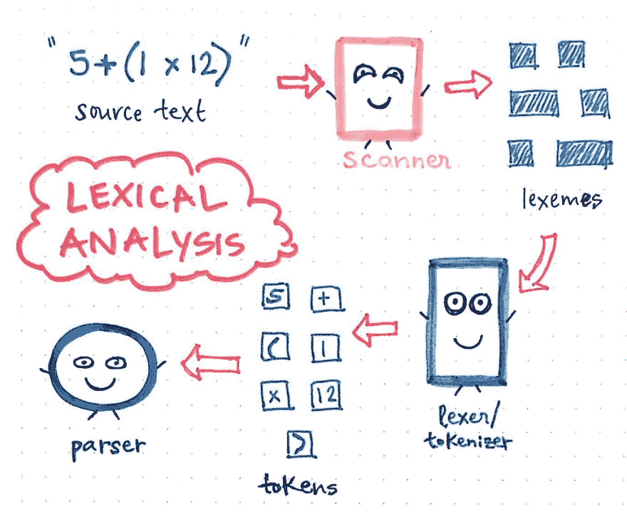](https://res.cloudinary.com/practicaldev/image/fetch/s--5v6dgWfA--/c_limit%2Cf_auto%2Cfl_progressive%2Cq_auto%2Cw_880/https://cdn-images-1.medium.com/max/1024/1%2A2WYz6w470aMymWzmQKYLHQ.jpeg) 

<figcaption>重温导致解析的事件！</figcaption>

</figure>

假设我们有一个超级短又甜的源文本，看起来是这样的:5 + (1 x 12)。

我们会记得，编译过程中发生的第一件事是文本的*扫描*，这项工作由*扫描器*执行，它导致文本被分解成尽可能小的部分，这些部分被称为*词位*。这一部分将是语言不可知的，我们将以我们的源文本的剥离版本结束。

接下来，这些词汇被传递给词汇提取器/记号赋予器，后者将我们源文本的这些小的表示转化为特定于我们语言的*记号*。我们的令牌看起来会像这样:[5，+，(，1，x，12，)]。扫描器和分词器的共同努力构成了编译的*词法分析*。

然后，一旦我们的输入被标记化，它产生的标记就被传递给我们的解析器，解析器然后获取源文本并从中构建一个解析树。下图以解析树的形式展示了我们的令牌化代码。

<figure>[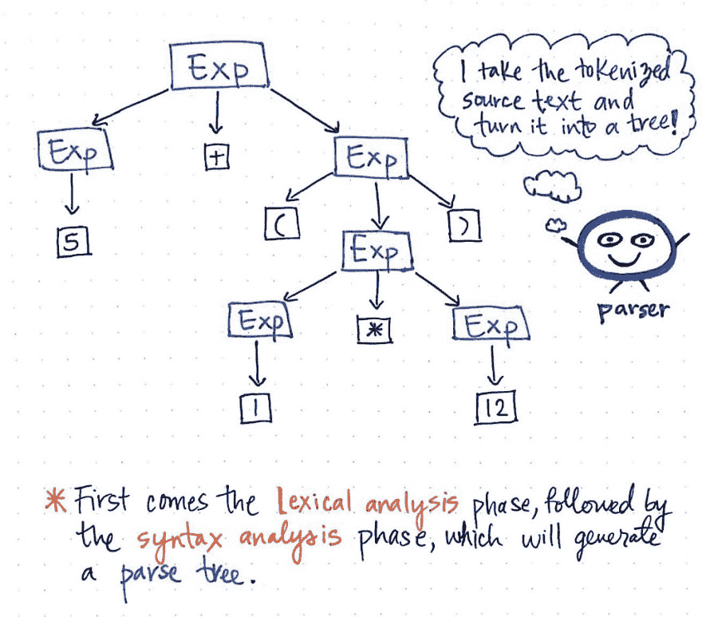](https://res.cloudinary.com/practicaldev/image/fetch/s--qIv6CpEY--/c_limit%2Cf_auto%2Cfl_progressive%2Cq_auto%2Cw_880/https://cdn-images-1.medium.com/max/1024/1%2Ahy0NjQ4pe44ysbU_eKFaXg.jpeg) 

<figcaption>语法分析阶段生成解析树</figcaption>

</figure>

将标记转换成解析树的工作也称为解析，被称为*语法分析*阶段。语法分析阶段直接依赖于词法分析阶段；因此，词法分析在编译过程中必须始终放在第一位，因为只有当标记器完成它的工作时，我们的编译器的解析器才能完成它的工作！

> 我们可以把编译器的各个部分看作是好朋友，它们相互依赖以确保我们的代码从文本或文件正确地转换成解析树。

但是回到我们最初的问题:抽象语法树在这个朋友群体中处于什么位置？为了回答这个问题，首先理解 AST 的*需求*是有帮助的。

### 把一棵树浓缩成另一棵树

好了，现在我们有两棵树要保持头脑清醒。我们已经有了一个解析树，还有另一个数据结构需要学习！显然，这个 AST 数据结构只是一个简化的解析树。那么，我们为什么需要它呢？这到底有什么意义？

好吧，让我们看看我们的解析树，好吗？

我们已经知道解析树代表了我们程序最独特的部分；事实上，这就是为什么扫描仪和记号赋予器如此重要的工作，将我们的表达分解成最小的部分！

> 用一个程序最独特的部分来表示它意味着什么？

事实证明，有时程序的所有不同部分实际上并不总是对我们有用。

<figure>[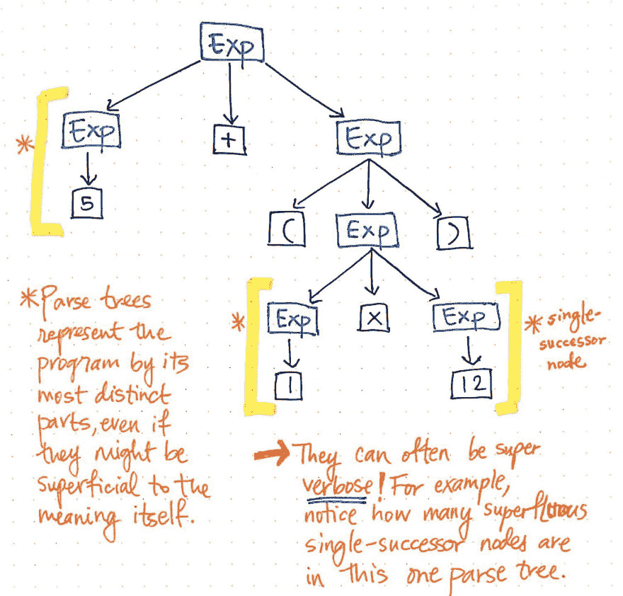](https://res.cloudinary.com/practicaldev/image/fetch/s---sjo7RbT--/c_limit%2Cf_auto%2Cfl_progressive%2Cq_auto%2Cw_880/https://cdn-images-1.medium.com/max/1024/1%2ANNLKQdokzXab1nrOOs-F_w.jpeg) 

<figcaption>解析树往往会超级冗长。</figcaption>

</figure>

让我们看一下这里显示的插图，它以解析树树格式表示了我们的原始表达式 5 + (1 x 12)。如果我们用批判的眼光仔细观察这棵树，我们会发现在一些情况下，一个节点只有一个子节点，这些子节点也被称为 ***单后继节点*** ，因为它们只有一个子节点(或一个“后继节点”)。

在我们的解析树示例中，单后继节点有一个表达式或 Exp 的父节点，它有某个值的单个后继节点，比如 5、1 或 12。然而，这里的 Exp 父节点实际上并没有给我们增加任何有价值的东西，不是吗？我们可以看到它们包含了 token/terminal 子节点，但是我们并不真正关心“表达式”父节点；我们真正想知道的是,*是什么表达式？*

一旦我们解析了树，父节点不会给我们任何额外的信息。相反，我们真正关心的是单个*子节点*，单个后继节点。的确，这是给我们重要信息的节点，对我们有意义的部分:数字和值本身！考虑到这些父节点对我们来说是不必要的，很明显这个解析树有点冗长。

所有这些单一后继节点对我们来说都是多余的，对我们没有任何帮助。所以，让我们摆脱他们！

<figure>[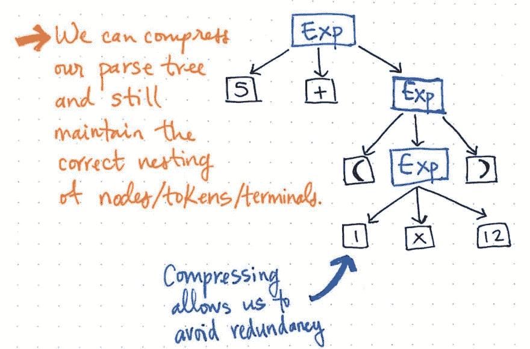](https://res.cloudinary.com/practicaldev/image/fetch/s--fEjUi3Qx--/c_limit%2Cf_auto%2Cfl_progressive%2Cq_auto%2Cw_880/https://cdn-images-1.medium.com/max/1024/1%2AMeUwZqnExmcsCBmSyr6nRg.jpeg) 

<figcaption>压缩解析树可以让我们避免冗余。</figcaption>

</figure>

如果我们压缩解析树中的单个后继节点，我们将得到一个更压缩版本的完全相同的结构。看上面的插图，我们会看到我们仍然保持着和以前完全一样的嵌套，我们的节点/令牌/终端仍然出现在树中的正确位置。但是，我们已经设法把它缩小了一点。

我们也可以多修剪一些圣诞树。例如，如果我们看一下我们的解析树，我们会发现其中有一个镜像结构。(1 x 12)的子表达式嵌套在括号()内，括号本身就是标记。

<figure>[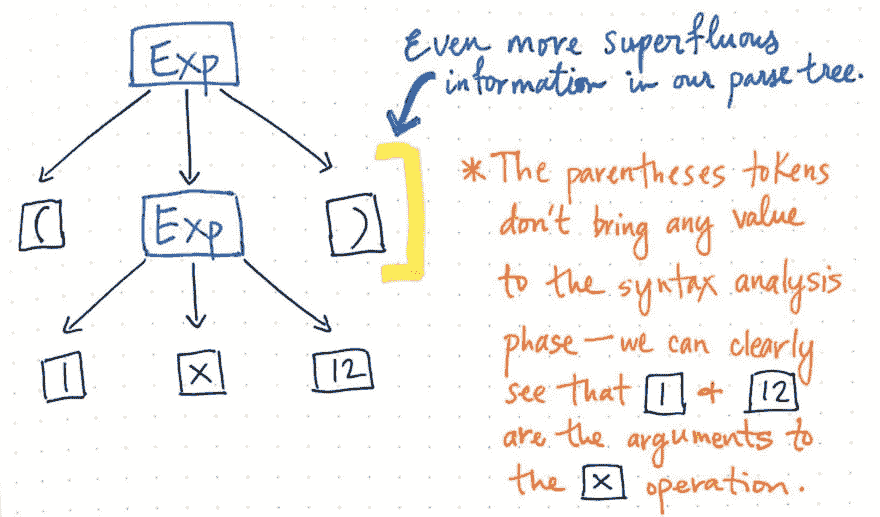](https://res.cloudinary.com/practicaldev/image/fetch/s--LTPWv2y_--/c_limit%2Cf_auto%2Cfl_progressive%2Cq_auto%2Cw_880/https://cdn-images-1.medium.com/max/1024/1%2AzKxxgXTGKTcOFogugiSfFw.jpeg) 

<figcaption>对我们没有用的多余信息可以从解析树中去掉。</figcaption>

</figure>

然而，一旦我们把树放在适当的位置，这些括号并不能真正帮助我们。我们已经知道 1 和 12 是将被传递给乘法 x 运算的参数，所以括号在这一点上并没有告诉我们太多。事实上，我们可以进一步压缩解析树，去掉这些多余的叶节点。

一旦我们压缩并简化了解析树，去掉了多余的语法“灰尘”，我们最终得到的结构在这一点上看起来明显不同。事实上，这个结构是我们新的、备受期待的朋友:抽象语法树。

<figure>[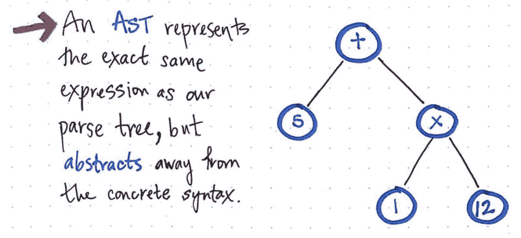](https://res.cloudinary.com/practicaldev/image/fetch/s--7ZPjHqIC--/c_limit%2Cf_auto%2Cfl_progressive%2Cq_auto%2Cw_880/https://cdn-images-1.medium.com/max/1024/1%2AT0Zo8ZLDDm0m0fSmmkj7wA.jpeg) 

<figcaption>一个抽象的 AST 远离了具体的语法。</figcaption>

</figure>

上图展示了与我们的解析树完全相同的表达式:5 + (1 x 12)。不同之处在于，它从具体的语法中抽象出了表达式。我们在这个树中看不到更多的括号()，因为它们不是必需的。类似地，我们没有看到像 Exp 这样的非终结符，因为我们已经知道“表达式”是什么，并且我们能够提取对我们真正重要的*值*——例如，数字 5。

这正是 AST 和 CST 之间的区别因素。我们知道抽象语法树忽略了解析树包含的大量语法信息，并跳过了解析中使用的“额外内容”。但是现在我们可以确切地看到这是如何发生的！

<figure>[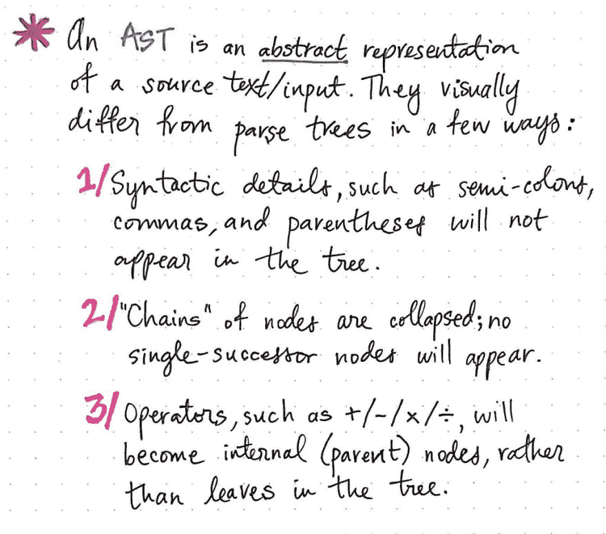](https://res.cloudinary.com/practicaldev/image/fetch/s--CYdboinh--/c_limit%2Cf_auto%2Cfl_progressive%2Cq_auto%2Cw_880/https://cdn-images-1.medium.com/max/1024/1%2Al-gFDuHOwn8KHm_BHr81nQ.jpeg)

<figcaption>AST 是源文本的抽象表示。</figcaption>

</figure>

既然我们已经浓缩了自己的解析树，我们将更好地理解区分 AST 和 CST 的一些模式。

抽象语法树与解析树在视觉上有一些不同:

1.  AST 永远不会包含语法细节，比如逗号、括号和分号(当然，这取决于语言)。
2.  AST 将具有折叠版本，否则将显示为单后继节点；它永远不会包含只有一个子节点的节点链。
3.  最后，任何操作符标记(如+、-、x 和/)都将成为树中的内部(父)节点，而不是终止于解析树的叶子。

从视觉上看，AST 总是比解析树更紧凑，因为根据定义，它是解析树的压缩版本，语法细节更少。

> 那么，显而易见的是，如果 AST 是解析树的压缩版本，那么只有在我们有了构建解析树的东西的情况下，我们才能真正创建抽象语法树！

事实上，这就是抽象语法树如何适应更大的编译过程。AST 与我们已经了解过的[解析树](https://dev.to/vaidehijoshi/grammatically-rooting-oneself-with-parse-trees-16a)有直接的联系，同时在 AST 被创建之前依靠[词法分析器](https://dev.to/vaidehijoshi/reading-code-right-with-some-help-from-the-lexer-61d)完成*它的*工作。

<figure>[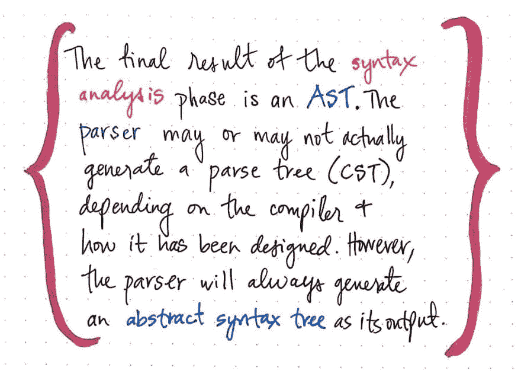](https://res.cloudinary.com/practicaldev/image/fetch/s--vqUMbX1n--/c_limit%2Cf_auto%2Cfl_progressive%2Cq_auto%2Cw_880/https://cdn-images-1.medium.com/max/1024/1%2AnSsol-zdKcJnk4X45FkCEw.jpeg) 

<figcaption>一个 AST 总是解析器的输出。</figcaption>

</figure>

抽象语法树是作为语法分析阶段的最终结果创建的。在语法分析过程中，作为主要“角色”的位于前端和中心的解析器可能会也可能不会总是生成解析树，或 CST。取决于编译器本身，以及它是如何被设计的，解析器可以直接构造语法树，或 AST。但是解析器将总是生成一个 AST 作为它的输出，不管它是否在中间创建了一个解析树，或者为了这样做它可能需要通过多少次。

### 解剖一个 AST

既然我们知道抽象语法树很重要(但不一定令人生畏！)，我们可以开始更深入地剖析它。AST 如何构造的一个有趣方面与这个树的节点有关。

下图举例说明了抽象语法树中单个节点的结构。

<figure>[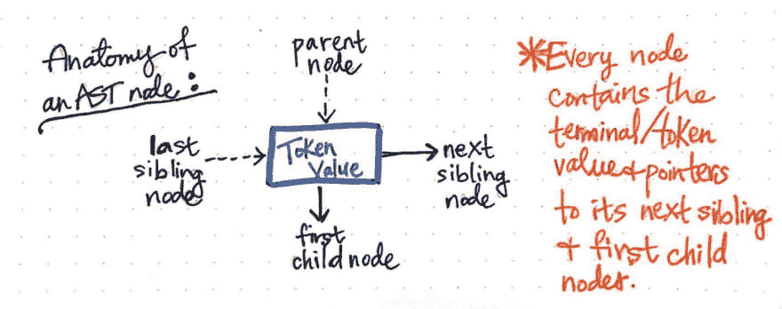](https://res.cloudinary.com/practicaldev/image/fetch/s--BGtrtmxn--/c_limit%2Cf_auto%2Cfl_progressive%2Cq_auto%2Cw_880/https://cdn-images-1.medium.com/max/1024/1%2ANO_p9739sX6Tf-ESRkSKaw.jpeg) 

<figcaption>解剖一个 AST 节点。</figcaption>

</figure>

我们会注意到，这个节点与我们之前看到的其他节点相似，它包含一些数据(一个令牌及其值)。但是，它也包含一些非常具体的指针。AST 中的每个节点都包含对其下一个兄弟节点*以及第一个*子节点*的引用。*

例如，我们的简单表达式 5 + (1 x 12)可以被构造成 AST 的可视化图示，如下图所示。

<figure> 

<figcaption>我们的 AST 表达式的简化可视化。</figcaption>

</figure>

我们可以想象，读取、遍历或“解释”这个 AST 可能从树的底层开始，一路向上，直到最后建立一个值或返回结果。

查看解析器输出的编码版本也有助于补充我们的可视化。我们可以依靠各种工具并使用预先存在的解析器来快速查看我们的表达式在解析器中运行时的样子。下面是我们的源文本 5 + (1 * 12)的一个示例，它通过 ECMAScript 解析器 [Esprima](http://esprima.org/) 运行，并生成抽象语法树，后面是它的独特标记列表。