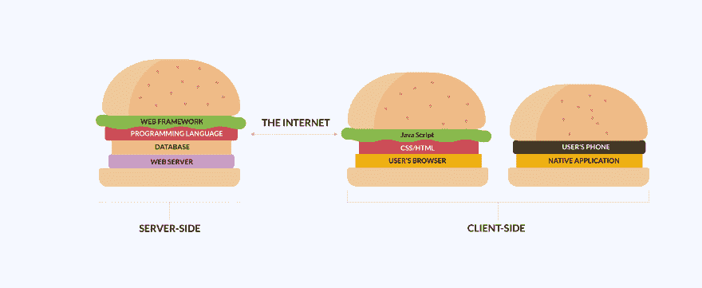

# 技术堆栈困境

> 原文：<https://dev.to/galyna_chekan/technology-stack-dilemma-for-non-technical-business-owners-1hco>

人们普遍认为，在构建软件产品时，技术栈要么成功，要么失败。在编写一行代码之前，您需要仔细选择一个技术堆栈，它将决定您产品的成功。

在当今的开发世界中，有各种各样的技术可供选择，选择一种最适合您的项目的技术似乎是一项艰巨的任务。但也不一定。当您陷入技术堆栈困境时，只有几个方面值得考虑。

## 什么是技术栈？

为了提醒您，请快速了解一下什么是技术堆栈。

[T2】](https://res.cloudinary.com/practicaldev/image/fetch/s--BsqPSyff--/c_limit%2Cf_auto%2Cfl_progressive%2Cq_auto%2Cw_880/https://perfectial.com/wp-content/uploads/2017/12/img1.jpg)

**技术栈**是开发人员用来构建 web 或移动应用程序的编程语言、框架和工具的组合。任何应用程序的两个主要组件是客户端(前端)和服务器端(后端)。应用程序的每一层都构建在下一层之上，从而创建了一个堆栈。

客户端是用户在屏幕上看到的一切，也是交互发生的地方。前端的三项主要技术是:

*   HTML(标记语言)
*   CSS(样式表)
*   JavaScript(脚本语言)

**服务器端**对用户不可见。但它的编程语言为用户端提供了动力，并创造了网站和应用程序的逻辑。编程语言的框架可以节省时间。它们提供通用功能(数据访问、用户身份验证等)的审核实施。).

唯一的挑战是选择服务器端技术。但是这是一个艰难决定吗？让我们潜入更深的地方。

## 如何选择技术堆栈

选择最适合你的项目的技术栈看起来是一个真正的挑战，尤其是如果你是一个非技术型的创始人。最简单的方法是依靠你的个人喜好或以前的经验。但是个人喜好是主观的，会导致错误的决定。只有你有很强的 web 开发背景，你才能指望它。相信你的竞争对手的经验或者去网上寻找无数的观点和论据也不是一个明智的选择。实际上，有几个方面需要考虑。

为非技术业务所有者解释技术栈困境的帖子最早出现在[软件开发公司完美](https://perfectial.com)上。