# 重访书写模式的垂直排版

> 原文:[https://dev . to/惠晶/vertical-buttoning-with-writing-mode-revisited-26kd](https://dev.to/huijing/vertical-typesetting-with-writing-mode-revisited-26kd)

大约一年前，我写了一篇关于尝试在网上垂直排版中文的文章。由此而来的是[一个允许你使用 checkbox hack 在书写模式之间切换的基本演示](https://www.chenhuijing.com/zh-type)。

不久前我遇到了 [Yoav Weiss](https://blog.yoav.ws/) ，我们聊了一会儿关于 [Responsive Images 社区组](http://ricg.io/)的事情，因为我提到了我认为如果能够有一些媒体对带有`picture`元素的`writing-mode`进行查询会很好，这样我就不必在切换模式时对我的图像进行一些轻微的黑客式转换。他建议我把它写成[响应图像的用例](https://github.com/ResponsiveImagesCG/ri-usecases/issues/63)。

但是当我重新打开这个一年没碰过的演示时，我的脸从🤨到😱到🤬到😩前 5 分钟内(我能说什么呢？我有一张表情丰富的脸🤷).因此，为了宣泄，我将写下我的详细描述，试图找出谁(即浏览器)破坏了什么，并希望现在如何减轻它。

警告，帖子很长。

## 初步发现

我只查看我可以直接访问的浏览器。因为我还有其他的事情要做🙆。

### Chrome (64.0.3278.0 开发)

[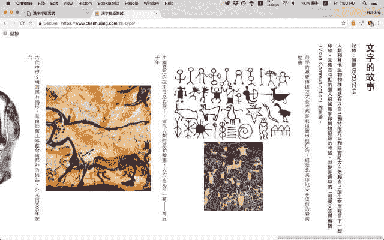T2】](https://res.cloudinary.com/practicaldev/image/fetch/s--ih_POUfa--/c_limit%2Cf_auto%2Cfl_progressive%2Cq_auto%2Cw_880/https://www.chenhuijing.cimg/posts/vertical-typesetting/chrome-640.jpg)

好吧，这看起来很好。当我说一切都坏了的时候，我有点夸张。所有的文本和图像都考虑在内，在垂直书写模式下没有大的渲染问题。干得好，Chrome。

[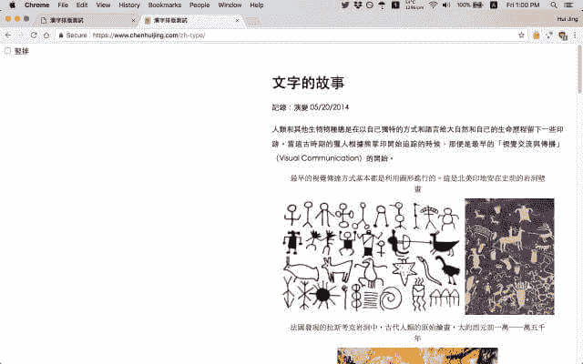T2】](https://res.cloudinary.com/practicaldev/image/fetch/s--eu797fp0--/c_limit%2Cf_auto%2Cfl_progressive%2Cq_auto%2Cw_880/https://www.chenhuijing.cimg/posts/vertical-typesetting/chrome2-640.jpg)

切换切换器会将东西踢到右边。我记得试图在垂直书写模式下水平居中是非常痛苦的，所以这一定是我在第一次尝试时不太顺利的一些技巧。

这在 2017 年初肯定是有效的，因为我为我的网络会议制作了这个截屏。亚洲幻灯片。我很确定它当时用的是 Chrome。几个月的时间对一个演示的影响是惊人的。我学长曾经提过一句话叫“代码腐烂”，不知道是不是这个。

### 火狐(59.0a1 每夜)

[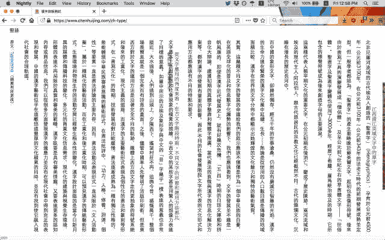T2】](https://res.cloudinary.com/practicaldev/image/fetch/s--xCNKtPp1--/c_limit%2Cf_auto%2Cfl_progressive%2Cq_auto%2Cw_880/https://www.chenhuijing.cimg/posts/vertical-typesetting/firefox-640.jpg)

天啊，这真是。我无话可说。我使用 Firefox Nightly 作为我的默认浏览器，因此我对 ZOMG 一切都坏了的最初反应。因为这里一切都坏了。看看它，看看无限的水平滚动条，发生了什么？！

[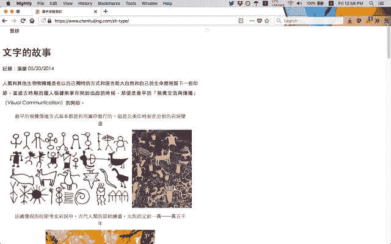T2】](https://res.cloudinary.com/practicaldev/image/fetch/s--KT-dE8Mo--/c_limit%2Cf_auto%2Cfl_progressive%2Cq_auto%2Cw_880/https://www.chenhuijing.cimg/posts/vertical-typesetting/firefox2-640.jpg)

让我们切换…等等，我的复选框在哪里？！叹气。这可能需要一段时间。无论如何，至少我将复选框与标签绑定在一起，这样我们仍然可以单击标签进行切换。嗯，它肯定不居中，但也不太破。两种浏览器，已经是天壤之别了。

### Safari 技术预览 44

[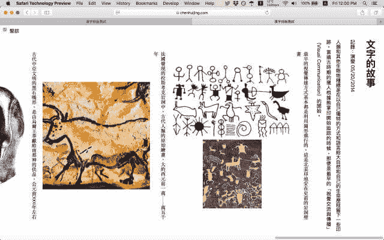T2】](https://res.cloudinary.com/practicaldev/image/fetch/s--6z79DMhq--/c_limit%2Cf_auto%2Cfl_progressive%2Cq_auto%2Cw_880/https://www.chenhuijing.cimg/posts/vertical-typesetting/stp-640.jpg)

嘿。嘿嘿嘿。这个看起来出奇的完好。连身高都没错。Safari，我可能看错你了。再说一遍 Safari 渲染引擎到底是什么？哦对了，WebKit。

[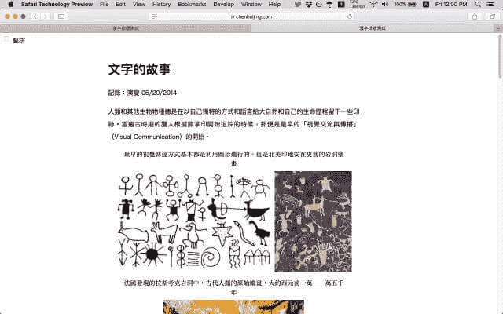T2】](https://res.cloudinary.com/practicaldev/image/fetch/s--5cu4Y-xx--/c_limit%2Cf_auto%2Cfl_progressive%2Cq_auto%2Cw_880/https://www.chenhuijing.cimg/posts/vertical-typesetting/stp2-640.jpg)

哦，这有点，有点，在页面的中间。不看代码，我肯定我尝试了一些奇怪的翻译来移动整个内容块，因此每个浏览器的行为都不一致。但这是一个惊喜。

### 边缘 16.17046

我正在使用 Windows 10 insider fast ring release，所以我认为我的 Edge 可能比大多数人安装的版本都要高。没关系，我也可以查看我的手机(是的，我用的是 Windows phone，来吧，评判我)。

[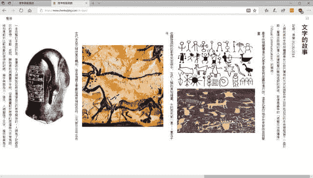T2】](https://res.cloudinary.com/practicaldev/image/fetch/s--Sv_XdTT9--/c_limit%2Cf_auto%2Cfl_progressive%2Cq_auto%2Cw_880/https://www.chenhuijing.cimg/posts/vertical-typesetting/edge-640.jpg)

反正这个看起来也不太破。只是复选框有点关。最大的好处是滚轮可以工作！所有其他浏览器都不允许我用滚轮水平滚动。我不知道这是 Windows 的问题还是 Edge 的问题。

[T2】](https://res.cloudinary.com/practicaldev/image/fetch/s--o3Yu-Axf--/c_limit%2Cf_auto%2Cfl_progressive%2Cq_auto%2Cw_880/https://www.chenhuijing.cimg/posts/vertical-typesetting/edge2-640.jpg)

模糊地半居中。我真的必须尽快检查转换代码。我现在可能也对复选框的情况略有所知。啊，但是没有滚轮的垂直滚动，这越来越有趣了。另外，注意滚动条在左边🤔。

### 边缘 15.15254

<figcaption>[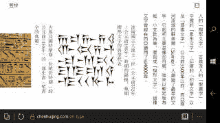](https://res.cloudinary.com/practicaldev/image/fetch/s--triFjINg--/c_limit%2Cf_auto%2Cfl_progressive%2Cq_auto%2Cw_880/https://www.chenhuijing.cimg/posts/vertical-typesetting/edgem.jpg)15 日

<figcaption>[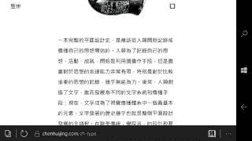](https://res.cloudinary.com/practicaldev/image/fetch/s--UKFypdIu--/c_limit%2Cf_auto%2Cfl_progressive%2Cq_auto%2Cw_880/https://www.chenhuijing.cimg/posts/vertical-typesetting/edgem2.jpg)第十五期

和 Edge 16 差不多。我有理由相信 Windows phone 上的 Edge 使用了与桌面版完全相同的渲染引擎，在这种情况下是 EdgeHTML，但如果我错了，请有人纠正我。

### iOS 11 WebKit

<figcaption>iOS 11 上的 vertical-rl WebKit</figcaption>

[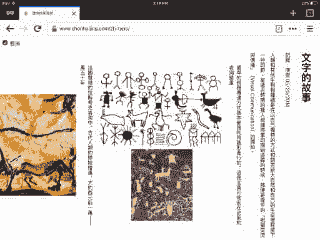](https://res.cloudinary.com/practicaldev/image/fetch/s--Yyeva4FG--/c_limit%2Cf_auto%2Cfl_progressive%2Cq_auto%2Cw_880/https://www.chenhuijing.cimg/posts/vertical-typesetting/ios.jpg)

<figcaption>iOS 11 上的横版-TB WebKit</figcaption>

[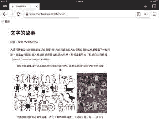](https://res.cloudinary.com/practicaldev/image/fetch/s--GFT4SnN0--/c_limit%2Cf_auto%2Cfl_progressive%2Cq_auto%2Cw_880/https://www.chenhuijing.cimg/posts/vertical-typesetting/ios2.jpg)

尽管我的 iPad 上安装了过多的浏览器，但我知道驱动所有浏览器的渲染引擎仍然是 WebKit，因为苹果从来不允许第三方浏览引擎。正如桌面版已经展示的那样，它是表现较好的版本之一。

## 代码时间

好了，现在我们已经建立了破坏的基线，是时候揭开防尘罩，看看我在那下面有什么奇怪的代码了。公平地说，考虑到这个演示是多么的简单，它并不多，所以这很好。

我还想大声喊出来(第无数次) [Browsersync](https://www.browsersync.io/) ，这是我的顶级开发工具，尤其是在多种设备上构建和调试多种浏览器的时候。如果没有 Browsersync，我不会做这么多。

### 一些背景

切换器的实现可能有两种方式，一种是使用 Javascript 切换类，或者使用 checkbox hack。我经常倾向于只使用 CSS 的解决方案，所以决定使用 checkbox hack。这个演示很简单，在键盘控制方面没有太多的干扰，我的意思是，你可以像任何其他复选框一样切换。

我真的需要研究一下可访问性，以确定我是否给屏幕阅读器带来了麻烦，但那是以后的事了。今天的首要任务是处理布局问题。

如果您以前没有尝试过，那么 checkbox hack 涉及到利用`:checked`伪选择器和兄弟或子选择器。你可以用这种方法用 CSS“黑”状态。

需要注意的是，切换`:checked`状态的输入(通常是 checkbox 元素)必须与您想要切换其状态的目标元素处于同一级别或更高。

```
<body>
  <input type="checkbox" name="mode" class="c-switcher__checkbox" id="switcher" checked>
  <label for="switcher" class="c-switcher__label">竪排</label>

  <main>
    <!-- All the markup for the content -->
  </main>

  <script src="scripts.js"></script>
</body> 
```

<svg width="20px" height="20px" viewBox="0 0 24 24" class="highlight-action crayons-icon highlight-action--fullscreen-on"><title>Enter fullscreen mode</title></svg> <svg width="20px" height="20px" viewBox="0 0 24 24" class="highlight-action crayons-icon highlight-action--fullscreen-off"><title>Exit fullscreen mode</title></svg>

这就是复杂之处。在同一个页面上混合不同的嵌套书写模式确实会使浏览器变得混乱。我不是浏览器工程师，但我有足够的基础知识来知道渲染不是小事。但我坚持惩罚，所以继续忍受痛苦！

<figcaption>通用策略带复选框黑客</figcaption>

[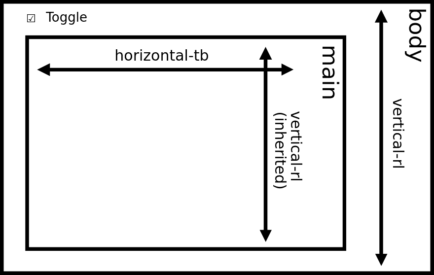](https://res.cloudinary.com/practicaldev/image/fetch/s--TadLWqxG--/c_limit%2Cf_auto%2Cfl_progressive%2Cq_auto%2Cw_880/https://www.chenhuijing.cimg/posts/vertical-typesetting/diagram.svg)

在最初的演示中，我将`body`元素的默认写入模式设置为`vertical-rl`，然后使用复选框切换`main`元素的写入模式。但是似乎每个人(浏览器渲染引擎)处理嵌套书写模式的方式都不一样，正如上面的截图目录所示。

### 调试 101:复位到基线

请记住，这是一个大脑转储条目，抱歉，如果你感到无聊。我做的第一件事是删除所有的风格，从头开始。同样，这是可行的，因为演示一开始就是基本的。伙计们，语境就是一切。

```
html {
  box-sizing: border-box;
  height: 100%;
}

*,
*::before,
*::after {
  box-sizing: inherit;
}

body {
  margin: 0;
  padding: 0;
  font-family: "Microsoft JhengHei", "微軟正黑體", "Heiti TC", "黑體-繁", sans-serif;
  text-align: justify;
} 
```

<svg width="20px" height="20px" viewBox="0 0 24 24" class="highlight-action crayons-icon highlight-action--fullscreen-on"><title>Enter fullscreen mode</title></svg> <svg width="20px" height="20px" viewBox="0 0 24 24" class="highlight-action crayons-icon highlight-action--fullscreen-off"><title>Exit fullscreen mode</title></svg>

这几乎成了我所有项目事实上的出发点。将一切设置为`border-box`，通常我会将`margin: 0`和`padding: 0`添加到通用选择器模块中，作为我的基线重置。但是在这个演示中，我会让浏览器保持间距，只重置`body`元素。

这个演示几乎是纯中文的，所以我在我的字体堆栈中只放了中文字体，并把系统的无衬线字体作为后备。然而，在大多数情况下，将您选择的基于拉丁语的字体放在第一位是一个普遍的共识。理由是，中文字体将支持基本的拉丁字符，而不是相反。

当浏览器遇到任何中文字符时，它不会在基于拉丁文的字体系列中找到它们，所以它会退回到下一行，直到找到可以找到的字体。如果您首先列出中文字体，浏览器将使用中文字体中的拉丁字符，有时这些字形不是那么完美，看起来不太好，尤其是在 Windows 上。

接下来是一些对布局没有太大影响的美学风格(`line-height`算吗？🤔)

```
img {
  max-height: 100%;
  max-width: 100%;
}

p {
  line-height: 2;
}

figure {
  margin: 0;
}

figcaption {
  font-family: "MingLiU", "微軟新細明體", "Apple LiSung", serif;
  line-height: 1.5;
} 
```

<svg width="20px" height="20px" viewBox="0 0 24 24" class="highlight-action crayons-icon highlight-action--fullscreen-on"><title>Enter fullscreen mode</title></svg> <svg width="20px" height="20px" viewBox="0 0 24 24" class="highlight-action crayons-icon highlight-action--fullscreen-off"><title>Exit fullscreen mode</title></svg>

这是一个相当不错的起点。所以现在我们可以开始调查`writing-mode`行为了。

### 垂直-rl 的含义

在每个元素上，`writing-mode`的缺省值是`horizontal-tb`，并且它是一个继承的属性。如果在一个元素上为`writing-mode`设置一个值，这个值将向下级联到它的所有子元素以及更高的元素。

如果我们在`main`元素上将`writing-mode`设置为`vertical-rl`，那么所有的文本和图像都会在每个浏览器中正确呈现。Firefox 有 15px 的轻微垂直溢出，我怀疑这是由于滚动条，但我不能确定。其他浏览器根本没有垂直溢出。

[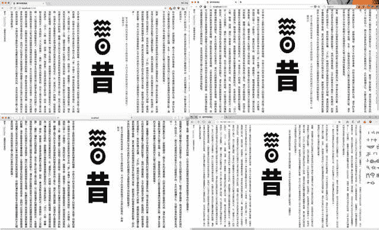T2】](https://res.cloudinary.com/practicaldev/image/fetch/s--3XTZzQkY--/c_limit%2Cf_auto%2Cfl_progressive%2Cq_auto%2Cw_880/https://www.chenhuijing.cimg/posts/vertical-typesetting/main-640.jpg)

让`main`元素处于垂直书写模式的问题是，文档本身处于水平书写模式，这意味着内容从左边开始，我们最终会在第一次加载时看到文章的结尾。

因此，让我们将事情向前推进一级，改为在`body`元素上设置`writing-mode: vertical-rl`。Chrome、Safari 和 Edge 从右向左渲染内容，这就是我们想要的。然而，Firefox 仍然显示文章的结尾，尽管这确实修复了滚动条溢出问题。这看起来与[错误 1102175](https://bugzilla.mozilla.org/show_bug.cgi?id=1102175) 最相关。

[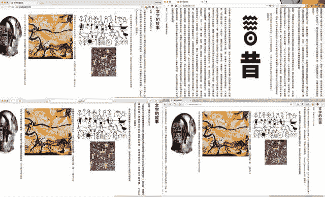T2】](https://res.cloudinary.com/practicaldev/image/fetch/s--dguTzLQ0--/c_limit%2Cf_auto%2Cfl_progressive%2Cq_auto%2Cw_880/https://www.chenhuijing.cimg/posts/vertical-typesetting/body-640.jpg)

最后，如果我们将`writing-mode: vertical-rl`应用到`html`元素，Firefox 最终会从右向左读取。还有，没有搞笑溢出，只是垂直的从右到左的善良。

[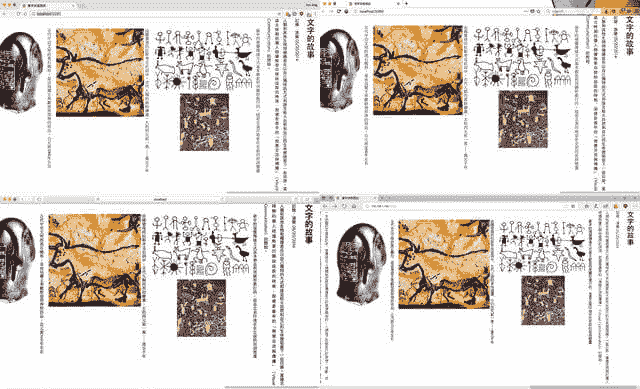T2】](https://res.cloudinary.com/practicaldev/image/fetch/s--QrvD2T3B--/c_limit%2Cf_auto%2Cfl_progressive%2Cq_auto%2Cw_880/https://www.chenhuijing.cimg/posts/vertical-typesetting/html-640.jpg)

IE11 支持写模式，但是使用了在使用`-ms-writing-mode: tb-rl`的规范的[早期版本中定义的旧语法。这工作得很好，但是基于我当前的标记，它使用了 IE11 不支持的`main`元素，切换器失败了。即使在`main`元素上应用`display: block`也不能修复它。为了更好的支持，我可以把`main`换成`div`。让我考虑一下。](https://www.w3.org/TR/2003/CR-css3-text-20030514/#Progression)

## 布局切换

Firefox 中有一些已知的 flexbox bugs，所以我将调试任务分成两部分，第一部分是纯粹的布局。找出不同的方法，让写作模式切换器工作，没有任何时髦的溢出。

第二部分将涉及到图像在图中的中心位置，这是我陷入这种混乱的原因。除了居中之外，我还想有某种图像定位。这也是我第一次重温这个演示的原因:我的 [RICG 用例撰写](https://github.com/ResponsiveImagesCG/ri-usecases/issues/63)。#mildlysidetracked

### 解决方案 1: Javascript

先说逃避解决方案。既然问题产生于嵌套混合编写模式，也许停止使用它们？根据我们上面的观察，一个 Javascript 事件监听器在`html`元素上切换 CSS 类可能会解决很多奇怪的呈现问题。好了，代码时间🤓。

我想在两个类之间切换，这两个类毫无创意地命名为`vertical`和`horizontal`。既然我已经有了复选框，不妨利用它作为 toggler 类。

```
document.addEventListener('DOMContentLoaded', function() {
  const switcher = document.getElementById('switcher')

  switcher.onchange = changeEventHandler
}, false)

function changeEventHandler(event) {
  const isChecked = document.getElementById('switcher').checked
  const container = document.documentElement

  if (isChecked) {
    container.className = 'vertical'
  } else {
    container.className = 'horizontal'
  }
} 
```

<svg width="20px" height="20px" viewBox="0 0 24 24" class="highlight-action crayons-icon highlight-action--fullscreen-on"><title>Enter fullscreen mode</title></svg> <svg width="20px" height="20px" viewBox="0 0 24 24" class="highlight-action crayons-icon highlight-action--fullscreen-off"><title>Exit fullscreen mode</title></svg>

将内容块居中进行得相当顺利。因为没有任何有趣的书写模式嵌套，也没有 flexbox 的参与，一个简单的自动边距居中在所有浏览器中都能很好地工作，甚至是 Firefox。

```
.vertical {
  writing-mode: vertical-rl;

  main {
    max-height: 35em;
    margin-top: auto;
    margin-bottom: auto;
  }
}

.horizontal {
  writing-mode: horizontal-tb;

  main {
    max-width: 40em;
    margin-left: auto;
    margin-right: auto;
  }
} 
```

<svg width="20px" height="20px" viewBox="0 0 24 24" class="highlight-action crayons-icon highlight-action--fullscreen-on"><title>Enter fullscreen mode</title></svg> <svg width="20px" height="20px" viewBox="0 0 24 24" class="highlight-action crayons-icon highlight-action--fullscreen-off"><title>Exit fullscreen mode</title></svg>

[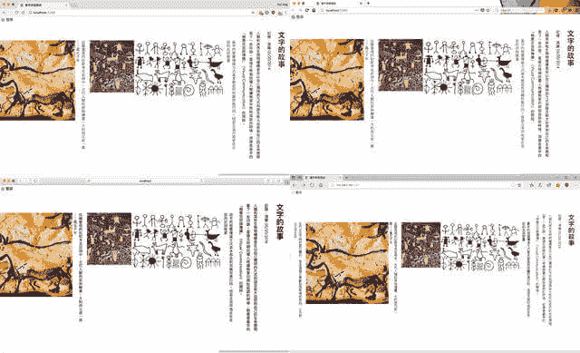T2】](https://res.cloudinary.com/practicaldev/image/fetch/s--vqAqJJqd--/c_limit%2Cf_auto%2Cfl_progressive%2Cq_auto%2Cw_880/https://www.chenhuijing.cimg/posts/vertical-typesetting/centred2-640.jpg)

有趣的事实是，在垂直书写模式下，我们可以使用`margin-top: auto`和`margin-bottom: auto`来垂直居中！但是相信我，当我说水平居中比你想象的更痛苦。你会看到，当我们到下一部分与复选框黑客。

**意外倾斜**:微软 Edge 坚持“*在严格模式下不允许对只读属性赋值*”ecmascript 5 标准，但 Chrome 和 Firefox 允许严格的怪癖模式，很可能是为了代码兼容。我最初试图使用`classList`来切换类名，但是它是一个只读属性。`className`虽然不是只读的。相关阅读见下面的链接。

### 解决方案 2:复选框破解

这项技术背后的机制类似于使用 Javascript，只是我们没有使用 CSS 类来改变状态，而是使用了`:checked`伪元素。就像我们之前讨论的那样，checkbox 元素必须与`main`元素处于相同的级别才能工作。

```
.c-switcher__checkbox:checked ~ main {
  max-height: 35em;
  margin-top: auto;
  margin-bottom: auto;
}

.c-switcher__checkbox:not(:checked) ~ main {
  writing-mode: horizontal-tb;
  max-width: 40em; 
  margin-left: auto; // this doesn't work
  margin-right: auto; // this doesn't work
} 
```

<svg width="20px" height="20px" viewBox="0 0 24 24" class="highlight-action crayons-icon highlight-action--fullscreen-on"><title>Enter fullscreen mode</title></svg> <svg width="20px" height="20px" viewBox="0 0 24 24" class="highlight-action crayons-icon highlight-action--fullscreen-off"><title>Exit fullscreen mode</title></svg>

布局代码与`.vertical`和`.horizontal`相同，但可惜结果并非如此。垂直居中很好，看起来就像我们使用 Javascript 一样。但是水平居中是向右倾斜的。自动边距在这个维度上似乎没有任何作用。

但是如果你仔细想想，这实际上是“正确的”行为，因为我们也不能用这种方法在水平书写模式下垂直居中。这是为什么呢？让我们检查一下规格。

所有的 CSS 属性都有值，一旦你的浏览器解析了一个文档并构建了 DOM 树，它需要为每个元素的每个属性赋值。林·克拉克给[写了一个精彩的代码漫画](https://hacks.mozilla.org/2017/08/inside-a-super-fast-css-engine-quantum-css-aka-stylo/)解释 CSS 引擎是如何工作的，你必须读一读！反正价值观。从规格来看:

> 属性的最终值是一个**四步计算**的结果:该值通过规范确定(**指定值**)，然后解析为一个用于继承的值(**计算值**)，然后在必要时转换为绝对值(**使用值**)，最后根据当地环境的限制进行转换(**实际值**)。

此外，根据规范，高度的[计算和边距的](https://www.w3.org/TR/CSS2/visuren.html#relative-positioning)是由不同类型的盒子的许多规则决定的。如果上限值和下限值都是自动的，则它们的使用值被解析为`0`。

[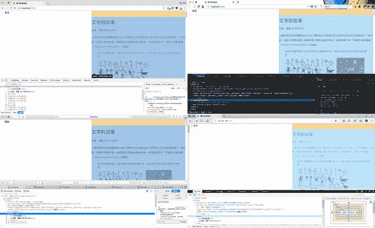T2】](https://res.cloudinary.com/practicaldev/image/fetch/s--KHik-nUp--/c_limit%2Cf_auto%2Cfl_progressive%2Cq_auto%2Cw_880/https://www.chenhuijing.cimg/posts/vertical-typesetting/zero-640.jpg)

当我们将书写模式设置为垂直时，在计算这些值时，“高度”似乎变成了横轴。我说似乎是因为我真的不能 100%确定它到底是如何工作的。我突然意识到 Javascript 解决方案实际上是神奇的！

不，我开玩笑的。这实际上是因为我们在使用 Javascript 解决方案时没有混合书写模式，所以解析为`0`的各个维度并没有影响我们想要实现的居中。也许把这句话再读几遍🤷。

为了在垂直书写模式切换时水平居中我们的`main`元素，我们需要使用好的 ol' transform 技巧。

```
.c-switcher__checkbox:not(:checked) ~ main {
  position: absolute;
  top: 0;
  right: 50%;
  transform: translateX(50%);
} 
```

<svg width="20px" height="20px" viewBox="0 0 24 24" class="highlight-action crayons-icon highlight-action--fullscreen-on"><title>Enter fullscreen mode</title></svg> <svg width="20px" height="20px" viewBox="0 0 24 24" class="highlight-action crayons-icon highlight-action--fullscreen-off"><title>Exit fullscreen mode</title></svg>

这适用于 Chrome、Firefox 和 Safari。不幸的是，它的边缘有点不稳，页面中间的某个地方向左倾斜了。是时候向 Edge 提交 bug 了。此外，滚动条出现在左侧而不是右侧。

[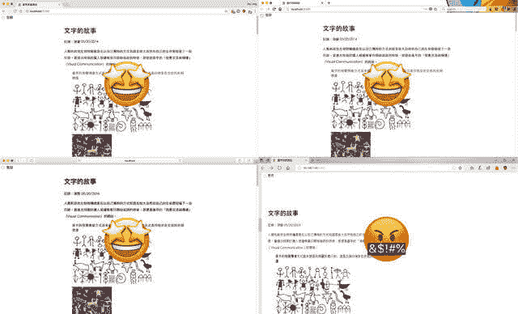T2】](https://res.cloudinary.com/practicaldev/image/fetch/s--0BAr7HLY--/c_limit%2Cf_auto%2Cfl_progressive%2Cq_auto%2Cw_880/https://www.chenhuijing.cimg/posts/vertical-typesetting/troublemaker-640.jpg)

## 处理图像对齐

好了，继续。当在垂直书写模式下，我希望有两个图像的数字堆叠显示，而在水平模式下，当空间允许时，并排显示。理想情况下，图形(图像和标题)在各自的书写模式下居中对齐。

### 旧派属性

既然我们是在一个干净的石板上操作，让我们试一下最基本的定心技术:`text-align`。默认情况下，图像和文本是行内元素。将`text-align: center`应用到图形元素，天啊，成功了😱！

水平和垂直书写模式下的图像都已成功居中，没有任何问题。我现在非常担心一年前我建造这个的时候的心态。显然 flexbox 对我的意图和目的来说是不必要的。我先伸手去拿新的闪亮的，它咬了我的屁股。

我很震惊。我需要喝一杯🥃.

在水平书写模式下，没什么需要添加的。只是一个简单的`margin-bottom: 1em`数字之间的一些喘息空间。出于空间原因，我确实需要将纵向图像旋转为横向图像，并且使用了旋转变换。

```
.vertical {
  figure {
    margin-bottom: 1em;
  }

  figcaption {
    max-width: 30em;
    margin: 0 auto;
    display: inline-block;
    text-align: justify;
  }

  .img-rotate {
    transform: rotate(-90deg);
  }
} 
```

<svg width="20px" height="20px" viewBox="0 0 24 24" class="highlight-action crayons-icon highlight-action--fullscreen-on"><title>Enter fullscreen mode</title></svg> <svg width="20px" height="20px" viewBox="0 0 24 24" class="highlight-action crayons-icon highlight-action--fullscreen-off"><title>Exit fullscreen mode</title></svg>

事情是这样的，当你旋转一个元素时，浏览器仍然识别它的原始宽度和高度值(我想)，所以对于我的演示，当视窗变得很窄时，它会触发水平溢出。也许有解决的办法，或者我做错了。欢迎咨询。

这是我将为 RICG 撰写的具体用例。想法是，如果有某种媒体对书写模式的查询，我可以使用`srcset`属性定义一个肖像图像和一个风景图像，然后相应地提供适当的图像。

对于垂直书写模式，我们通常希望文本是两端对齐的，或者至少对于那些短线上的半孤立字符是顶端对齐的。对于呼吸空间，边距应用于左侧而不是底部。

```
.vertical {
  figure {
    margin-left: 1em;
  }

  figcaption {
    max-height: 30em;
    margin: auto 0.5em;
    display: inline-block;
    text-align: justify;
  }
} 
```

<svg width="20px" height="20px" viewBox="0 0 24 24" class="highlight-action crayons-icon highlight-action--fullscreen-on"><title>Enter fullscreen mode</title></svg> <svg width="20px" height="20px" viewBox="0 0 24 24" class="highlight-action crayons-icon highlight-action--fullscreen-off"><title>Exit fullscreen mode</title></svg>

我们现在差不多可以收工了。结束了。这已经是目标的最终结果。我想补充一点，这对于 Javascript 实现和 checkbox hack 实现来说是完全一样的，除了我前面提到的 Edge bug。

### 使用 flexbox 对中

我怀疑我选择使用 flexbox 来定心，虽然我真的不记得为什么我认为这是个好主意。很明显，我不需要 flexbox 来做这些事情。当时应该做一个大脑倾倒，是吧？

但是看一看我的原始代码，我意识到我已经对那些应该堆叠的图像的图像包装器`div`应用了一个`display: flex`。这使得图像本身成为伸缩子图像，并且在使用垂直书写模式时，在某种程度上打乱了 Firefox 中的渲染😩。

[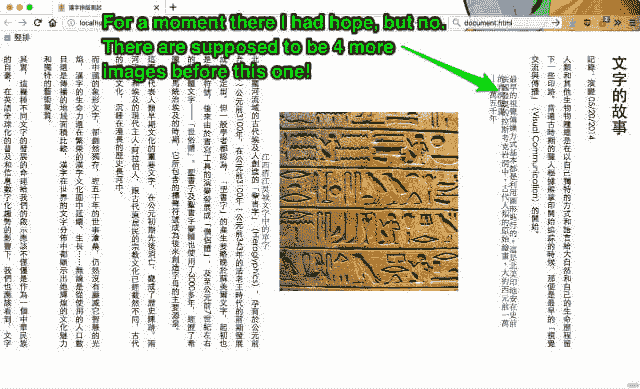T2】](https://res.cloudinary.com/practicaldev/image/fetch/s--4PSqtuxJ--/c_limit%2Cf_auto%2Cfl_progressive%2Cq_auto%2Cw_880/https://www.chenhuijing.cimg/posts/vertical-typesetting/ffbug-640.jpg)

当使用这种方法时，我测试的 Chrome、Edge 和 Safari 版本看起来都很好(参考上面的列表),图像在垂直和水平方向上都居中对齐，这很好。但它们不在 Firefox 中，就像字面上一样，当垂直书写模式切换时，图像在我的页面上不可见。不过在水平方向上还是不错的。

[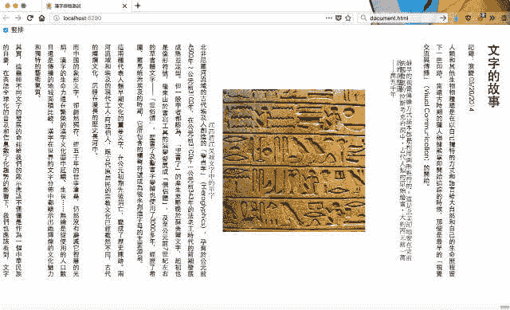T2】](https://res.cloudinary.com/practicaldev/image/fetch/s--I56umJZj--/c_limit%2Cf_auto%2Cfl_progressive%2Cq_auto%2Cw_880/https://www.chenhuijing.cimg/posts/vertical-typesetting/ffbug2-640.jpg)

我已经将应该做堆叠工作的图像包装在一个已经应用了`display: flex`的`div`中，这在某种程度上打乱了 Firefox 在垂直书写模式下的渲染。我怀疑这种行为与以下 Bug 有关: [Bug 1189131](https://bugzilla.mozilla.org/show_bug.cgi?id=1189131) 、 [Bug 1223180](https://bugzilla.mozilla.org/show_bug.cgi?id=1223180) 、 [Bug 1332555](https://bugzilla.mozilla.org/show_bug.cgi?id=1332555) 、 [Bug 1318825](https://bugzilla.mozilla.org/show_bug.cgi?id=1318825) 和 [Bug 1382867](https://bugzilla.mozilla.org/show_bug.cgi?id=1382867) 。

与此同时，我对图片的这种效果有点好奇，这些图片是 flex 的孩子，在 Firefox 上的垂直书写模式下有这种效果。这就像浏览器刚刚去没有🧟‍♀️🙅💩。

[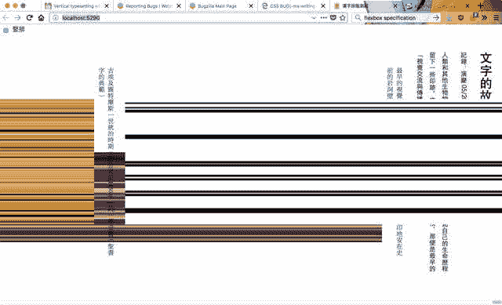T2】](https://res.cloudinary.com/practicaldev/image/fetch/s--2ezi-m0I--/c_limit%2Cf_auto%2Cfl_progressive%2Cq_auto%2Cw_880/https://www.chenhuijing.cimg/posts/vertical-typesetting/whoa-640.jpg)

除了垂直书写模式，不久前我和 Jen Simmons 就 flexbox 在不同浏览器上的实现进行了一次对话，她发现所有浏览器对缩小图像的处理方式都不一样。[CSS 工作组仍在讨论这个问题](https://github.com/w3c/csswg-drafts/issues/1322)，敬请关注最新消息。

这个收缩问题与固有大小的概念有关，特别是图像的固有纵横比。CSS 工作组对此进行了相当长时间的讨论，因为这不是一个小问题。

一个有趣的观察是，在 Firefox 上，flex 容器的宽度限制在视口的宽度，但在其他浏览器上却不是这样。当容器中图像的总宽度超过视窗宽度时，在 Firefox 上，图像会缩小以适应视窗宽度，但在所有其他浏览器上，图像会溢出，这样就会出现水平滚动🤔。

为了避免这个问题，我确保我的图片本身都不是 flex 的孩子。所有的图像，无论是双打还是单打，都被包裹在一个附加的`div`中。`display: flex`属性被应用到`figure`元素上，这使得`figcaption`和图像包装器`div`成为 flex 子对象，而不是图像本身。

```
.vertical {
  writing-mode: vertical-rl;

  main {
    max-height: 35em;
    margin-top: auto;
    margin-bottom: auto;
  }

  figure {
    flex-direction: column;
    align-items: center;
    margin-left: 1em;
  }

  figcaption {
    max-height: 30em;
    margin-left: 0.5em;
  }

  .img-single {
    max-height: 20em;
  }
}

.horizontal {
  writing-mode: horizontal-tb;

  main {
    max-width: 40em;
    margin-left: auto;
    margin-right: auto;
  }

  figure {
    flex-wrap: wrap;
    justify-content: center;
    margin-bottom: 1em;
  }

  figcaption {
    max-width: 30em;
    margin-bottom: 0.5em;
  }

  .img-wrapper img {
    vertical-align: middle;
  }

  .img-single {
    max-width: 20em;
  }

  .img-rotate {
    transform: rotate(-90deg);
  }
} 
```

<svg width="20px" height="20px" viewBox="0 0 24 24" class="highlight-action crayons-icon highlight-action--fullscreen-on"><title>Enter fullscreen mode</title></svg> <svg width="20px" height="20px" viewBox="0 0 24 24" class="highlight-action crayons-icon highlight-action--fullscreen-off"><title>Exit fullscreen mode</title></svg>

checkbox hack 实现的工作方式完全相同。我从这个练习中得到的启示是，浏览器需要非常努力地计算元素的维度，尤其是那些具有内在纵横比的元素。

### 网格怎么样？

我们已经离这个布局的要求很远了，所以我考虑尝试使用网格来对齐图像。我们可以试着把每个`figure`做成一个网格容器，也许可以利用有趣的属性，比如`grid-area`和`fit-content`，让事情排列起来。

不幸的是，尝试 10 分钟后，我伤透了脑筋。Firefox 中的网格检查器工具似乎与我页面上的元素不匹配，但可能是因为那里有太多的东西。

[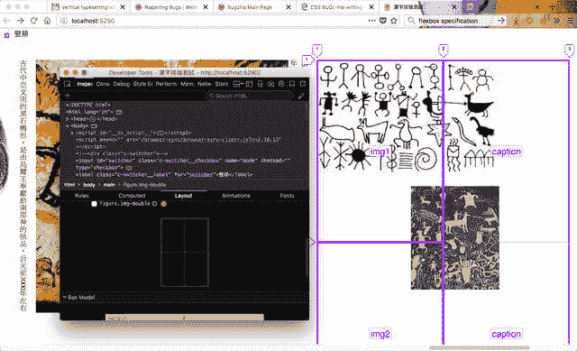T2】](https://res.cloudinary.com/practicaldev/image/fetch/s--VkGVFp5n--/c_limit%2Cf_auto%2Cfl_progressive%2Cq_auto%2Cw_880/https://www.chenhuijing.cimg/posts/vertical-typesetting/gridtool-640.jpg)

我需要创建一个简化的测试用例，使用垂直模式的网格，这将是一个更简单的演示和单独的书面报告(可能与相应的错误报告)。

## 获奖方案？

我的[独立演示](https://www.chenhuijing.com/zh-type/)的当前活动实现是没有 flexbox 解决方案的 checkbox hack。我保留了 checkbox hack 版本来跟踪 Edge bug。但是 flexbox 解决方案，如果你不介意额外的包装，也很好。Javascript 实现的标记看起来也更好，因为您可以将切换包装在一个`div`中。

但是到了最后，有很多方法可以达到相同的最终结果。从其他地方复制代码是没问题的，但是当某些地方出错了，而你又不知道为什么时，麻烦就来了。你不必从头开始写所有的东西，但要确保没有你无法破译的“魔法”。

只是说说😎。

## 进一步阅读

*   [在严格模式下不允许对只读属性赋值](https://devtidbits.com/2016/06/12/assignment-to-read-only-properties-is-not-allowed-in-strict-mode/)
*   [超快速 CSS 引擎内部:量子 CSS(又名 Stylo)](https://hacks.mozilla.org/2017/08/inside-a-super-fast-css-engine-quantum-css-aka-stylo/)
*   [CSS 写入模式第三级](https://www.w3.org/TR/css-writing-modes-3/)
*   [CSS 灵活框布局模块一级编辑稿](https://drafts.csswg.org/css-flexbox/)
*   [CSS 内在&外在规模模块第 3 级](https://www.w3.org/TR/css-sizing-3/)

## 问题和 bug 列表

*   [Firefox Bug 1102175:<body>with writing-mode:vertical-rl 不将子元素向右对齐](https://bugzilla.mozilla.org/show_bug.cgi?id=1102175)
*   Firefox Bug 1189131:当书写模式为垂直时，flex align-items center 会替换文本-rl
*   [Firefox 错误 1223180: Flex +垂直书写模式:Flex 项目/文本消失](https://bugzilla.mozilla.org/show_bug.cgi?id=1223180)
*   [Firefox Bug 1332555:[writing-mode]垂直写入模式的子元素导致父元素的固有大小错误，因此子元素在重排后不适合](https://bugzilla.mozilla.org/show_bug.cgi?id=1332555)
*   [Firefox 错误 1318825: [css-flexbox]水平 flex 容器中的垂直书写模式 flex 项目宽度错误](https://bugzilla.mozilla.org/show_bug.cgi?id=1318825)
*   Firefox 错误 1382867:写模式和 flexbox 的布局问题
*   [CSSWG 问题#1322: [css-flexbox]具有收缩图像的非互操作性](https://github.com/w3c/csswg-drafts/issues/1322)
*   [Chromium 问题 781972:调整大小时图像不保持纵横比](https://bugs.chromium.org/p/chromium/issues/detail?id=781972)

*最初发布于[www.chenhuijing.com](https://www.chenhuijing.com/blog/vertical-typesetting-revisited/)2017 年 12 月 04 日。*

</figcaption>

</figcaption>