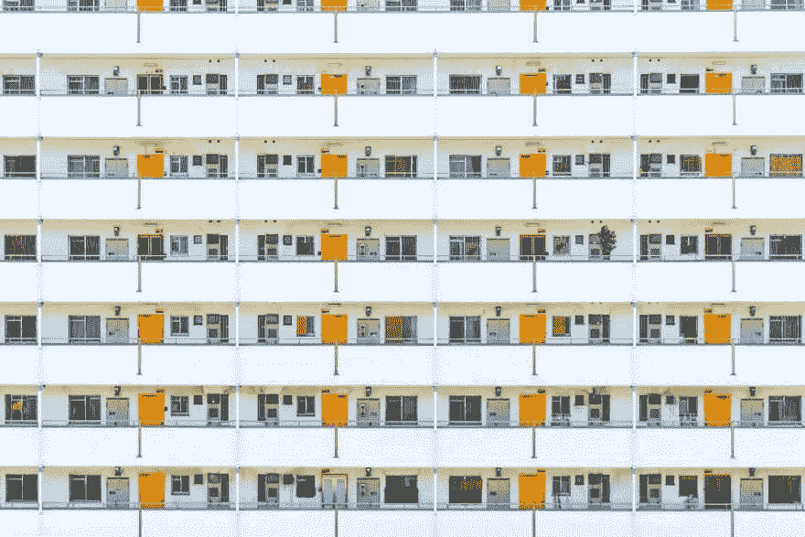
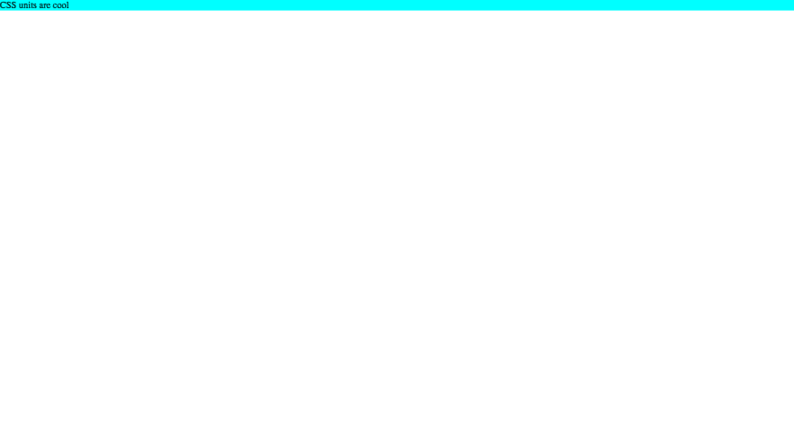
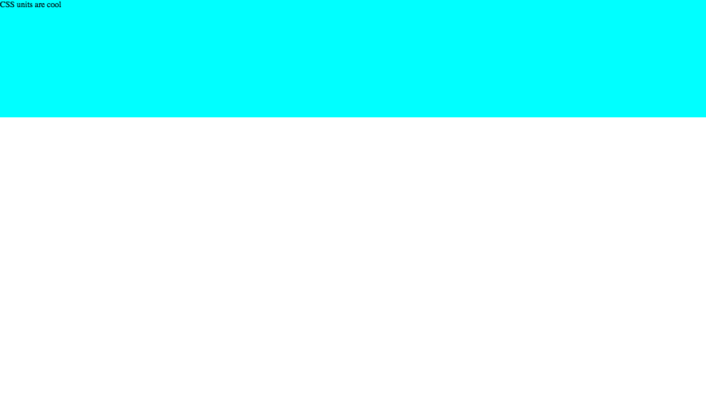
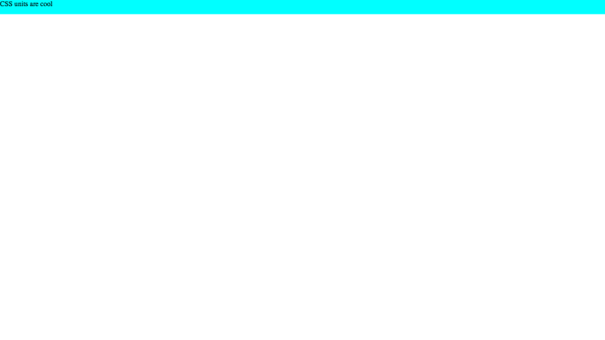
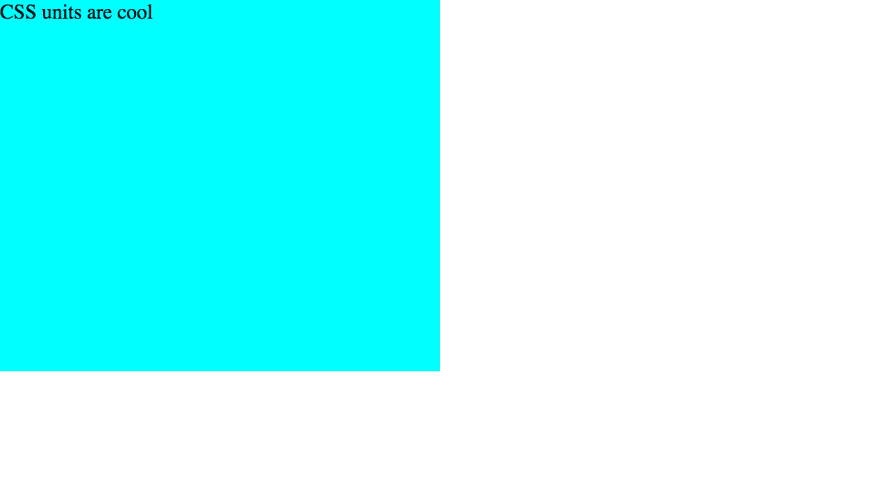
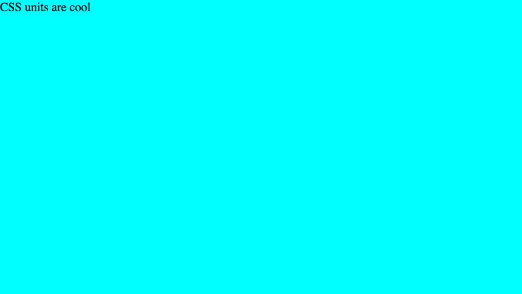
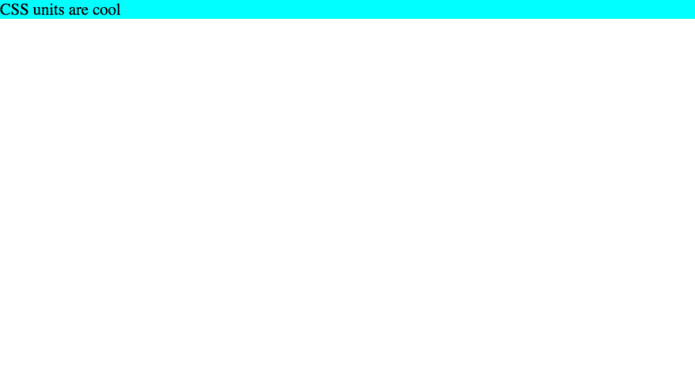

# CSS 单位——比你想象的要多…🤔

> 原文:[https://dev.to/codetheweb/css-units-那里比你想象的还要多- cm2](https://dev.to/codetheweb/css-units--there-are-more-than-you-think--cm2)

[T2】](https://res.cloudinary.com/practicaldev/image/fetch/s--m3QHDRWQ--/c_limit%2Cf_auto%2Cfl_progressive%2Cq_auto%2Cw_880/https://codetheweb.blog/assets/img/posts/css-units/cover.jpg)

## 入门

我认为最好是边做边学，所以我强烈建议在我的所有教程中遵循。接下来，首先创建一个新的项目文件夹，其中包含`index.html`和`style.css`文件。将以下代码添加到您的`index.html` :

```
<!DOCTYPE html>
<html>
    <head>
        <title>CSS units DEMO</title>
        <link rel="stylesheet" href="style.css">
    </head>
    <body>
        <div id="demo">CSS units are cool</div>
    </body>
</html> 
```

<svg width="20px" height="20px" viewBox="0 0 24 24" class="highlight-action crayons-icon highlight-action--fullscreen-on"><title>Enter fullscreen mode</title></svg> <svg width="20px" height="20px" viewBox="0 0 24 24" class="highlight-action crayons-icon highlight-action--fullscreen-off"><title>Exit fullscreen mode</title></svg>

并将以下内容添加到您的`style.css` :

```
body {
    margin: 0; /* Remove default margins */
}

#demo {
    background-color: cyan; /* So that we can see the width/height */
} 
```

<svg width="20px" height="20px" viewBox="0 0 24 24" class="highlight-action crayons-icon highlight-action--fullscreen-on"><title>Enter fullscreen mode</title></svg> <svg width="20px" height="20px" viewBox="0 0 24 24" class="highlight-action crayons-icon highlight-action--fullscreen-off"><title>Exit fullscreen mode</title></svg>

> 注意:在本文的其余部分，我不会在代码中包含关于`body`的部分。只要记得把它放在你的 CSS 文件的顶部。这样做的原因是因为默认情况下，主体有边距，在某些情况下可以填充定位。

在网络浏览器中打开您的`index.html`。如果一切顺利，应该是这样的:

[T2】](https://res.cloudinary.com/practicaldev/image/fetch/s--vEzdU7Vq--/c_limit%2Cf_auto%2Cfl_progressive%2Cq_auto%2Cw_880/https://codetheweb.blog/assets/img/posts/css-units/base-code.png)

我们走吧！

## 固定单位

固定单元很简单——不管在什么情况下，它们都保持相同的大小。比如`2px`永远是同一个`2px`。但是，其他单位(如`vw`)可以改变。CSS 中允许的固定单位有:

| 单位 | 意义 |
| --- | --- |
| 像素 | 像素 |
| 厘米 | 厘米 |
| 毫米 | 毫米 |
| 在 | 英寸 |
| 元素铂的符号 | 点数(= 1 英寸的 1/72) |
| 个人计算机 | 十二点活字 |

> **关于`px` :** 一个像素是观看者屏幕上的一个像素。这意味着一个像素*可以根据观看者的屏幕分辨率*变化(因为像素的数量并不总是与屏幕的大小成比例，像素可以更小或更大)。
> 
> 然而，像素仍然被认为是固定的单位，因为一旦网站被加载，它们就不能改变。

如果你愿意，你可以在你的演示页面上尝试所有的固定单位。我在这里不打算这样做，因为这是不言自明的，但基本上是这样的(无论你使用什么单位):

```
#demo {
    background-color: cyan;
    height: 6cm;
} 
```

<svg width="20px" height="20px" viewBox="0 0 24 24" class="highlight-action crayons-icon highlight-action--fullscreen-on"><title>Enter fullscreen mode</title></svg> <svg width="20px" height="20px" viewBox="0 0 24 24" class="highlight-action crayons-icon highlight-action--fullscreen-off"><title>Exit fullscreen mode</title></svg>

结果: [](https://res.cloudinary.com/practicaldev/image/fetch/s--HSquMMog--/c_limit%2Cf_auto%2Cfl_progressive%2Cq_auto%2Cw_880/https://codetheweb.blog/assets/img/posts/css-units/cm.png)

固定单位的一般惯例是总是使用`px`，但是没有理由不使用任何其他单位。不要担心记忆`pt`和`pc`，你很少会需要它们。

所以，这就是固定单位。对他们来说真的没什么(尽管知道他们的存在是件好事)。现在到了有趣的部分！

## 相对单位

相对单位可以改变，因为它们相对于*另一个长度*。这意味着`2vw`等长度将根据其参考长度而有不同的大小。我们走吧！

### `em`

`em`单位是相对于元素的字体大小。例如，假设我们有一个 div，我们想将高度设置为`2em`——这意味着我们将它设置为两倍的字体大小。事实上，让我们试试吧！

```
#demo {
    background-color: cyan;
    height: 2em;
} 
```

<svg width="20px" height="20px" viewBox="0 0 24 24" class="highlight-action crayons-icon highlight-action--fullscreen-on"><title>Enter fullscreen mode</title></svg> <svg width="20px" height="20px" viewBox="0 0 24 24" class="highlight-action crayons-icon highlight-action--fullscreen-off"><title>Exit fullscreen mode</title></svg>

结果: [](https://res.cloudinary.com/practicaldev/image/fetch/s--XMlGAquH--/c_limit%2Cf_auto%2Cfl_progressive%2Cq_auto%2Cw_880/https://codetheweb.blog/assets/img/posts/css-units/em-height.png)

正如你所看到的，我们的`<div>`现在的高度是它的字体大小的两倍！这意味着它(大约)是文本高度的两倍。

`em`在设置`font-size`属性时也很有用！例如，如果我们想将文本的大小增加一倍，我们只需说`font-size: 2em`。我们来试试吧！

```
#demo {
    background-color: cyan;
    height: 2em;
    font-size: 2em; /* Add this line */
} 
```

<svg width="20px" height="20px" viewBox="0 0 24 24" class="highlight-action crayons-icon highlight-action--fullscreen-on"><title>Enter fullscreen mode</title></svg> <svg width="20px" height="20px" viewBox="0 0 24 24" class="highlight-action crayons-icon highlight-action--fullscreen-off"><title>Exit fullscreen mode</title></svg>

结果: [](https://res.cloudinary.com/practicaldev/image/fetch/s--zKQbnheE--/c_limit%2Cf_auto%2Cfl_progressive%2Cq_auto%2Cw_880/https://codetheweb.blog/assets/img/posts/css-units/em-font-size.png)

如你所见，`font-size`已经翻倍了。但我们的`height` - *也是如此什么？因为`font-size`增加了一倍，所以`height`也增加了一倍，因为它被设置为`font-size`的两倍。*

这就是相对单位的性质！我们的`height`属性还是`2em`，但是元素的实际高度已经变了！

### `rem`

`rem`单元只是根元素的`em`(`<html>`标签)。这就是全部了！

### [T3`vw`T4】T1】](#-raw-vw-endraw-amp-raw-vh-endraw-)

`vw`和`vh`代表*视口宽度*和*视口高度*。正如我之前解释过的，视窗是浏览器窗口(不包括标签等)。)-实际网站部分屏幕: [](https://res.cloudinary.com/practicaldev/image/fetch/s--w7DDn0Qo--/c_limit%2Cf_auto%2Cfl_progressive%2Cq_auto%2Cw_880/https://codetheweb.blog/assets/img/posts/css-position-property/viewport.png)

`1vw`是视口宽度的 1%,`1vh`是视口高度的 1%。我们来试试吧！

```
#demo {
    background-color: cyan;
    height: 75vh; /* Change this line */
    width: 50vw; /* Add this line */
    font-size: 2em;
} 
```

<svg width="20px" height="20px" viewBox="0 0 24 24" class="highlight-action crayons-icon highlight-action--fullscreen-on"><title>Enter fullscreen mode</title></svg> <svg width="20px" height="20px" viewBox="0 0 24 24" class="highlight-action crayons-icon highlight-action--fullscreen-off"><title>Exit fullscreen mode</title></svg>

结果: [](https://res.cloudinary.com/practicaldev/image/fetch/s--FU9-Ach0--/c_limit%2Cf_auto%2Cfl_progressive%2Cq_auto%2Cw_880/https://codetheweb.blog/assets/img/posts/css-units/vw-vh.png)

如你所见，`<div>`占据了浏览器窗口宽度的 50%和浏览器窗口高度的 75%。

当元素覆盖整个屏幕时，`vw`和`vh`尤其有用。我们试试吧！看你能不能猜出代码:

```
#demo {
    background-color: cyan;
    height: 100vh; /* Change this line */
    width: 100vw; /* Change this line */
    font-size: 2em;
} 
```

<svg width="20px" height="20px" viewBox="0 0 24 24" class="highlight-action crayons-icon highlight-action--fullscreen-on"><title>Enter fullscreen mode</title></svg> <svg width="20px" height="20px" viewBox="0 0 24 24" class="highlight-action crayons-icon highlight-action--fullscreen-off"><title>Exit fullscreen mode</title></svg>

结果: [](https://res.cloudinary.com/practicaldev/image/fetch/s--etchkMQw--/c_limit%2Cf_auto%2Cfl_progressive%2Cq_auto%2Cw_880/https://codetheweb.blog/assets/img/posts/css-units/vw-vh-cover.png)

呜！`<div>`现在占据了整个屏幕！这是`vw`和`vh`的一个常见用法，尽管还有更多。

### (`%`)

我们已经到了最后一步，这是我将在本文中介绍的最后一个单元。`%`是指母元素的百分比。例如，`200%` `width`是父元素的 2x 的`width`，而`200%` `font-size`是父元素的 2x 的`font-size`。

那么为什么我们不能用`100%`代替`100vw`和`100vh`？嗯，我们来试试:

```
#demo {
    background-color: cyan;
    height: 100%; /* Change this line */
    width: 100%; /* Change this line */
    font-size: 2em;
} 
```

<svg width="20px" height="20px" viewBox="0 0 24 24" class="highlight-action crayons-icon highlight-action--fullscreen-on"><title>Enter fullscreen mode</title></svg> <svg width="20px" height="20px" viewBox="0 0 24 24" class="highlight-action crayons-icon highlight-action--fullscreen-off"><title>Exit fullscreen mode</title></svg>

结果: [](https://res.cloudinary.com/practicaldev/image/fetch/s--WkVeqBat--/c_limit%2Cf_auto%2Cfl_progressive%2Cq_auto%2Cw_880/https://codetheweb.blog/assets/img/posts/css-units/100-percent.png) 没有！身高恢复正常了！这是为什么呢？

嗯，用`height: 100%`的时候要小心。如您所知，它意味着 100%的父元素(在本例中是`<body>`)。你可能认为`<body>`占据了整个屏幕，但实际上并没有！

默认情况下，`<body>`元素(或任何元素)的尺寸被设置为`auto`。这意味着它们只占用与它们的内容一样多的空间。所以，我们的身体不是 100%的屏幕高度，而是被设置为其内容的高度(`<div>`)。但是，我们想让`<div>`100%占用`<body>`！这意味着它实际上只是占据了自己默认高度的 100%。

`width`不受影响的原因是因为`<div>`的显示类型是[块](https://codetheweb.blog/2017/11/29/css-display-property/#display-block)，块元素总是占据最大可用宽度(在这种情况下是整个屏幕)。

要修正`height`的问题，我们可以给车身一个固定的高度:

```
body {
    margin: 0;
    height: 100vh; /* Add this line */
}

#demo {
    background-color: cyan;
    height: 100%;
    width: 100%;
    font-size: 2em;
} 
```

<svg width="20px" height="20px" viewBox="0 0 24 24" class="highlight-action crayons-icon highlight-action--fullscreen-on"><title>Enter fullscreen mode</title></svg> <svg width="20px" height="20px" viewBox="0 0 24 24" class="highlight-action crayons-icon highlight-action--fullscreen-off"><title>Exit fullscreen mode</title></svg>

结果:

[T2】](https://res.cloudinary.com/practicaldev/image/fetch/s--etchkMQw--/c_limit%2Cf_auto%2Cfl_progressive%2Cq_auto%2Cw_880/https://codetheweb.blog/assets/img/posts/css-units/vw-vh-cover.png)

现在，`<div>`占据了`<body>`高度的`100%`(`100vh`)。

我将在后面的文章中更深入地探讨 CSS 继承。

## 结论

呜！希望你今天学到了很多(如果你学到了，可以在评论中告诉我)。

如果你喜欢这篇文章，我希望你能分享它或者注册简讯。写博客需要很多时间和精力，如果你能帮忙，我会非常感激！

如果你对这篇文章有疑问或反馈，或者需要一些编码帮助，你可以联系我或者在下面的评论中告诉我。

下一次我将谈论[flex box](https://codetheweb.blog/2017/12/05/css-flexboxes/)，它是 CSS 中最酷的部分之一(在我看来😉).

到时候见，继续编码，祝你有美好的一天！

又及:我希望你喜欢这个微不足道的封面图片😜

> ### 想要更多这样的帖子？[注册我的简讯](https://codetheweb.blog/newsletter/)。
> 
> 我一直在努力学习这些教程，但是到目前为止还没有赚到任何钱，所以如果你注册的话，我会非常感激；)

这篇文章最初发表在 [Code The Web](https://codetheweb.blog) 上，这是一个有趣且易于理解的博客，帮助你学习 Web 开发🚀
学:[HTML](https://codetheweb.blog/learn/html/)|[CSS](https://codetheweb.blog/learn/css/)|[JavaScript](https://codetheweb.blog/learn/javascript/)