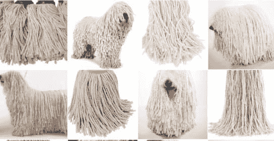

# 谷歌的无服务器机器学习

> 原文:[https://dev . to/swyx/server less-machine-learning-at-Google-cp9](https://dev.to/swyx/serverless-machine-learning-at-google-cp9)

### 谷歌可以分辨狗和拖把。可以吗？

[T2】](https://res.cloudinary.com/practicaldev/image/fetch/s--7_z7Cutr--/c_limit%2Cf_auto%2Cfl_progressive%2Cq_auto%2Cw_880/http://cin.h-cdn.co/assets/16/14/1460113736-screen-shot-2016-04-08-at-43127-pm.png)

Bret McGowen 介绍了谷歌的无服务器机器学习。你可以在这里观看他的完整演讲，但这里是我的笔记。

# 无服务器

四项原则:

*   无需管理/考虑服务器
*   无需预先配置，可按需扩展(拥有足够的容量不会错)
*   按使用付费
*   无国籍/短暂

谷歌的无服务器:

*   后台功能:云存储、云发布/订阅
*   HTTP 函数:API、Webhooks、浏览器

# 机器学习

机器学习正在使用许多**例子**到**回答问题**。

谷歌的机器学习:

*   使用自己的数据:TensorFlow 和云机器学习引擎
*   预训练的 ML 模型:云(视觉、语音、自然语言、翻译)API、云视频智能

关于云视觉 API 功能的细节:

*   标签检测([狗还是拖把](http://www.cosmopolitan.in/life/news/a5821/is-it-a-dog-or-mop-kitten-or-ice-cream-these-photographs-will-definitely-confuse-you/)？)
*   人脸检测(在照片中，这里是人脸的位置)
*   OCR(从照片中读取文本)
*   色情内容检测(暴力/成人)
*   地标检测(那是埃菲尔铁塔！)
*   本地检测(不确定)

其他云视觉功能:

*   裁剪提示-建议的裁剪尺寸
*   网络注释——建议在你的网页上搜索其他元数据——例如，从一辆标志性汽车的照片中，它可以告诉你汽车的型号，它来自哪部电影，它可能在哪里。并且可以给你其他匹配的图像来支持它。

### 云事件触发演练

云存储->云功能->云视觉 API

NLP:从句子中提取实体，情感分析，语法分析(将句子解析为一个词条，这样你就可以看到词性依赖图)

### 语音 API

110 种语言的语音到文本转录。

Azar -使用云语音 api 和云翻译 api 交谈
还在抄本顶部给出每个单词的时间戳。

### 视频智能 API

翻看整个视频给东西贴标签。

### 链接

*   [http://github.com/bretmcg/functions-resize](http://github.com/bretmcg/functions-resize)
*   [http://cloud.google.com](http://cloud.google.com)