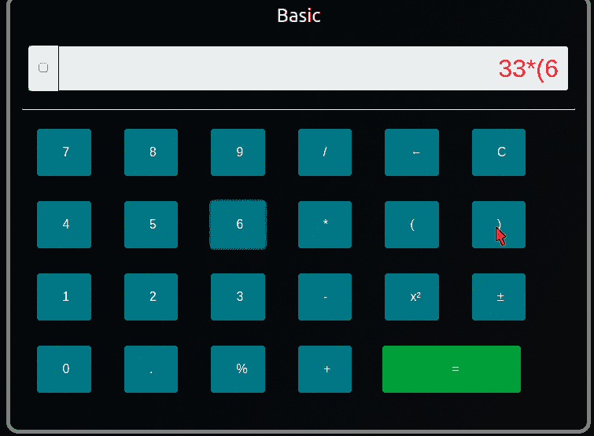
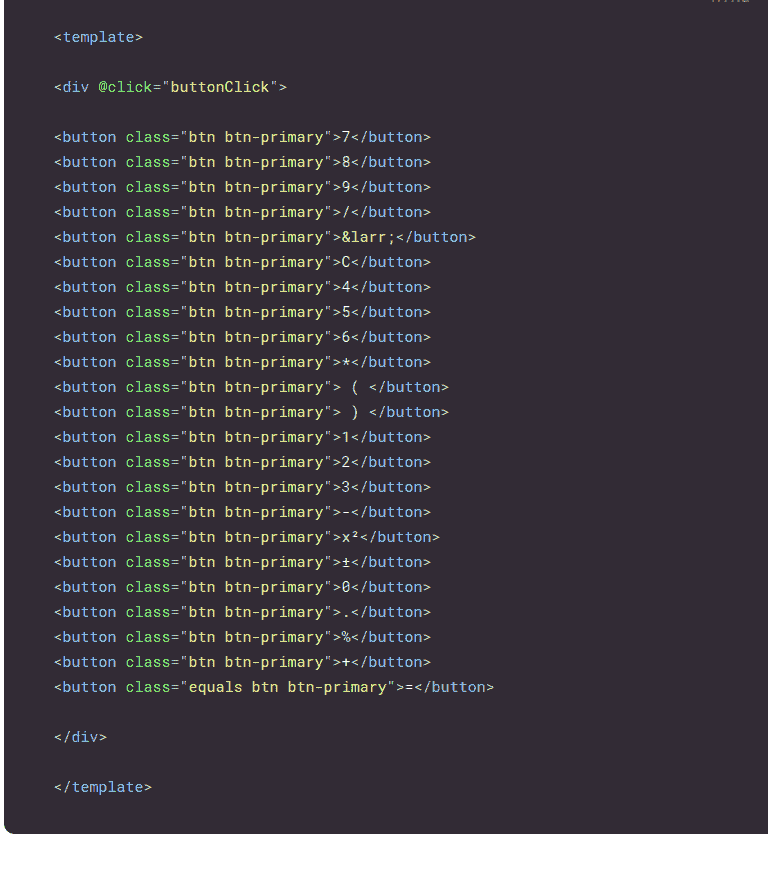
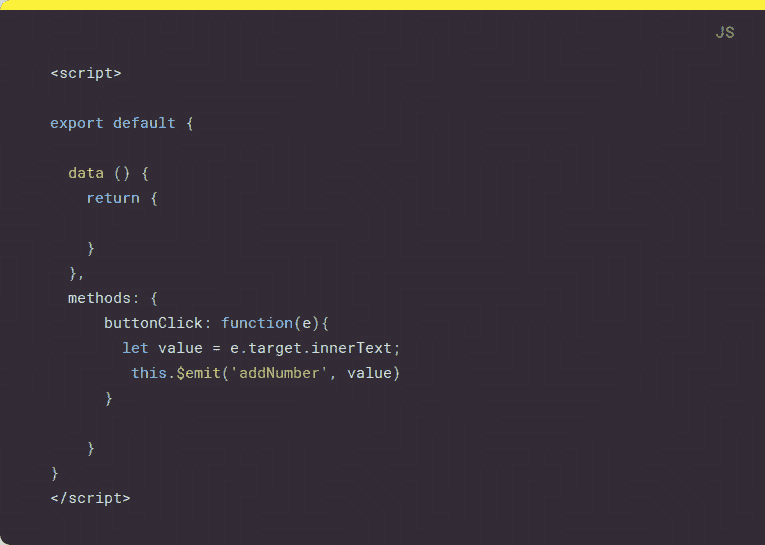
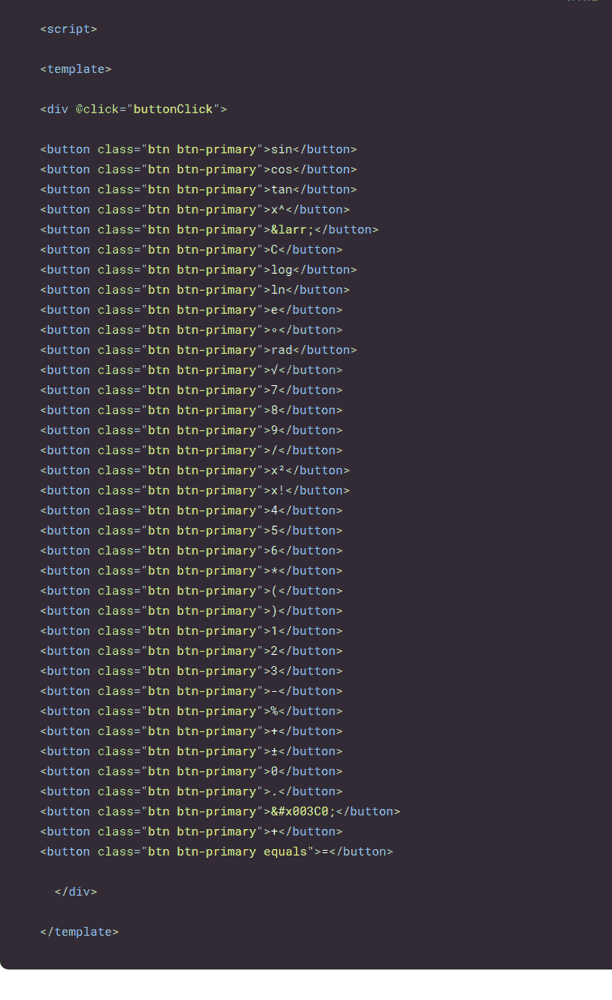
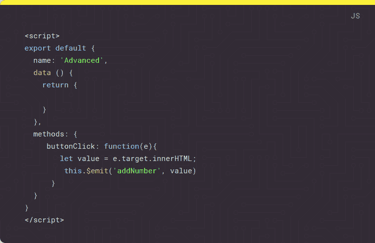
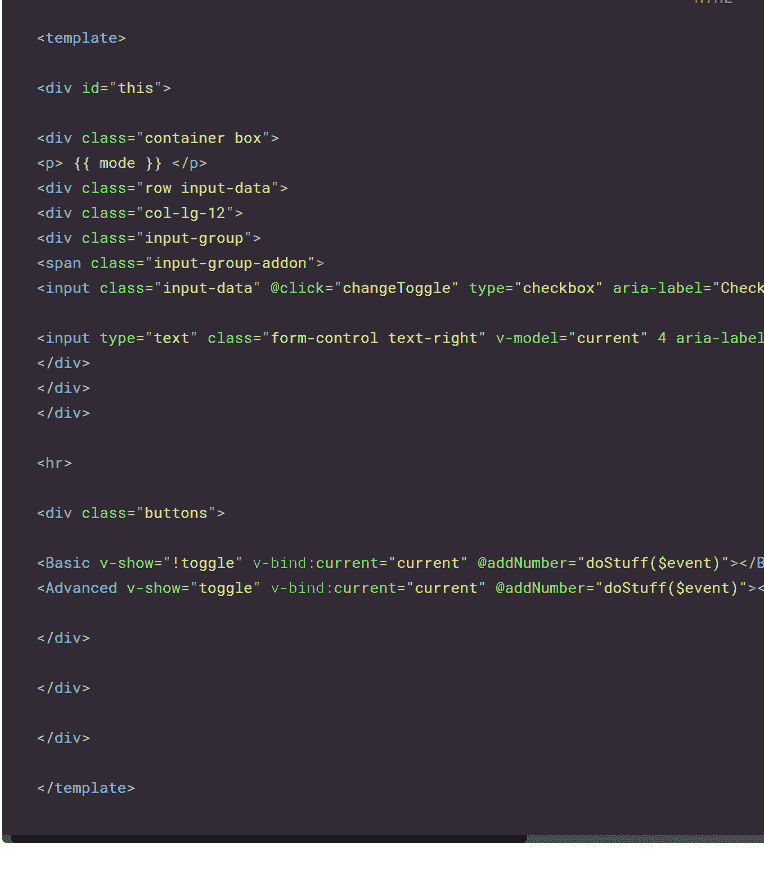
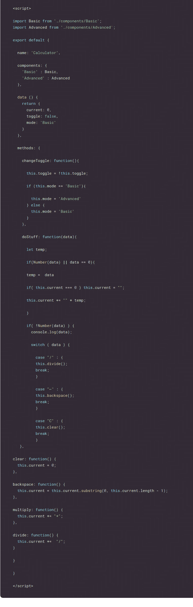

# 带 VueJS 的科学计算器|第 1 天[ 30 天代码]

> 原文：<https://dev.to/jordanirabor/scientific-calculator-with-vuejs--day-1--30-days-of-code--c3j>

大家好。🔥上个月我发表了一篇关于做 30 天代码和技术文章挑战的文章，这是第一个项目的文章(昨天做的)。

本文的源代码可以在 [Github](https://github.com/Jordanirabor/Scientific-Calculator-With-VueJS) 上找到

## 简介

这篇文章讲述了如何使用 VueJS 构建一个科学计算器。

这是最终结果的直观显示:

[T2】](https://res.cloudinary.com/practicaldev/image/fetch/s--vGwiCDjc--/c_limit%2Cf_auto%2Cfl_progressive%2Cq_66%2Cw_880/https://thepracticaldev.s3.amazonaws.com/i/nxi3etnxnfbwxyt1gdwh.gif)

让我们开始吧。

## 设置 VueJS

出于本教程的考虑，我们将使用 Vue CLI 进行安装和设置，另一种方法是从 CDN
引用 Vue

```
 https://unpkg.com/vue 
```

Enter fullscreen mode Exit fullscreen mode

我们可以用这个命令安装 Vue CLI:

```
$ npm install --global vue-cli 
```

Enter fullscreen mode Exit fullscreen mode

接下来，让我们创建一个新项目:

```
$ vue init webpack-simple vueCalulator 
```

Enter fullscreen mode Exit fullscreen mode

在响应了一些终端提示后，我们应该已经设置好了一切。

让我们导航到工作目录，安装依赖项并启动我们的应用程序:

```
$ cd vueCalulator
$ npm install
$ npm run dev 
```

Enter fullscreen mode Exit fullscreen mode

## 定义 Vue 组件

因为我们正在构建一个具有两种模式[基本和高级]的计算器，所以让我们定义两个组件来代表每一个。

首先，让我们在`src`目录下创建一个`components`文件夹【这不是必须的，但是我喜欢保持一个干净的工作目录】。

接下来，我们在`components`目录中创建两个新的`Vue`文件。我们将这些文件称为:

```
Advanced.vue

Basic.vue 
```

Enter fullscreen mode Exit fullscreen mode

该计算器不同模式背后的逻辑是:

> 根组件[ App.vue ]将保存输入字段，而`Basic`和`Advanced`组件将在输入字段下方的空间内切换。

现在让我们进入正题！

## 构建基本组件

让我们编写将驻留在`Basic`组件中的模板、数据和方法。

`Basic`模板将保存计算器按钮，这些按钮监听任何按钮上的点击事件

[T2】](https://res.cloudinary.com/practicaldev/image/fetch/s--N5fDjWRN--/c_limit%2Cf_auto%2Cfl_progressive%2Cq_auto%2Cw_880/https://thepracticaldev.s3.amazonaws.com/i/fhzj9yng715jdegwvrqb.png)

我们可以看到按钮被包装在一个根 div 标签中，每当按钮被点击时，这个标签就调用一个`buttonClick`方法。

接下来，让我们导出并定义我们的`Basic`组件中的方法，我们只需通过编写一个脚本标签来完成:

[T2】](https://res.cloudinary.com/practicaldev/image/fetch/s--jnAhJfpj--/c_limit%2Cf_auto%2Cfl_progressive%2Cq_auto%2Cw_880/https://thepracticaldev.s3.amazonaws.com/i/5mwxgjenwlvw7fj6fgxd.png)

在这个脚本标签中，我们没有定义任何数据[我们在这个组件上不需要任何数据]，我们定义了一个单独的`buttonClick`方法，该方法捕获点击事件，获取`innerText`值，并向根组件发出一个事件。

我们需要这个方法，以便当计算器处于基本模式时，根组件可以作用于被单击的按钮。

## 构建高级组件

高级组件在结构和逻辑上与基本组件非常相似。

首先，让我们编写包含`Advanced`计算器按钮的模板，并监听任何按钮上的点击事件。

[T2】](https://res.cloudinary.com/practicaldev/image/fetch/s--4G6KdTaj--/c_limit%2Cf_auto%2Cfl_progressive%2Cq_auto%2Cw_880/https://thepracticaldev.s3.amazonaws.com/i/4pufguc93trq7vjvrouc.png)

与基本组件类似，我们不会在数据对象中定义任何数据，我们还会在单击按钮时向根组件发出一个事件。

[T2】](https://res.cloudinary.com/practicaldev/image/fetch/s--KTO_N3by--/c_limit%2Cf_auto%2Cfl_progressive%2Cq_auto%2Cw_880/https://thepracticaldev.s3.amazonaws.com/i/n5mixufvnoeuhennv0af.png)

我们可以看到高级组件中的`buttonClick`方法和基础组件中的一模一样。

## 我们来深挖一下根组件！

最后，让我们通过根组件[ App.vue ]将整个应用程序连接在一起。

根组件的代码结构非常简单。

正如我们对两个子组件所做的那样，我们需要定义一个模板来保存输入字段和其他两个组件的切换(子组件主要包含计算器的按钮)。

根模板将具有:

> 1.  The mechanism of switching between advanced and basic modes [using V-show]
>     
>     
> 2.  The input field
>     
>     
> 3.  which displays the punch number is the shell tag of the subcomponent [in this example, it is a div tag with a name buttons

下面是模板代码的可视化显示:

[T2】](https://res.cloudinary.com/practicaldev/image/fetch/s--ibUhg84I--/c_limit%2Cf_auto%2Cfl_progressive%2Cq_auto%2Cw_880/https://thepracticaldev.s3.amazonaws.com/i/fdwagq225ex6a19ehnfi.png)

从这段代码中，我们可以看到基本组件和高级组件嵌套在一个 div 标签中[使用类' buttons']。

根组件注册一个事件侦听器来捕获子组件发出的事件并对其进行操作。

让我们看看如何在根组件的脚本部分中处理事情[:

[T2】](https://res.cloudinary.com/practicaldev/image/fetch/s--w36cdG-f--/c_limit%2Cf_auto%2Cfl_progressive%2Cq_auto%2Cw_880/https://thepracticaldev.s3.amazonaws.com/i/wjy50aloacgcubj04z3l.png)

首先，我们将基本和高级组件导入到根组件中，因为我们需要引用它们。

接下来，我们声明应用程序的名称并创建一个组件对象(这是我们注册组件的地方)。

在数据部分，我们注册了三个`key/value`对:

> 1.  Current-Tracks the current input value.
> 2.  Switch-stores the current switch value.
> 3.  Mode-stores the current mode.

接下来，我们注册几个方法:

`changeToggle`负责在基本和高级模式之间切换，并更新`mode`的值。

`doStuff`方法处理由子组件发出的事件。它接收一个`data`参数，并通过管道传递给几个案例。当一个案例匹配时，它调用正确的函数来处理数学计算。

为了使这个应用程序正确运行，需要定义更多的数学函数，尽管这些函数没有包含在快照中。

# 结论

厉害！🔥这就是用 VueJS 构建科学计算器所需要的全部。

为了简洁起见，这个项目的源代码比这些快照中显示的要长得多。

要在本地运行该项目，请在终端中键入以下命令。

```
-- clone the repository
git clone https://github.com/Jordanirabor/Scientific-Calculator-With-VueJS

-- navigate into the directory --
cd Scientific-Calculator-With-VueJS

-- install dependencies --
npm install

-- serve with hot reload at localhost:8080 --
npm run dev

-- build for production with minification --
npm run build 
```

Enter fullscreen mode Exit fullscreen mode

明天我将会建造和写另一个项目，敬请关注🔥🔥🔥