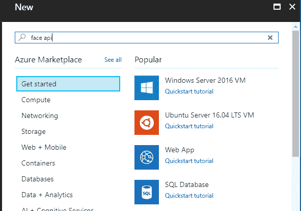
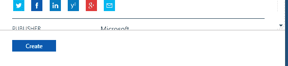
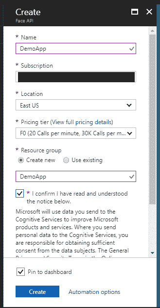
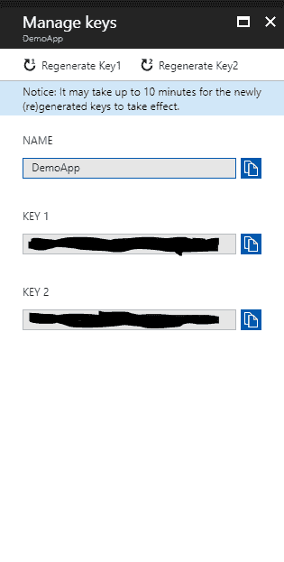
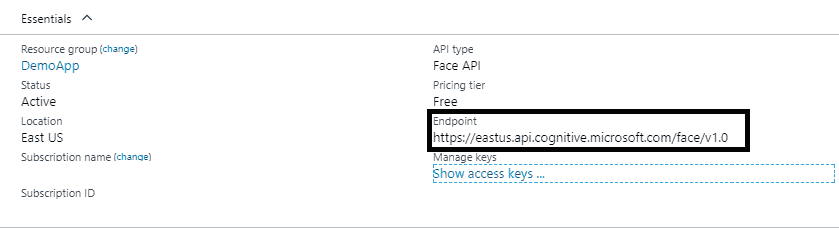
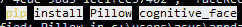
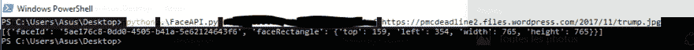

# azure Face API–使用 Python 的实践(基础)

> 原文:[https://dev.to/hbibzdeploy/azure-face-api-动手使用-python-basic-8jc](https://dev.to/hbibzdeploy/azure-face-api--hands-on-using-python-basic-8jc)

大家好！

这是穆罕默德·哈比卜在一个新的实践教程。在本文中，我将致力于 Azure 的人脸识别 API。我将向您展示如何利用这个非常强大的 API，通过检测图像中的人脸来为您的应用程序添加识别功能。

[T2】](https://res.cloudinary.com/practicaldev/image/fetch/s--FXoaI-ms--/c_limit%2Cf_auto%2Cfl_progressive%2Cq_auto%2Cw_880/https://notebooks.azure.com/Content/landing-page/pythonintro.png)

这将是一个没有先决技能的指南，尽管唯一的要求是访问 Azure 门户和与 web 框架或 JS 语法相关的基础知识，因为如果你正在阅读基本版本，我们将使用 Angular 或 Python 构建我们的演示项目。

### 什么是 Azure？

微软 Azure 是微软于 2010 年 2 月推出的可扩展云计算平台。由于它的简单性和它提供的服务的多样性，开发人员选择它来部署他们的项目和它的 API 以使事情变得更容易。在大量文章和所有者文档的指导下，Azure 成为了云王国的王者之一，仅次于 AWS (Amazon Web Services)。

[T2】](https://res.cloudinary.com/practicaldev/image/fetch/s--OCsgq7wH--/c_limit%2Cf_auto%2Cfl_progressive%2Cq_auto%2Cw_880/https://s3curi7y.tn/papers/image2.jpeg)

Azure 的 FaceAPI 是什么？

Azure 的 Face API 是一个应用程序编程接口，在 Azure 门户内提供。它用于检测人脸和比较相似的人脸并识别人，以便对他们进行分组。

### 获取我们的 API 密钥:

为了访问任何 API，您需要在对端点的每个请求中提供一个访问令牌/密钥作为参数。获取您的 FaceAPI 密钥需要您拥有 Azure 帐户的访问权限，并且该帐户具有访问该服务的权限。

登录后，访问仪表板:

[T2】](https://res.cloudinary.com/practicaldev/image/fetch/s--rj1HY_8H--/c_limit%2Cf_auto%2Cfl_progressive%2Cq_auto%2Cw_880/https://s3curi7y.tn/papers/image3.png)

然后点击左上角的绿色大+号，搜索 face API:

[T2】](https://res.cloudinary.com/practicaldev/image/fetch/s--Bf0AhIwK--/c_limit%2Cf_auto%2Cfl_progressive%2Cq_auto%2Cw_880/https://s3curi7y.tn/papers/image4.png)

之后，点击“创建”

[T2】](https://res.cloudinary.com/practicaldev/image/fetch/s--19taCu3s--/c_limit%2Cf_auto%2Cfl_progressive%2Cq_auto%2Cw_880/https://s3curi7y.tn/papers/image5.png)

并填写表格:

[T2】](https://res.cloudinary.com/practicaldev/image/fetch/s--rXZXwFMw--/c_limit%2Cf_auto%2Cfl_progressive%2Cq_auto%2Cw_880/https://s3curi7y.tn/papers/image6.png)

之后，您将被自动重定向到控制面板，创建应该会成功。第一次访问该服务时，应该会出现如下内容:

[T2】](https://res.cloudinary.com/practicaldev/image/fetch/s--PNzyqabX--/c_limit%2Cf_auto%2Cfl_progressive%2Cq_auto%2Cw_880/https://s3curi7y.tn/papers/image7.png)

点击密钥，并将它们复制到一个安全的地方。

[T2】](https://res.cloudinary.com/practicaldev/image/fetch/s--OGvGmiI0--/c_limit%2Cf_auto%2Cfl_progressive%2Cq_auto%2Cw_880/https://s3curi7y.tn/papers/image8.png)

页（page 的缩写）s:万一你不小心把它们展示给了不可信的一方，你可以安全地重新生成它们，把以前的密钥状态改为无效。

接下来，访问概述页面，复制端点 URL，这应该因地区而异。

[T2】](https://res.cloudinary.com/practicaldev/image/fetch/s--FqAEGd6P--/c_limit%2Cf_auto%2Cfl_progressive%2Cq_auto%2Cw_880/https://s3curi7y.tn/papers/image9.png)

首次使用:

现在，您应该可以在以下位置使用示例代码了:

[https://github.com/hbibz-deploy/AzureCognitive-py/](https://github.com/hbibz-deploy/AzureCognitive-py/)

复制/克隆名为“FaceAPI.py”的脚本并保存。

在运行你的代码之前，假设你有三个。安装了 X python 和 pip，运行:

[T2】](https://res.cloudinary.com/practicaldev/image/fetch/s--rd2vRMG4--/c_limit%2Cf_auto%2Cfl_progressive%2Cq_auto%2Cw_880/https://s3curi7y.tn/papers/image10.png)

然后，您可以使用示例:

**命令**:python faceapi . py { key } { Image URL }

**举例:**

[T2】](https://res.cloudinary.com/practicaldev/image/fetch/s--4mhIjhhn--/c_limit%2Cf_auto%2Cfl_progressive%2Cq_auto%2Cw_880/https://s3curi7y.tn/papers/image11.png)

隐藏的文本是我的访问键。

完成后，应该会出现如下内容:

[T2】](https://res.cloudinary.com/practicaldev/image/fetch/s--Ep-tn-Qv--/c_limit%2Cf_auto%2Cfl_progressive%2Cq_auto%2Cw_880/https://s3curi7y.tn/papers/image12.png)

检测到的人脸应该在蓝色矩形中。