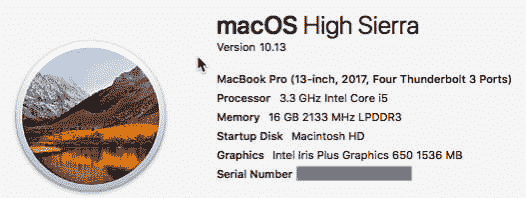

# 是时候加入 InfluxDB 了

> 原文:[https://dev.to/davidgs/time-to-awesome-with-influxdb-1fd0](https://dev.to/davidgs/time-to-awesome-with-influxdb-1fd0)

[InfluxData](https://influxdata.com/) 有个事儿时间给力  。以至于他们把它注册了商标。不，说真的，他们做到了。他们是认真的。所以让我们从零到牛逼！

> 我们非常专注于将时间缩短到令人惊叹的  ，我们真正关心的是帮助开发者和企业以更低的复杂性和更少的代码更快地获得结果。

这直接来自他们网站上关于 的 [**部分，他们真的是这个意思！但为了以防万一，我决定(再次)测试一下。实际上，我在**](https://www.influxdata.com/about/)**[写了一整篇博文](https://davidgs.com/2017/running-influxdb-on-an-artik-520/)，讲述设置 InfluxDB 是多么容易，但我想我会再做一次，只是为了好玩。这一次，我想我会证明这是多么容易，多么快！**

## 该设置了

我有一台值得信赖的 MacBook Pro，我可以在上面做任何事情，所以我打算把它安装在上面。这是我正在做的:

[T2】](https://res.cloudinary.com/practicaldev/image/fetch/s--ewkPUsbP--/c_limit%2Cf_auto%2Cfl_progressive%2Cq_auto%2Cw_880/https://www.influxdata.com/wp-content/uploads/MarsEditScreenSnapz001.png)

我安装并配置了 InfluxDB、Chronograf、Telegraf 和 Kapacitor，并设置了一个快速系统监控仪表板来跟踪一些系统状态，所有这些都在 5 分钟内完成。

## 这就是证据

## 我是这样做的

Davids-MacBook-Pro:~ davidgs $ brew 安装 influxdb == >下载[https://home brew . bin tray . com/bottles/influxdb-1 . 3 . 6 . high \ _ Sierra . bottle . tar . gz](https://homebrew.bintray.com/bottles/influxdb-1.3.6.high%5C_sierra.bottle.tar.gz)已经下载:/Users/davidgs/Library/Caches/home brew/influxdb-1 . 3 . 6 . high _ Sierra . bottle . gz = =>倒 influxdb-1 . 3 . 6 . high _ Sierra . bottle . tar . gz 56.4 MB Davids-MacBook-Pro:~ davidgs $ brew install tele graf = =>下载[https://home brew . bin tray . com/bottles/tele graf-1 . 4 . 2 . high \ _ Sierra . bottle . gz](https://homebrew.bintray.com/bottles/telegraf-1.4.2.high%5C_sierra.bottle.tar.gz)已下载:/Users/davidgs/Library/Caches/home brew/telegraf-1.4.2.high_sierra . tar . gz = =>倒 tele graf-1 . 4 . 2 . high _ Sierra 43.2 MB Davids-MacBook-Pro:~ davidgs $ brew install chronograf = =>安装 chronograf 的依赖项: **kapacitor** == >安装 chronograf 依赖项: **kapacitor** == >下载[https://home brew . bin tray . com/bottles/kapacitor-1 . 3 . 3 . high \ _ Sierra . bottle . 1 . tar . gz](https://homebrew.bintray.com/bottles/kapacitor-1.3.3.high%5C_sierra.bottle.1.tar.gz)已下载:/Users/davidgs/ 79.0MB == >安装 **chronograf** == >下载[https://home brew . bin tray . com/bottles/chronograf-1.3.9 . 0 . high \ _ Sierra . bottle . tar . gz](https://homebrew.bintray.com/bottles/chronograf-1.3.9.0.high%5C_sierra.bottle.tar.gz)已下载:/Users/davidgs/Library/Caches/home brew/chronograf-1 . 3 . 9 . 0 . high _ Sierra . bottle . gz = =>倒 chronograf-1 . 3 . 9 21.2 MB Davids-MacBook-Pro:~ davidgs $ brew services start influxdb = =>成功启动`influxdb`(标签:homebrew . mxcl . influxdb)Davids-MacBook-Pro:~ davidgs $ brew services start tele graf = =>成功启动`telegraf`(标签:home brew . mxcl . tele graf)Davids-MacBook-Pro:~ davidgs $ brew services start kapacitor = =>成功启动`kapacitor`(标签:home brew

就是这样！总共 7 个命令。3 安装整个 TICK 堆栈——因为 Chronograf 依赖于 Kapacitor，所以它是自动安装的——4 启动所有服务并确保它们在重启后启动。

没有比这更简单的了！添加少量的点击来建立仪表板，你有一个令人惊讶的短时间内真棒  ！

帖子[是时候用 InfluxDB](https://davidgs.com/2017/timetoawesomeinfluxdb/) 了，最早出现在[的大卫·g·西蒙斯](https://davidgs.com)上。